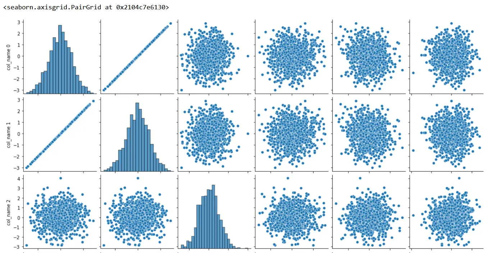
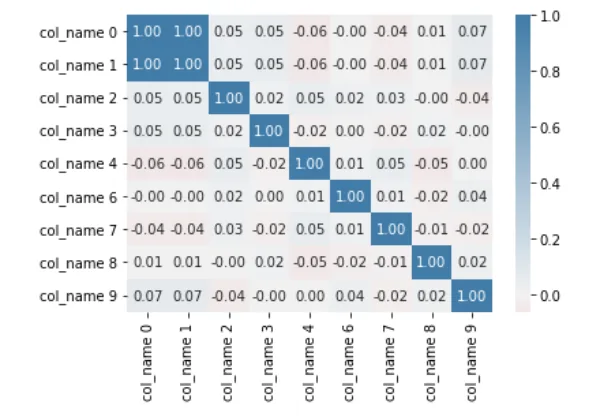
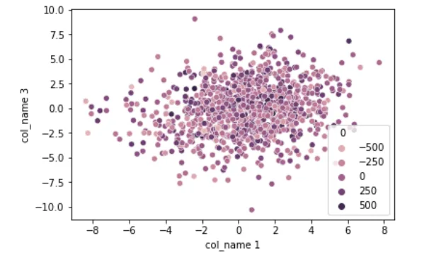
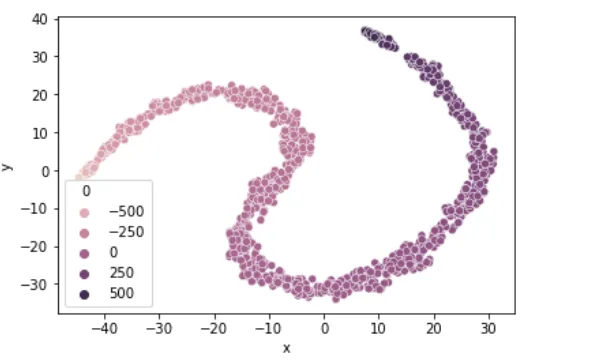
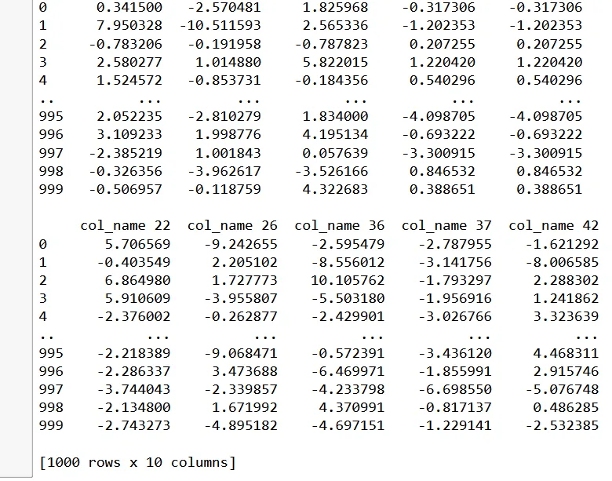
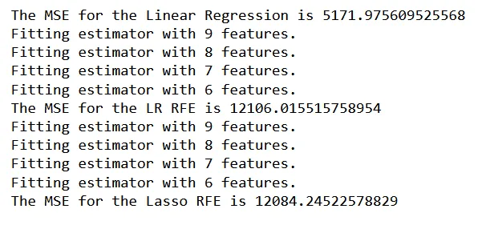
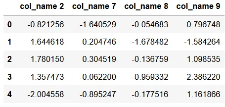

Data comes in different sizes. Some datasets have two variables the target and a feature variable. Sometimes we can have a huge set of feature variables say, 50, 100, etc. The thinking is that we need more data as possible to better understand the target variable. However, it has been learned that the higher the dimensionality of the dataset, the models seem to fail to perfectly model data. **By the law of parsimony, a parsimonious model is a model that accomplishes the desired task of fitting on a dataset with as few predictor variables as possible.** We will strive to follow the dictates of this law in this blog.

Let us create synthetic datasets and try to model reduce the dimensions. Let us create 10 variables plus a target variable (11 variables).

```python
from sklearn.datasets import make_regression, make_classification
import pandas as pd
import numpy as np
import matplotlib.pyplot as plt

# Lets make a regression
data
variable, target = make_regression(
n_samples = 1000,
n_features = 10,
random_state = 263)
```

The data needs to be contained in a data frame structure and we concatenate the target and feature variables. The Sklearn.datasets make_regresion() function creates 2 separate sets which we can combine for further analysis as:

```python
# Variables
X = pd.DataFrame(variable, columns=["col_name "+ str(i) for i in range(variable.shape[1])])
# Target
y= pd.DataFrame(target)
y.head(4)
data_lin = pd.concat([X, y], axis=1)
```

**1. Method 1: Dropping a variable**

The first and easiest way of reducing a dataset is simply dropping the undesired variable by the following code:

# Drop 5th column
X = X.drop('col_name 5', axis = 1)
X.shape

2. **Method 2: Use pairplot**

You can plot the pair plot to understand the relationship between numeric datasets

```python
# Pairs plot
import seaborn as sns
X['col_name 0'] = X['col_name 1']
sns.pairplot(X.iloc[:,:6], diag_kind = 'hist')
```



The plot shows that the first column and the second column have a high correlation. This conclusion may not be very clear. To clear out, we can use a pairwise correlation heat map that can better inform us. We can do this by:

```python
# Correlation
corr = X.corr()
cmap = sns.diverging_palette(h_neg = 10,
                             h_pos = 240,
                            as_cmap = True)

sns.heatmap(corr, center=0, cmap = cmap, annot = True, fmt = '.2f')
```



The two plots pairs plot and heatmap show high correlation between the first 2 columns. The high correlation can be a source of multicollinearity. Multicollinearity reduces the precision of the model coefficients thereby weakening the statistical power of the regression model. Thee other problem is that the coefficient estimates tend to swing wildly based on the model variables. By removing either of the corelated variables, we reduce the effects.

**Method 3: t-SNE**

t-SNE an abbreviation for t-distributed stochastic neighbor embedding is another method of reducing our variables. We can create a dataset with 50 feature variables as follows

```python
 variables_cat, target_cat  = make_classification(
                    n_samples = 1000,
                    n_features = 50,
                    n_informative = 20,
                    n_redundant = 2,
                    n_repeated = 2,
                    n_classes = 2,
                    # Distribution of classes 45% Output1
                    # 55%> output 2
                    weights = [.45,.55],
                    random_state = 263)

X_cat = pd.DataFrame(variables_cat, columns=["col_name "+ str(i) for i in range(variables_cat.shape[1])])
y_cat = pd.DataFrame(target)
data = pd.concat([X_cat, y_cat], axis = 1)

sns.scatterplot(x= 'col_name 1',
               y = 'col_name 3',
            hue = 0,
               data = data)
plt.show()
```



Observe how we instantiate the t-SNE() and fit on the data

```python
from sklearn.manifold import TSNE
m = TSNE(learning_rate = 50)
tsne_features = m.fit_transform(data)
tsne_features[1:4,]

data['x'] = tsne_features[:,0]
data['y'] = tsne_features[:,1]

sns.scatterplot(x= 'x',
               y = 'y',
            hue = 0,
               data = data)
plt.show()
```



We reduce the dataset to two variables x and y which when we plot can somewhat separate the dataset across the target group classes.

**Method 4: Feature Selector**

We can use a feature selector by say, we drop a variable if it has high percentage of missing numbers. Say drop all columns with 30 percent missing values. For this section we will drop considering say the variance of each of the columns

```python
from sklearn.feature_selection import VarianceThreshold

sel = VarianceThreshold(threshold =8)
sel.fit(X_cat)
mask = sel.get_support()
print(mask)

reduced_data = X_cat.loc[:, mask]
print(reduced_data)
```



The variance threshold is set at 8 as most of the variables since they were randomly synthesised have the almost the same distribution and 8 happens to be the decider. Observe that we remain with 10 variables out of 50 variables we started with. This is a 60% drop from the variables we started with.

**Method 5: Recursive Selection**

Suppose we are modeling and we want the model to recursively work its way to the best model, we use the Recursive Feature Selector function which is in the *sklearn.feature-selection* package

For the purposes of benchmarking the models, we will train the Linear regression, linear regression with RFFE and LASSO with RFE models and evaluate using the mean square error function

```python
from sklearn.model_selection import train_test_split
from sklearn.linear_model import LinearRegression
from sklearn.linear_model import Lasso
from sklearn.feature_selection import RFE
from sklearn.metrics import mean_squared_error

X_train, X_test, y_train, y_test = train_test_split(X, y,
                                                   test_size= 0.2,
                                                   random_state= 263)

ln = LinearRegression()
ln.fit(X_train, y_train)
y_pred_ln = ln.predict(X_test)

ln_mse = mean_squared_error(y_test, y_pred_ln)
print('The MSE for the Linear Regression is {}'.format(ln_mse))

# Linear Regression Recursive feture selection

ln_rfe = RFE(estimator = ln,
            n_features_to_select = 5,
            verbose=1)

ln_rfe.fit(X_train, y_train)
y_pred_rfe = ln_rfe.predict(X_test)

#X.columns[rfe.support_]

rfe_mse = mean_squared_error(y_test, y_pred_rfe)
print('The MSE for the LR RFE is {}'.format(rfe_mse))

# LASSO RFE
lasso = Lasso()

lass_rfe = RFE(estimator = lasso,
            n_features_to_select = 5,
            verbose=1)

lass_rfe.fit(X_train, y_train)
y_pred_rfe_las = lass_rfe.predict(X_test)

#X.columns[rfe.support_]

las_rfe_mse = mean_squared_error(y_test, y_pred_rfe_las)
print('The MSE for the Lasso RFE is {}'.format(las_rfe_mse))
```



Irrespective of the high number of variables the linear regression model had, the models with fewer variables achieved the least MSE of 1208 compared to that of 5172

**Method 6: Combining feature selectors**

We can combine models and let them together reduce the variables as follows:

```python
lr_mask = ln_rfe.support_
lass_mask = lass_rfe.support_

votes = np.sum([lr_mask, lass_mask], axis=0)
print(votes)
mask = votes>= 2
reduced_X = X.loc[:, mask]
reduced_X.shape

reduced_X.head()
```



**Observe that the model has selected only 4 variables that achieve the task at hand. We have arrived at a parsimonious model, we have cured the curse of dimensionality**

You can find the code [here](https://github.com/Matshisela/Some-Dimension-reduction-techniques). Acknowledge the tutelage of the DataCamp course which can be found [here](https://app.datacamp.com/learn/courses/dimensionality-reduction-in-python).
