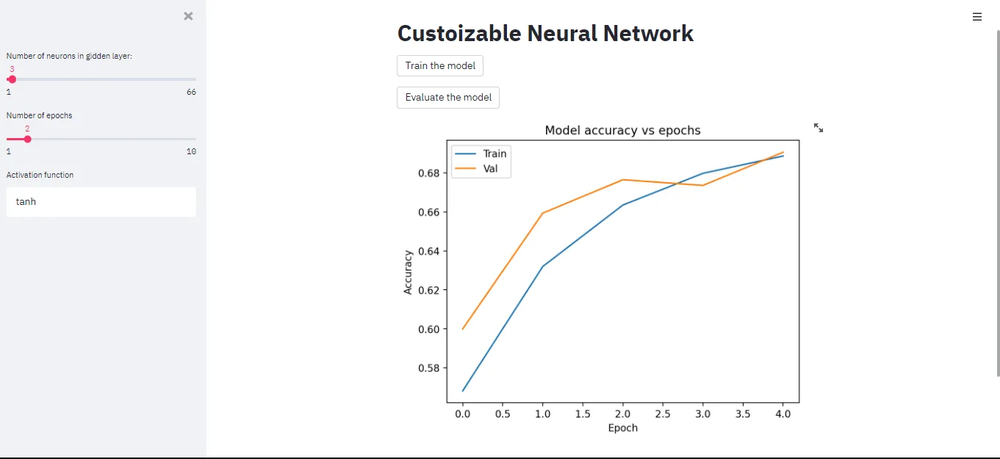
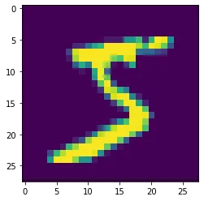
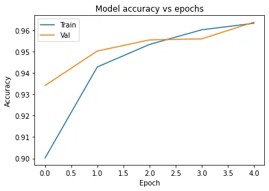

## About the dataset:

The MNIST dataset is an acronym that stands for the Modified National Institute of Standards and Technology dataset.

It is a dataset of 60,000 small square 28×28 pixel grayscale images of handwritten single digits between 0 and 9.

## About the task:

The task is to classify a given image of a handwritten digit into one of 10 classes representing integer values from 0 to 9, inclusively.

used Sequential model with bach of layers built deployed using streamlit.

And the app is Customizable for the number of neurons, number of epochs, and activation function.

## How it works

To use streamlit you have to create an env to work in:

1. Go to your directory.
2. open the cmd and type:
   - py -m venv .env - .env\Scripts\activate
3. 3- To run the streamlite app, type:
   - streamlit run [yourscript.py](http://yourscript.py)

See what inside the dataset:

```python
import matplotlib.pyplot as pltplt.imshow(X_train[0])
```



Preprocessing the image:

```python
def preprocess_image(images):images = images / 255return imagesX_train = preprocess_image(X_train)X_test = preprocess_image(X_test)
```

Create the model:

```python
model = Sequential()model.add(InputLayer((28,28)))model.add(Flatten())model.add(Dense(32, 'relu'))model.add(Dense(10))model.add(Softmax())model.compile(loss='sparse_categorical_crossentropy', metrics=['accuracy'])model.summary()
```

```python
Model: "sequential_7" _________________________________________________________________ Layer (type)                 Output Shape              Param #    ================================================================= flatten_7 (Flatten)          (None, 784)               0          _________________________________________________________________ dense_13 (Dense)             (None, 32)                25120      _________________________________________________________________ dense_14 (Dense)             (None, 10)                330        _________________________________________________________________ softmax_6 (Softmax)          (None, 10)                0          ================================================================= Total params: 25,450 Trainable params: 25,450 Non-trainable params: 0
```

Plot model accuracy

```python
import pandas as pdimport matplotlib.pyplot as plthistory = pd.read_csv('history.csv')fig = plt.figure()plt.plot(history['epoch'], history['accuracy'])plt.plot(history['epoch'], history['val_accuracy'])plt.title('Model accuracy vs epochs')plt.ylabel('Accuracy')plt.xlabel('Epoch')plt.legend(['Train', 'Val'])plt.show()
```



Check code: https://github.com/geehaad/Custoizable-Neural-Network
