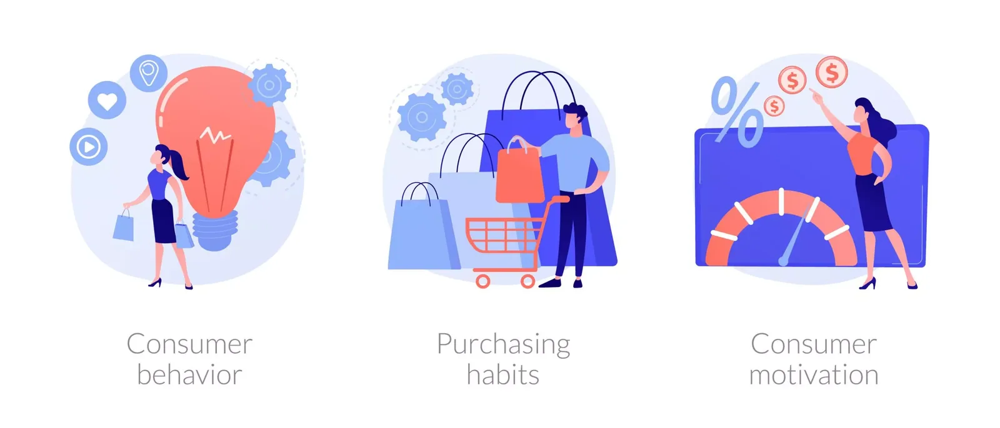

This project is derived from the field of Customer Relationship Management (CRM) in Starbucks. One of the main concerns for CRM field is to interact with not only current customers, but also previous and potential customers, so that a company can boost its business relationship with the customers, and eventually expect its continuous sales growth. As mentioned in the provided business case, one of its marketing campaigns is to send out an offer to customers through various channels. An offer can be either just an advertisement for a certain beverage, or a coupon-type offer such as a ‘discount’ or ‘buy 1, get 1 (BOGO)’. Each offer is valid for certain number of days. The validity periods are different from offers.

To maximize a return-on-investment(ROI), we should properly figure out which customers are effectively using their received offers. If a customer feels reluctant to receive advertisement offers, this might be able to result in losing users or lead to decrease customer retention rate in the long run. These types of customers should be removed in advance from the “offering-list”. In this analysis, I classify the customers into 2 groups who use appropriately our offers and who do not based on customers' individual demographic features and their purchasing patterns.

Data Preparation/ Cleaning

```python
# Import the libraries
import numpy as np
import pandas as pd
import matplotlib.pyplot as plt
%matplotlib inline
import math
import json
plt.rc("font", size=14)
import seaborn as sns
sns.set()
sns.set(style="whitegrid", color_codes=True)
```

```python
# Read in the json files
portfolio = pd.read_json('portfolio.json', orient='records', lines=True)
profile = pd.read_json('profile.json', orient='records', lines=True)
transcript = pd.read_json('transcript.json', orient='records', lines=True)
```

To begin with, I analyzed the business situation of Starbucks during the test period, based on the transcript datasets.

```python
# Visualisation of each feature after cleaning the dataset.
plt.figure(figsize=[15,3])
plt.subplots_adjust(wspace = 0.3 , hspace= 0.5)
base_color =sns.color_palette()[0]

plt.subplot(1, 3, 1)
profile_cleaned.age.hist()
plt.title('Distribution of Age (Cleaned)')
plt.ylabel('No. of Customers')
plt.xlabel('Age')

plt.subplot(1, 3, 2)
profile_cleaned.income.hist()
plt.title('Distribution of Income (Cleaned)')
plt.ylabel('No. of Customers')
plt.xlabel('Income')

plt.subplot(1, 3, 3)
sns.countplot(data = profile_cleaned, x='gender', color = base_color)
plt.title('Distribution of Gender (Cleaned)')
plt.ylabel('No. of Customers')
plt.xlabel('Gender')
```

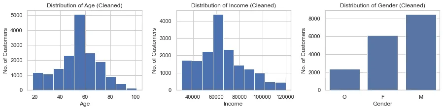

**The Change of Traffics during the Test Period**

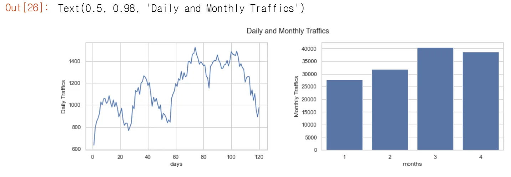

**The Sales Trend Amount during the Test Period**

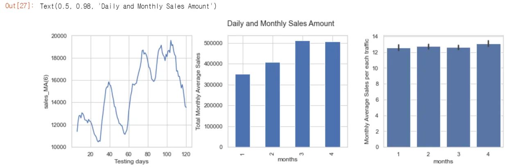

I discovered that the number of traffics changed each month. It continued to rise until the third month. However, the total number of traffics declined somewhat in the fourth month. It's worth noting that traffic in the fourth month is still nearly as high as it was in the third.

Changes in average sales amounts follow very comparable patterns to changes in traffic. This situation could be seen as greater traffic resulting in improved sales performance. Interestingly, while the number of visitors and average monthly sales amount showed consistent patterns across the months, the average spending per purchase is not considerably different.

Then I concentrated on the offers that were sent to clients as well as the potential relationships between customer demographic factors and the sent offers. Out [31] offers descriptive data in the table below. The customer dataset has 17,000 customers. During the test time, all clients participated in purchases, although not all of them received the offers. 6 consumers (= 17,000 - 16,994) made purchases without receiving any form of incentive.

According to the table, bogo and discount offers are provided twice as frequently as informational offers4. Customers who purchased products throughout the test period received nearly two bogo and discount offers and one educational offer on average. The average customer age is 54.5, and the average customer income is 65,226.90 USD. When the mean and median value of the feature "days as member" are compared, we can expect the data points to be biased to the right. Its mean value exceeds its median value.

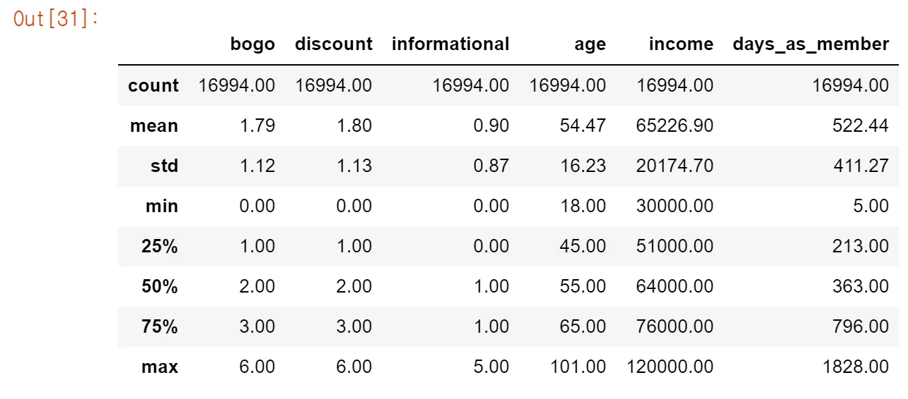

Then I explored whether the number of offers customers received is related to customer demographic factors. As you can see in the output, there are no significant differences of average received offers on gender.

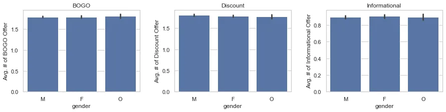

30543 ‘BOGO’ offers, 30499 ‘Discount’ offers, and 15235 ‘informational’ offers are sent.

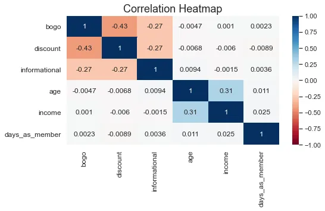

Furthermore, the total number of offers and the number of each type of offer are unrelated to customers' ages, salaries, or days as a Starbucks member. In other words, Starbucks sent out offers at random during the testing period. Following that, I studied the data by concentrating on the offers.

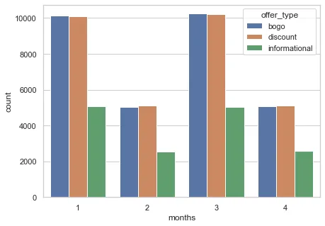

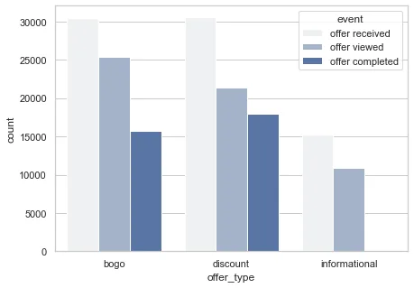

The number of offers issued is not equal. The months with 'BOGO' and 'Discount' offerings are approximately evenly distributed. On the other hand, only half of the "Informational" offers are issued during the course of the month. Furthermore, the offers are distributed twice as much in the first and third months as in the second and fourth months.

Not all of the available offers are viewed. Customers notice only 75,68% of offers. Almost half of all 'BOGO' and 'Discount' offers are merely fulfilled. It should be noted that whether or not the informational type of data is completed is not gathered. A desirable used offer is characterized as such if a customer viewed the informational data and had at least one purchase history throughout the offer's valid term. Finally, we can see from the output that customers viewed more 'BOGO' offers than 'Discount' offers. On the other side, more "discount" offers are finished.

According to descriptive statistics, the latest purchase of customers is ca. 14 days ago on average. During the test period, customers bought products 8 times on average. In addition, the mean value of 'monetary' implies that their average spending during the test period is more than 100 dollars.

```python
# Descriptive Statistics of RFM dimensionsrfm_df.describe()
```

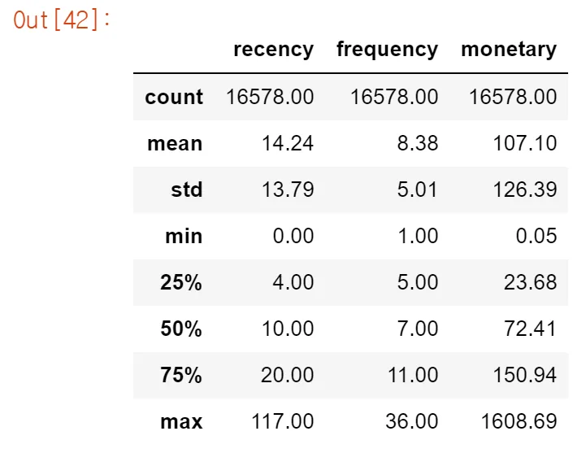

Customers' purchase patterns are depicted in the scatter matrix. First, the histograms of recency, frequency, and monetary values (Plots on the scatter matrix's main diagonal) are all skewed to the right. Customers who have recently visited our stores outnumber those who have purchased beverages in the past. There were also a few consumers who bought products frequently and spent a lot of money throughout the test period, but the majority of customers bought products less than 11 times and spent less than 151 dollars.

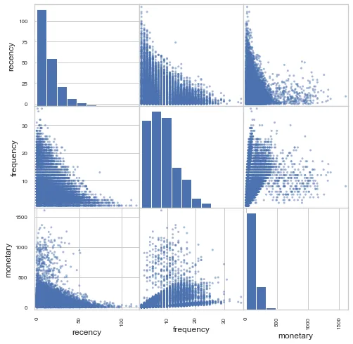

Recency is inversely connected to frequency and monetary values, and vice versa. On the other side, frequency is related to monetary values in a positive way. This implies that the more recently customers purchased Starbucks products (lower recency value), the more frequently customers purchased our products, and the more money they spent at Starbucks. Customers tend to spend more money at our store when they buy more regularly. A heatmap is used to show the relationships in the Jupyter Notebook.

Customers are randomly assigned different offers during the test time (s). To be rewarded, some customers followed desirable processes. Not all of them, however. Other customers may be rewarded without even realizing it because they receive the offers without even realizing it. In this part, I will explain how the "desirably-used" offers in the given dataset are identified.

First, I used pandas get dummies to rearrange the transactions dataframe. The dataframe was then combined with the offer information to calculate the last valid day of the respective deals. In output the column'max offer day' shows that all events of a specific offer must be completed before the last valid day in order to be defined as a desirable used offer. Finally, I sorted the transaction dataframe by 'customer id,' 'days,' and 'offer id'.

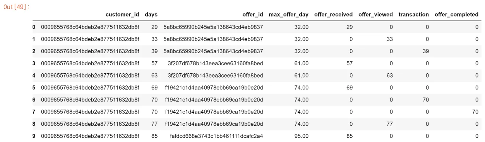

For example, in the table output [49], the customer with id (0009655768c64bdeb2e877511632db8f) received an offer (offer ID: 5a8bc65990b245e5a138643cd4eb9837) on the 29th testing day, and the offer's last valid day is the 32nd testing day, because the offer is good for 4 days. On the 33rd testing day, the consumer viewed the offer and purchased the product on the 39th testing day. As a result, we might conclude that the consumer did not take advantage of the offer in a desirable manner.

On the 57th testing day, this consumer received a fresh offer, but saw it after the last valid day. On the 69th testing day, the consumer received the third offer, and the following day, he purchased merchandise and finished the offers. However, the user viewed the offer after it had passed its expiration date. As previously said, while customers completed the offer and were rewarded, it is not the desirable manner for the organization to use incentives. This allows you to comprehend the entire dataframe.

As previously described, the offer is desirably used if the events "offer viewed" and "transaction" of each offer occurred prior to the last valid day of the associated offer. As a result, I filtered out such situations and ended up with the dataframe event name dfThis dataframe featured the most popular offers per customer and day.

Starbucks distributed 76,277 offers at random to their consumers. There are 6468 'discount' offers, 5370 'bogo' offers, and 1187 informational offers among them. 9042 distinct clients took advantage of the incentives in a desirable manner. Therefore I assigned those offers as 'desirable' and the remainder as 'non-desirable'. This is utilized as a target variable in the classification models that follow.

**Algorithms Implementation**

**Imbalanced data & Feature Selection**

```python
offer_order =['bogo', 'discount','informational']
sns.countplot(data= customer_offer_df, x= 'offer_type', hue = 'desirable_use', order = offer_order)
```

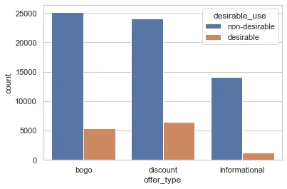

BOGO Offer:
non-desirable 25129
desirable 5370
Name: desirable_use, dtype: int64

Discount Offer:
non-desirable 24075
desirable 6468
Name: desirable_use, dtype: int64

Informational Offer:
non-desirable 14048
desirable 1187
Name: desirable_use, dtype: int64

As you can see from the accompanying bar plot, I encountered an uneven class distribution. Almost 21.5%, 27%, and 8.5% of the offered BOGO offers, Discount offers, and all Informational offers, respectively, are desirably utilised. In this case, the prediction model created with traditional supervised machine learning techniques may be biased and erroneous. This is because the algorithms do not take class balance into account, as they are often meant to improve accuracy by minimizing error. As a result, after dividing the dataset into training and testing sets, I used the Synthetic Minority Over-sampling Technique (SMOTE) to correct the imbalance.

The goal of feature selection is to remove non-informative or redundant input variables from the model. Some models' performance can suffer when irrelevant predictors are added to the target variable. Furthermore, some predictive models with many variables might impede model development and training and may require a large amount of system memory.

In this analysis, I chose feature subsets based on their link to the target. A classification predictive modeling issue with numerical and category input variables is presented. As a result, two statistical measures are involved, which can be utilized for filter-based feature selection with various input and output variable data types.

- Numerical Inputs: ANOVA correlation coefficient
- Categorical Inputs: Chi-Squared test (contingency tables)

**Data Splitting & Balancing Strategy**

Then I split the data into random train and test subsets. 20% of data points are assigned to the test dataset. As expected, training dataset is also imbalanced.

**Model Comparisons**

For this analysis, I set up several models, then compared individual performances, represented by f1-score and time duration. I set a logistic regression model as a benchmark.

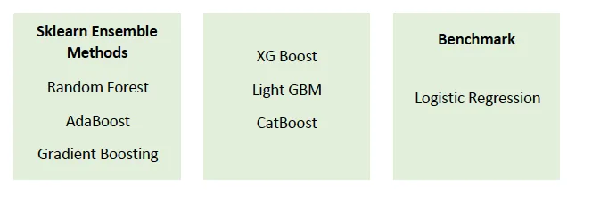

Random Forest uses averaging to increase predictive accuracy and minimize severe over-fitting by fitting many decision tree classifiers on distinct sub-samples of the dataset.

To boost performance, AdaBoost (Adaptive Boosting) is frequently employed with several learning methods. To begin, the AdaBoost classifier trains a classifier on the first dataset. The output of other learning algorithms running on the same dataset (also known as weak learners) is then combined using a weighted sum. The total represents the classifier's final output.

Gradient Boosting creates a prediction model from an ensemble of weak prediction models, most commonly decision trees. It, like other boosting algorithms, constructs an additive model in stages. This enables the optimization of any differentiable loss function.

XGBoost (eXtreme Gradient Boosting) is a lately dominant structured or tabular data method. XGBoost is introduced to improve model performance and execution speed. The gradient boosting decision tree technique is used.

LightGBM (Light Gradient Boosting Machine) is another decision tree-based method that is frequently used for ranking, classification, and so on. It has the majority of the benefits of XGBoost, such as sparse optimization, parallel training, various loss functions, regularization, bagging, and early stopping. The techniques used by XGBoost and LightGBM differ in how they generate trees. Instead of developing trees leaf by leaf, LightGBM chooses the leaf with the greatest reduction in loss. Furthermore, LightGBM employs a highly optimized histogram-based decision tree learning algorithm rather than the sorted-based decision tree learning method commonly seen in XGBoost or other techniques. Ensemble Methods from Sklearn GBM XG Boost Light CatBoost Benchmark The Forest at Random Logistic Regression with AdaBoost Gradient Boosting

CatBoost is a decision tree gradient boosting system. It is primarily employed in ranking and predicting applications such as recommendation systems.

Finally, I chose a logistic regression model as a reference model. Whether the data in question has a binary output, such as when it belongs to one class or another, or in this analysis is either a 'desirable' or a 'non-desirable' for each type of offer, logistic regression is most commonly utilized.

I examined each offer type dataset using all of the classification methods, then compared individual model performance using the f1-score and time duration.

Performance Results

BOGO

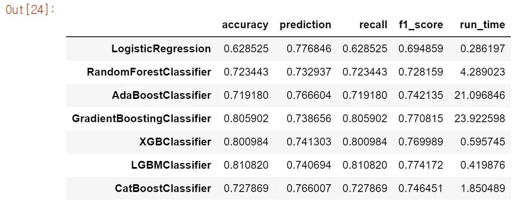

Discount

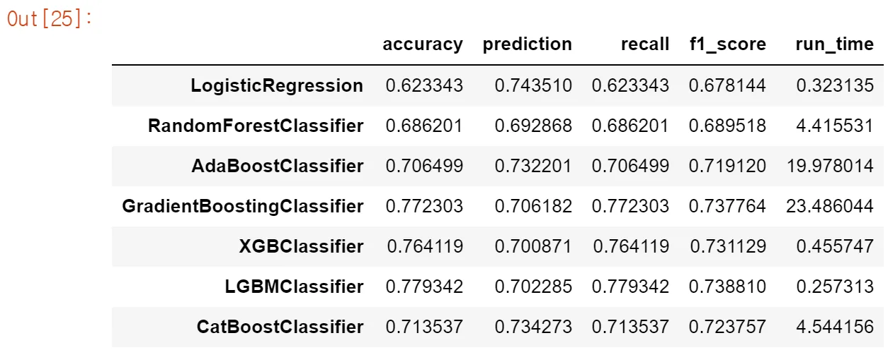

Informational

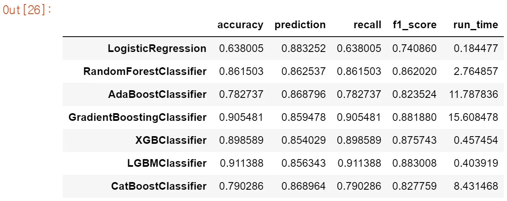

**LGBMClassifier**

"LGBMClassifier" demonstrates remarkable model performance in terms of f1-score for all types of offers. It is worth noting that the Gradient Boosting Classifier performed the second best. However, the LGBMClassifier performs somewhat better in a considerably shorter amount of time.

I also compared RFM scores between customers who took advantage of desirable offers and those who did not. I discovered that people who wanted to use offers had something in common, regardless of the type of offer. The average recency score of the two groups does not differ much. However, the attractive users purchased more products and spent more money at Starbucks than the customer group that did not take advantage of the received offers.

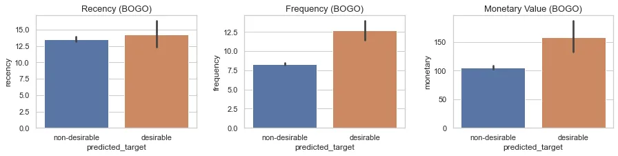

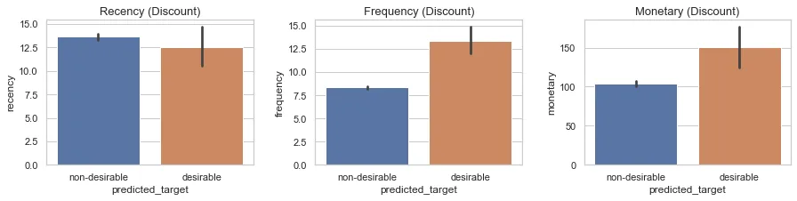

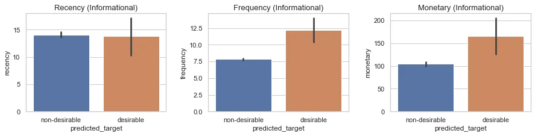

Conclusion

In my investigation, I focused on how customer profiles and purchase habits influence whether customers use the offers they receive. To begin, by researching existing business scenarios, I discovered that delivering deals to clients raises total sales quantities. It's worth noting that the average spending per item is very consistent across the months.

Although all of the clients in the profile dataset purchased products from Starbucks, not all of them received offers. Starbucks distributed all offers at random. There are no statistically significant connections between the number of offers of any kind and client demographic characteristics. It is worth noting that 'BOGO' and 'Discount' offers are sent out nearly twice as frequently as "Informational" offers. Users do not view all issued offers, and only half of issued 'BOGO' and 'discount' offers are completed. Furthermore, I calculated individual Recency, Frequency, and Monetary scores to indicate client purchase trends.

Case 1 and Case 2 were utilized to define the desirable used offerings. Based on the definition, I classified all offer usages as 'desirable' or 'undesirable' for each offer type. All three datasets are significantly skewed, it turns out. As a result, I used the Synthetic Minority Oversampling Technique to correct the imbalance (SMOTE). Then I trained each dataset using a different categorization model.

"LGBMClassifier" shown the best model performance for all types of offers. Within the shortest amount of time, it achieved 0.7742, 0.7388, and 0.8830 of f1-score for bogo, discount, and informative datasets, respectively. The f1-score is significantly higher than the benchmark model. Furthermore, the time period is significantly less than that of the benchmark model. The model using LGBMClassifier outperforms the benchmark model.
