pandas is a data analysis library for Python that has exploded in popularity over the past years. The website describes it thusly:

> “pandas is an open-source, BSD-licensed library providing high performance, easy-to-use data structures and data analysis tools for the Python programming language.”
> -pandas.pydata.org

pandas contains data structures and data manipulation tools designed to make data cleaning and analysis fast and easy in Python. we are going to discuss 5 techniques used in data wrangling.

**Importing data**

We are going over how we can import a text file or .csv file that has a data set into python. So it's basically going to be how you can import data into python script using python library called pandas, which is basically the most common python library that we use in order to import data into python.

We will import some .csv files related to out-of-school rates global data sourced from Unicef. Firstly, we are going to import pandas library. Then, in order to read the text file of the .csv file, we are going to give the name of the function that I want to call. So, We are going to set some variable names which data & data1 that hold my data frame.

```python
import pandas as pddata = pd.read_csv('Primary.csv', encoding='latin-1')data1 = pd.read_csv('Upper Secondary.csv', encoding='latin-1')
```

Passing .head() which is an optional parameter to read the first rows as the column names. Then when we look at the output on the terminal of the head, it looks like the dataset was loaded incorrectly.

```python
data.head()
```

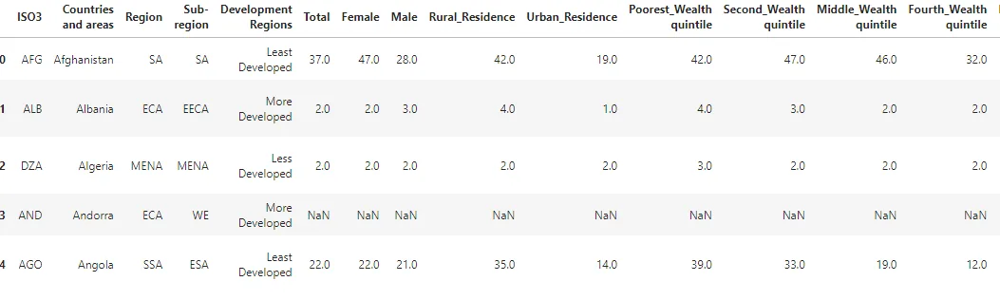

If we want for example the shape of the data set. So, if we want to know how many rows of the data do we have and how many columns are in the data set, we can do the variable name of our data frame either data or data1 passing it into .shape, and print it out. the first number between parentheses indicates the row numbers and the second one indicates the columns numbers.

```python
print(data.shape)
```

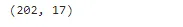

The second example is importing data from URL. The same thing from the last time, instead of passing in the path or the URL directly into read_csv.

```python
URL = 'http://users.stat.ufl.edu/~winner/data/resid_energy.dat'df = pd.read_csv(URL)df.head()
```

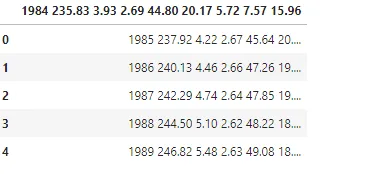

**Apply a function**

Pandas Apply function returns some value after passing each row/column of a data frame with some function. The function accepts Series objects with an index equal to the DataFrame's row (axis=0) or the DataFrame's columns (axis=1).

We will do some changes based on the values used in DataFrame.

```python
import numpy as npdata = pd.read_csv("Primary.csv", encoding='latin-1')data.head()
```

concatenates all of the lists of columns (Countries and areas) & (sub-region) and validates that this new list contains the same exact values as the original columns lists.

```python
#concatenate two column
def concatenate(col1, col3) :
   return str(col1) + '>>' + str([col3])

data['Region_plus_Subregion'] = data[['Countries and areas', 'Sub-region']].apply(lambda x:concatenate(x['Countries and areas'],x['Sub-region']),axis=1)

data.head()
```

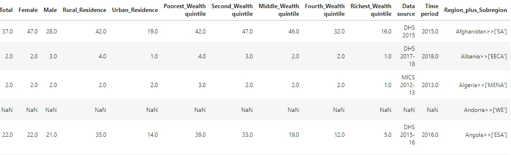

```python
Female_and_male_p = data.loc[:, ['Countries and areas', 'Female', 'Male']]Female_and_male_p.head()
```

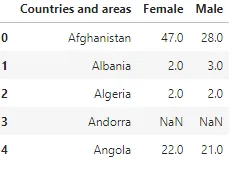

**Merge Operation**

Joining or merging functions By linking rows with one or more keys, you can integrate datasets. Here, we use the merge method to combine the Primary.csv and Upper secondary.csv to start combining DataFrames horizontally.

```python
data2 = pd.read_csv('Upper Secondary.csv', encoding='latin-1')Female_and_male_s = data2.loc[:, ['Countries and areas', 'Female', 'Male']]Female_and_male_s.head()
```

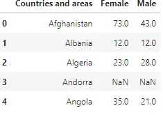

```python
pd.merge(Female_and_male_p, Female_and_male_s, suffixes=['_p','_s'], on='Countries and areas', how='outer').head()
```

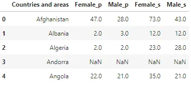

By merging 2 DataFrames we have noticed that that percentage of Out of School Rates between primary education age (between 6 and 13 years old) and upper secondary education age (between 14 to 16 years) have increased percentage between male and female which make sense.

|  |  |
| --- | --- |
| Option | ​Behavior |
| 'inner' | ​Use only the key combinations observed in both tables |
| 'left' | ​Use all key combinations found in the left table |
| ​'right' | ​Use all key combinations found in the right table |
| ​'output' | ​Use all key combinations observed in both tables together |

**Groupby Operation**

In this part, we highlight the amazing groupby method, that enables us to aggregate our data in any way you want and execute any function to each group separately before producing a single dataset.

We will take primary dataset as an example and execute mean function to column Total which refers to the total % of children who were out of schools by each region is provided.

```python
data.groupby('Region').Total.mean()
```

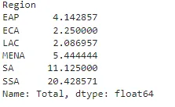

Then we will execute min, max, and mean functions to our provided dataset.

```python
data.groupby('Region').Total.agg(['min', 'max', 'mean'])
```

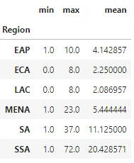

```python
%matplotlib inlinedata.groupby('Region').Total.mean().plot (kind='bar')
```

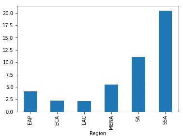

We notice that SSA (Sub-Saharan Africa) has the highest percentage of children who were out of school. And ECA (Eastern Europe) and LAC (Latin America and the Caribbean) have the lowest percentage.

**Data binning**

Data binning, also called discrete binning or bucketing, is a data pre-processing technique used to reduce the effects of minor observation errors. The original data values which fall into a given small interval, a bin, are replaced by a value representative of that interval, often the central value. It is a form of quantization. Wikipedia

Statistical data binning is a way to group numbers of more or less continuous values into a smaller number of "bins". Wikipedia

In our data, we will classify % of children who were out of school and were residing in Rural areas into bins with names indicating the educational quality in this country.

```python
R = data.loc[:, ['Countries and areas', 'Rural_Residence']]print(R)
```

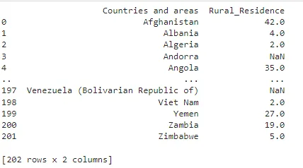

```python
bins=[0 ,20, 40, 60]
score = ['high eduction', 'average eduction', 'poor eduction']
data['quality index'] = pd.cut(data['Rural_Residence'], bins, labels = score)
data.loc[:, ['Countries and areas','Rural_Residence', 'Development Regions', 'quality index']]
```

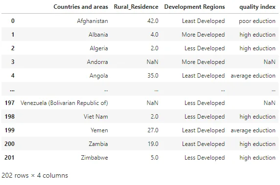

We notice after the execution of our code a direct correlation between the development level and educational level in these countries.

**Thanks for reading!**

Link for GitHub repo[**GitHub**](https://github.com/EslamElkot/EslamEklot.github.io/blob/main/Data_analysis_and_manipulation_tools_using_pandas.ipynb)

**Sources**

[Wikipedia](https://en.wikipedia.org/wiki/Data_binning)

[Kaggle](https://www.kaggle.com/komalkhetlani/out-of-school-rates-global-data?select=Primary.csv)

[Cover photo](https://videoplasty.com/stock-animation/lofi-panda-coding-sunset-session-29041)

[pandas.pydata.org](http://pandas.pydata.org)

**Acknowledgment**

That was part of Data insight's Data Scientist program.
