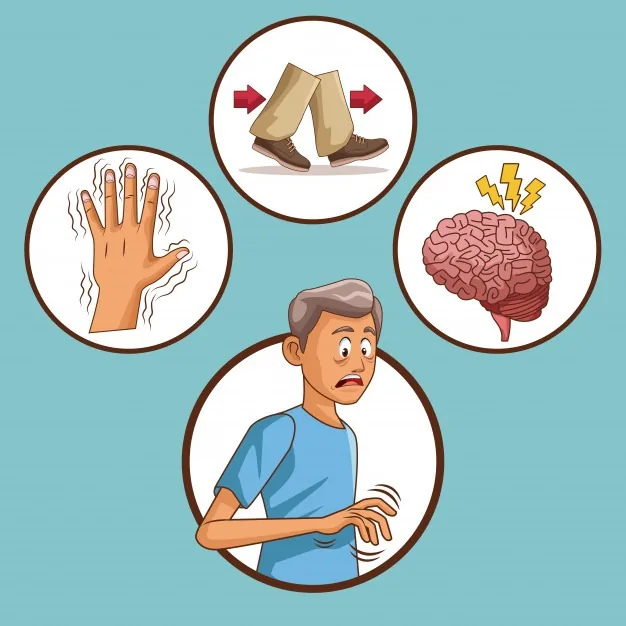
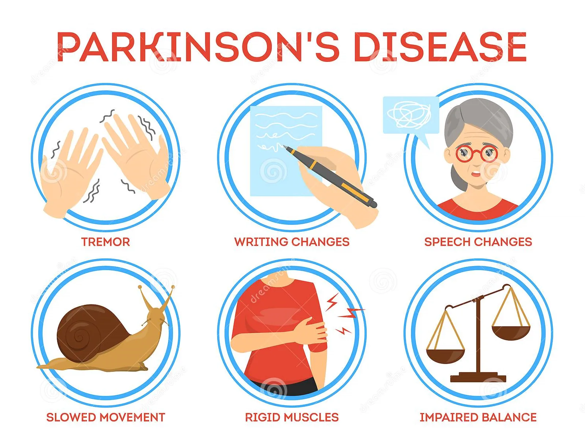
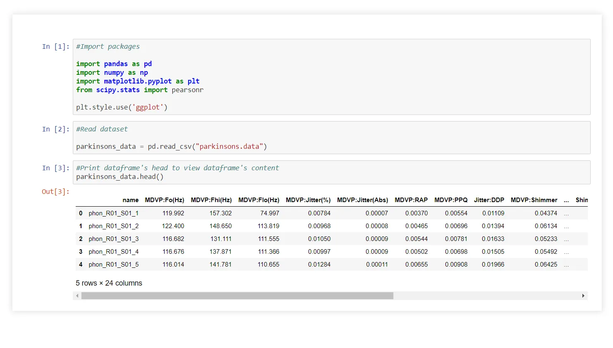
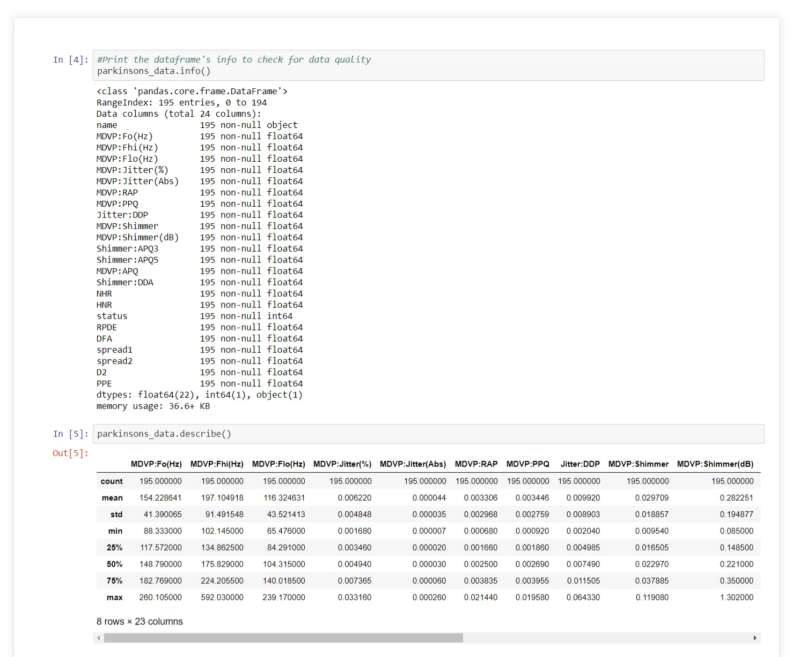
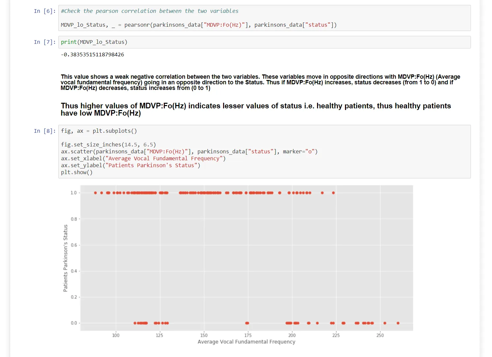
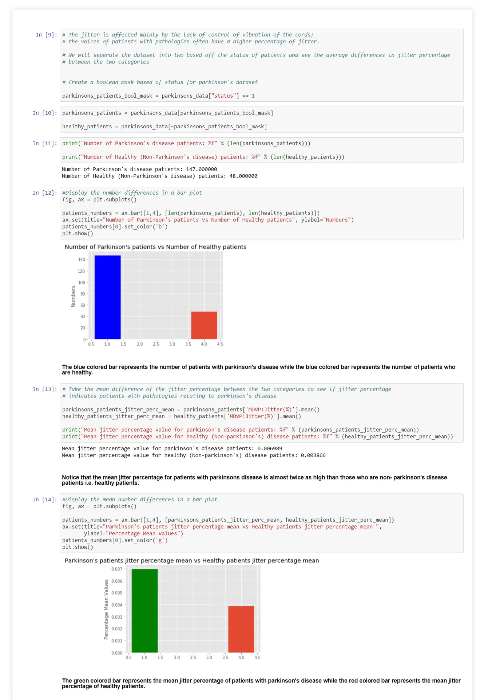
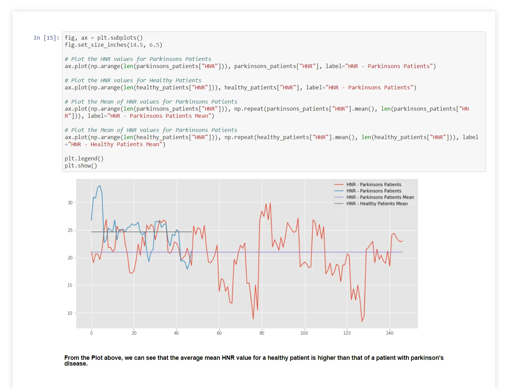
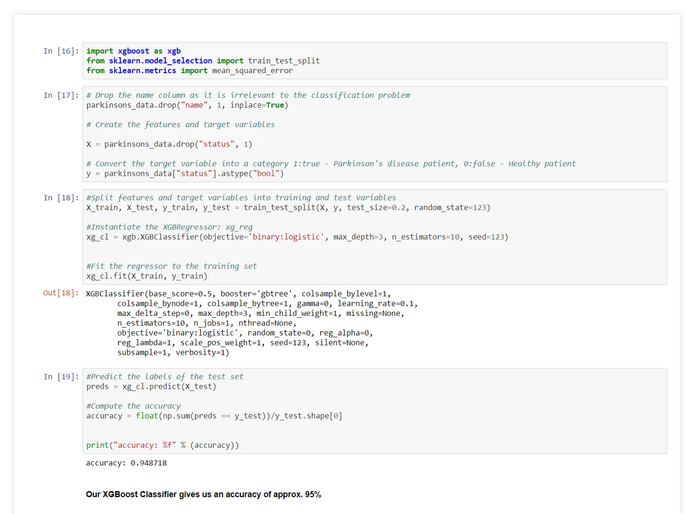

Neurodegenerative diseases are a heterogeneous group of disorders that are characterized by the progressive degeneration of the structure and function of the nervous system. They are incurable and debilitating conditions that cause problems with mental functioning also called dementias.

*Credit: Freepik*

**Parkinson's Disease**

Parkinson's disease is a progressive disease of the nervous system marked by tremor, muscular rigidity, and slow, imprecise movement, chiefly affecting middle-aged and elderly people. It is associated with degeneration of the basal ganglia of the brain and a deficiency of the neurotransmitter dopamine.

*Credit: Dreamstime*

Using Oxford Parkinson's Disease Detection Dataset, a Parkinson's disease dataset from UCI Machine Learning Repository to explore and build predictive models to successfully predict the presence of Parkinson's or not.

**Source:**

The dataset was created by Max Little of the University of Oxford, in collaboration with the National Centre for Voice and Speech, Denver, Colorado, who recorded the speech signals. The original study published the feature extraction methods for general voice disorders.

In this post, we attempt to answer three (3) questions from the dataset, which are:-

i. Does the MDVP:Flo correlates with the Status of patients?

ii. Does the jitter percentage of patients indicate their status?

iii. What does the Harmonics-To-Noise Ratio say about the two categories of patients?

We will first import the dataset and explore the quality and features of the dataset.

The Kay Pentax multidimensional voice program (MDVP) was used by Little et al. to measure 16 voice perturbation parameters, including the period (jitter) and amplitude (shimmer) perturbations, and harmonics-to-noise (and noise-to-harmonics) ratios.

Information about the column names from the dataset as described by the article - *Dysphonic Voice Pattern Analysis of Patients in Parkinson's Disease Using Minimum Interclass Probability Risk Feature Selection and Bagging Ensemble Learning Methods* [Yunfeng Wu](https://www.ncbi.nlm.nih.gov/pubmed/?term=Wu%20Y%5BAuthor%5D&cauthor=true&cauthor_uid=28553366), et al.

Yuweng et al, described in details that the average, maximum, and minimum vocal fundamental frequency (in Hz) computed by the Kay Pentax multidimensional voice program (MDVP) are indicated with the abbreviations of MDVP:F0, MDVP:Fhi, and MDVP:Flo, respectively.

The percentage and absolute jitter values are expressed as MDVP:Jitter(%) and MDVP:Jitter(Abs). The five-point period perturbation quotient and relative amplitude perturbation parameters calculated by the MDVP are written as MDVP:PPQ and MDVP:RAP.

The Jitter:DDP denotes the average absolute difference of differences between jitter cycles. The original and logarithmic units of the MDVP local shimmer parameter are named MDVP:Shimmer and MDVP:Shimmer(dB).

The abbreviations of Shimmer:APQ3 and Shimmer:APQ5 are short for the three-point and five-point shimmer perturbation quotient values, respectively. MDVP:APQ11 represents the 11-point amplitude perturbation quotient value.

Shimmer:DDA is the average absolute difference between the amplitudes of consecutive periods. The noise-to-harmonics ratio and harmonics-to-noise ratio of the acoustic signals are abbreviated as NHR and HNR, respectively.

Several nonlinear features include the correlation dimension (D2), recurrence period density entropy (RPDE), detrended fluctuation analysis (DFA), and pitch period entropy (PPE). Two nonlinear measures of fundamental frequency variation are presented as Spread1 and Spread2, respectively.

Let us inspect the quality of the dataset, check to see if there are missing values.

As seen from above, there are no missing data from the dataset.

The dataset has a column named **"status"** which indicates the status of the patient if the patient has Parkinson's disease or not.

Let us attempt to answer the questions.

1. **Does the MDVP:Flo correlates with the Status of patients?**

**Notice how patients with Average Vocal Fundamental Frequency (Hz) higher than 190 falls into the categories of those who are healthy while those below 190 are largely grouped among patients with Parkinson's disease.**

This graph indicates that the distribution follows a logistic regression model.

2. **Does the jitter percentage of patients indicate their status?**

Jitter is defined as the parameter of frequency variation from cycle to cycle, and shimmer relates to the amplitude variation of the sound wave, as Zwetsch et al.

The jitter is affected mainly by the lack of control of vibration of the cords; the voices of patients with pathologies often have a higher percentage of jitter.

**Patients with higher percentage values for jitter MDVP:Jitter(%) are Parkinson's disease patients, therefore higher percentage values indicate early stages of Parkinson's disease.**

3. **What does the Harmonics-To-Noise Ratio say about the two categories of patients?**

The HNR is an assessment of the ratio between periodic components and non-periodic components comprising a segment of voiced speech, as Murphy and Akande.

Ma E and Yiu E, define dysphonia as a phonation disorder with the difficulty in voice production. Dysphonia can be observed with hoarse, harsh, or breathy vowel sounds, as a result of the impaired ability of the vocal folds to properly vibrate during exhalation.

Idiopathic Parkinson's disease (IPD) is known as a chronic neurodegenerative disorder that may lead to producing dysphonic voice due to probable neurogenic interruptions in the laryngeal nerve paths, Sewall et al.

**Lower HNR values indicate asthenic voice and dysphonia which are symptoms of Parkinson's disease.**

## Let's build a Supervised Learning Model that predicts the presence of neurodegenerative disease in an individual from the dataset.
**Using XGBoost Classifier as this problem is a binary classification problem, the target variable i.e. "status" being either True: 1 or False: 0.**

Our XGBoost classifier model has trained and predicted over the hold-out test set with an accuracy of approximately 95%.

**Conclusion**

From the exploratory data analysis, we learned the following that:

i. Higher values of MDVP:Fo(Hz) indicate that the patient has Parkinson's disease since MDVP:Fo(Hz) and status values are negatively correlated.

ii. Higher percentage values of MDVP:Jitter(%) indicates the early stages of Parkinson's disease in the patient.

iii. The lower the HNR value indicates asthenic voice and dysphonia which are symptoms of Parkinson's disease.

We've also built a binary classification machine learning model with XGBoost to predict the status of a patient from similar datasets with an accuracy of 95%.

**References:**

- <https://www.hindawi.com/journals/cmmm/2017/4201984/tab2/>
- <https://www.ncbi.nlm.nih.gov/pmc/articles/PMC5434464/>
- Zwetsch, I., Fagundes, R., Russomano, T., Scolari, D.. Digital signal processing in the differential diagnosis of beningn larynx diseases, Porto Alegre, 2006.
- Murphy, P. and Akande, O. Cepstrum-Based Estimation of the Harmonics-to noise Ratio for Synthesized and Human Voice Signals. In Nonlinear Analyses and Algorithms for Speech Processing. Barcelona, LNAI 3817, Springer, 2005.
- Sewall G. K., Jiang J., Ford C. N. Clinical evaluation of Parkinson's-related dysphonia. *Laryngoscope*. 2006;116(10):1740–1744. doi: 10.1097/01.mlg.0000232537.58310.22. [[PubMed](https://www.ncbi.nlm.nih.gov/pubmed/17003722)] [[CrossRef](https://dx.doi.org/10.1097%2F01.mlg.0000232537.58310.22)]
- Ma E. P.-M., Yiu E. M.-L. Multiparametric evaluation of dysphonic severity. *Journal of Voice*. 2006;20(3):380–390. doi: 10.1016/j.jvoice.2005.04.007. [[PubMed](https://www.ncbi.nlm.nih.gov/pubmed/16185841)] [[CrossRef](https://dx.doi.org/10.1016%2Fj.jvoice.2005.04.007)]
