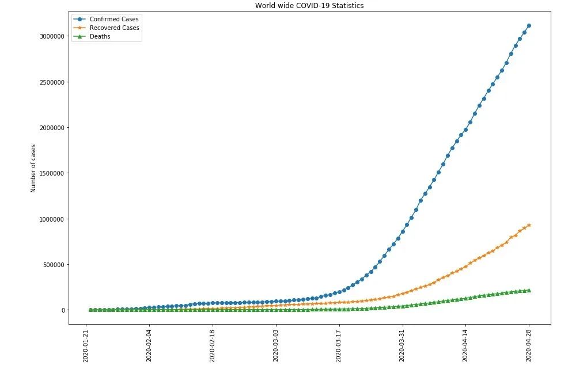
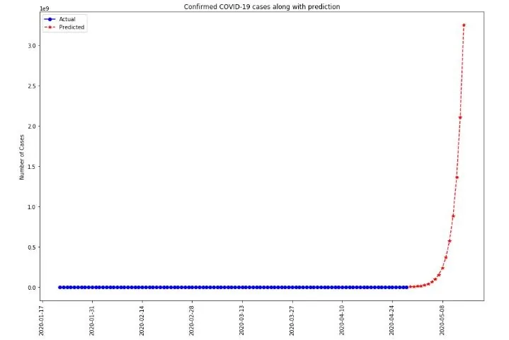
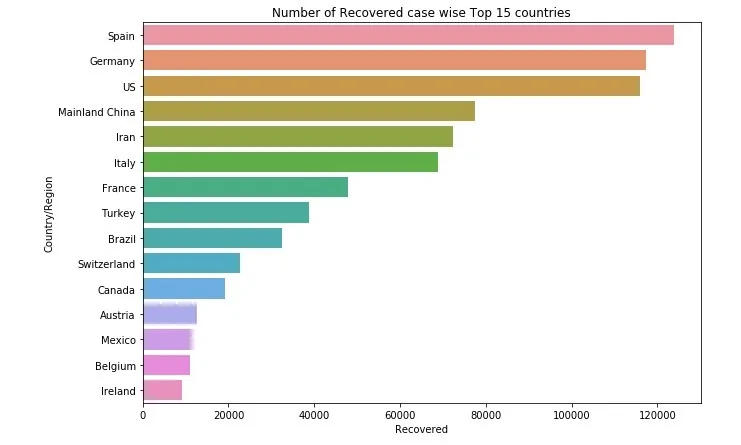
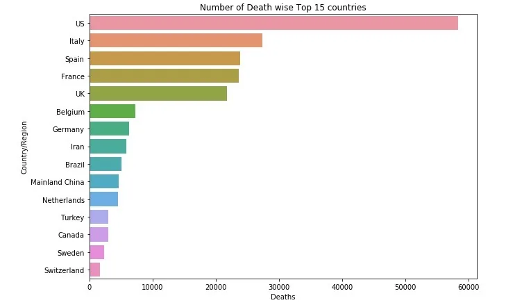
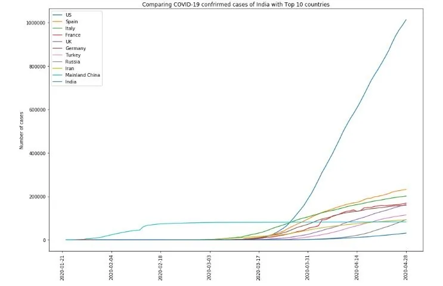
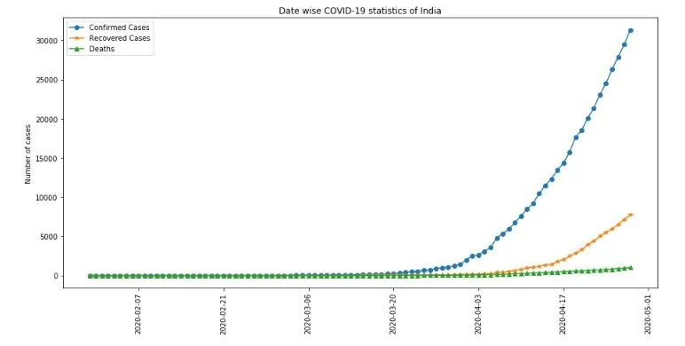
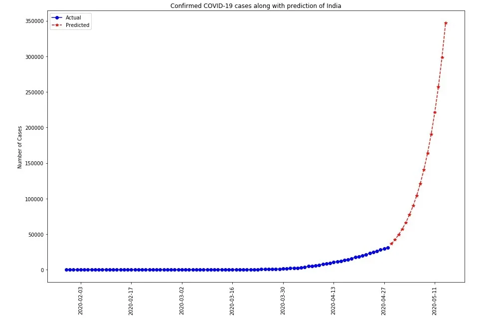

In the recent times, early 2020, corona virus disease (COVID-19) is spreading rapidly affecting the whole world population. In this article we will analyze the growth and spread of this pandemic. We will analyse the data for the whole world and also compare the top ten countries data with India.

We will use the data collected from this [Kaggle Dataset](https://www.kaggle.com/sudalairajkumar/novel-corona-virus-2019-dataset#covid_19_data.csv). This data provides the daily information on the number of COVID-19 affected cases throughout the world. The full statistical analysis on the data can be found in this [github repository](https://github.com/govind-savara/Analysis-of-COVID-19).

## World wide Spread
The data shows the following statistics as of 28th April, 2020.

- Total Confirmed Cases: 3116398.0
- Total Recovered Cases: 928658.0
- Total Deaths: 217153.0
- Total Active Cases: 1970587.0
- Total Countries/Regions effected with COVID: 220
- Percentage of Recovered cases: 29.799082145476927
- Percentage of deaths: 6.968076606389813

The statistics shows that there are 220 countries or regions are affected with COVID-19. Total confirmed cases found are more than 3 millions. The percentage of recovered cases is 29.8 whereas the death percentage is approximately 7. This death rate is huge and alarming to be very cautious to the whole world. Due to this rapid spread most of the countries imposed lock-down of their usual activities. This impositions highly effected the financial markets, transportation system, labor community etc.

The following graph shows the day wise statistics of the covid-19 spread.

The spread of this pandemic increased exponentially after mid of March.

The Growth Factor which is the ratio of total number of cases of the day to the total number of cases on the previous day, is used to predict the spread for next 15 days.

With this growth factor, the pandemic spreads rapidly to 3 billion in 15 to 20 days.

## Comparison of 15 highest spread countries
The following image shows the top 15 countries according to the recovered cases.

Spain is the top country which could able to recover maximum number of cases. US is most effected country due to covid-19 but also makes efforts to recover from the disease.

The above image shows the top 15 countries with number of deaths cases. Comparatively US has very huge amount of deaths than other countries. With the increase in recovery rate Spain could able to reduce the number of deaths.

The data shows that the US is with the highest number of confirmed COVID-19 cases. There is a huge difference between the US and the second top most country, Spain. From the beginning China is mostly affected but could able to control it. In recent times all the countries cases are growing exponentially.

## COVID-19 statistics of India
India is the second highest populated country. Comparatively it also has a high population density. This makes India prone to high impact of pandemic spread.

The spread of confirmed cases in India is predicted using the average Growth Factor.

This prediction shows that if the spread is not controlled then it will affect most of the people in the country. From the beginning India imposed lock-down and also educated the public on corona virus safety measures.

## Conclusion
The data shows that the spread is exponential and has a high chance of growing cases. As there is no proper medication yet for this corona virus disease we should very much vigilant in this regarding.

As prevention is better than cure, following social distancing and using proper safety measures will definitely reduce the spread of this pandemic.

**Stay safe and Stay healthy !**

The complete analysis of the data is available at this [github repository](https://github.com/govind-savara/Analysis-of-COVID-19).
