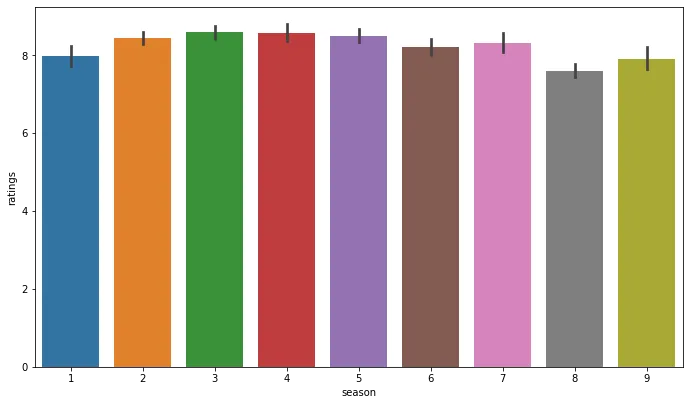
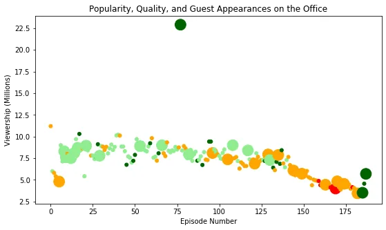
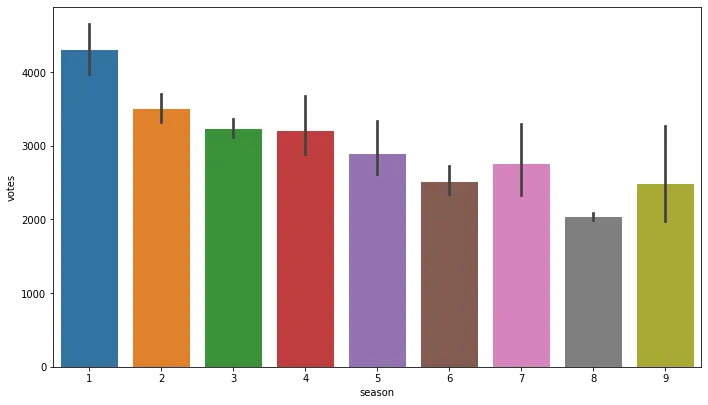
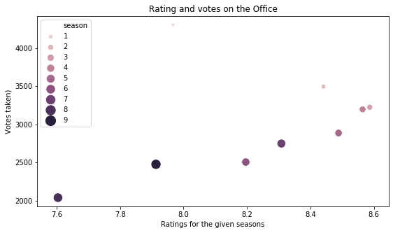
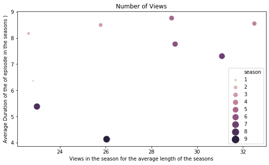

The Office is an American Mockumentary sitcom television series that depicts the everyday lives of office employees in the Scranton, Pennsylvania, branch of the fictional Dunder Mifflin Paper Company. Here we look into the datasets and discover new things and and visualize them.

The main step here is the data preprocessing so as for the given datasets, the original CSV files contains these columns:

```python
Data columns (total 12 columns):
 #   Column        Non-Null Count  Dtype
---  ------        --------------  -----
 0   Unnamed: 0    188 non-null    int64
 1   Season        188 non-null    int64
 2   EpisodeTitle  188 non-null    object
 3   About         188 non-null    object
 4   Ratings       188 non-null    float64
 5   Votes         188 non-null    int64
 6   Viewership    188 non-null    float64
 7   Duration      188 non-null    int64
 8   Date          188 non-null    object
 9   GuestStars    29 non-null     object
 10  Director      188 non-null    object
 11  Writers       188 non-null    object
```

So we add two more columns "has_guest" and the "scaled version of ratings" so that visualizations can be better and on scaling data cant be biased on one region.

```python
data.columns=['episode_number', 'season', 'episode_title', 'description', 'ratings', 'votes', 'viewership_mil', 'duration', 'release_date', 'guest_stars', 'director', 'writers']
```

```python
    def minmax(df):
    return round((df["ratings"]-
           df["ratings"].min())/(df["ratings"].max()-
           df["ratings"].min()),2)

    data["has_guests"]=data["guest_stars"].notnull()
    data["scaled_ratings"]=minmax(data)
```

After this, we have 14 columns and then we visualize which of the seasons have the highest ratings.

```python
plt.rcParams['figure.figsize']=[9,5]
fig=plt.figure()
ax=fig.add_axes([0,0,1,1])
sns.barplot(x="season", y="ratings", data=data)
plt.show()
```



Here from these visualizations, we can see seasons 2,3,4,5 are having maximum ratings.

Now let's see the popularity, quality and having the guest appearance.

```python
fig=plt.figure()
color=[]
stars=[]
for index,rows in data.iterrows():
    if rows["scaled_ratings"]>= 0.75:
        color.append("darkgreen")

    elif rows["scaled_ratings"]>=0.50 and rows["scaled_ratings"]<0.75:
        color.append("lightgreen")
    elif rows["scaled_ratings"]>=0.25 and rows["scaled_ratings"]<0.50:
        color.append("orange")
    else:
        color.append("red")
sizer=[]
for index,rows in data.iterrows():
    if rows["has_guests"]==True:
        sizer.append(250)

    else:
        sizer.append(25)

plt.scatter(data["episode_number"],y=data["viewership_mil"],c=color,s=sizer)
plt.xlabel("Episode Number")
plt.ylabel("Viewership (Millions)")
plt.title("Popularity, Quality, and Guest Appearances on the Office")

plt.show()
```



Here the bigger size episodes have the guest appearances and vice versa.

Moving forward, the highest voted seasons can be also seen as:



Now let's group the data points by seasons and figure out the views, durations counts and ratings of the seasons accordingly.

```python
fig=plt.figure()
df=data.groupby('season')[['votes','ratings',"viewership_mil",'duration']].mean().reset_index()
print(df)
seasons=data["season"]
sns.scatterplot(data=df, x="ratings", y="votes", hue="season",size="season",
    sizes=(20, 200), legend="full")
plt.xlabel("Ratings for the given seasons")
plt.ylabel("Votes taken)")
plt.title("Rating and votes on the Office")
plt.legend()
plt.show()
sns.scatterplot(data=df, x="duration", y="viewership_mil", hue="season",size="season",
    sizes=(20, 200), legend="full")
plt.xlabel("Views in the season for the average length of the seasons")
plt.ylabel("Average Duration of the of episode in the seasons )")
plt.title("Number of Views")
plt.legend()
plt.show()
```





Hence in this way, we can estimate the best seasons, make decisions on guest callings and create new insights.
