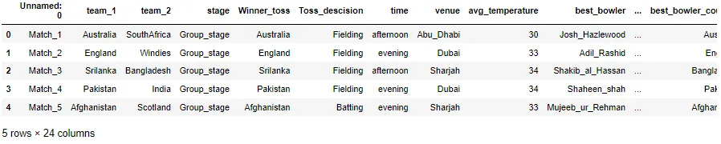
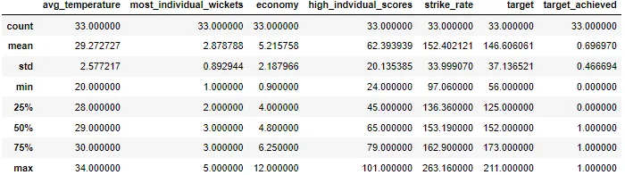
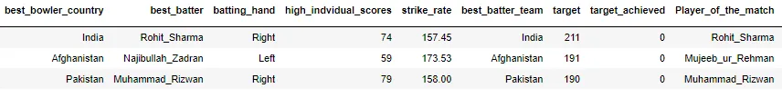
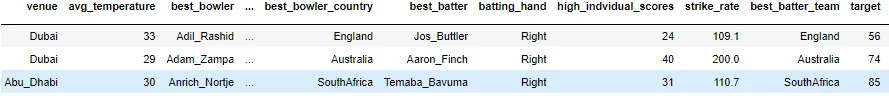
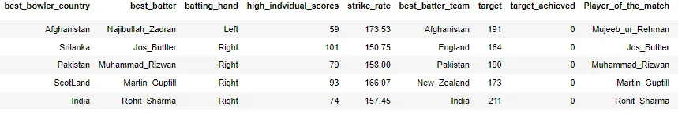
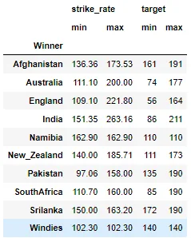
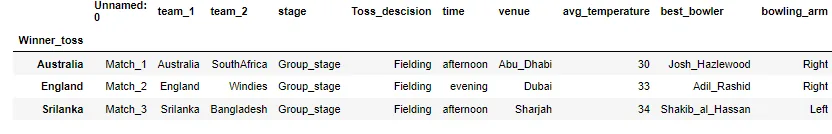
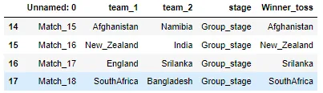
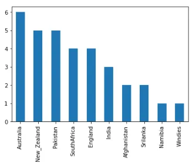
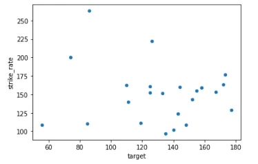

**Introduction**

In this blog, I want to explain the Pandas function that is helpful to find interesting information from data. I used the ICC T20 World Cup 2021 data shown <https://www.kaggle.com/affanazhar/icct20-worldcup2021> .

**1. Loading and Assessing Basic Information From Data:**

Start with importing the Pandas library:

```python
import pandas as pd
```

To load the data from the Comma Separated Value (csv file), we use **pd.read_csv()** function.

```python
data = pd.read_csv(r'C:\Users\Mairaj-PC\Desktop\worldt20_data.csv')
data.head()
```



To get some basic information from the data, we use **dataframe.info()** method

```python
# check the description of data in detail
data.info()
```

```python
 <class 'pandas.core.frame.DataFrame'>
RangeIndex: 33 entries, 0 to 32
Data columns (total 24 columns):
 #   Column                   Non-Null Count  Dtype
---  ------                   --------------  -----
 0   Unnamed: 0               33 non-null     object
 1   team_1                   33 non-null     object
 2   team_2                   33 non-null     object
 3   stage                    33 non-null     object
 4   Winner_toss              33 non-null     object
 5   Toss_descision           33 non-null     object
 6   time                     33 non-null     object
 7   venue                    33 non-null     object
 8   avg_temperature          33 non-null     int64
 9   best_bowler              33 non-null     object
 10  bowling_arm              33 non-null     object
 11  bowling_style            33 non-null     object
 12  most_individual_wickets  33 non-null     int64
 13  economy                  33 non-null     float64
 14  best_bowler_country      33 non-null     object
 15  best_batter              33 non-null     object
 16  batting_hand             33 non-null     object
 17  high_indvidual_scores    33 non-null     int64
 18  strike_rate              33 non-null     float64
 19  best_batter_team         33 non-null     object
 20  target                   33 non-null     int64
 21  target_achieved          33 non-null     int64
 22  Player_of_the_match      33 non-null     object
 23  Winner                   33 non-null     object
dtypes: float64(2), int64(5), object(17)
memory usage: 6.3+ KB
```

The info function defines as the data have 32 rows and 24 columns. There are no null values in the data.

We also see a basic statistical description of data by using a **dataframe.describe()** function. This function shows us the statistical summary of all quantitative variables in the data.

```python
# check the basic statistical summary of data
data.describe()
```



The described function shows us mean, standard deviation and many more. We get a many of information from this function like the mean temperature during the World Cup is 29.27 degrees Celcius and the highest individual score is 101.

**2. Sorting, Counting and Applying a Condition to Data:**

For sorting data either in ascending or descending order, we use **dataframe.sort_values()** function. By using this function, we find the top three highest targets during the World Cup.

```python
# sort the data from highest to lowest target of each match
data.sort_values('target', ascending = False).head(3)
```



The output shows us the top three targets set by India, Afghanistan and Pakistan of 211, 191 and 190 respectively.

Sort values function also apply with multiple columns shown below:

```python
# sorting with multiple columns (lowest by target and highest by temperature)
data.sort_values(['target', 'avg_temperature'], ascending = [True, False]).head(3)
```



The smallest target during the World Cup is 56 in Dubai with a hot temperature of 33 degrees Celcius.

We also examine our data by applying conditions by using and, or and not operators. An example of this operator is shown below:

```python
# find the player those have 50 plus individual scores and target not achieved
data[(data['high_indvidual_scores'] > 50) & (data['target_achieved'] == 0)].head()
```



For explaining the information from categorical data to get counts of categorical variables. We use **'dataframe.value_counts()'** method.

The T20 World Cup 2021 is in the United Arab Emirates. There are three venues Dubai, Sharjah and Abu Dhabi. We check that how many matches are played in each venue?

```python
# find the count of matches in each venue
data['venue'].value_counts()
```

```python
Dubai        13
Abu_Dhabi    11
Sharjah       9
Name: venue, dtype: int64
```

The output shows that Dubai Stadium covers more matches than the other two.

Take another example to see which country won the most matches in this World cup.

```python
# find the most number of wins by each country
most_wins = data['Winner'].value_counts()
most_wins.head(4)
```

```python
Australia      6
New_Zealand    5
Pakistan       5
SouthAfrica    4
Name: Winner, dtype: int64
```

Output is similar to expectation, Australia won the most matches therfore they are champion of this World Cup.

**3. Group Summary Statistics From Data :**

To make data split into separate groups to perform computations for better analysis. We use **dataframe.groupby()** function. We understand this concept with several examples.

First, we find the mean temperature in each venue of the World Cup. We use groupby() function as follows:

```python
# average temperatue in each venue
data.groupby('venue')['avg_temperature'].mean()
```

```python
venue
Abu_Dhabi    28.363636
Dubai        29.769231
Sharjah      29.666667
Name: avg_temperature, dtype: float64
```

The output shows us that Dubai has a slightly hotter temperature as compared to others.

We also apply groupby() function in multiple columns.

```python
# find the summary statistics of strike rate and target for each winning country
data.groupby('Winner')[['strike_rate', 'target']].agg([min, max])
```



Let's take another example to find out the most economical bowling spell of the World Cup.

```python
# find the most economical bowler
data.groupby('best_bowler')['economy'].mean().sort_values().head(3)
```

```python
best_bowler
Adil_Rashid      0.90
Hamid_Hassan     2.25
Anrich_Nortje    2.40
Name: economy, dtype: float64
```

Adil Rashid from England bowled the most economical spell of bowling with an average economy of 0.91 per over.

**4. Indexing and Slicing:**

We also slice and index data with any columns as per our requirement. We use two functions to apply the indexing. These are:

- **dataframe.loc[]** : gets rows (and/or columns) with particular **labels**.
- **dataframe.iloc[]**: gets rows (and/or columns) at integer **locations.**

Let's learn with examples, we want to find the tosses won by Pakistan team. We find by setting the index column to the 'Winner_toss" column by using **dataframe.set_index()** command.

```python
# make the index set to winner toss to see which have more toss win
new_data = data.set_index('Winner_toss')
new_data.head(3)
```



Now find the tosses won by Pakistan team by using dataframe.loc[] method.

```python
# subset the new data with few columns
selective_new_data = new_data[['team_2', 'stage']]

# print result of Pakistan
print(selective_new_data.loc['Pakistan'])
```

```python
                  team_2        stage
Winner_toss
Pakistan           India  Group_stage
Pakistan     New_Zealand  Group_stage
Pakistan         Namibia  Group_stage
Pakistan        ScotLand  Group_stage
```

The output said that Pakistan won the 4 tosses, all in the group stage matches.

Let's look at the rows of matches 15 to 18 with dataframe.iloc[] method .

```python
# we also use indexing by number using .iloc[]
# See the match 15 to 18
data.iloc[14:18,:5]
```



**5. Plotting with Pandas:**

Visualization is an important part of our analysis. Let's visualize the findings.

Make a bar plot to see the number of matches won by each team.

```python
# Create a vraible most_wins that show number of matches won by every team
# lets see result with bar plot
most_wins.plot(kind = 'bar')
```



The output shows the winning matches details of 10 countries out of 12 participating countries because 2 countries Bangladesh and Scotland did not win a single match in the World Cup.

Let's find the relation between strike rate and targets chased. The chance is the highest target chased with a high strike rate so both have an increasing relationship. Let us check by using a scatter plot.

```python
# lets find a relation with strike rate and target set in those game when target is chased
target_chased = data[data['target_achieved'] == 1]

# for this, we use scatter plot
target_chased.plot(x = 'target', y = 'strike_rate', kind = 'scatter')
```



The output does not show any strong increased relationship because small targets also chased with high strike rates.

**Conclusion:**

Pandas functions are very helpful to find insight from the data. They help us to get a better understanding of our data with a versatile approach. By the use of Pandas techniques in our analysis, we find the following information from our data:

- India set the highest target of 211 against Afghanistan.
- The smallest target of the World Cup is 56.
- The individual highest score by a batsman is 101.
- Dubai Stadium covers the most matches i.e 13 with hottest average temperature as compared to the other two venues.
- Australia won the most matches i.e 6.
- Adil Rashid from England bowled the most economical spell of the World Cup i.e 0.91 per over.
- Bangladesh and Scotland did not win a single match in the World Cup.

I hope this blog is helpful for you to learn some Pandas functions. The GitHub repository of this blog is <https://github.com/MuhammadMairajSaleem92/Python-Pandas-Techniques/blob/main/Pandas%20Techniques.ipynb>
