**A. Data Analyst**

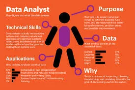

The rise of social networks, e-commerce and the Internet of Things has meant that companies in all industries now possess immense amounts of data. This data can be related to their customers, their products, their own performance, or even the market as a whole and the competition.

By analyzing this raw data, it is possible to extract very useful information to support decision making and gain competitive advantage. However, data analysis requires expertise and skills. This is where the Data analyst's job can help. It is in charge of processing the data available to the company in order to extract information from it to stimulate the company's growth and guide its strategy.

This information can then be used to decide which products to develop, or to define a marketing strategy. Thus, it is at the heart of the company. He is the one who must define the strategy to adopt and the direction to take. His role is to give meaning to the data, to transform it into usable information.

**B. NAICS**

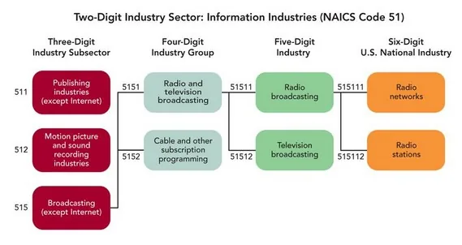

The **North American Industry Classification System (NAICS)** is an industry classification system developed by the statistical agencies of Canada, Mexico and the United States. It is used by business and government to classify business establishments according to type of economic activity or industry.

A NAICS code can have up to 6 digits. The breakdown:

- The **1st and 2nd numbers** = economic sector
- The **3rd number** = sub-sector
- The **4th number** = industry group
- The **5th number** = industry
- The **6th number** = national industry (a zero indicates no national industry is needed)

**C. Analysis**

Before analyzing these data, activities will be carried out to structure, clean up, extend, validate and publish the results in a suitable format. The whole of these processes is **data wrangling**. Questions related to this task are:

- Which most companies hired the most in Canada?
- How employment in Construction evolved overtime? In which month the recruitment are most important?
- How employment in Construction evolved over time, compared to the total employment across all industries?
- How food manufacturing companies have evolved in recruitment over time ? In which month the recruitment are most important?
- How employment in Repair, personal and non-profit services evolved over time? At what month are volunteers most needed?

1. **Preparation of the data set**

We worked with the glob package which allows to assemble the different csv files according to their classification (2, 3, 4 digits). This method avoids us to write a lot of code. The main activities before EDA consisted in converting some columns into strings for extractions, character replacements, concatenations and data joins.


a- Preprocessing of the five 2-digit NAICS datasets

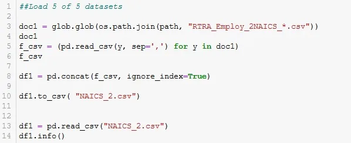

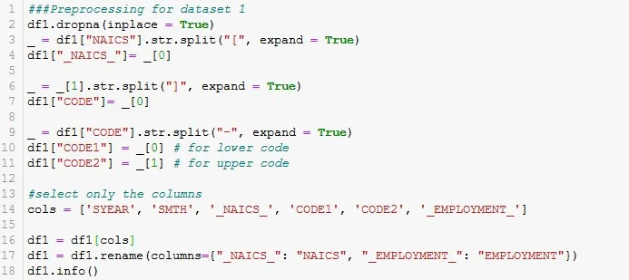

b- Preprocessing of the five 3-digit NAICS datasets

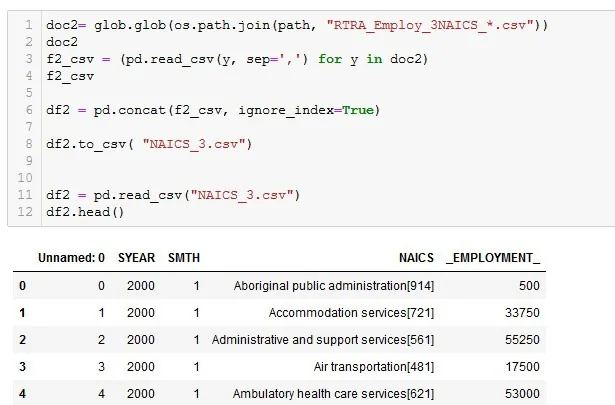

c- Preprocessing of the five 4-digit NAICS datasets

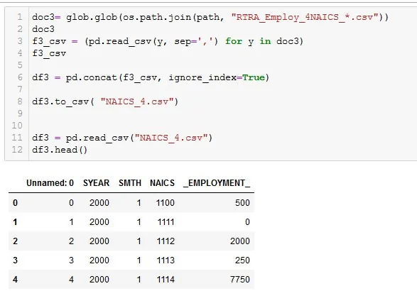

d- Join all dataset in one


e- Extraction Industries code in LMO_Detailed_Industries_by_NAICS file

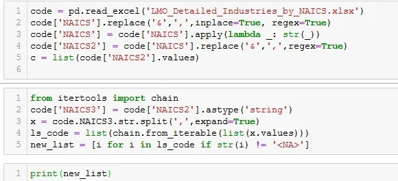

```python
##Conversion my list type in integer
list_of_code = [int(i) for i in new_list]
print(list_of_code)
```

2. Exploratory Data analysis

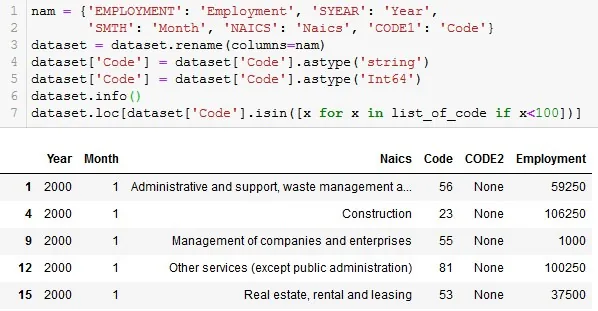

**Q1: Which 3 companies hired the most in Canada?**

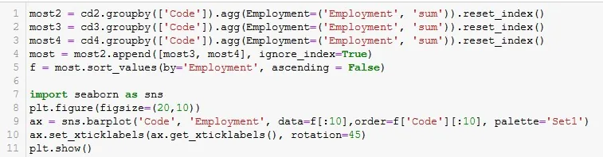

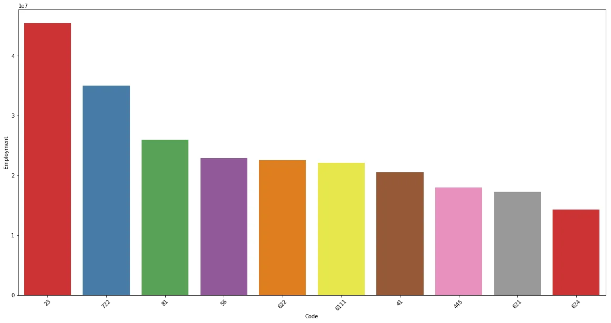

- The top 2 companies that hire the most in Canada are: construction companies (23) with 86032500, then non-profit services with 47391750

**Q2: How employment in Construction evolved overtime? In which month the recruitment are most important?**

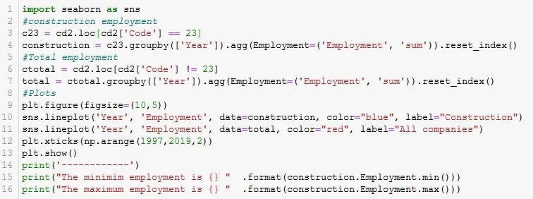

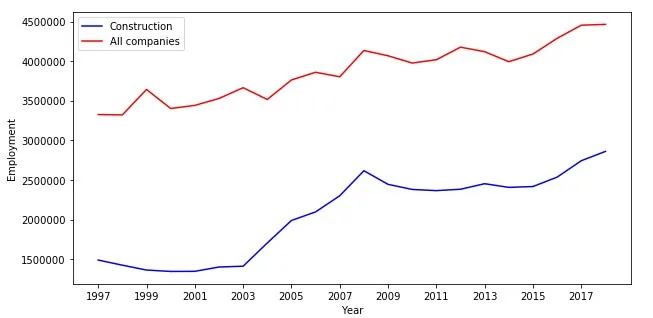

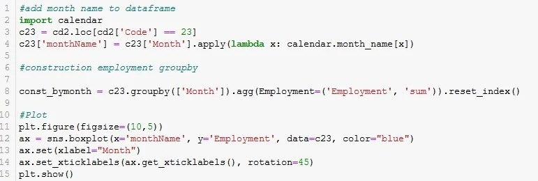

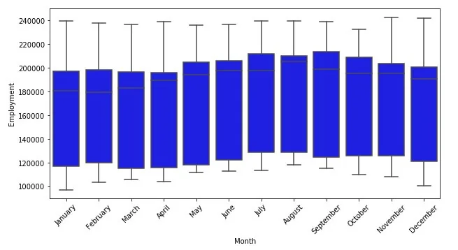

- Employment in construction has fluctuated with a significant downturn in 2000 probably due to the economic crisis. The increase in employment gradually rebounded until 2018, its highest point. From the same year, there was a clear decrease and it is not going to stop with the health crisis of 2020.
- Recruitment in the construction industry is highest for almost 4 months (highest in August). However, the variation is not very significant for the other months, even though December is still the smallest.

**Q3: How employment in Construction evolved over time, compared to the total employment across all industries?**

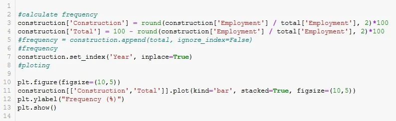

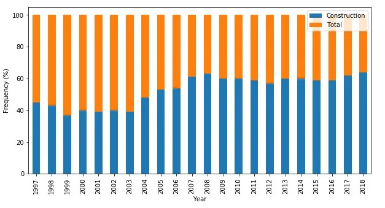

- Generally it is the construction industry that hires the most part of all the companies included in the study, this hiring rate varies on average between 40% and 60%. This result demonstrates the influence of this industry in the Canadian economy.

**Q4: What is the evolution of employment in food manufacturing during the year?**


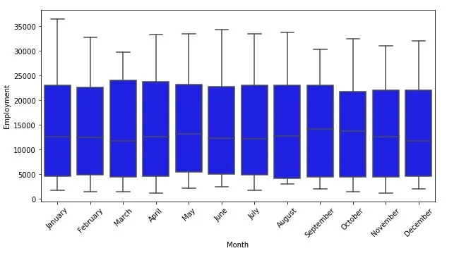

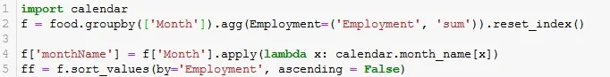

- Employment in food manufacturing is generally very low and is higher in December than in January.

**Q5: How employment in Repair, personal and non-profit services evolved over time? At what month are volunteers most needed ?**


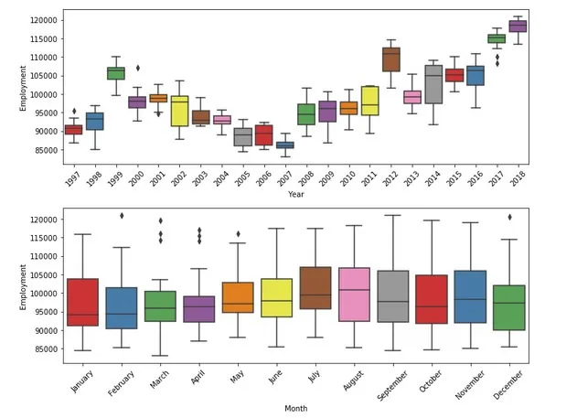

- Employment in not-for-profit organizations tends significantly over time. At its lowest level in 2007, it increased in the next few years with some fluctuations, peaking in 2019. Average over the months, the difference is not too significant even if October remains the least important period in terms of employment in this sector.

**D. Conclusion**
The previous analyses show that the sector that hires the most is the construction sector. Even if during the year 2000, jobs fell dramatically, probably due to the crisis, a gradual recovery is noted in the following years with 2018 as the year that recorded more hiring. This sector represents a major source of employment compared to other sectors.

**References**

https://www.bls.gov/bls/naics.htm
 https://www.edureka.co/blog/data-analyst-vs-data-engineer-vs-data-scientist/
