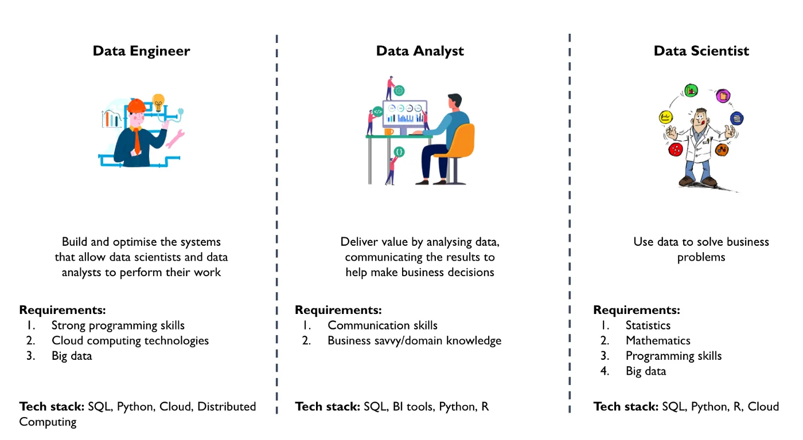
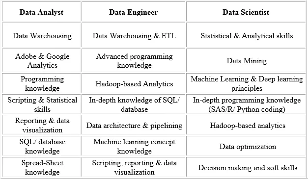
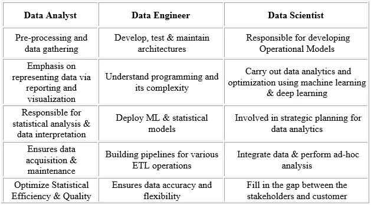

Data has always been vital to any kind of decision-making. Today’s world runs completely on data and none of today’s organizations would survive without data-driven decision-making and strategic plans. There are several roles in the industry today that deal with data because of its invaluable insights and trust. In this tutorial, we will discuss the key differences and similarities between a data analyst, data engineer and data scientist.

Have you ever wondered what differentiates a data scientist from a data analyst and a data engineer? What is the differentiating factor that helps them to analyze the data from a different point of view? The answer is their core **TASK!**

The task of a Data Scientist is to unearth future insights from raw data. Data engineer focuses on the development and maintenance of data pipelines. Data analysts mainly take actions that affect the company’s scope.

|  |  |  |
| --- | --- | --- |
| **Data Analyst** | **Data Engineer** | **Data Scientist** |
| Data Analyst analyzes numeric data and uses it to help companies make better decisions. | Data Engineer involves in preparing data. They develop, construct, test & maintain complete architecture. | A data scientist analyzes and interprets complex data. They are data wranglers who organize (big) data. |

### · **Data Analyst**

Most entry-level professionals interested in getting into a data-related job start off as Data Analysts. Qualifying for this role is as simple as it gets. All you need is a bachelor’s degree and good statistical knowledge. Strong technical skills would be a plus and can give you an edge over most other applicants. Other than this, companies expect you to understand data handling, modelling and reporting techniques along with a strong understanding of the business.

### · **Data Engineer**

Data Engineer either acquires a master’s degree in a data-related field or gather a good amount of experience as a Data Analyst. A Data Engineer needs to have a strong technical background with the ability to create and integrate APIs. They also need to understand data pipelining and performance optimization.

### · **Data Scientist**

Data Scientist is the one who analyses and interpret complex digital data. While there are several ways to get into a data scientist’s role, the most seamless one is by acquiring enough experience and learning the various data scientist skills. These skills include advanced statistical analyses, a complete understanding of machine learning, data conditioning etc.

For a better understanding of these professionals, let’s dive deeper and understand their required skill-sets.

## Skill-Sets
The below table illustrates the different skill sets required for Data Analyst, Data Engineer and Data Scientist:

As mentioned above, a data analyst’s primary skill set revolves around data acquisition, handling, and processing. A data engineer, on the other hand, requires an intermediate level understanding of programming to build thorough algorithms along with a mastery of statistics and math! And finally, a data scientist needs to be a master of both worlds. Data, stats, and math along with in-depth programming knowledge for Machine Learning and Deep Learning.

Now that we have a complete understanding of what skill sets you need to become a data analyst, data engineer or data scientist, let’s look at what the typical roles and responsibilities of these professionals.

Next, let us compare the different roles and responsibilities of a data analyst, data engineer and data scientist in their day to day life.

## Roles And Responsibilities
The roles and responsibilities of a data analyst, data engineer and data scientist are quite similar as you can see from their skill-sets. Refer the below table for more understanding:

Now data scientists and data engineers job roles are quite similar, but a data scientist is the one who has the upper hand in all the data-related activities. When it comes to business-related decision-making, data scientists have **higher proficiency**.

If you are someone looking to get into an interesting career, now would be the right time to up-skill and take advantage of the Data Science career opportunities that come your way.
