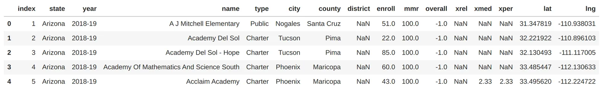
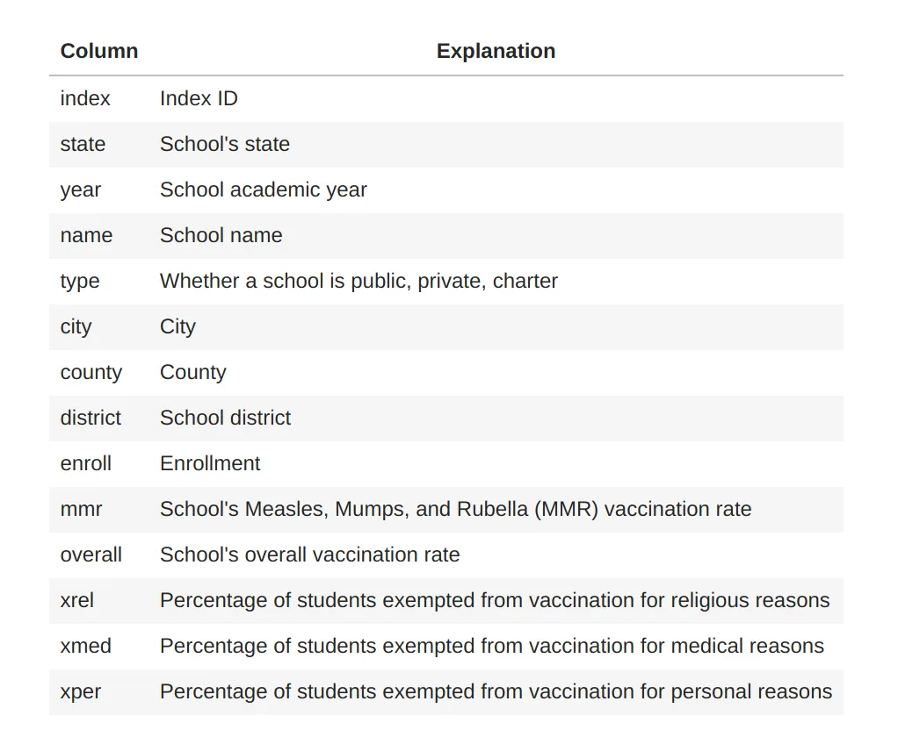
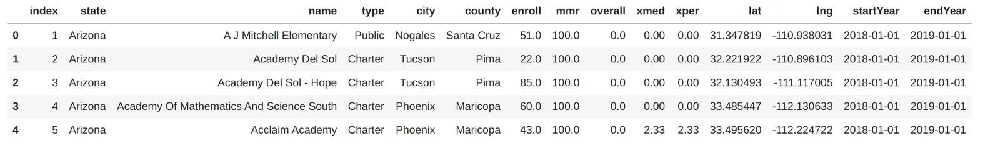

## General Introduction


According to Wikipedia, Data cleaning is the process of detecting and correcting (or removing) corrupt or inaccurate records from a recordset and refers to identifying incomplete, incorrect, inaccurate, or irrelevant parts of the data. Then replacing, modifying, or deleting dirty or coarse data.

The implementation of this process goes through different stages that we will try to show around a practical project.

You will find the dataset on the Datacamp platform with the following name "[**Measles Data**](https://app.datacamp.com/workspace/datasets)".

To be successful in this process one of the most important phases is to understand the data.

First of all, let's import our data to get an overview.

```python
import pandas as pd
measles = pd.read_csv('data/measles.csv')
measles.head()
```



The dataset presents us with the following information.



```python
measles.info()
```

```python
<class 'pandas.core.frame.DataFrame'>
RangeIndex: 46411 entries, 0 to 46410
Data columns (total 16 columns):
 #   Column    Non-Null Count  Dtype
---  ------    --------------  -----
 0   index     46411 non-null  int64
 1   state     46411 non-null  object
 2   year      41730 non-null  object
 3   name      46411 non-null  object
 4   type      19237 non-null  object
 5   city      29072 non-null  object
 6   county    41253 non-null  object
 7   district  0 non-null      float64
 8   enroll    33567 non-null  float64
 9   mmr       46411 non-null  float64
 10  overall   46411 non-null  float64
 11  xrel      94 non-null     object
 12  xmed      12972 non-null  float64
 13  xper      6411 non-null   float64
 14  lat       44859 non-null  float64
 15  lng       44859 non-null  float64
dtypes: float64(8), int64(1), object(7)
memory usage: 5.7+ MB
```

## Data analysis
After this overview we can identify some major problems on our dataset which are the following:

- **There is missing data**

```python
measles.isna().sum()
```

```python
index           0
state           0
year         4681
name            0
type        27174
city        17339
county       5158
district    46411
enroll      12844
mmr             0
overall         0
xrel        46317
xmed        33439
xper        40000
lat          1552
lng          1552
dtype: int64
```

We notice that the **district** column is unused.

### Column Year

**Year** should be in the format **datetime.dt.year**.

We have to convert the **year** column into this format.

When we look at the following code.

```python
measles.year.unique()
```

```python
array(['2018-19', '2017-18', nan, '2017'], dtype=object)
```

We notice that there is 2 year, the start year and the end year. So we should split the year column into two-column **startYear** and **endYear.**

### **Column** state, name, city, type, and county

The previous column should be converted in a **string** type

let's look at the column **type** in detail.

```python
measles.type.unique()
```

```python
array(['Public', 'Charter', 'Private', nan, 'Kindergarten', 'Nonpublic',
       'BOCES'], dtype=object)
```

This column should be converted into **category** type because we have several known values ​​that vary very little.

On the other hand for the other columns of string type, we cannot do it because we have too many distinct values.

The missing value for the **type** column should be replaced by **Missing.**

### **Column** enroll, overall,xrel, xmed, and xper

The enroll column represents the number of people registered so the correct type for this column is an integer.

When we try to see the min value for the **overall** columnwe get.

```python
measles.overall.min()
```

```python
-1.0
```

When we try to see the min value for the **mmr** columnwe get.

```python
measles.mmr.min()
```

```python
-1.0
```

When we try to see the max value for the **xper** columnwe get.

```python
measles.xper.max()
```

```python
169.23
```

**overall, mmr, xrel, xmed**, and **xper** represent values ​​in percentages. Therefore, they must be between **0** and **100**. This implies that the missing values ​​for these columns will have the value 0.

```python
measles.xrel.unique()
```

```python
array([nan, True], dtype=object)
```

For the **xrel** column available value is in boolean type.

So we will delete this column because the data does not represent what it is supposed to represent.

### Column lat and lng
for the following column, we will simply replace not available values with **0**.

- **Checking duplicate values**

Fortunately for us, this dataset does not present values ​​which are duplicated.

```python
measles.duplicated().sum()
```

```python
0
```

## Cleaning Data
We will clean the data by columns

- **dropping columns**

We will drop irrelevant columns.

```python
measles.drop('xrel', axis=1, inplace=True)
measles.drop('district', axis=1, inplace=True)
measles.columns
```

```python
Index(['index', 'state', 'year', 'name', 'type', 'city', 'county', 'district',
       'enroll', 'mmr', 'overall', 'xrel', 'xmed', 'xper', 'lat', 'lng'],
      dtype='object')
```

- **The column type**

Let's handle missing value.

```python
measles.loc[measles['type'].isna(), 'type'] = 'Missing'
measles.type.unique()
```

```python
array(['Public', 'Charter', 'Private', 'Missing', 'Kindergarten',
       'Nonpublic', 'BOCES'], dtype=object)
```

Let's change the data type of the current column.

```python
measles.type.astype('category')
measles.type.describe()
```

```python
count       46411
unique          7
top       Missing
freq        27174
Name: type, dtype: object
```

- **The column enroll**

Let's handle missing value.

```python
measles.loc[measles['enroll'].isna(), 'enroll'] = 0
```

Let's change the data type.

```python
measles.enroll.astype('int')
measles.enroll.describe()
```

```python
count    46411.000000
mean        51.571396
std         46.786130
min         -1.000000
25%         -1.000000
50%         83.330000
75%         95.612018
max        100.000000
Name: overall, dtype: float64
```

- **The column overall, xmed, xper, lat and lng**

Let's correct the data

```python
measles.loc[measles.overall < 0, 'overall'] = 0
measles.loc[measles.xmed < 0, 'xmed'] = 0
measles.loc[measles.xper > 100, 'xper'] = 0
measles.loc[measles.xmed.isna(), 'xmed'] = 0
measles.loc[measles.xper.isna(), 'xper'] = 0
measles.loc[measles.lat.isna(), 'lat'] = 0
measles.loc[measles.lng.isna(), 'lng'] = 0
```

- **The column state, name, city, and county**

Let's fix the data type.

```python
measles.state.astype('string')
measles.name.astype('string')
measles.city.astype('string')
measles.county.astype('string')
```

- **Creation of startYear and endYear columns**

Let's create new columns **startYear** and **endYear.**

```python
measles[['startYear', 'endYear']] = measles['year'].str.split('-', expand=True)
measles.endYear = '20'+measles.endYear
```

Let's drop the **year** column.

```python
measles.drop('year', axis=1, inplace=True)
```

Let's change the column's data type.

```python
measles.startYear = pd.to_datetime(measles.startYear, format='%Y')
measles.endYear = pd.to_datetime(measles.endYear, format='%Y')
```

Let's try to get an overview of the result of our data cleansing.

```python
measles.head()
```



## Conclusion
In conclusion, we have tried to perform the data cleansing on the measles data.

In our article, we have explained some techniques in a more practical than theoretical way.

We remember that cleaning remains one of the most important steps in a data study, it should not be neglected and it should be taken seriously.

If done well, it can improve the performance of the study to follow.

This process aims to correct inconsistent data or not used for our study that could have slipped into our dataset.

- "[**Measles Data**](https://app.datacamp.com/workspace/datasets)" on the Datacamp platform
- Full code on [Github](https://github.com/GreyCoderK/DataInsightOnline/blob/main/measles.ipynb).
- Written by **Kossonou Kouamé Maïzan Alain Serge** as part of [Data Scientist Program](https://linktrest.io/datainsight-data-scientist-program).
