After data extraction/collection, the data needs to be cleaned before analysis. Data cleaning is an important task in data science since the collected data can have many problems including incorrect data format, missing data, incorrect input values, and so forth. This task covers more than half of the overall task in Data Science. Today, we will look at some of the important concepts in the data cleaning process.

##### Simple Data Cleaning
Some essential functions used in data cleaning includes:

```python
#(if the DataFrame is named as df)
df.isnull()
```

This returns a Boolean table indicating **True** when the value is null and **False** otherwise

```python
df.notnull()
```

This does the reverse of *isnull()* i.e. return **True** when the value is not null and **False** when null

```python
df.dropna()
```

This drops the rows when any of its value is null. We can drop columns too by assigning the parameter *axis = 1*. By default, the function drops the rows(or columns) when any single value is null, we can also set the function to drop the row(or column) if all of its value is null by assigning the parameter *how='all'*.

```python
df.fillna(0)
```

This fills all the null values in the *DataFrame* with the value of 0. Any other value can be set apart from 0.

Another important aspect is renaming the columns in the *DataFrame*. At times, the column name is too complex and renaming it can simplify our task. This can be achieved with the *rename* method of the dataframe.

```python
df.rename(columns = {'old_name': 'new_name'}
         index = {'old_name': 'new_name'})
```

The rename method can take two arguments, columns (to rename the column) and index (to rename the row). Each of these takes on a dictionary stating the old name to be renamed and the new name. We’ll see its use in later examples.

Further grouping and data transformation needs to be done to make our data cleaner for analysis. We will look at these concepts with an example dataset.

We will look at the **World Happiness Report** as an example in all the task that follows. The World Happiness report data can be available [here](https://www.kaggle.com/unsdsn/world-happiness).

```python
import pandas as pd
import numpy as np

happiness_2015 = pd.read_csv('2015.csv')
happiness_2015.head()
```

A preview of the report looks like

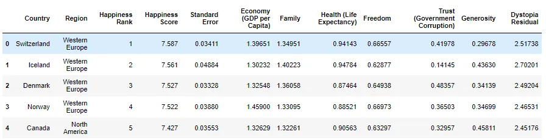

The columns of the dataset include:

**Country** – name of the country

**Region** – the region where the country is located

**Happiness rank** – the rank of the country in terms of happiness score

**Happiness score** – the overall happiness score of the country

**Standard Error** – the standard of the happiness score

**Economy, Family, Health, Freedom, Trust, Generosity** – the contribution of each of the factor in the overall happiness score for the country

**Dystopia Residual**- Represents the extent to which the factors above over or under explain the happiness score.

Let’s first rename few of the columns, **Economy (GDP per Capita)**, **Health (Life Expectancy)** and **Trust (Government Corruption)**

```python
happiness_2015.rename(columns = {'Economy (GDP per Capita)':
                                  'Economy',
                                'Health (Life Expectancy)':
                                  'Health',
                                'Trust (Government
                                   Corruption)': 'Trust'})
```

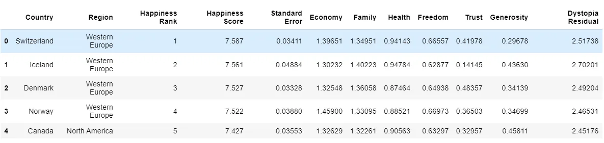

##### Data Aggregation
Aggregation is applying a statistical operation to groups of data. It reduces dimensionality so that the DataFrame returned will contain just one value for each group. The aggregation process consists of three sets:

1. Split the dataframe into groups
2. Apply a function to each group
3. Combine the results into one data structure

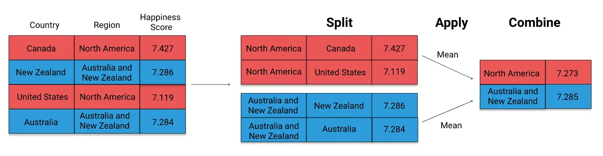

The groupby operation optimizes the split-apply-combine process. We can break it down into two steps:

1. Create a GroupBy object
2. Call an aggregation function

Let us now apply the *groupby* to the data above. When we look at the data, we see that we can group the countries based on the region column. Lets see what happens

```python
grouped = happiness_2015.groupby('Region')
print(grouped)
```

This returns us with the output

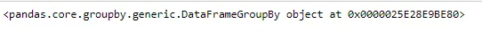

This shows that the data has been grouped and return a grouped object. To view the number of elements of each group, we can use the *size()* method of the *groupby* object.

```python
print(grouped.size())
```

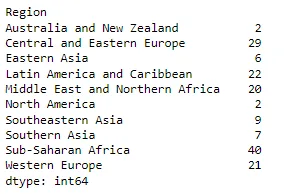

This returns us a series with the number of data (rows) in each group (i.e. region in the data above).

The power of *groupby* is seen when we want to apply a statistical function (or any other groupby methods) over the grouped data.

Various aggregating fuctions are available which includes: *mean(), sum(), size(), count(), min(), max()*, etc.

```python
print(grouped.mean())
```

This gives us a *DataFrame* object with the mean values of all numeric columns.

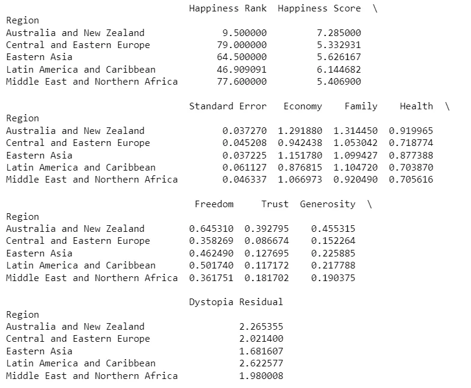

We can also view only a single column or a list of columns by passing the column name to the *groupby* object.

```python
#selecting single column
print(grouped['Happiness Score'].mean())
```

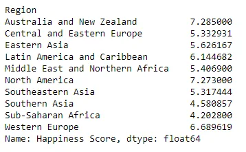

```python
#displaying values for group of columns
print(grouped[['Happiness Score', 'Family', 'Freedom']].mean())
```

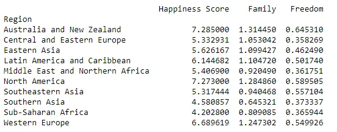

Notice how the index has been set to the column by which the table has been grouped. This can be reset with the *reset_index* method.

```python
print(grouped[['Happiness Score', 'Family', 'Freedom']].mean().reset_index())
```

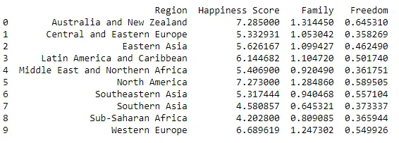

The *groupby* object also has a *agg()* method which allows user to pass multiple aggregating function in a single go. However, it should be noted that the function should be passed as a parameter without parenthesis in the *agg* method.

```python
print(grouped['Happiness Score'].agg([np.min, np.max, np.mean]))
```

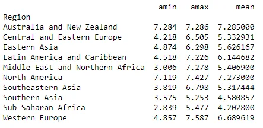

We can also pass a group of columns to apply the aggregate function like in the previous example.

The grouping of data is useful while finding errors in the dataset and some unexpected or unreasonable data that appears in the dataset.

##### Transforming Data
Many a times there arise situations while cleaning data that we have to apply certain cleaning process (functions) to every row of the data. We can do this by looping through each data and apply the function to each row. Pandas offer a better way to achieve this task through the functions map() and apply(). Both these functions apply the specified function element wise in the series.

For the Happiness report from above example, if we look at the data, there are columns which represents the factors of impact on the overall happiness score. We can convert these rows into category which represents ‘High’ and ‘Low’ impact. For this, we first define a custom function which separated the high and low impact value.

```python
def impact(element):
    if element > 1:
       return 'High'
    else:
       return 'Low'
```

We then apply this impact function over each row of a column (Series) with the *Series.map()* and *Series.apply()* function.

```python
happiness_2015['Family _map'] = happiness_2015['Family'].map(impact)

happiness_2015['Family _apply'] = happiness_2015['Family'].apply(impact)
```

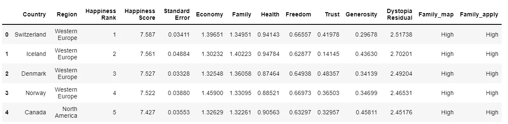

Upon inspection, we see that both the *map()* and the *apply()* function yields the same result. These function takes an element of a row, applies the specified function, returns the result and then moves to another row. Notice how the function has been called without the parenthesis in both *map()* and *apply()*. Also note that both of these functions are methods of a series and multiple columns will not work on multiple columns.

Pandas offer *applymap()* method for the purpose. With the *applymap()*, we can apply a function over multiple columns at a single go.

```python
factors = ['Economy', 'Family', 'Health', 'Freedom', 'Trust', 'Generosity']
happiness_rank = happiness_2015[factors].applymap(impact)

print(happiness_rank.head())
```

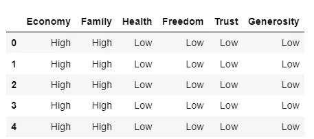

One thing to note is the difference between the apply() and the map() function. Altough, both performs the same task, there is one significant difference between the two. The apply function can take on an argument to be applied. To see this, let’s first create a function which takes two parameters.

```python
def impact_new(element, x):
    if element > x:
        return ‘High’
    else:
        return ‘Low’
```

When we apply the above function with the *map()*, we get an error while *apply()* can successfully implement it.

```python
happiness_new = happiness_2015['Family'].map(impact_new, x=0.8)
```

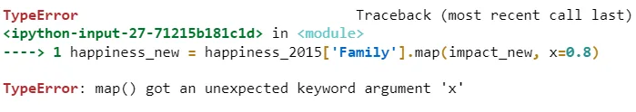

```python
happiness_new = happiness_2015['Family'].apply(impact_new, x=0.8)
happiness_new.head()
```

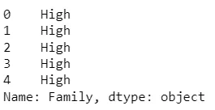

*The blog has been written as a part of the Data Insight program.*

*Some of the content has been referred from the DataQuest platform.*

*Examples of the entire blog can be found in my* [*GitHub*](https://github.com/Clown-Face/DataInsight/blob/88704486f3f3f073c4d850153f74b4b1179777c3/Data%20Cleaning.ipynb) *repo.*
