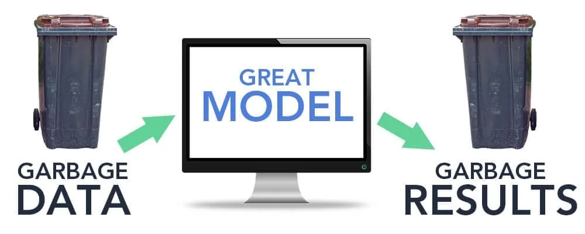

## What is data cleaning?

Data cleaning is the process of fixing or removing incorrect, corrupted, incorrectly formatted, duplicate, or incomplete data within a dataset. (ref: [here](https://www.tableau.com/learn/articles/what-is-data-cleaning))

## Why data cleaning is important?

Data cleaning is an essential step in the Data Science workflow since the insights and the results are depending on the data you have. If our data is not cleaned, we will not get good insights and results. (Garbage in, Garbage out)

If the data is incorrect, outcomes and algorithms are unreliable. Using uncleaned or dirty data in analysis will only result in erroneous predictions that engenders bad decisions and dangerous outcomes.

Before we move on,

This tutorial is designed to explain the concepts of data cleaning with code snippets. The data was self-created for demonstration purpose. In this tutorial, the code snippets are described for the corresponding topic. and not in the right order. You can find the complete source code and data in my GitHub repo [here](https://github.com/ayenadikyaw/DataCleaning.git).

## How do we check data is clean or qualified?

One of the first steps of assessing data cleanliness is quality analysis. Data typically has five characteristics than can be used to determine its quality. These five characteristics are:

1. Validity
2. Accuracy
3. Completeness
4. Consistency and
5. Uniformity

### 1.Validity

Typical constraints applied on forms and documents to ensure data validity are:

- Data type constraints
- Range Constraints
- Unique Constraints
- Foreign key constraints and
- Cross-field validation

#### Data Type Constraints

When you dealing with data cleaning, you might encounter with the condition of data types are not relevant for processing. For example, we should process the data as integer but it was in a string format. Or Sometimes, some data are represented as numbers but they are actually categories. So how can we deal with this? Python supports multiple functions to handle this situations. Now let's see an example.

First let's first import the necessary libraries to read csv file as pandas data frame and peek some rows of data.

```python
#import libraries
import pandas as pd

df=pd.read_csv('temp_rec_test.csv')
df.head()
```

output:

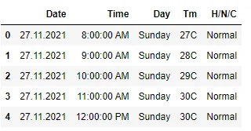

Then, let's check data types.

```python
# checking data types
df.dtypes
```

output:

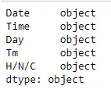

One column name H/N/C is not quite relevant. So, let's change the column name.

```python
# rename column
df.rename(columns={'H/N/C':'Status'},inplace=True)
```

Date column should be date time object and Tm (Temperature) should be integer. We can just leave Time and Day as it is. The Status column should be category.

We can easily convert Data column to date time object using pandas to_datetime() function like below.

```python
# convert Date column to pandas date time object
df['Date']=pd.to_datetime(df['Date'])
```

We can also easily convert Status column to 'category' type as well.

```python
#change into category type
df['Status']=df['Status'].astype('category')
```

However to convert the Tm (temperature) column to integer, we need to do some text processing. Because the temperature in the data is originally recorded as value+C form. First, we need to remove 'C' from all those temperature records. Python supports str.strip() function to remove any letter we want. Let's see an example:

```python
df['Tm']=df['Tm'].str.strip('C')
```

We can know column 'Tm' is definitely still a string by using sum() function.

```python
df['Tm'].sum()
```

output:

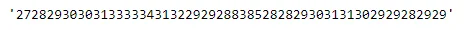

We can see the concatenated result. Now, let's try to change to integer as below.

```python
df['Tm']=df['Tm'].astype('int')
```

You can check again the dtypes of the columns by using [df.info()](http://df.info)

```python
df.info()
```

output:

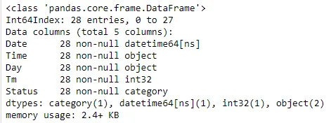

Now, you can see that all the data type fall into the relevant constraints

#### Data Range Constraints

One of the easiest restraints to check, and one of the easiest to understand, is the range constraint. Water is only physically water between 0 and 100 degrees Celsius. If your data says the water is 435 C, it isn’t water anymore. In fact, it’s steam. In your dataset, you might see out of range data. Numbers and data should fall within a certain range. This can be because of data entry error. There are some ways that you can use to deal with out of range data: You can drop it, or you can set custom minimums and maximums, treat as missing and impute or you can set custom value depending on business assumptions.

When you check the membership of Date column, you will see one record is out of range.

```python
#check membership of Date
df['Date'].unique()
```

Output:

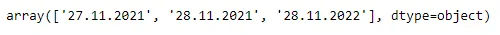

You can see there is a date (28.11.2022) which is not coming yet. To handle this, you need to check how many records like that are there in the data.

```python
#import datetime as dt
toDay=pd.to_datetime('now')
# subset irrelevant dates
df_subset = df.loc[(df['Date'] > toDay)]
```

output:

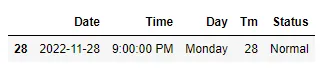

There are only one record which is out of range. We can just simple drop this row.

```python
#drop the out of range data
df.drop(df[df['Date']>toDay].index,inplace=True)
```

#### Unique Constraint

Furthermore, A unique constraint enforces the data integrity e.g. that every value in a column or set of columns (key) be unique—that is, no two rows of a table have duplicate values in a specified column or set of columns. Your data might have duplicate values means not unique. This can because of Data Entry or Human Error, or it can also happen when you join or merge the data set. It can also because of bugs and design errors. Pandas support function to check whether your data has duplicates. Let's see an example.

You can use duplicated() function to check your data has duplicate values or not.

```python
# Uniqueness
duplicates=df.duplicated(keep=False)
duplicates
```

output:

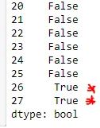

You can see there are two duplicate rows. We can extract these using loc.

```python
df.loc[26:27]
```

output:

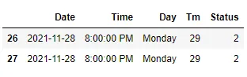

To deal with the duplicate values, you might decide to drop or keep the necessary ones. In my demonstration, I will just drop the last row by simply using drop() function. You should take a look of drop_duplicates() function as well. [Data Camp's Data Cleaning Tutorial](https://campus.datacamp.com/courses/cleaning-data-in-python/common-data-problems-1?ex=1) has a well explanation about this. Now let's just simply drop the last row.

```python
#drop last row
df.drop(27)
```

This will remove the last row which is a duplicate record.

#### Cross Field Validation

Today, data never comes from a single source. More often than not, it is collected in different locations and merged together. A common challenge when merging data is data integrity. In simple words, making sure our data is correct by using multiple fields to check the validity of another. In fancier terms, this process is called **Cross Field Validation**.

### 2. Accuracy

Accuracy refers to how much the collected data is both feasible and accurate. Data in the form of locations, for example, can easily be cross-checked to confirm whether the location exists or not, or if the postal code matches the location or not. Similarly, feasibility can be a solid criterion for judging. A person cannot be 100 feet tall, nor can they weigh a thousand pounds, so data going along these lines can be easily rejected.

### 3. Completeness

Completeness refers to the degree to which the entered data is present in its entirety. Missing fields and missing values are often impossible to fix, resulting in the entire data row being dropped. The presence of incomplete data, however, can be appropriately fixed with the help of proper constraints that prevent participants from filling up incomplete information or leaving out certain fields.

Completeness Example

Now, let's check the missing values conditions of our data set.

```python
#check missing values
df.isna().sum()
```

output:

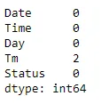

You can visualize missing data using mssingno package which is good for understanding and visualizing of missing data.

```python
import missingno as msno
import matplotlib.pyplot as plt
msno.matrix(df)
plt.show()
```

output:

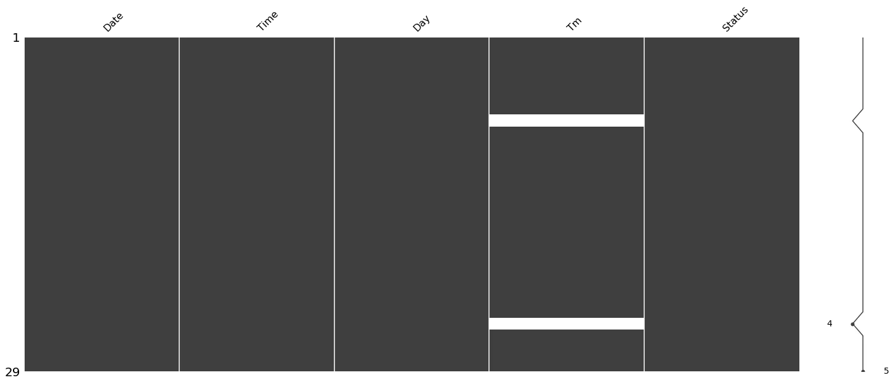

We can see that there are two missing values in Tm (Temperature). To handle the missing values, you can drop or impute with statistical measures.

In this tutorial, normally temperature does not change that much within an hour. So that, we can sue forward or backward fill method. This example use forward fill (ffill ).

```python
# fill missing values using forward fill
df['Tm']=df['Tm'].fillna(method='ffill')
```

check information again

```python
df.info()
```

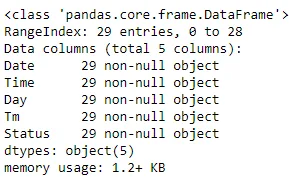

Now, the data is complete and there are no missing values anymore.

### 4. Consistency

Consistency refers to how the data responds to cross-checks with other fields. Studies are often held where the same participant fills out multiple surveys which are cross-checked for consistency. Cross checks are also included for the same participant in more than a single field.

### 5. Uniformity

The degree to which the data is specified using the same unit of measure.

The weight may be recorded either in pounds or kilos.

If you check the statistics information of Tm(Temperature) like below, you will notice there are some irrelevant data.

```python
#Statistics of Tm
df['Tm'].describe()
```

output:

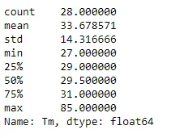

You can see that the maximum value is 85 which is impossible for temperature in degree Celsius. We can visualize to check these outliers.

```python
plt.scatter(x='Time',y='Tm',data=df)
plt.title("Temperatures for Two Days")
plt.xlabel('Time')
plt.ylabel('Temperature in celcius')
ax=plt.gca()
ax.set_xticklabels(labels=df['Time'],rotation=45)
plt.show()
```

output:

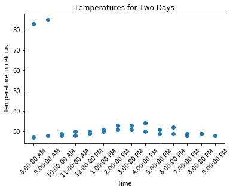

We can see that there are two data points which is so far away from the majority of data points. They might be degree Fahrenheit. We need to handle this situation. There is a formula we can convert from Fahrenheit to Celsius. So, we will use that to convert all the values greater than 40 to Degree Celsius which is a considerate amount for Celsius.

```python
# change fahrenheight to celsius
temp_fah=df.loc[df['Tm']>40,'Tm']
temp_cels=(temp_fah-32)*(5/9)
df.loc[df['Tm']>40,'Tm']=temp_cels
assert df['Tm'].max()<40
```

Then, let's check again the statistics.

```python
df.describe()
```

output:

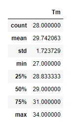

Now, the data looks fine but we still need to check other quality assessments.

Besides checking up on these generic characteristics, there are still other specialized methods that data scientists and data engineers use to check the quality of their data.

## How do you clean data?

There is no one absolute way to prescribe the exact steps in the data cleaning process because the processes will vary from dataset to dataset. But it is crucial to establish a template for your data cleaning process so you know you are doing it the right way every time.

The techniques used for data cleaning may vary according to the types of data you are using. However, basic and essential steps for data cleaning that you should perform are:

1. Remove duplicate or irrelevant data
2. Fix structural errors
3. Filter unwanted outliers
4. Handle missing data and
5. Validate and QA

## Conclusion

In this blog tutorial, you can learn data quality analysis which is crucial. Because quality data can beat better insights. The concepts are explained with python code examples so that you will get a foundation knowledge how you can connect with your real-world data cleaning process.
