Data is not always perfect or tidy. Data can have missing values due to observations that were not recorded or the data source may be corrupted. Without making sure data is completely clean before processing it, we risk compromising the insights and reports we generated from said data. In this blog, we will identify and diagnose some common data cleaning constraints we can find in everyday data. This blog covers the following data constraints:

· Missing data

· Data type constraint

· Inconsistent column names

In this blog, we are going to use the dictionary below that I manually created and convert it into pandas DataFrame. Pandas and Numpy are imported as under their usual aliases pd and np.

```python
import pandas as pd
import numpy as np
```

```python
customers= {
     'first_Name' :['Ama','Kofi', 'Kweku','Kwame', 'Yaw', np.nan,'Ajoa', 'Ohemaa', 'missing'],
     'Last_name'  :['KorKo', 'Agyeman','Osei','Bonsu', np.nan, "missing",'Gogba','Laryae','Donda'],
     'position'   :['Nurse','Carpenter','NaN', np.nan,'Doctor','Engineer',np.nan, 'Accountant','Police'],
     'age'        :['missing','45','55','25','31','54',np.nan,'28','42']}
```

We read the dictionary as a DataFrame by using the **pd.DataFrame()** method and store the result in the variable df.

```python
df=pd.DataFrame(customers)
df
```

output:

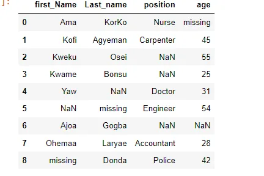

**Missing Data**

Missing data is always a problem for real-life data analysis. The quality and accuracy of insights and reports on data are greatly hindered by missing values. How do we know whether a DataFrame has missing values? We can use the pandas **isna()** method which returns a boolean whether there are missing elements in the data i.e. True if there are any missing values and False otherwise.

```python
df.isna()
```

output:

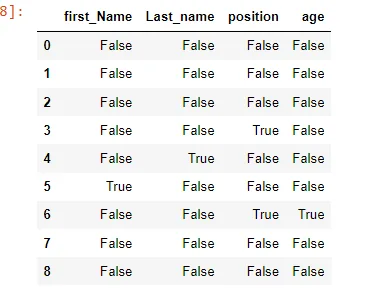

To ascertain the number of missing values by columns and count, we should use the **pandas.isna().sum()** method. The output produces a pandas series of the number of missing values as per columns.

```python
df.isna().sum()
```

output:

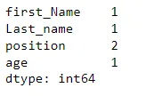

From here, we shall expound and start cleaning the data. There are two simple ways that this can be done. The first is dropping the missing data and inputting missing data

To drop rows of missing values, we can use the[**drop.na()**](http://drop.na)[.](http://drop.na) This is usually done when the missing values are not huge and do not have a significant impact on the overall data. Using the above DataFrame, we use the [**drop.na()**](http://drop.na) method and assign it to a different variable named df1. We are assigning the output to a different variable because we do not lose the original data.

```python
df1= df.dropna()
df1
```

output:

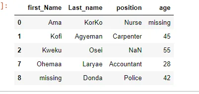

From the above output, it shows some of the rows of the DataFrame has been dropped but if you closely observe the output, there is still missing data. Why is that so? How come pandas was not able to remove the other missing values?

Using the info method shows that the new DataFrame (**df1**) has no null values. But the **info()** method also shows the data types of the columns.

```python
df1.info()
```

The outputs show the values of the Dataframe columns are of the object type. The object data type is the way pandas stores strings in DataFrame. Hence pandas could read the remaining null values as a string. That is why pandas was not able to drop them.

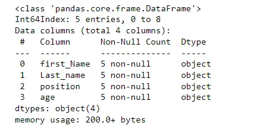

Therefore dropping the null values will not be enough in this case. This leads to inputting missing data. We will go back and use our original DataFrame(df). Here we will replace all the missing values that are strings into **np.nan** so that pandas can read them as null values.

Here we use the pandas replace method to do that. We parse the dictionary where we map the string 'NaN' and 'missing' to numpy null value **np.nan** as the object to the replace method. Then we call df to see the changes.

```python
df= df.replace({'NaN':np.nan, 'missing': np.nan})
df
```

output:

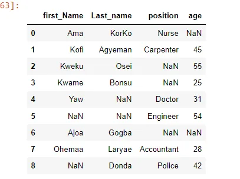

In order to start inputting missing values. We have to convert the age column data type into a float. This leads us to our next point Data Type Constraint.

**Data Type Constraint**

In order to work on the age column, we need to convert it into a float. Converting it into an integer will raise an error. We then use the **pandas .astype()** specifying the desired type as a float.

```python
df['age'] = df['age'].astype('float')
```

Using the pandas **dtypes** attribute we can see the data type of age has changed to float.

```python
df['age'].dtypes
```

output:

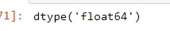

Now that the data type has been converted, this brings us back to inputting missing values.

We can find the median value of the age column and assign it to the null values. We can do this by using **pandas.fillna()** method.

But first, we need to find the median value of the age column

```python
age_median_value = df['age'].median()
age_median_value
```

Output:

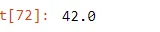

We pass the median value as an object to the **pd.fillna()** and set the in place parameter to True so that the changes will take effect in the DataFrame.

```python
df['age'].fillna(age_median_value, inplace= True)
df
```

Output:

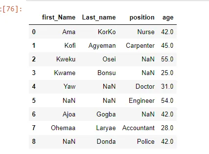

We still have missing values of the first name, last name and position columns. Since the first and last name columns are dominated by local Ghanaian names, we can randomly assign Ghanian names to them. The position column also has the traditional occupational position, therefore for the data to have uniformity we will randomly assign traditional jobs to the missing values. We will do this by using **pandas.loc** method to locate the position of the missing values and assign them new values.

```python
df.loc[2,'position']= 'Lawyer'
df.loc[3,'position']= 'Banker'
df.loc[6, 'position']= 'Politician'
df.loc[4, 'Last_name'] = 'Kanta'
df.loc[5, 'Last_name'] = 'Okyere'
df.loc[5,'first_Name'] = 'Kwabena'
df.loc[8,'first_Name'] = 'John'

df
```

output:

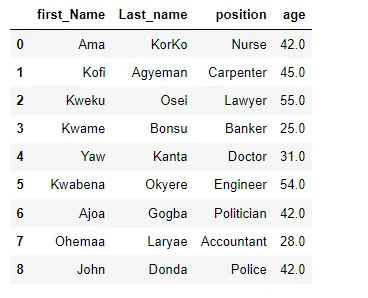

**Inconsistent column names**

There should be uniformity in the column names in every DataFrame. It is important for a dataset to follow a specific standard. Inconsistent use of upper and lower cases in column names is a common mistake. For example in this dataset, the column names do not follow a specified case. Some of the column names are capitalized others are not. To rectify this, we call the string method upper on the column names.

```python
df.columns=df.columns.str.upper()
```

When we call the DataFrame after, the column names have been changed to upper cases.

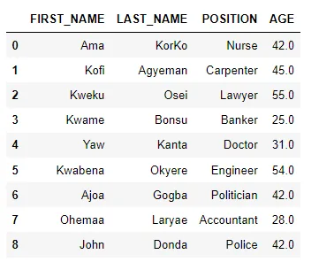

**Conclusion**
There are so many ways of cleaning data, the above steps are some of the essential procedures.

This blog is a Data Insight Scholarship Project. You can find more information on Data Insight Data Science Program [here](https://www.datainsightonline.com/)

The code in this blog was written [here](https://github.com/Storerun/data_cleanining_python)

The cover photo was taken from [here](https://unsplash.com/@jeshoots?utm_source=unsplash&utm_medium=referral&utm_content=creditCopyText)
