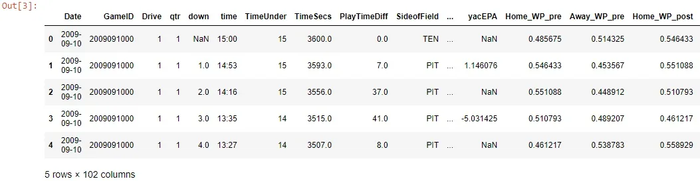
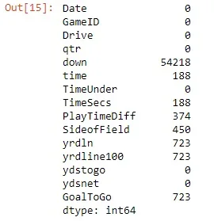
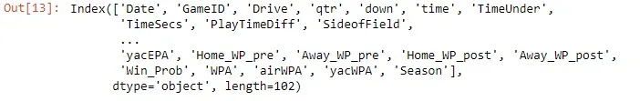
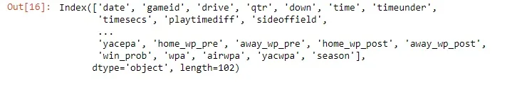
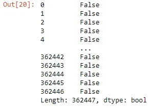

Data that can lead to good insights and to get useful information and knowledge from has to be checked in terms of its quality. As garbage in leads to garbage out, Data cleaning is an essential process before moving on to draw any analysis or building any model based on these data. And examples of issues that affect the data quality are noisy data, missing data, inconsistency in data, incomplete data, and duplicates, and more.

In this article, we will go through to some of these issues and how to deal with them.

Firstly we imported our data and we will see some of its rows as follows:

```python
play_df.head()
```



let's begin to deal with missing data as from what we see in the first five rows there are a number of missing data.

```python
play_df.isnull().sum()[0:15]
```



Here we viewed the first fifteen columns and the number of missing values that exist in them. We can conclude from finding missing values

in the data that either these values were not recorded or did not exist.

It appears that there are many columns that have many null values and with a large proportion of the data. So to do the careful analysis we have to look at each column individually and decide how to fill the missing values in it.

One of the simple techniques for treating the missing values problem is to drop or remove any row or column that has a missing value like that:

```python
play_df.dropna()
```

but unfortunately, it will not be simple like that as if we did that it will remove all the rows that have at least one missing value.

Also if we did the same thing with columns:

```python
play_df2.dropna(axis=1,inplace=True,inplace=True)
```

let's compare the number of columns before and after this command:

```python
print(play_df.shape)
print(play_df2.shape)
```

```python
(362447, 102)
(362447, 41)
```

As we saw we removed the columns that contain missing values but as a result of that, we have lost some data due to that.

Another technique that can be used to fill the missing values is to fill them automatically like that:

```python
play_df3.fillna(0)
```

```python
play_df.fillna(method='bfill', axis=0).fillna(0)
```

In the last example we replaced the Nulls with the values that comes directly after it in the same column, and the remaining nulls are replaced with 0.

Notice that we can use other values to fill in the missing values, For example, if we have data that does not have outliers we can use the mean of each column but in case that there are outliers we can use other measures like the median and so on. So it depends on the data that you are working with.

One of the most common problems, when we are talking about data cleaning and data quality, is the inconsistency problems. one of its problems appear in the names of the columns

```python
play_df.columns
```



As we see here, These are the columns of the original data. There is an inconsistency in naming the columns. We can resolve that by making all the columns names to be at a lower case like that:

```python
play_df.columns=play_df.columns.str.lower()
```

```python
play_df.columns
```



Well, it looks better now. So this was one approach for dealing with this problem of inconsistency.

Of the other aspects of the inconsistency is the duplicate data and we can check it by:

```python
play_df.duplicated()
```



Link for GitHub repo: [here](https://github.com/Abdelrahman7000/Data_cleaning).

Some resources used in this article: [here](https://www.kaggle.com/learn/data-cleaning) and [here](https://realpython.com/python-data-cleaning-numpy-pandas/).

Do not forget to check the [documentation](https://pandas.pydata.org/) for more resources and examples.

Acknowledgment

That was part of Data Insight's Data Scientist program.
