## Introduction to Pandas
Pandas is an open source python library for data analysis and manipulation. It is fast, powerful and easy to use. Pandas provides a fast and efficient **DataFrame** object for data manipulation with integrated indexing. There are a variety of tools for reading and writing data for different data formats such as CSV and text files, Microsoft Excel, SQL databases, etc. It also support flexible **reshaping** and **pivoting** data sets. It can handles well for missing data as well. **Aggregating** or **transforming** data with a powerful group by engine allowing ***split-apply-combine***operations on data sets. **Merging and joining** of data sets with high performance can be applied well with Pandas.

In this article, you will going to learn **Reading** and **Writing** data files, **Grouping** , **Pivoting** , **Categorical** and **handling missing data.**

## Reading and Writing data files with Pandas
In this section, some useful methods to read and write data file with pandas are described. Even though Pandas supports multiple file types, this tutorial only focus on the most commonly used data file type: **csv**.

### Reading and Writing CSV file
CSV stands for comma separated values and this file type is one of the most simple and commonly used text based flat file type. Each line is a row, and within each row, each value is assigned a column by a separator. Pandas supports on both reading and writhing csv file.

#### Reading CSV files with read_csv()
```python
# importing pandas first
import pandas as pd
df= pd.read_csv('IceCreamData.csv')
# view the first few rows
df.head()
```

Output:

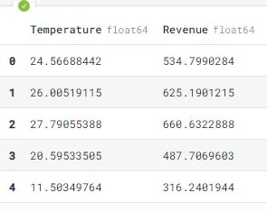

Pandas will search the file in the current directory where your script has. So that you have to put the data file in your working directory or you have to include the whole path of the file. Now, we can see that IceCreamData.csv ( form Kaggle [here](https://www.kaggle.com/vinicius150987/ice-cream-revenue)) is imported successfully.

```python
print(type(df))
```

output:

```python
<class 'pandas.core.frame.DataFrame'>
```

If you check the type of df, you can see it is a pandas dataframe object. Pandas read_csv file always returns the dataframe object.

Alternatively, you can also read CSV files from online resources, such as GitHub, simply by passing in the URL of the resource to the read_csv() function.

```python
df2=pd.read_csv(r'https://raw.githubusercontent.com/ayenadikyaw/IceCreamDataFile/main/IceCreamData.csv')
df2.head()
```

output:

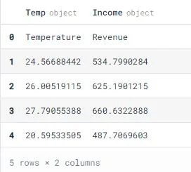

Now, you can see the same data file that I uploaded to my github repo is successfully loaded. However, there is one thing you have to be aware of. To successfully load the file, you have to convert the URL to raw format first. You can convert [here](https://gist.github.com/fedarko/4fc177cff9084b9e325dcbe954547edc).

We can also customize headers. By default, the read_csv() method uses the first row of the CSV file as the column headers. When necessary, you can set your own headers like below. You can first create a list of your custom column names and pass it to names argument.

```python
col_names=['Temp','Income']
df3=pd.read_csv('IceCreamData.csv',names=col_names)
df3.head()
```

output:

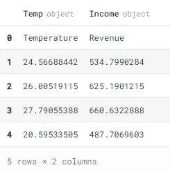

Here, we get our own custom headers, but the first row which was originally used to set the column names is also included in dataframe. So, let's address this issue by using **skiprows** argument.

```python
df3=pd.read_csv('IceCreamData.csv',names=col_names,skiprows=[0])
df3.head()
```

output:

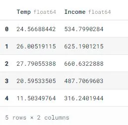

Sometimes your data file is so large you cannot load it into memory at all, even. So how do you process it quickly? By loading and then processing the data in **chunks**, you can load only part of the file into memory at any given time. And that means you can process files that don’t fit in memory. Let’s see how you can do this with Pandas.

```python
tp=pd.read_csv('IceCreamData.csv',iterator=True,chunksize=100)
df4=pd.concat(tp,ignore_index=True)
df4.info()
```

output:

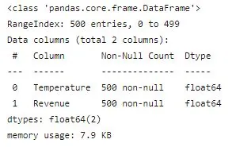

The above example is just a simple introduction of how to read data file in chunk by chunk. If you would like to know more about why we should read large data by chunk by chunk. You can read more in (1. [python - Large, persistent DataFrame in pandas - Stack Overflow](https://stackoverflow.com/questions/11622652/large-persistent-dataframe-in-pandas)) (2. [Reducing Pandas memory usage](https://pythonspeed.com/articles/chunking-pandas/) : Reading in chunks )

#### Writing CSV with to_csv()
You can save your Pandas DataFrame as a CSV file with .to_csv():

```python
df.to_csv('NewIceCreamData.csv')
```

That's it! Now, you will see NewIceCreamData.csv file in your working directory.

You can also use some arguments depending on your needs. Below are some useful arguments that we should know.

- **sep**: Delimiter to be used while saving the file.
- **columns**: Names to the columns from the data to write in the file.
- **header**: The name to be give to the columns when writing the file.
- **index** : A Boolean value which determines whether the column index to be included or not in the output file
- **encoding :** String representing the encoding to use in the output file, the default value is ‘utf-8’

## Grouping
Grouping is a pretty simple concept. We can create a grouping of categories and apply a function to the categories using python **groupby**. It’s a simple concept but it’s an extremely valuable technique that’s widely used in data science. Groupby concept is really important because it’s ability to aggregate data efficiently, both in performance and the amount code is magnificent. Groupby mainly refers to a process involving one or more of the following steps they are: *splitting, applying and combining.*

**Splitting** is a process in which we split the data into groups based on some criteria.

**Applying** is a process in which we apply a function to each group independently.

**Combining** is a process in which we combine different datasets after applying groupby and results into a data structure.

### Splitting
Out of the three steps, splitting is the most straightforward. Now, let's see an example of how we can split SalesByFlavor1.csv data set into groups. You can download the data from my GitHub repo [here](https://github.com/ayenadikyaw/Data-Manipulation-With-Pandas/blob/main/SalesByFlavor1.csv) and it is about the the amount of ice-cream and smooth for a total of 52 weeks which are sold according to four flavors: chocolate, lemon, strawberry and chocolate.

```python
#import necessary libraries
import pandas as pd
import numpy as np

flavors=pd.read_csv('SalesByFlavor1.csv')
flavors.head()
```

output:

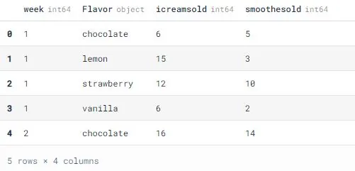

```python
#check the last few rows also
flavors.tail()
```

output:

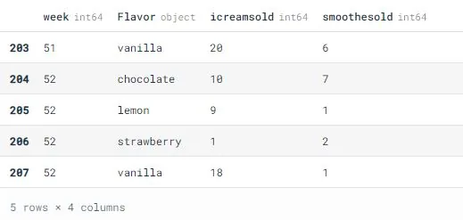

In SalesByFlavor data set, there are a total of four columns: week, Flavor, icreamsold, and smoothesold. The data is all about the amount of sales for ice-cream and smoothe which has four flavors from week 1 to week 52.

Now, let's try to group the data according to flavor first.

```python
flavors_grouped=flavors.groupby('Flavor')
# print out all the groups
print(flavors.groupby('Flavor').groups)
```

output:

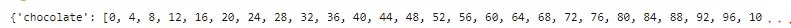

Now, you can see there are a total of four groups because the Flavor column has four different flavors: chocolate, lemon, strawberry, and vanilla. But it's not quite obvious. Now, let's print out the the first group .

```python
# check the first group
print(flavors_grouped.first())
```

output:

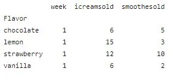

We can see that the first group ( week1) sold by four flavors.

```python
# check the last group
print(flavors_grouped.last())
```

output:

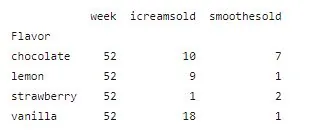

This is the last group (week 52) sold by flavors.

Pandas also support to group by multiple columns. Let's check it out!

```python
flavors_grouped_multi=flavors.groupby(['Flavor','week'])
print(flavors.groupby(['Flavor','week']).groups)
```

output:

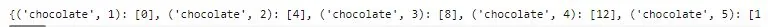

```python
print(flavors_grouped_multi.first())
```

output:

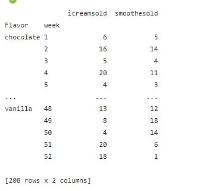

**Applying**

In the applying step, we usually do one of these steps: **Aggregation**, **Transformation** and **Filtration**.

**Aggregation**

Aggregation: In this process, you can compute a summary statistic (or statistics) for each group. For example, you can compute group sums or means or compute group sizes or counts.

Now, let's check out the total sales according to flavors.

```python
flavors_grouped[['icreamsold','smoothesold']].aggregate(np.sum)
```

output:

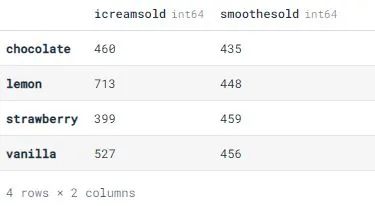

Now, we get the total sales for each flavor. Lemon is the most buying for ice-cream and strawberry is the most buying for smoothe.

Moreover, pandas also support to apply multiple functions at the same time. And also supports applying different functions to different columns.

**Applying multi-functions at once**

```python
flavors_grouped['icreamsold'].agg([np.sum,np.mean,np.std])
```

output:

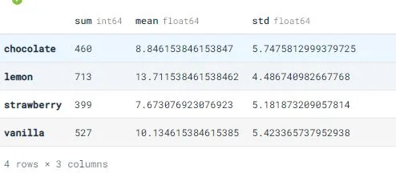

**Applying different functions to columns**

```python
flavors_grouped.agg({'icreamsold':np.sum,'smoothesold':np.mean})
```

output:

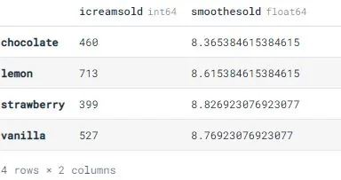

### Transforming
This is the process in which we usually perform some group-specific computations and return like-indexed object. For example, standardizing data (zscore) within a group and filling NAs within groups with a value derived from each group.

```python
#compute z-score
sc=lambda x: (x-x.mean())/x.std()#10
flavors_grouped.transform(sc)
```

output:

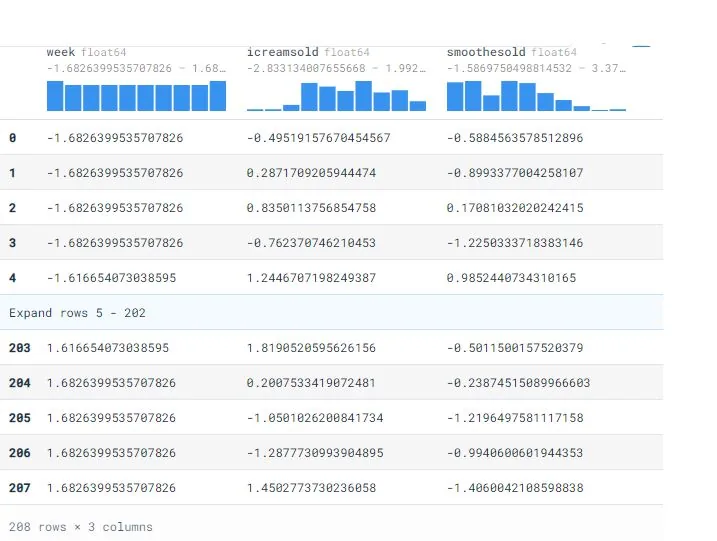

### Filtration
Filtration is the process in which we usually discard some groups, according to a group-wise computation that evaluates True or False. For example, discarding data that belongs to groups with only a few members and filtering out data based on the group sum or mean.

```python
#filter data
flavors_grp=flavors.groupby(['Flavor'])
flavors_grp.filter(lambda x: (x['Flavor']=='chocolate').any())
```

output:

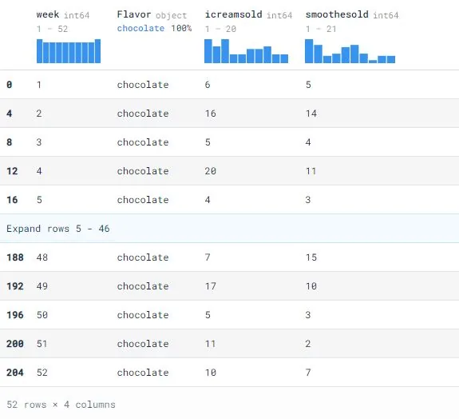

Now, you can see only the chocolate data is filtered.

### Pivoting
A pivot table is a table of statistics that summarizes the data of a more extensive table (such as from a database, spreadsheet, or business intelligence program). This summary might include sums, averages, or other statistics, which the pivot table groups together in a meaningful way. Pandas support s pivot() function which provides general purpose pivoting with various data types (strings, numeric, etc.), pandas also provides pivot_table() for pivoting with aggregation of numeric data. The function pivot_table() can be used to create spreadsheet-style pivot tables.

**pivot() function example**

```python
new_df=flavors.pivot(index='week',columns='Flavor',values=['icreamsold','smoothesold'])
print(new_df.head())
```

output:

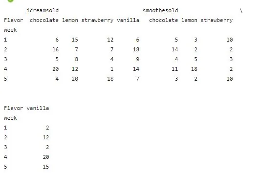

Now, we can see four flavors sold of ice-cream and smoothe for each week.

**pivot_table() function example**

Let's try to pivot according to flavors.

```python
pd.pivot_table(flavors,index=['Flavor'],values=['icreamsold','smoothesold'])
```

output:

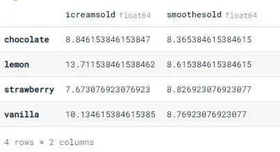

Now, we can see the mean value of ice-cream and smoothe sold for each flavor. pivot_table() function has aggfunc argument for aggregation. If we did not mention any specified function, it will apply the default function which is mean.

Now, let's pivot with aggregate function.

```python
pd.pivot_table(flavors,index=['Flavor'],values=['icreamsold','smoothesold'],aggfunc=np.sum)
```

output:

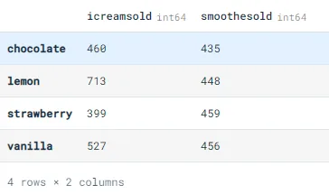

Here again, we pivoted to check the total sold of ice-cream and smoothe for each flavor.

## Categorical
Panda has categorical data type which corresponds to the categorical variables in statistics. Such variables take on a fixed and limited number of possible values. For examples - grades, gender, blood group type etc.

**astype()**

```python
#copy data set
flavors_cpy=flavors.copy()
print(flavors_cpy.head())
```

output:

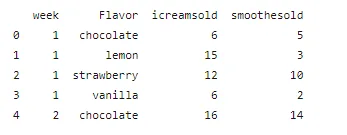

```python
#convert Flavor to categorical type
flavors_cpy['Flavor']= flavors_cpy['Flavor'].astype('category')
flavors_cpy['Flavor']
```

output:

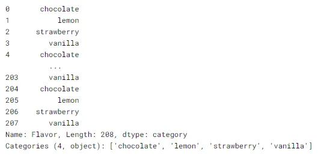

Now, we can se that the Flavor column changed to categorical data type and there are a total of four categories: chocolate, lemon, strawberry and vanilla.

We can also rename our categories if we want like below.

```python
# rename categories
flavors_cpy['Flavor'].cat.categories=['CHOCO','LMON','STBERRY','VNILLA']
flavors_cpy['Flavor']
```

output:

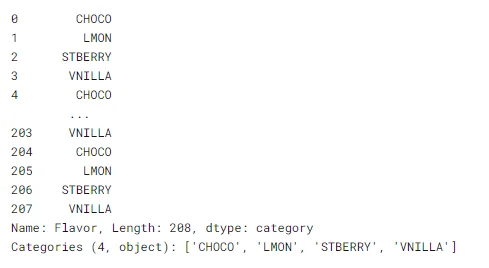

**pd.Categorical()**

We can also use Categorical() function to convert to categorical data type in pandas.

```python
# copy data
flavors_cpy_1=flavors.copy()
# convert Flavor to categorical data type
flv= pd.Categorical(flavors_cpy_1['Flavor'])
print(flv)
```

output:

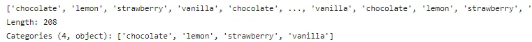

### Working with missing values
It is a very big problem in a real-life scenarios. There may be missing values in a dataset because it exists and was not collected or it never existed. For example, some users may choose not to share their income or some users may choose not to share the address. In this way, many datasets went missing. In pandas, missing data can be represented by two values: None and NaN.

None is a Python singleton object that is often used for missing data in Python code.

NaN (an acronym for Not a Number), is a special floating-point value recognized by all systems that use the standard IEEE floating-point representation.

We can handle the missing values generally in these methods: **filling** or **dropping**. And pandas supports functions for these. Pandas also support to check whether the data sets has missing values or not.

There are several useful functions for detecting, removing, and replacing null values in Pandas DataFrame. They are : isnull(),notnull(),dropna(),fillna(),replace(),nterpolate()

**Checking for missing values uisng isnull() and notnull()**

To check missing values in Pandas DataFrame, pandas suppports isnull() and notnull() functions. Both functions can help in checking whether a value is NaN or not.

Now, let's create the dataset first.

```python
#import libraries
import pandas as pd
import numpy as np

#dictionary lists
dict={'Day1':[50,100,np.nan,75],'Day2':[30,25,40,np.nan],'Day3':[np.nan,40,70,95]}

# change to dataframe
DF=pd.DataFrame(dict)

DF
```

output:

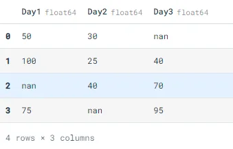

```python
#checking null values
DF.isnull()
```

output:

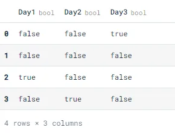

Here, we can see if the data is not null, it said 'false' and if it is null, it shows 'true'.

```python
# checking the values are not null
DF.notnull()
```

output:

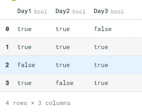

notnull() function works reverse from isnull(). It returns 'true' if the value is not null and returns 'false' if it is null.

**Dropping missing values using dropna()**

We can drop rows which has at least one missing values by using dropna() function.

```python
#copy dataset
DF1=DF.copy()
DF1
```

output:

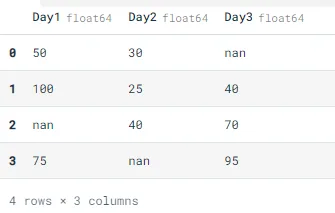

```python
DF1.dropna()
```

output:

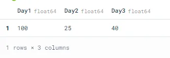

Now, we can see that three rows which has nan values are dropped.

**Filling missing values using fillna(), replace() and interpolate()**

However, dropping missing values is not a good idea for some cases. Sometimes, we might encounter a situation where we need to fill missing values to the dataset. For this case, we can use fillna(), replace() and interpolate() function. All of these function can replace NaN values with some value of their own. interpolate() function is basically used to fill NA values in the dataframe but it uses various interpolation technique to fill the missing values rather than hard-coding the value.

Using fillna() to filll with a single value

```python
DF.fillna(0)
```

output:

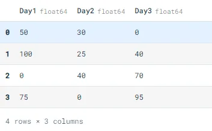

Now, we can see that nan values are now filled with 0.

Filling null values with previous one

```python
DF.fillna(method='pad')
```

output:

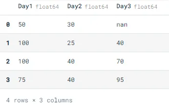

method argument can be used to describe fill method. 'pad' will fill nan values with its previous values. nan value of the first row is not filled because it is at the top of the column and has no previous value.

Now, let's see more how to fill with next values.

```python
DF.fillna(method='bfill')
```

output:

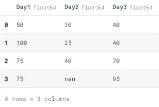

Then, let's use another method which is replace() to fill missing values.

```python
# will replace Nan value in dataframe with value -99
DF.replace(to_replace=np.nan,value=-99)
```

output:

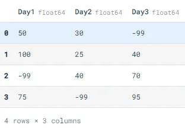

Three missing values are now filled with -99.

It is time for interpolation now. We can use interpolate() function to fill the missing values linear method. The linear method ignores the index and treat the values as equally spaced.

```python
DF.interpolate(method='linear',limit_direction='forward')
```

output:

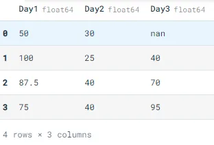

As we can see the output, values in the first row could not get filled because the direction of filling of values is forward and there is no previous value which could have been used in interpolation.

**Conclusion**

In this tutorial, I introduced some basic useful techniques of Pandas for data manipulation. Kindly referenced to Data Camp Pandas Tutorial, Python Documentation and https://www.geeksforgeeks.org.
