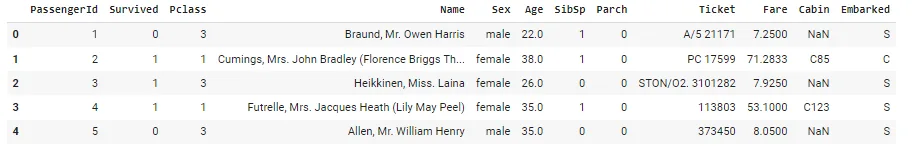
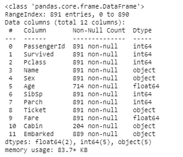
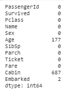
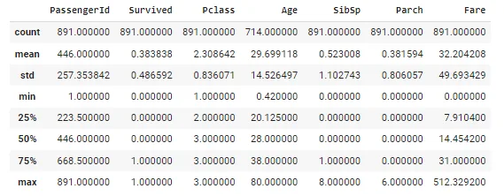
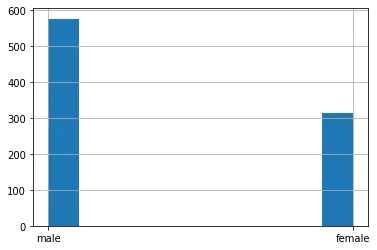
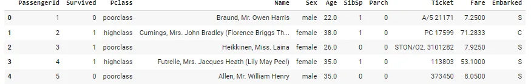

in real world the data is messy and need to get details about data and clean so now we will discuss how pandas is important to get information about data ,clean our data also have some great plotting so today we will discuss this using Titanic dataset you can download from [here](https://www.kaggle.com/c/titanic/data?select=train.csv)

we will discuss how to deal with data using some steps

## Reading Data

To read data we need first to import pandas library

```python
# import the essential library
import pandas as pd
```

then we will use method inside pandas called read_csv()

```python
# read titanic dataframe
df= pd.read_csv('train.csv')
```

now it`s time to show the first five rows

```python
# show the first five rows
df.head()
```



## Get Data information
to get some information about data we will use .info() method

```python
# get some info about data
df.info()
```



as we can see there is a lot of information names of columns, data type, number of observation ,...etc

now we will see how many null values in each columns

```python
# see sum of null values
df.isna().sum()
```



## Statistical Summary
there is a method in pandas give us a statistical summary about data called .describe()

```python
# now we will get some statisical summury
df.describe()
```



now it`s time to have some amazing plot example using pandas

## plotting
there is a lot of method to plot data like hist(), plot(), ...etc

now it`s time to get an example about how to plot using pandas

```python
# plot the Sex column
df.Sex.hist()
```



this graph show how many male and female in our dataset

after we have information about data it`s time to clean our data

## Clean Data and Handle Missing Values

as we see Cabin column have 687 missing value out of 892 so i decide to drop

```python
# we will deal with missing value
# for Cabin column we have 687 missing value out of 892 so it`s better to drop
df.drop('Cabin',inplace=True,axis=1)
```

and we will replace missing value in Age column with mean

```python
# for age column we have 177 null value so i decideto impute the null value with mean
df['Age'].fillna(df['Age'].mean(),inplace=True)
```

also we will replace the Embarked column missing with Mode

```python
# for Embarked column we have 2 missing value so i will impute them by mode
df['Embarked'].fillna(df['Embarked'].mode()[0],inplace=True)
```

using map function to apply it on Pclass column

```python
pclass={1:'highclass',2:'mediumclass',3:'poorclass'}
# map to  column pclass
df['Pclass'] = df['Pclass'].map(pclass)
```

it`s time to see first five rows

```python
df.head()
```



after study this data i decide to drop non useful columns

```python
# drop the non useful columns like passenger id, name , ticket
non_useful_column=['PassengerId','Name','Ticket']
for i in non_useful_column:
  df.drop(i,inplace=True,axis=1)
```

## Handle Categorical Data
we can handle categorical data to convert to dummy variable using pandas we will handle all string columns

```python
embarked = pd.get_dummies(df['Embarked'],drop_first=True)
pclass   = pd.get_dummies(df['Pclass'],drop_first=True)
sex      = pd.get_dummies(df['Sex'],drop_first=True)
```

and we will add all to our dataframe

```python
df = pd.concat([df,embarked,pclass,sex],axis=1)
```

and we will drop the original columns

```python
# now it`s time to drop categorical columns
cat=['Pclass','Sex','Embarked']
for i in cat:
  df.drop(i,inplace=True,axis=1)
```

after doing all data processing we will save our data to use it again

```python
df.to_csv('cleaning_data.csv')
```

## Conclusion

As we can see above Pandas library is most world use to deal with many data format like CSV, EXCEL , JSON ....etc

also we can handle missing value , clean, plot ...etc

so Pandas is the best when we need to do EDA.
