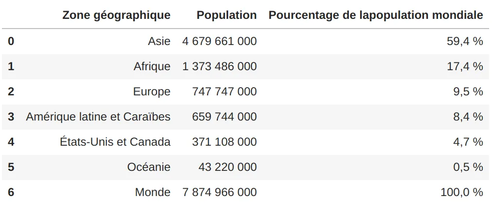
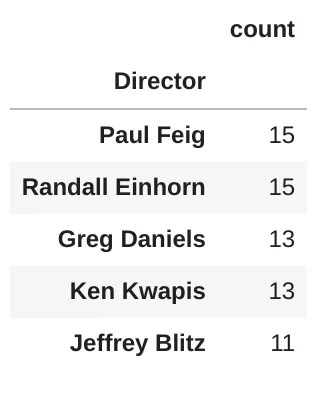
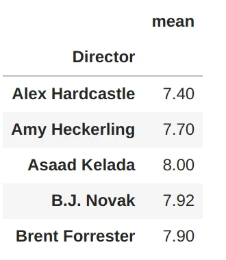
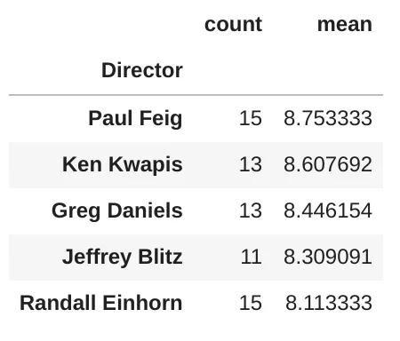
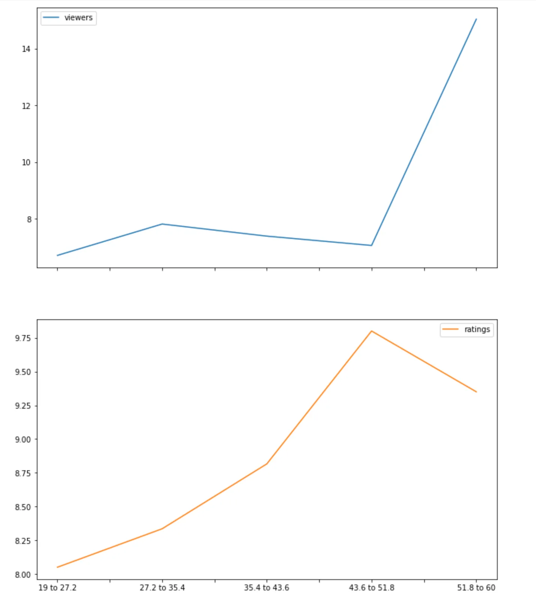
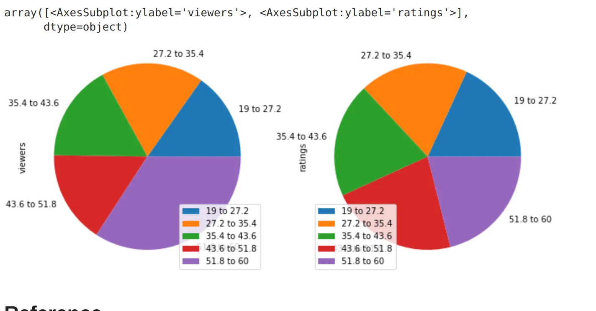

Pandas is a library written for data manipulation and analysis in Python. It offers data structures and operations for manipulating numerical tables and time series.

We will use five techniques between a bunch of functionality that we could have. But let's try to place ourselves in the context of carrying out an exploratory study and will use five techniques most used during exploratory data analysis. To carry out learning from the beginning to the visualization without really using other dependencies.

The techniques that we will go through together are:

- **Loading files**
- **Handle missing data**
- **Manipulation of string data**
- **Joining data**
- **Visualization data**

Before loading files, we will import the Pandas library first.

```python
import pandas as pd
```

Also, we will refer to some parts of the previous [post](https://www.datainsightonline.com/post/the-office-investigating-some-factors-that-could-have-influenced-its-popularity).

## Loading files
The Pandas library has many functions for reading a file, according to the file type.

Usually, the function name is read_XXXX, XXXX represents the file type in lower case.

Allows file types are the following: CSV, Excel, JSON, XML, HTML, Pickle, ...

If you want to learn more about file types, you should read the [documentation](https://pandas.pydata.org/docs/user_guide/io.html).

In our example, we will try to read a JSON and HTML file.

- **JSON**

We will try to retrieve data from the current URI *https://api.github.com/users/hadley/orgs*. This URI returns JSON data.

```python
github = pd.read_json("https://api.github.com/users/hadley/orgs")
github.info()
```

```python
<class 'pandas.core.frame.DataFrame'>
RangeIndex: 10 entries, 0 to 9
Data columns (total 12 columns):
 #   Column              Non-Null Count  Dtype
---  ------              --------------  -----
 0   login               10 non-null     object
 1   id                  10 non-null     int64
 2   node_id             10 non-null     object
 3   url                 10 non-null     object
 4   repos_url           10 non-null     object
 5   events_url          10 non-null     object
 6   hooks_url           10 non-null     object
 7   issues_url          10 non-null     object
 8   members_url         10 non-null     object
 9   public_members_url  10 non-null     object
 10  avatar_url          10 non-null     object
 11  description         8 non-null      object
dtypes: int64(1), object(11)
memory usage: 1.1+ KB
```

- **HTML**

This time we will try to retrieve data from this URI <https://fr.wikipedia.org/wiki/Population_mondiale>. On this page, we have different types of data like text and tables. Thanks to the read_html, we can directly get the list of table data.

```python
world_population = pd.read_html('https://fr.wikipedia.org/wiki/Population_mondiale') # list of table
world_population[0] # display the first item in list
```



## Handle missing data

for this part, we will use the following dataset **datasets/the_office_series.csv** from Kaggle [here](https://www.kaggle.com/nehaprabhavalkar/the-office-dataset)

We already used this dataset in the previous post, so we know the **GuestStars** column has nullable values.

Using the function **isna** of pandas library, we will try to show where there is no value for the five first records.

```python
office_df = pd.read_csv("datasets/the_office_series.csv")
office_df['GuestStars'].isna().head()
```

```python
0    True
1    True
2    True
3    True
4    True
Name: GuestStars, dtype: bool
```

To count missing values, we can write the following code.

```python
office_df['GuestStars'].isna().sum() # output 159
```

We can also fill missing values with other possible values according to the study. Has an example, we can have it.

```python
office_df['GuestStars'].fillna('No value').head(10)
```

```python
0         No value
1         No value
2         No value
3         No value
4         No value
5       Amy Adams
6         No value
7         No value
8    Nancy Carell
9       Amy Adams
Name: GuestStars, dtype: object
```

We will work with the GuestStars column, where the value is not empty.

```python
available_guest =  office_df.loc[:,'GuestStars'].dropna()
available_guest.head()
```

```python
5        Amy Adams
8     Nancy Carell
9        Amy Adams
12     Tim Meadows
14       Ken Jeong
Name: GuestStars, dtype: object
```

## Manipulation of string data

Using the Pandas library, we can find a pattern in a string like this.

```python
available_guest.str.match('Amy Adams').head()
```

```python
5      True
8     False
9      True
12    False
14    False
Name: GuestStars, dtype: bool
```

There is another function for finding patterns in a string.

We also can change the string case. Currently, we have capitalized case for the GuestStars column.

```python
available_guest.str.upper().head()
```

```python
5        AMY ADAMS
8     NANCY CARELL
9        AMY ADAMS
12     TIM MEADOWS
14       KEN JEONG
Name: GuestStars, dtype: object
```

To learn more about the manipulation of string using the Pandas library, You should read the [documentation](https://pandas.pydata.org/pandas-docs/stable/user_guide/text.html).

## Joining data
Like in the previous post, to use the **merge** function. We have to have at least two data frames.

The first will get the director, who made ten episodes at least.

```python
director_df = office_df.groupby('Director')['EpisodeTitle'].agg(['count'])
director_df = director_df[director_df['count'] > 10 ].sort_values('count', ascending=False)
director_df
```



The second data frame will contain the rating means for all directors.

```python
director_mean_df = office_df.groupby('Director')['Ratings'].agg(['mean'])
director_mean_df.head()
```



```python
new_df = pd.merge(director_df, director_mean_df, left_index=True, right_index=True)
new_df.sort_values('mean', ascending=False)
```



## Visualization data
We will use the last data frame from the previous post, created by the following code.

In this code, we create a function **rangeGetData** to get the **mean** from the provided column. Later we get data from the selected duration using the bool mask tip. Then, we create a data frame from filtered data.

```python
# Function creation
def rangeGetData(column, df):
    return df[column].mean()

# Boolean mask trick to filter data
mean_viewers_19___27__2 = rangeGetData('Viewership', office_df[(office_df['Duration'] >= 19) & (office_df['Duration'] < 27.2)])
mean_ratings_19___27__2 = rangeGetData('Ratings', office_df[(office_df['Duration'] >= 19) & (office_df['Duration'] < 27.2)])

mean_viewers_27__2___35__4 = rangeGetData('Viewership', office_df[(office_df['Duration'] >= 27.2) & (office_df['Duration'] < 35.4)])
mean_ratings_27__2___35__4 = rangeGetData('Ratings', office_df[(office_df['Duration'] >= 27.2) & (office_df['Duration'] < 35.4)])

mean_viewers_35__4___43__6 = rangeGetData('Viewership', office_df[(office_df['Duration'] >= 35.4) & (office_df['Duration'] < 43.6)])
mean_ratings_35__4___43__6 = rangeGetData('Ratings', office_df[(office_df['Duration'] >= 35.4) & (office_df['Duration'] < 43.6)])

mean_viewers_43__6___51__8 = rangeGetData('Viewership', office_df[(office_df['Duration'] >= 43.6) & (office_df['Duration'] < 51.8)])
mean_ratings_43__6___51__8 = rangeGetData('Ratings', office_df[(office_df['Duration'] >= 43.6) & (office_df['Duration'] < 51.8)])

mean_viewers_51__8 = rangeGetData('Viewership', office_df[office_df['Duration'] >= 51.8])
mean_ratings_51__8 = rangeGetData('Ratings', office_df[office_df['Duration'] >= 51.8])

# Data frame creation
duration_df = pd.DataFrame(
    data={
        'viewers': [mean_viewers_19___27__2, mean_viewers_27__2___35__4, mean_viewers_35__4___43__6, mean_viewers_43__6___51__8, mean_viewers_51__8],
        'ratings': [mean_ratings_19___27__2, mean_ratings_27__2___35__4, mean_ratings_35__4___43__6, mean_ratings_43__6___51__8, mean_ratings_51__8]
        },
    index = ['19 to 27.2', '27.2 to 35.4', '35.4 to 43.6', '43.6 to 51.8', '51.8 to 60']
)

# Show data frame
duration_df
```


```python
duration_df.plot.line(subplots=True, figsize=(11, 14))
```



```python
duration_df.plot(kind='pie',subplots=True, figsize=(11, 14))
```



## Conclusion
The Pandas library has enough functionality and allows us to do an exploratory study without worries and using external dependencies.

## Reference
- DataCamp's Unguided Project: "Investigating Netflix Movies and Guest Stars in The Office" [here](https://projects.datacamp.com/projects/1170).
- This article was originally written by **Kossonou Kouamé Maïzan Alain Serge**, as part of the **Data Insight** [data scientist program](https://www.datainsightonline.com/data-scientist-program).
- The full code on [Github](https://github.com/GreyCoderK/DataInsightOnline/blob/main/Data%20manipulation%20with%20Pandas.ipynb)
