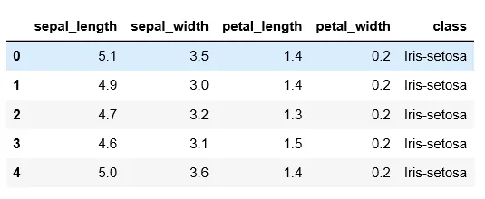

**Pandas** is a fast, powerful, flexible, and easy-to-use open-source data analysis and manipulation tool, built on top of the Python programming language.

**To install the pandas library**

```python
pip install pandas
```

**We need to import** **the** **pandas library before** **using** **it.**

```python
import pandas as pd
```

**To read CSV data, we use read_csv of pandas**

```python
df = pd.read_csv('iris.csv')
```

**To explore data read we can use** the **.head or .tail method**

```python
df.head()
```



.head() gives the top five rows of the dataframe. We can input the number of rows to .head() that we would like to read. Similarly, we can read the last five rows of the dataframe using the .tail method. For example, df.head(10) reads the first 10 lines of rows and df.tail(10) reads 10 rows from the last rows.

**To read the unique values of the column**

```python
df['sepal_length'].unique()
```

All the unique values of the sepal_length column are printed.

**Sorting the column**

Values of the column can be sorted in ascending as well as descending column. The line below sorts the value of the sepal_length column in ascending order.

```python
data.sort_values('sepal_length',ascending=True)
```

**Subsetting data**

We can subset the data frame also. The below subset the rows only if the class of the flower is iris-setosa with sepal_length greater than 5.

```python
data[(data['class']=='Iris-setosa') & (data['sepal_length']>5)]
```

**Check value contains in the column or nor using .isin**

The .isin is used to check the value contains in the column or not. To use .isin the column must be categorical data. The code below gives the rows with 'Iris-virginica' value of categorical column class.

```python
data['class'].isin(['Iris-virginica'])
```

**Applying a statistical function to a column value**

There are different types of statistical functions in the pandas library like mean, median, mode, standard deviation, etc. Amond them we have used maximum and sum functions which calculate the maximum value between the value of the sepal_length and the total sum of the values of the sepal_width.

```python
data['sepal_length'].max()
data['sepal_width'].sum()
```

**Aggregate** **function**

We can apply a function to a single column or multiple columns using the .agg() function.

```python
data[['sepal_length','sepal_width','petal_length','petal_width']].agg(['min'])
```

In the above line,we have use a minimum function to calculate a minimum value for column name 'sepal_length','sepal_width' ,'petal_length' and 'petal_width' columns.

We can apply a user-defined function to a single column or multiple columns also. From the example below, we have created a function named as test that takes an argument col. The test function calculates the maximum value and minimum value of the column passed to the test function. The test function is applied to all columns defined inside the square bracket of data. That means the test function calculates the maximum and minimum value of all of the columns sepal_length, sepal_width, petal_length, and petal_width.

```python
def test(col):
    return col.max(),col.min()

data[['sepal_length','sepal_width','petal_length','petal_width']].agg(test)
```

**GroupBy**

Pandas **dataframe.groupby()** function is used to split the data into groups. The dataframe data is grouped with respect to each value of the column class and count value of sepal_length for each class type.

```python
data.groupby(['class'])['sepal_length'].count()
```

**Pivot Table**

The pivot_table() function is used to create a spreadsheet-style pivot table as a DataFrame.A simple example of the pivot_table is added to the snippet of the code. Count a sepal_length value for each individual value of the class column.

```python
data.pivot_table(values='sepal_length',index='class',aggfunc='count')
```

**Slicing the dataframe**

We can select a part of dataframe using the .iloc and .loc methods. .loc is label-based, which means that we have to specify the name of the rows and columns that we need to filter out. On the other hand, iloc is integer index-based. So here, we have to specify rows and columns by their integer index.

```python
data.iloc[0:10,0:3]
```

0:10 reads the first 10 ten rows and 0:3 reads 3 columns from the left side.

The command below reads a row only with value='Iris-setosa' and column name from 'sepal_length' to column name 'petal_length'.

```python
data.loc['Iris-setosa','sepal_length':'petal_length']
```
