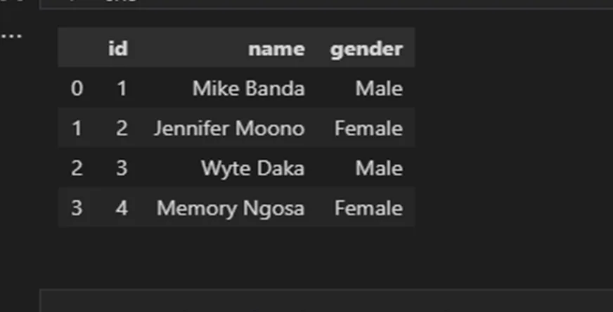
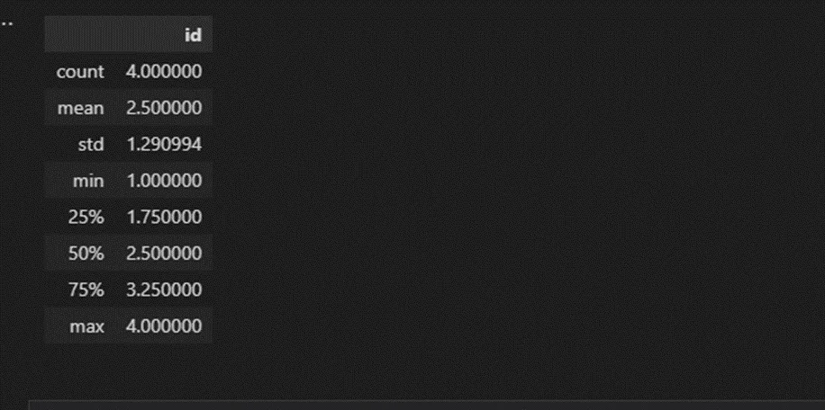
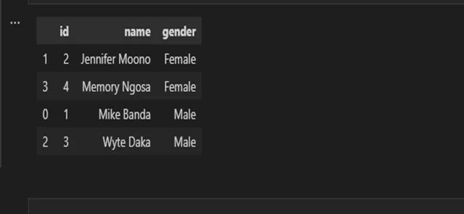
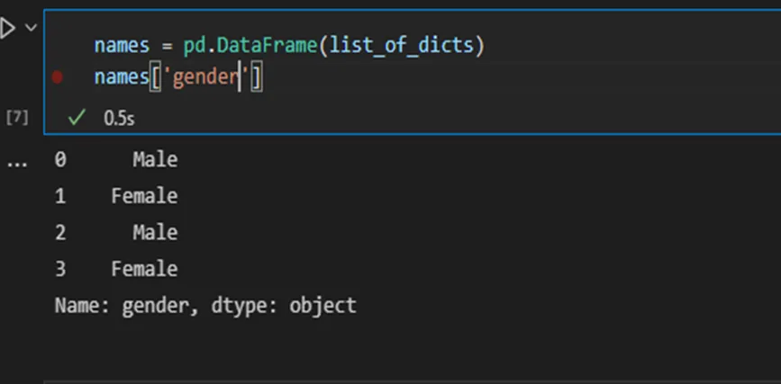

pandas is a Python package that can be used for manipulation and visualization. pandas is built on top of two essential Python packages, NumPy and Matplotlib. Numpy provides multidimensional array objects for easy data manipulation that pandas uses to store data, and Matplotlib has powerful data visualization capabilities that pandas takes advantage of. Now we are going to dive to explore tools found in pandas.

**1. Introduction to pandas DataFrames:**

In pandas, rectangular data is represented as a DataFrame object. DataFrames can be created from dictionaries or reading from a CSVs file. In python we have to install the pandas package using pip install pandas. Before we can use the pandas package we have to import in our python script for example, import pandas as pd.

a. Creating a DataFrame from dictionaries:

To construct a DataFrame from dictionaries we can use a either a list of dictionaries or dictionaries of list. To create a DataFrame using a list of dictionaries create a list containing one dictionary per row. Each dictionary key is a column name, and each value is the row’s value in that column. Then pass the list to pd.DataFrame(). For example,

List_of_dicts = [

{ “id”:1, “name”: “Mike Banda” , “gender”: “Male”},

{ “id”:2, “name”: “Jennifer Moono” , “gender”: “Female”} ]

names = pd.DataFrame(List_of_dicts)

Print(names)

Another way is to build a DataFrame by column, create a dictionary containing a key for each column name. The values for these keys will be a list of row values for that column. Then, pass the dictionary to pd.DataFrame().

Dict_of_lists = { ‘id’ : [1,2],

‘name’:[‘ Mike Banda’, ‘Jennifer Moono’],

‘gender’: [‘Male’,’Female’] }

Name = pd.DataFrame(Dict_of_lists)

**2. Exploring Data Frames**

The good thing about pandas is that it provides methods that aloe you to explore DataFrames without having to view every row and column.

Lets consider the names DataFrame we formed earlier. We use .head() to display the first few observations.

print( names.head() )

.info() displays the name, data type, and number of missing values for each column. for example calling [name.info()](http://name.info) produces the following output.

print( [name.info()](http://name.info) )

<class 'pandas.core.frame.DataFrame'>

RangeIndex: 2 entries, 0 to 1

Data columns (total 3 columns):

# Column Non-Null Count Dtype

--- ------ -------------- -----

0 id 2 non-null int64

1 name 2 non-null object

2 gender 2 non-null object

dtypes: int64(1), object(2)

memory usage: 176.0+ bytes

The .shape attribute return a tuple of the number of rows followed by the number of rows followed by the number of columns. Since .shape is an attribute and not a method, it does not require parentheses.

print( names.shape )

(2, 3)

The .describe() method returns summary statistics for numeric columns, including the mean and the median values. Count is the number of non-missing values in the column. calling the describe method produces the following.

print( names.describe() )

**3. Sorting DataFrames on a single and multiple column**

Sorting DataFrame rows can improve the readability of your DataFrame. You can do this with the .sort_values() method, passing the column name to sort by as an argument.

print( names.sort_values(‘name’) )

.sort_values() sorts in ascending order by default. To sort in descending order, set ascending = FALSE.

**4. Subsetting DataFrame columns**

To select a subset of DataFrame columns, follow the DataFrame name with square brackets containing the names of the columns. For example, below to subset gender.

print( names[‘gender’] )

To subset multiple columns, pass a list of column names to the square brackets. For example, to subset id and gender from our names DataFrames.

print( names.[[ ‘id’ , ‘gender’ ]] )

**5. Adding a new DataFrame column**

To add DataFrame columns derived from existing columns, follow the DataFrame name with square brackets containing the new column name. For example to add age to our names dataframe.

names['age'] = [18,22,10,31]

print(names)

**1. Summarizing numerical data**

Summary statistics are numbers that tell you more about your datasets. Pandas provides DataFrame methods to compute these numbers.

The **mean** is an indication of where the center of data is. To compute the mean of a DataFrame column, subset the column and follow it with .mean() method. For the mean for our names DataFrame can be calculated as follows.

print( names['age'].mean() )

20.25

Other summary statistics include:

.median() , .mode(), .min() , .max(), .var() , .std(), .sum(), .quantile()

These statistics can be used in the same way we used the mean in the previous example.

The Pandas package has a lot of tools that can be used to manipulate data and these mentioned here are just some of the manipulation we can do on DataFrame. There is a lot to learn in pandas.

Happy Hacking.
