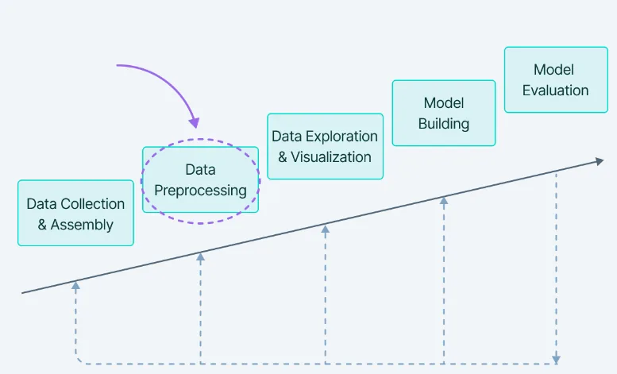
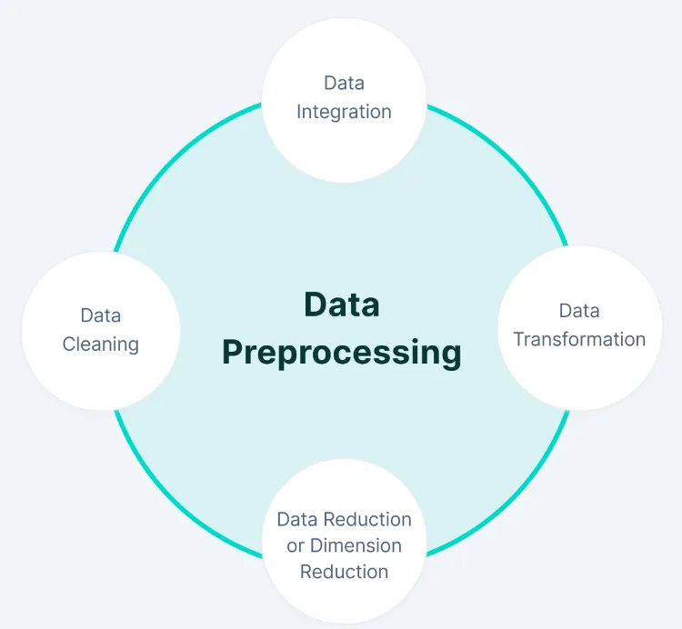

In this article, we will cover all the data pre-processing steps that need to be taken to convert raw data into a processed form.

**Data Pre-processing**

Data pre-processing includes the steps we need to take to transform or encode the data so that it can be easily analyzed by the machine.

The main goal for a model to be accurate and precise in predictions is for the algorithm to be able to easily interpret the characteristics of the data.

**Data pre-processing steps**

**A. Data cleaning**

Data cleaning is particularly done as part of data preprocessing to clean the data by filling in missing values, smoothing out noisy data, resolving inconsistencies, and removing outliers.

**B. Data Integration**

Data integration is one of the data preprocessing steps used to merge data present in multiple sources into a single larger data store, such as a data warehouse.

**C. Data Transformation**

After erasing the data, we need to consolidate the quality data into other forms by changing the value, structure or format of the data using the data transformation strategies : Generalization, standardization, Attribute Selection, aggregation.

**D. Data Reduction**

The size of the dataset in a data warehouse may be too large to be handled by data analysis and data mining algorithms.
