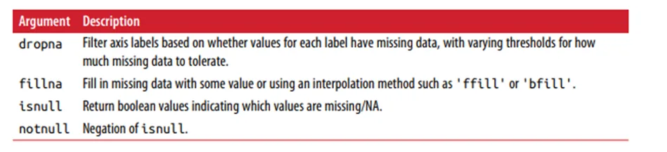
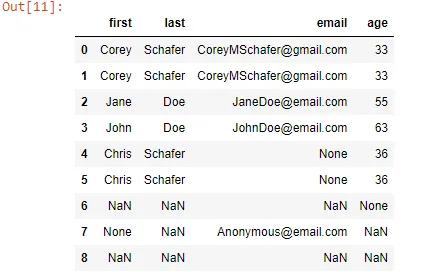
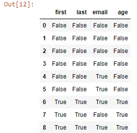
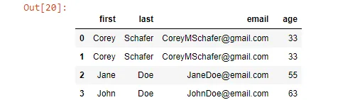
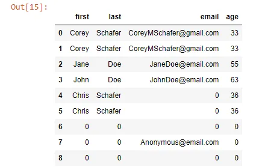
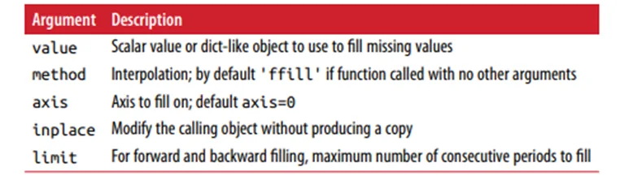
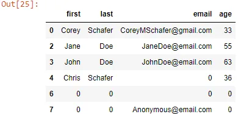
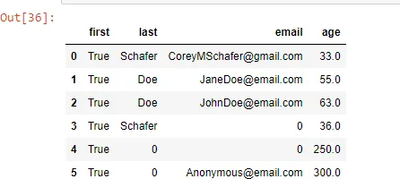
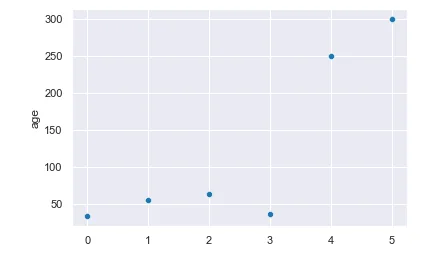
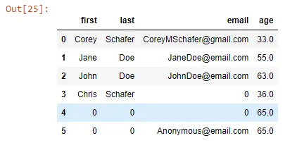

## Data Preparation Part 2


In Part 1 We saw how importing our data in python can be a piece of cake right?

Let's then deep further into the analysis process! Let's discover together some highlights of the cleansing phase.

During the the process of doing data analysis and modeling, a significant amount of time is spent on data preparation: loading, cleaning, transforming, and rearranging. Such tasks are often reported to take up 80% or more of an analyst’s time. Fortunately, pandas, along with the built-in Python language features, provides us with a high-level, flexible, and fast set of tools to enable us to manipulate data into the right form.

**1-** **Handling Missing Data****:** Missing data occurs commonly in many data analysis applications. One of the goals of pandas is to make working with missing data as painless as possible:



So we have this example:

```python
people = {
    'first': ['Corey','Corey', 'Jane', 'John', 'Chris','Chris', np.nan, None, 'NA'],
    'last': ['Schafer', 'Schafer', 'Doe', 'Doe', 'Schafer', 'Schafer', np.nan, np.nan, 'Missing'],
    'email': ['CoreyMSchafer@gmail.com', 'CoreyMSchafer@gmail.com', 'JaneDoe@email.com','JohnDoe@email.com', None,None, np.nan, 'Anonymous@email.com', 'NA'],
    'age': ['33', '33', '55', '63', '36','36', None, 'Missing','Missing']
}
```

We can observe that we have string fields that refer to missing values('NA', 'Missing') so we need to replace them by NAN value using replace function.

We're going to turn this into a dataframe and will be handling its missing data.

```python
import pandas as pd
import numpy as np
df = pd.DataFrame(people)
df.replace('NA', np.nan, inplace=True)
df.replace('Missing', np.nan, inplace=True)
df
```



The built-in Python None value is also treated as NaN in object arrays, so when we call isnull() function: detect missing values in the given series object. It return a boolean same-sized object indicating if the values are NA. Missing values gets mapped to True and non-missing value gets mapped to False.

```python
df.isnull()
```



-Filtering our data: the dropna can be helpful, but it will discard all the rows that have missing data that could be needed for our analysis, not very smart though:

```python
df.dropna()
```



So, rather than filtering out missing data (and potentially discarding other data along with it), you may want to fill in the “holes” in any number of ways. For most pur‐poses, the fillna method is the workhorse function to use. Calling fillna with a constant replaces missing values with that value:

```python
dfs= df.fillna(0)
dfs
```



Here's the fillna() arguments that you might find useful:



**2-** **Data Transformation****:** Duplicate rows may be found in a DataFrame for any number of reasons like we see in our example. The DataFrame method duplicated returns a boolean Series indicating whether each row is a duplicate (has been observed in a previous row) or not:

```python
dfs.duplicated()
```

```python
0    False
1     True
2    False
3    False
4    False
5     True
6    False
7    False
8     True
dtype: bool
```

To remove those duplicated rows we use drop_duplicates():

***inplace: bool, default False***

***Whether to drop duplicates in place or to return a copy.***

***ignore_index: bool, default False***

***If True, the resulting axis will be labeled 0, 1, …, n - 1.***

```python
dfs.drop_duplicates(inplace=True,ignore_index=True)
dfs
```



-Datatype constraints: Before preparing to analyze and extract insights from our data, we need to make sure that our variables have the correct datatypes (which is not the case in our dfs.

```python
dfs.dtypes
```

```python
first    object
last     object
email    object
age      object
dtype: object
```

For first, last and email columns, we don't have a proble because they're strings but for the age column we need it to be float! how are we going to do that? well let me introduce to you the astype() function: it cast a pandas object to a specified dtype:

```python
dfs['age'] = dfs['age'].astype(float)
dfs.dtypes
```

```python
first     object
last      object
email     object
age      float64
dtype: object
```

Now, wanna play a bit?

How about we change some values in the age column and make them unreal?...You don't see where I'm going with that?...Trust me, I know what I'm doing... I hope though!

```python
dfs.loc[4,'age']= 250.0
dfs.loc[5,'age']= 300.0
dfs
```



Now, using seaborn (we'll go through it in part 3), we plot the age column in a scatter plot so we can see if ther's any outliers(see what i did there? )

***An outlier is a data point in a data set that is distant from all other observations.***

```python
import seaborn as sns
import matplotlib.pyplot as plt
sns.set_style("darkgrid")
sns.set_context("notebook")

g= sns.scatterplot(x=dfs.index,
            y=dfs["age"],
            data=dfs)
```



We can clearly see that there is two points outside the overall distribution of the dataset. Those two points belong to the two values we changed above. We need to rearrange our dataset so we won't be blured by those two values.

One of the things we can do is convert these two values into a random value so we can move on with our analysis:

```python
dfs.loc[dfs['age']>100,'age']= 65
dfs
```



**3-** **Conclusion****:** So,We have explored a number of tools in this part that will help you throughout the cleansing phase.But there's always more in the jungle, I suggest for you to go deeper as you can, because effective preparation helps a lot to get a productive analysis and useful insights.

References: Python for data Analysis, Oreilly

You can find the remaining parts here: [Part1](https://www.datainsightonline.com/post/data-preparation-importing-data-in-python-part-1), [Part3](https://www.datainsightonline.com/post/data-preparation-visualizing-data-in-python-part-3)

And the code is right here: [Cleaning the Data](https://github.com/asmakrl/datacampstd/blob/main/Cleaning%20The%20Data.ipynb)

***Thank you for your time And Happy Learning.***
