## Data Preparation Part 1
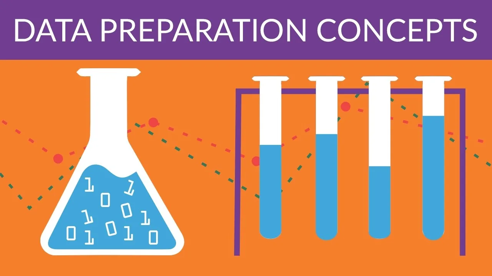

Bob Hayes, Ph.D, chief research officer at Appuri, said: ***“I think of data science as more like a practice than a job. Think of the scientific method, where you have to have a problem statement, generate a hypothesis, collect data, analyze data and then communicate the results and take action…. »***

This is what data science is about! But when it comes to collecting your data and analyzing it, there’s a spare key step in between called: Data Preparation.

One of the good questions you can ask is: Why do we have to clean our data? The answer is simple: It is rare that you get data exactly in the right form you need it to be. Often, you’ll need to create some new variables, reorder the observation or just drop registers in order to make data a little easier to read. It will usually require some manipulation and adaptation.

And this is exactly what we’re going to learn throughout this tutorial! Shaped in three parts, by which we’re going to discover three major concepts of the data preparation. Starting from importing the data, because obviously nothing can be done without it, all the way to the cleansing phase to finally do some pretty good visualizations.

REEADDY?

LET THE MAGIC HAPPEN…!

Accessing data is a necessary step in order to actually be using most of the tools that need to be used in order to manipulate our data. It falls into a few main categories: we'll go through some of pandas functions to achieve this.

**1-****Reading text files and other more efficient on disk formats****:**
pandas features a number of functions for reading tabular data as a DataFrame object. This table will summarizes some of them:

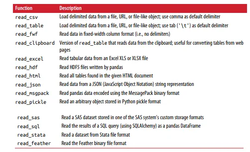

- JsonFiles: (short for JavaScript Object Notation) has become one of the standard formats for sending data by HTTP request between web browsers and other applications. To convert a JSON string to Python form, use json.loads: Here's an example of Json string:

```python
obj = """
{"name": "Wes",
 "places_lived": ["United States", "Spain", "Germany"],
 "pet": null,
 "siblings": [{"name": "Scott", "age": 30, "pets": ["Zeus", "Zuko"]},
 {"name": "Katie", "age": 38,
 "pets": ["Sixes", "Stache", "Cisco"]}]
}
"""
```

```python
import json
result = json.loads(obj)
result
```

```python
{'name': 'Wes',
 'places_lived': ['United States', 'Spain', 'Germany'],
 'pet': None,
 'siblings': [{'name': 'Scott', 'age': 30, 'pets': ['Zeus', 'Zuko']},
  {'name': 'Katie', 'age': 38, 'pets': ['Sixes', 'Stache', 'Cisco']}]}
```

To convert a JSON object , you can pass a list of dicts (which were previously JSON objects) to the DataFrame constructor and select a sub‐ set of the data fields:

```python
import pandas as pd
siblings = pd.DataFrame(result['siblings'], columns=['name', 'age'])
siblings
```

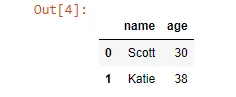

The pandas.read_json can automatically convert JSON datasets in specific arrangements into a Series or DataFrame:

```python
file= r'C:\Users\HP\Documents/Data science project/assignments/4th assignment/jsonfile2.json'
df=pd.read_json(file)
df
```

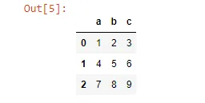

-XML and Html(Web scrapping): Python has many libraries for reading and writing data in HTML and XML formats. Examples include lxml, Beautiful Soup, and html5lib. While lxml is comparatively much faster in general, the other libraries can better handle malformed HTML or XML files.

pandas has a built-in function, read_html, which uses libraries like lxml and Beautiful Soup to automatically parse tables out of HTML files as DataFrame objects.

The pandas.read_html function has a number of options, but by default it searches for and attempts to parse all tabular data contained within

tags. The result is a list of DataFrame objects:

```python
url = (
    "https://raw.githubusercontent.com/pandas-dev/pandas/master/"
    "pandas/tests/io/data/html/spam.html"
)
dfs = pd.read_html(url)
dfs
```

the output will be a list.the length of this list is equal to 1 so we acces our dataframe by its index (len=1, index=0):

```python
df=dfs[0]
df.head(10)
```

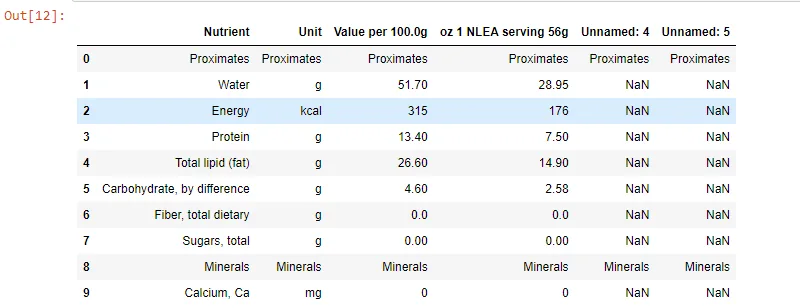

- XML (eXtensible Markup Language) is another common structured data format supporting hierarchical, nested data with metadata. XML and HTML are structurally similar, but XML is more general. Here, we'll use the pandas function read_xml () which can accept an XML string/file/URL and will parse nodes and attributes into a pandas DataFrame:

```python
xml = """<?xml version="1.0" encoding="UTF-8"?>
<bookstore>
  <book category="cooking">
    <title lang="en">Everyday Italian</title>
    <author>Giada De Laurentiis</author>
    <year>2005</year>
    <price>30.00</price>
  </book>
  <book category="children">
    <title lang="en">Harry Potter</title>
    <author>J K. Rowling</author>
    <year>2005</year>
    <price>29.99</price>
  </book>
  <book category="web">
    <title lang="en">Learning XML</title>
    <author>Erik T. Ray</author>
    <year>2003</year>
    <price>39.95</price>
  </book>
</bookstore>"""
df = pd.read_xml(xml)
df
```

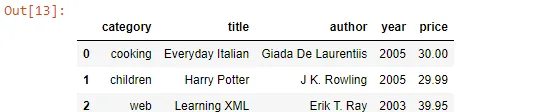

-Binary data formats: One of the easiest ways to store data (also known as serialization) efficiently in binary format is using Python’s built-in pickle serialization. pandas objects all have a to_pickle () that writes the data to disk in pickle format: To make it fun let's create a pickle file from a csv file and then open it with pandas function read_pickle():

```python
file= r'C:\Users\HP\Documents/Data science project/assignments/4th assignment/example1.csv'
frame = pd.read_csv(file)
frame
```

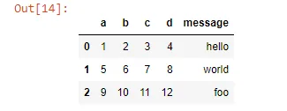

Then, we're going to store this file into a pickle file with to_pickle function: will be giving the path where we want to store our new file to this function.

```python
frame.to_pickle(r'C:\Users\HP\Documents/Data science project/assignments/4th assignment/frame_pickle')
```

then, read it with pandas function read_pickle() and we're going to get the same Dataframe as output 14 above.

```python
pd.read_pickle(r'C:\Users\HP\Documents/Data science project/assignments/4th assignment/frame_pickle')
```

**2-** **Loading data from databases****:** In a business setting, most data may not be stored in text or Excel files. SQL-based relational databases (such as SQL Server, PostgreSQL, and MySQL) are in wide use. The SQLAlchemy project is a popular Python SQL toolkit that abstracts away many of the common differences between SQL databases. Loading data from SQL into a DataFrame is fairly straightforward:

- Import packages and functions

- Create the database engine

- Connect to the engine

- Query the database

- Save query result to a dataframe

- Close the connection or not if you’re using a context manager.

For this we 're going to use the [chinook database](https://assets.datacamp.com/production/repositories/487/datasets/ec8aa8bc9ffea6b4e2729e1a0a2d4aea2f300b3a/Chinook.sqlite) : create the database engine and display its tables:

```python
import pandas as pd
import sqlalchemy as sqla
engine= sqla.create_engine('sqlite:///chinook.sqlite')
table_names=engine.table_names()
print(table_names)
```

```python
['Album', 'Artist', 'Customer', 'Employee', 'Genre', 'Invoice', 'InvoiceLine', 'MediaType', 'Playlist', 'PlaylistTrack', 'Track']
```

```python
rs=con.execute('select * from Album')
df=pd.DataFrame(rs.fetchall())
df.columns=rs.keys()
con.close()
df
```

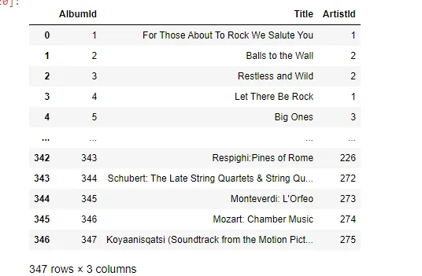

Also,You can use a context manager for this or you can simply use the pandas function read_sql():

```python
with engine.connect() as con:
    rs=con.execute("select * from Album")
    df1=pd.DataFrame(rs.fetchall())
    df1.columns=rs.keys()
    df1
```

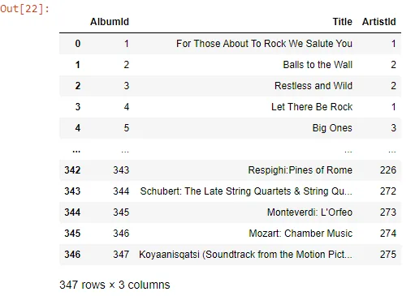

```python
df=pd.read_sql('select * from Genre',engine)
df
```

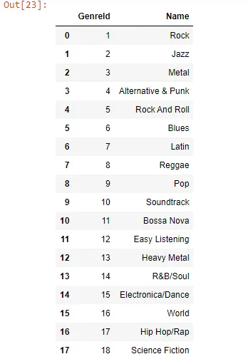

**3-** **Interacting with network sources like web APIs****:**

Api*(Application Programming Interface)*: is a set of protocol and routines for building and interacting with software applications. To make it simpler: it’s a bunch of code that allows the software programs to communicate with each other. Json is the standard format for transferring data through APIs.

Many websites have public APIs providing data feeds via JSON or some other format. There are a number of ways to access these APIs from Python; one easy-to-use method is the requests package.

So,How do we connect to an API in python? Here’s an example:

First, we need to import the packages we need:

```python
import pandas as pd
import requests
```

Then, getting the URL of the API we need to use, and send a request to get the url and turn into a json file son we can transforme into a DF:

```python
url='https://api.github.com/repos/pandas-dev/pandas/issues'
r= requests.get(url)
json_data= r.json()
issues = pd.DataFrame(json_data)
issues.head()
```

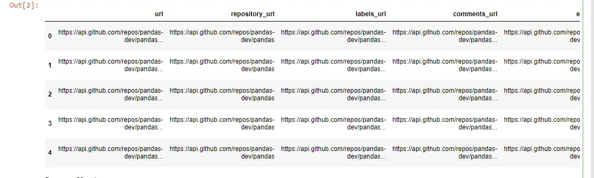

**4-** **Conclusion****:**

Getting access to data is frequently the first step in the data analysis process. We have looked at a number of useful tools that should help you get started.

For further knowledge check this [link](https://pandas.pydata.org/docs/user_guide/io.html).

References: Python for data Analysis, Oreilly

You can find the remaining parts here: [Part2](https://www.datainsightonline.com/post/data-preparation-cleaning-data-in-python-part-2), [Part3](https://www.datainsightonline.com/post/data-preparation-visualizing-data-in-python-part-3)

And the code is right here: [Importing Datafiles with Python](https://github.com/asmakrl/datacampstd/blob/main/Importing%20Data%20Files%20With%20Python.ipynb)

[Loading data from Databases](https://github.com/asmakrl/datacampstd/blob/main/loading%20data%20from%20databases.ipynb)

[Interacting with APIs](https://github.com/asmakrl/datacampstd/blob/main/Interacting%20with%20APIs.ipynb)

***Thank you for your time And Happy Learning.***
