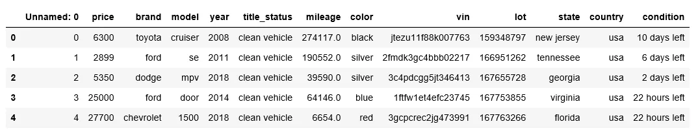
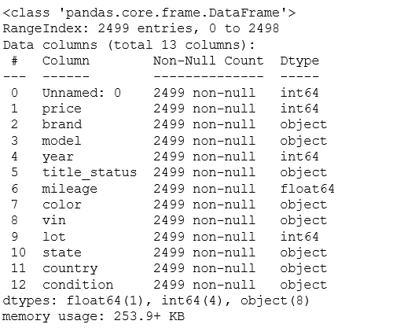
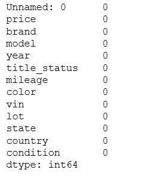
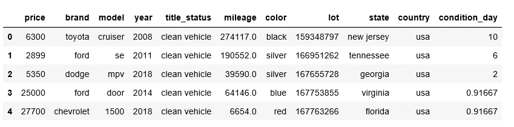
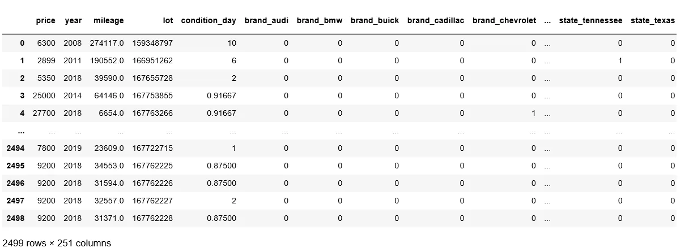
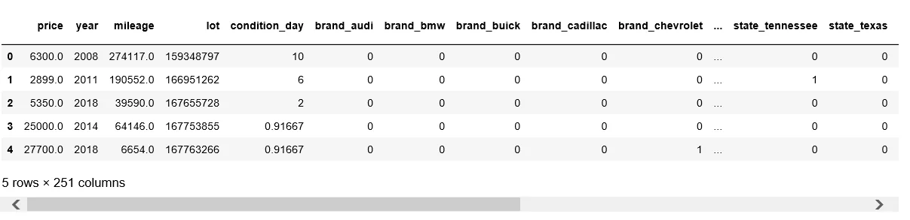
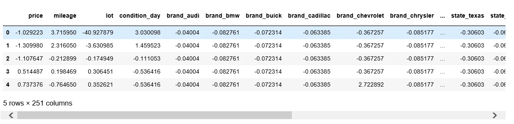

**Data Preparation** involves the manipulation and consolidation of raw data from different sources into a standardized format so that it can be used in a model. Data preparation may entail data augmentation, cleaning, delivery, fusion, ingestion, and/or loading. We are trying to prepare data from raw data in this blog.

We are using the USA car dataset which was downloaded from the Kaggle website with this [link](https://www.kaggle.com/code/aksh03/us-cars-dataset-beginner-s-eda-guide/data).First read csv data using pandas library and print few lines of data.

```python
import pandas as pd
df = pd.read_csv('cars_datasets.csv')
df.head()
```



Let's get some information of the dataset using .info().

```python
df.info()
```



Check if any column contains null value.

```python
df.isnull().sum()
```



Remove unnecessary column from the given dataset

```python
df.drop(['Unnamed: 0','vin'],axis=1,inplace=True)
```

The condition column contains string and numerical value, so that we have to remove strings and change all numerical value into same day value range. We can change minutes,hours value into day value. The changed value of the condition is then added to new column named as condition_day and remove the condition column from the dataset as shown in the image below.

```python
import re
condition_day = []
for i in df['condition']:
    if 'minutes' in i:
        min_val =  re.findall(r'\d+',i)
        for i in min_val:
            val = format(int(i)/(60*24),'0.5f')
            condition_day.append(val)
    elif 'hours' in i:
        hour_val =  re.findall(r'\d+',i)
        for i in hour_val:
            val = format(int(i)/24,'0.5f')
            condition_day.append(val)
    elif 'days' in i:
        day_val =  re.findall(r'\d+',i)
        for i in day_val:
            condition_day.append(i)
    else:
        condition_day.append(0)
print(len(condition_day))

df['condition_day'] = condition_day
df.drop('condition',axis=1,inplace=True
```



There are many columns with categorical data type. We need to change the categorical data into numerical data using get_dummies.

```python
dummy = pd.get_dummies(df,columns=   \ ['brand','model','title_status','color','state','country'],drop_first=True)

dummy
```



Change the data type of the price column of the dummy dataset.

```python
dummy['price'] = dummy['price'].astype('float')
dummy.head()
```



The values of the columns still are in different range.We need to make all of these values are of same data range. We are using StandardScaler to standardize this value.

```python
from sklearn.preprocessing import StandardScaler
scaler = StandardScaler()

col_name = []
del_year = dummy.drop('year',axis=1)
for col in del_year.columns:
    col_name.append(col)

scaled_df = scaler.fit_transform(del_year.to_numpy())
final_df = pd.DataFrame(scaled_df,columns = col_name)
final_df['year'] = dummy['year']
final_df.head()
```


