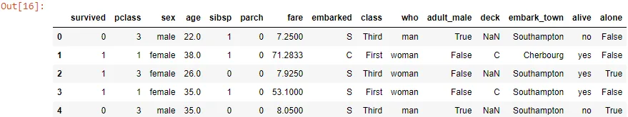
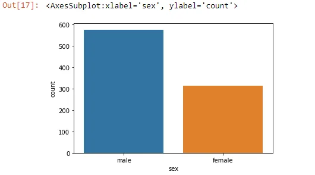
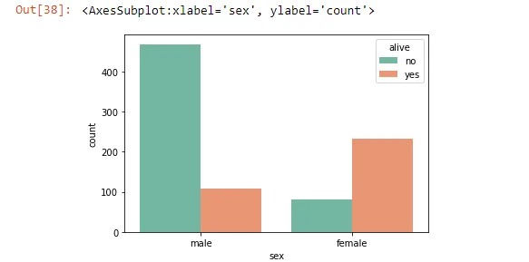
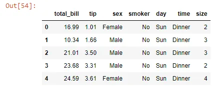
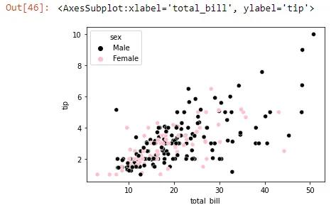
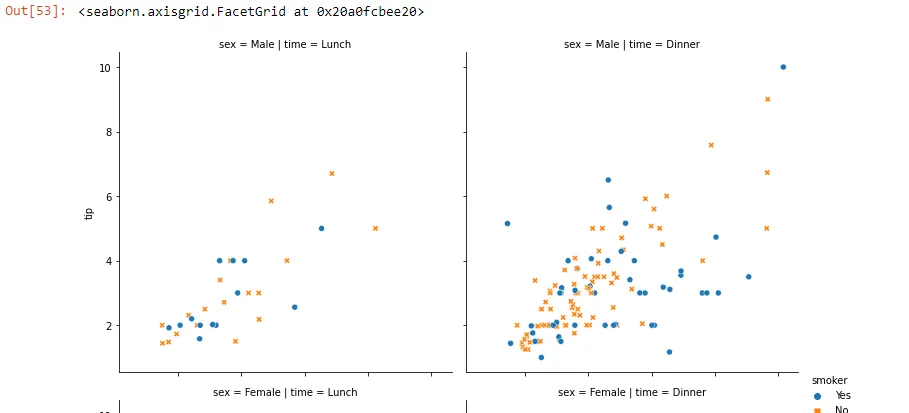
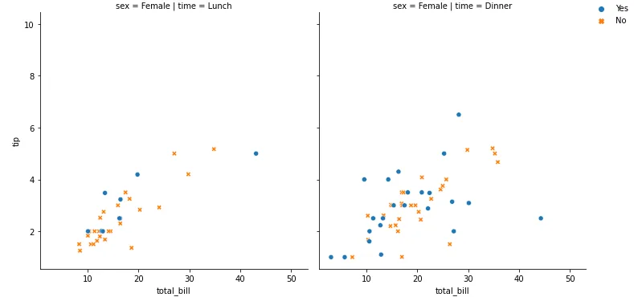

## Data Preparation Part 3


Here we are, we made it to the fun part: How can we plot our data to get expressive visualizations and useful insights?

Making informative visualizations is one of the most important tasks in data analysis. It may be a part of the exploratory process.Python has many libraries for making visualizations, but we'll be focusing on plotting with pandas and Seaborn.

Seaborn is a library for making statistical graphics in Python. It builds on top of [matplotlib](https://matplotlib.org/) and integrates closely with [pandas](https://pandas.pydata.org/) data structures.

Seaborn helps you explore and understand your data.

We'll be using the titanic dataset so we need to load it with one of seaborn's functions:

***load_dataset()******:*** Load an example dataset from the online repository.

This function provides quick access to a small number of example datasets that are useful for documenting seaborn or generating reproducible examples for bug reports.

Use [get_dataset_names()](https://seaborn.pydata.org/generated/seaborn.get_dataset_names.html#seaborn.get_dataset_names) to see a list of available datasets.

```python
import pandas as pd
import matplotlib.pyplot as plt
import seaborn as sns
```

```python
titanic_df = sns.load_dataset("titanic")
titanic_df.head()
```



***Seaborn provides to us different types of graphs:***

***Count plot******: s***how the counts of observations in each categorical bin using bars.A count plot can be thought of as a histogram across a categorical, instead of quantitative,variable. Here we have the sex column that contains a categorical variable: whether its male or female.

```python
sns.countplot(x='sex',data=titanic_df)
```



According to the plot, we can clearly distinguish that male passengers were way more than female passengers.

What if we want to see how many female/male passnegers survived?

```python
sns.countplot(x='sex', hue = 'alive', data = df,
palette = 'Set2')
```

we used the same function, except here we used the argument hue. Hue will color our count plot based on if the passenger is alive or not! and to have fun, we changed the colors using the palette argument. Here's our graph:



What we can take out of this plot is that the number of male passengers who died are much bigger than the female ones and that few of them really survived! We can really see that they prioritized the female's passengers in the rescue operation.(we saw that in the movie didn't we!...)

Now enough of the titanic tragedy! Let's explore another dataset!

```python
df= sns.load_dataset('tips')
df.head()
```



This Dataset contains informations about people who went to some restaurant to have dinner or lunch, the totall bill they paind and the tip they gave...etc

***-*** ***Scatter plot******:*** Draw a scatter plot with possibility of several semantic groupings. The relationship between x and y can be shown for different subsets of the data using the hue, size, and style parameters. These parameters control what visual semantics are used to identify the different subsets.

Are you curious like me about who gives a bigger tip? let's plot that:

```python
hue_color={"Male":"Black", "Female":"Pink"}
sns.scatterplot(x="total_bill",y="tip",data=df,hue='sex', palette=hue_color)
```



Well High is the bill Higher is the tip! women are more reasonable with tips though!

What if we want to do what we did above, but we want our plots to be in subgroups?

***-*** ***Relplot******:*** Figure-level interface for drawing relational plots onto a FacetGrid. This function provides access to several different axes-level functions that show the relationship between two variables with semantic mappings of subsets: - You want sublots in columns: use col argument

- You wnt subplots in rows: use row argument

here we'll be using both, in addition to the style argument to distinguish somkers frome not smokers:

```python
sns.relplot(x="total_bill",y="tip",data=df,
            kind='scatter',col='time',row='sex',
            hue='smoker',style='smoker')
```





**-** **Conclusion****:** Data Visualization is a good way to present data, and Seaborn is a useful tool to have in your toolbox. In this part, we saw some highlights about plotting with seaborn but there is always more.

For further knowledge, check the [seaborn documentation](https://seaborn.pydata.org/index.html).

References: Python for data Analysis, Oreilly

You can find the remaining parts here: [Part1](https://www.datainsightonline.com/post/data-preparation-importing-data-in-python-part-1), [Part3](https://www.datainsightonline.com/post/data-preparation-visualizing-data-in-python-part-3)

And the code is right here: [Visualizing Data with Seaborn](https://github.com/asmakrl/datacampstd/blob/main/Visualizing%20Data%20with%20Seaborn.ipynb)

***Thank you for your time And Happy Learning.***
