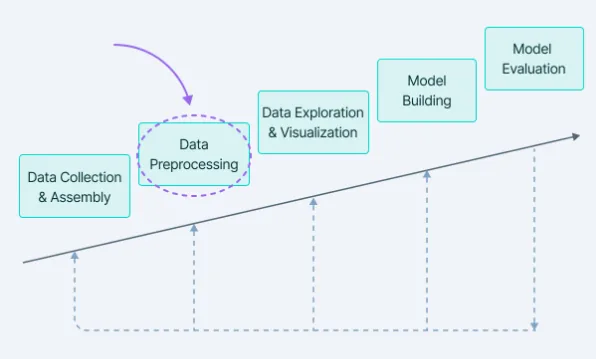
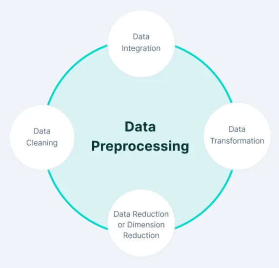
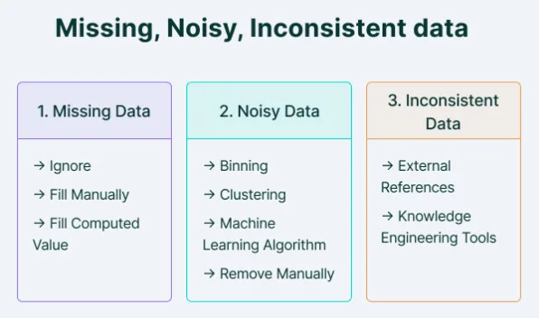

Data Preprocessing includes the steps we need to follow to transform or encode data so that it may be easily parsed by the machine.

The main agenda for a model to be accurate and precise in predictions is that the algorithm should be able to easily interpret the data's features.

**Why is Data Preprocessing important?**

The majority of the real-world datasets for machine learning are highly susceptible to being missing, inconsistent, and noisy due to their heterogeneous origin.

Applying data mining algorithms to this noisy data would not give quality results as they would fail to identify patterns effectively. Data Processing is, therefore, important to improve the overall data quality.

- Duplicate or missing values may give an incorrect view of the overall statistics of data.
- Outliers and inconsistent data points often tend to disturb the model’s overall learning, leading to false predictions.

**Features in machine learning**

Individual independent variables that operate as an input in our machine learning model are referred to as features. They can be thought of as representations or attributes that describe the data and help the models to predict the classes/labels.

For example, features in a structured dataset like in a CSV format refer to each column representing a measurable piece of data that can be used for analysis: Name, Age, Sex, Fare, and so on.

**Data Cleaning**

Data Cleaning is particularly done as part of data preprocessing to clean the data by filling missing values, smoothing the noisy data, resolving the inconsistency, and removing outliers.

**1. Missing values**

Here are a few ways to solve this issue:

- Ignore those tuples

This method should be considered when the dataset is huge and numerous missing values are present within a tuple.

- Fill in the missing values

There are many methods to achieve this, such as filling in the values manually, predicting the missing values using the regression method, or numerical methods like attribute mean.

**2. Noisy Data**

It involves removing a random error or variance in a measured variable. It can be done with the help of the following techniques:

- Binning

It is the technique that works on sorted data values to smoothen any noise present in it. The data is divided into equal-sized bins, and each bin/bucket is dealt with independently. All data in a segment can be replaced by its mean, median or boundary values.

- Regression

This data mining technique is generally used for prediction. It helps to smoothen noise by fitting all the data points in a regression function. The linear regression equation is used if there is only one independent attribute; else Polynomial equations are used.

- Clustering

Creation of groups/clusters from data having similar values. The values that don't lie in the cluster can be treated as noisy data and can be removed.

**3. Removing outliers**

Clustering techniques group together similar data points. The tuples that lie outside the cluster are outliers/inconsistent data.

**Data Integration**

Data Integration is one of the data preprocessing steps that are used to merge the data present in multiple sources into a single larger data store like a data warehouse.

Data Integration is needed especially when we are aiming to solve a real-world scenario like detecting the presence of nodules from CT Scan images. The only option is to integrate the images from multiple medical nodes to form a larger database.

We might run into some issues while adopting Data Integration as one of the Data Preprocessing steps:

- Schema integration and object matching: The data can be present in different formats, and attributes that might cause difficulty in data integration.
- Removing redundant attributes from all data sources.
- Detection and resolution of data value conflicts.

**Data Transformation**

Once data clearing has been done, we need to consolidate the quality data into alternate forms by changing the value, structure, or format of data using the below-mentioned Data Transformation strategies.

**Generalization**

The low-level or granular data that we have converted to high-level information by using concept hierarchies. We can transform the primitive data in the address like the city to higher-level information like the country.

**Normalization**

It is the most important Data Transformation technique widely used. The numerical attributes are scaled up or down to fit within a specified range. In this approach, we are constraining our data attribute to a particular container to develop a correlation among different data points. Normalization can be done in multiple ways, which are highlighted here:

- Min-max normalization
- Z-Score normalization
- Decimal scaling normalization

**Attribute Selection**

New properties of data are created from existing attributes to help in the data mining process. For example, date of birth, data attribute can be transformed to another property like is_senior_citizen for each tuple, which will directly influence predicting diseases or chances of survival, etc.

**Aggregation**

It is a method of storing and presenting data in a summary format. For example sales, data can be aggregated and transformed to show per month and year format.

**Data Reduction**

The size of the dataset in a data warehouse can be too large to be handled by data analysis and data mining algorithms.

One possible solution is to obtain a reduced representation of the dataset that is much smaller in volume but produces the same quality of analytical results.

Here is a walkthrough of various Data Reduction strategies.

**Data cube aggregation**

It is a way of data reduction, in which the gathered data is expressed in a summary form.

**Dimensionality reduction**

Dimensionality reduction techniques are used to perform feature extraction. The dimensionality of a dataset refers to the attributes or individual features of the data. This technique aims to reduce the number of redundant features we consider in machine learning algorithms. Dimensionality reduction can be done using techniques like Principal Component Analysis etc.

**Data compression**

By using encoding technologies, the size of the data can be significantly reduced. But compressing data can be either lossy or non-lossy. If original data can be obtained after reconstruction from compressed data, this is referred to as lossless reduction; otherwise, it is referred to as lossy reduction.

**Discretization**

Data discretization is used to divide the attributes of the continuous nature into data with intervals. This is done because continuous features tend to have a smaller chance of correlation with the target variable. Thus, it may be harder to interpret the results. After discretizing a variable, groups corresponding to the target can be interpreted.

**Numerosity reduction**

The data can be represented as a model or equation like a regression model. This would save the burden of storing huge datasets instead of a model.

**Attribute subset selection**

It is very important to be specific in the selection of attributes. Otherwise, it might lead to high dimensional data, which are difficult to train due to underfitting/overfitting problems. Only attributes that add more value to model training should be considered, and the rest can be discarded.

**Data Quality Assessment**

Data Quality Assessment includes the statistical approaches one needs to follow to ensure that the data has no issues. Data is to be used for operations, customer management, marketing analysis, and decision making—hence it needs to be of high quality.

The main components of Data Quality Assessment include:

1. The completeness with no missing attribute values
2. Accuracy and reliability in terms of information
3. Consistency in all features
4. Maintain data validity
5. It does not contain any redundancy

The Data Quality Assurance process involves three main activities.

1. Data profiling: It involves exploring the data to identify the data quality issues. Once the analysis of the issues is done, the data needs to be summarized according to no duplicates, blank values etc identified.
2. Data cleaning: It involves fixing data issues.
3. Data monitoring: It involves maintaining data in a clean state and having a continuous check on business needs being satisfied by the data.

**Data Preprocessing: Best practices**

Here's a short recap of everything we've learnt about data preprocessing:

- The first step in Data Preprocessing is to understand your data. Just looking at your dataset can give you an intuition of what things you need to focus on.
- Use statistical methods or pre-built libraries that help you visualize the dataset and give a clear image of how your data looks in terms of class distribution.
- Summarize your data in terms of the number of duplicates, missing values, and outliers present in the data.
- Drop the fields you think have no use for the modelling or are closely related to other attributes. Dimensionality reduction is one of the very important aspects of Data Preprocessing.
- Do some feature engineering and figure out which attributes contribute most towards model training.
