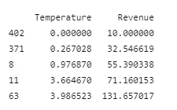
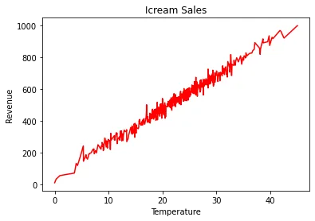
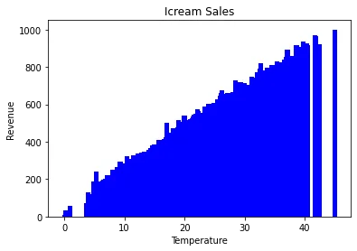
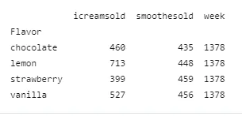
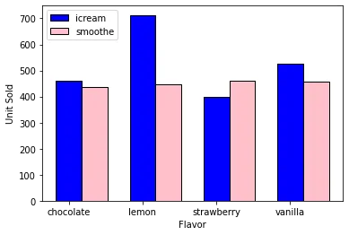

## Introduction to Matplotlib: Data Visualization Tool in Python
Data visualization is really important in data analysis. Data visualization can provide a good pictorial representation of data. Matplotlib is a popular python package library for data visualization. which makes it easier to understand, observe, analyze. This article is an introduction to matplotlib and how it can help to visualize our data.

### Understanding Charts
There are four main types of charts: Comparison, Relationship, Composition and Distribution.

**Comparison charts** are used to compare one or more datasets. They can compare items or show differences over time.

**Relationship charts** are used to show a connection or correlation between two or more variables.

Composition charts are used to display parts of a whole and change over time.

**Distribution charts** are used to show how variables are distributed over time, helping identify outliers and trends.

(Ref: [How to Choose the Right Chart for Your Data (infogram.com)](https://infogram.com/page/choose-the-right-chart-data-visualization))

It is important to choose the right chart type to visualize in order to check what story your data tells. This article introduced how matplotlib can be used to plot line and bar graphs mainly.

**Line Chart**

A line chart graphically displays data that changes continuously over time. It can show relationship between two different data on an x-axis and a y-axis. Each line graph consists of points that connect data to show a trend or a continuous change. Normally, we can use line chart when we would like to show trends, or make predictions or comparing two or more different variables.

The following example used IceCreamData.csv ([Ice Cream Dataset | Kaggle](https://www.kaggle.com/ahmednour/ice-cream-dataset)). Matplotlib pyplot is used to create the line plot. Can read documentation [here](https://matplotlib.org/stable/api/_as_gen/matplotlib.pyplot.html).

Pandas is used to read csv file as a data file. ([Read documentation](https://pandas.pydata.org/))

```python
from matplotlib import pyplot as plt
import pandas as pd

df=pd.read_csv("IceCreamData.csv")
df=df.sort_values(by='Temperature',ascending=True)
print(df.head())

plt.plot(df['Temperature'],df['Revenue'],color='red')
plt.title('Icream Sales')
plt.xlabel('Temperature')
plt.ylabel('Revenue')
plt.show()
```

View few rows of data frame:



Line Graph Output:



Now, we finished plotting line chart using matplotlib. From the chart, we can know that the amount of ice-cream sale is keep increasing when the temperature rises.

**Bar Chart**

A bar chart is used when you want to show a distribution of data points or perform a comparison of metric values across different subgroups of your data. From a bar chart, we can see which groups are highest or most common, and how other groups compare against the others. Now, let's change the above line chart into bar chart.

```python
plt.bar(df['Temperature'],df['Revenue'],color='blue')
plt.title('Icream Sales')
plt.xlabel('Temperature')
plt.ylabel('Revenue')
plt.show()
```



The above example can be used to check the distribution of data points. Now let's see more to understand bar chart.

The data set used in the following example is SalesByFlavor1.csv. (Can find in my github repo [here](https://github.com/ayenadikyaw/DataVisualization.git).)

```python
import numpy as np

df1=pd.read_csv('SalesByFlavor1.csv')
#print(df1)
# to catagorize according to falvors
new_df=df1.pivot_table(df1,index=['Flavor'],aggfunc=np.sum)
print(new_df)

bar_width=0.35
# reset index
new_df.reset_index(inplace=True)
#set x-axis values
x=np.arange(len(new_df['Flavor']))
#for legend
types=['icream','smoothe']
#two main catagories
y1=new_df['icreamsold']
y2=new_df['smoothesold']
#bar plot
plt.bar(x,y1,bar_width,color='blue',edgecolor='black')
plt.bar(x+bar_width,y2,bar_width,color='pink',edgecolor='black')

plt.xticks(x,new_df['Flavor'])
plt.xlabel('Flavor')
plt.ylabel('Unit Sold')
plt.legend(types,loc=2)
plt.show()
```

After pivoted:



Bar Graph Output:



Now, we can see the use of matplotlib to plot bar graph is very handy. Apart from line and bar chart, matplotlib.pyplot can be used to create more graphs like histogram, piechart, scatter plot, etc.

**Conclusion**

This article uses an easy-to-follow examples to make you understand about the usage of matplotlib to visualize data. I hope you can enjoy reading.
