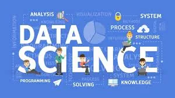

The interdisciplinary field of data science pertains to the processes and systems that are utilized in extracting knowledge or insights from huge amounts of data. Data science touches upon various theories and methods from other fields such as computer science, mathematics, statistics, and information science. There are several methods used in data science like signal processing, pattern recognition, machine learning, visualization, computer programming, data engineering, and probability models.

> Machine learning is part of data science. It is a process that automates analytical model building using statistics, complex algorithms, and techniques like supervised clustering, regression, and more.

In essence, Machine learning is the processes of applying complex mathematical calculations to big data to unravel some underlying patterns. When generated data is too massive that it is totally tedious for a person to manage, machine learning comes in. It can be used to achieve higher levels of efficiency as it learns and processes data sets with little human intervention. Good machine learning systems require scalability, ensemble modeling, basic and advanced algorithms, data preparation capabilities, and automation and iterative processes.

**Importance of Data Science and Machine Learning**

In the 21st century, data has become the lifeblood of businesses and organizations. Data-driven decisions make a huge difference! Data science is growing in importance and is now essential in many industries, including agriculture, risk management, healthcare, and marketing analytics, among others. Data science utilizes methods such as machine learning, predictive modeling, and data preparation to resolve a variety of issues in different sectors.

Data scientists are now vital members of businesses, brands, and other organizations. They attempt to understand and make sense of a large amount of data in an attempt to unearth relevant patterns that may be applied to the organization’s future goals and objectives. Data scientists also identify the best way to optimize the World Wide Web, advance the speeds at which data can be accessed, and detect frauds and anomalies in the market. Data science plays a major role in the functioning and growth process of brands and businesses. It helps businesses understand their customers more and it allows brands to communicate their story in an engaging and powerful way.

On the other hand, industries that work with huge amounts of data are recognizing the significance of machine learning technology, which is a part of data science. Machine learning is useful for unlocking the value of customer and corporate data which could generate decisions that will keep companies ahead of the competition. Machine learning is used to automate various tasks which have huge effects on a business, the economy and living in general.

**Python and/or R for Data Science and Machine Learning**

Python and R are two open-source (i.e free) programming languages commonly used in data science. Both are excellent tools in their own right, and there are data scientists who prefer one over the other. However, there is also a small percentage of data scientists who use both.

With multiple programming paradigms, Python is a tool used to implement large-scale machine learning. It is an object-oriented language that is capable of doing various tasks such as data wrangling which makes replicability and accessibility easier. Python has five libraries where programmers can perform various data science tasks: Seaborn, Numpy, Scikit-learn, Scipy, and Pandas. These libraries have automatic memory management features.

R is used in performing statistical data analysis. In fact, this open-source programming language has now one of the richest ecosystems for whatever kind of data analysis a programmer wants to perform. R is often the first choice for specialized statistical analysis, and its difference is that it has cutting-edge tools to communicate the results, something that other statistical products don’t have.

**Practical Applications of Data Science and Machine Learning**

**Retail**

In the retail industry, data science can and has helped brands connect and interact with customers in a more personalized manner. Data science allows retail brands to understand how customers use their products and how to match the right product to the right customer. Many retail websites use machine learning to analyze customers’ buying history and personalize their experience by recommending items based on previous purchases. Machine learning is also used for upselling and cross-channel marketing.

**Healthcare**

The healthcare sector benefits a lot from data science applications, particularly in finding solutions that will help patient care, diagnoses, and treatment. Data science methods use an integration of different kinds of data with genomic data which will help in having a deeper understanding of genetic issues in reactions to specific drugs. This enables an advanced level of treatment personalization. Data science and machine learning algorithms simplify the process of drug development instead of using lab experiments which would take an average of twelve years. Wearable devices and sensors use machine learning to analyze patient’s health in real-time, identifying trends that leads to improved diagnoses and treatment.

**Energy**

The use of data science in the energy sector is transforming the industry, as it provides insights on cost reductions and better monitoring of maintenance and equipment. The number of machine learning applications in the energy industry is vast. It can be used in finding new energy sources, streamlining energy demand and supply, and analyzing minerals.

There are so many other applications of data science and machine learning in our world today including:

1. Fraud and Risk Detection
2. Internet Search
3. Targeted Advertising
4. Website Recommendations
5. Advanced Image Recognition
6. Speech Recognition
7. Airline Route Planning
8. Gaming
9. Augmented Reality and many more.

[Aina Adekunle](https://www.linkedin.com/in/aina-adekunle)
