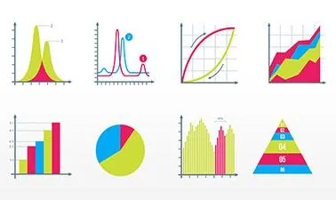
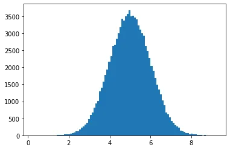
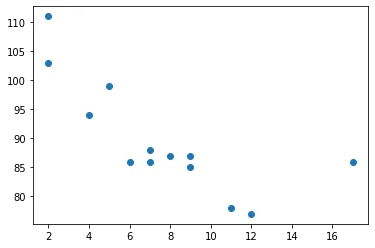
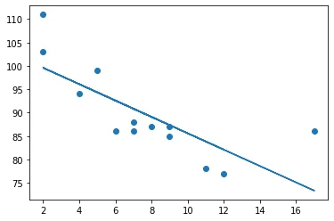
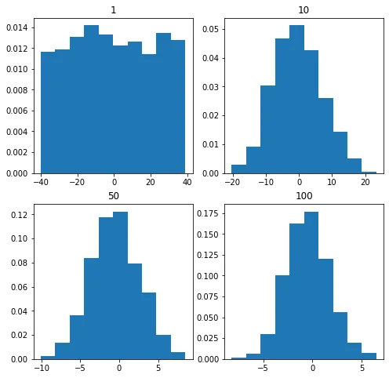
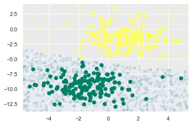
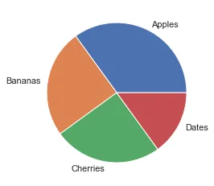
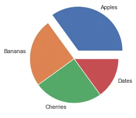
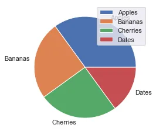

In practically every facet of data science, statistics is used. It's used to clean, transform, and analyze data. Algorithms for machine learning should be evaluated and improved. It's also utilized for presenting findings and thoughts. We acquired some statistical ideas in this essay that will aid us in our study.

In this blog, some important statistical concepts for Data Science are discussed.

1. Measures of Central Tendency
2. Standard Deviation
3. Percentiles
4. Normal Distribution
5. Scatter Plot
6. Linear Regression
7. Central limit theorem
8. Bayes’ theorem
9. Statistical Significance
10. Pie Charts

1. Measures of Central Tendency - Mean, Median, Mode

Central tendency is the central (or typical) value of a probability distribution. The most common measures of central tendency are mean, median, and mode.

Mean - The average value
Example: We have registered the weight of 13 people:

```python
weight = [99,86,87,88,111,86,103,87,94,78,77,85,86]
x = numpy.mean(weight)
```

Median - The mid point value

```python
x = numpy.median(weight)
```

If there are two numbers in the middle, divide the sum of those numbers by two.

```python
weight = [99,86,87,88,86,103,87,94,78,77,85,86]
x = numpy.median(weight)
```

Mode - The most common value

The SciPy module has a method for this. We Use the SciPy mode() method to find the number that appears the most:

```python
weight = [99,86,87,88,111,86,103,87,94,78,77,85,86]
x = stats.mode(weight)
```

2. Standard Deviation
The standard deviation is a number that expresses how far the values are spread out. A low standard deviation indicates that the majority of the data points are near to the mean (average). A high standard deviation means that the values are spread out over a wider range.

Example: This time, we recorded the weight of seven persons:

```python
weight = [86,87,88,86,87,85,86]
x = numpy.std(weight)
```

Meaning that most of the values are within the range of 0.9 from the mean value, which is 86.4.
Let us do the same with a selection of numbers with a wider range:

```python
weight = [32,111,138,28,59,77,97]
x = numpy.std(weight)
```

Meaning that most of the values are within the range of 37.85 from the mean value, which is 77.4.
As you can see, a higher standard deviation indicates that the values are spread out over a wider range.

3. Percentiles

Percentiles are used in statistics to give a number that describes the value that a given percent of the values are lower than.
Example: Let's say we have an array of the ages of all the people that lives in a street.

```python
ages =[5,31,43,48,50,41,7,11,15,39,80,82,32,2,8,6,25,36,27,61,31]
x = numpy.percentile(ages, 75)
```

What is the 75. percentile? The answer is 43, meaning that 75% of the people are 43 or younger.

4. Normal Distribution
In probability theory this kind of data distribution is known as the normal data distribution, or the Gaussian data distribution, after the mathematician Carl Friedrich Gauss who came up with the formula of this data distribution.

```python
import numpy
import matplotlib.pyplot as plt
x = numpy.random.normal(5.0, 1.0, 100000)
plt.hist(x, 100)
plt.show()
```



We use the array from the numpy.random.normal() method, with 100000 values, to draw a histogram with 100 bars.
We specify that the mean value is 5.0, and the standard deviation is 1.0.
Meaning that the values should be concentrated around 5.0, and rarely further away than 1.0 from the mean.
And as you can see from the histogram, most values are between 4.0 and 6.0, with a top at approximately 5.0.

5. Scatter Plot
A scatter plot is a diagram where each value in the data set is represented by a dot.

```python
import matplotlib.pyplot as plt
x = [5,7,8,7,2,17,2,9,4,11,12,9,6]
y = [99,86,87,88,111,86,103,87,94,78,77,85,86]
plt.scatter(x, y)
plt.show()
```



The x-axis represents ages, and the y-axis represents speeds.
What we can read from the diagram is that the two fastest cars were both 2 years old, and the slowest car was 12 years old.

6. Linear Regression

Regression : The term regression is used when you try to find the relationship between variables. In Machine Learning, and in statistical modeling, that relationship is used to predict the outcome of future events.

Linear Regression : Linear regression uses the relationship between the data-points to draw a straight line through all them. This line can be used to predict future values.

Python includes functions for determining a link between data points and drawing a linear regression line. Instead of going over the mathematic formula, we'll show you how to use these strategies.
The x-axis indicates age, and the y-axis represents speed in the example below. We recorded the age and speed of 13 vehicles as they passed through a tollbooth. Let's see whether we can use the data we gathered in a linear regression:

```python
x = [5,7,8,7,2,17,2,9,4,11,12,9,6]
y = [99,86,87,88,111,86,103,87,94,78,77,85,86]
slope, intercept, r, p, std_err = stats.linregress(x, y)
def myfunc(x):
    return slope * x + intercept
mymodel = list(map(myfunc, x))
plt.scatter(x, y)
plt.plot(x, mymodel)
plt.show()
```



7. Central limit theorem
Assume we're taking a sample from a population with a finite mean and standard deviation (sigma). As the sample size grows, the sample's distribution tends to resemble that of a normal distribution.



It is evident from the graphs that as we keep on increasing the sample size from 1 to 100 the histogram tends to take the shape of a normal distribution.

8. Bayes’ theorem
Naïve Bayes algorithms is a classification technique based on applying Bayes’ theorem with a strong assumption that all the predictors are independent to each other. In simple words, the assumption is that the presence of a feature in a class is independent to the presence of any other feature in the same class. For example, a phone may be considered as smart if it is having touch screen, internet facility, good camera etc. Though all these features are dependent on each other, they contribute independently to the probability of that the phone is a smart phone.

In Bayesian classification, the main interest is to find the posterior probabilities i.e. the probability of a label given some observed features. With the help of Bayes theorem,

Example
Depending on our data set, we can choose any of the Naïve Bayes model explained above. Here, we are implementing Gaussian Naïve Bayes model in Python − We will start with required imports as follows

```python
plt.scatter(X[:, 0], X[:, 1], c = y, s = 50, cmap = 'summer')
lim = plt.axis()
plt.scatter(Xnew[:, 0], Xnew[:, 1], c = ynew, s = 20, cmap = 'summer', alpha = 0.1)
plt.axis(lim)
```



9. Statistical Significance
In statistics, statistical significance means that the result that was produced has a reason behind it, it was not produced randomly, or by chance. SciPy provides us with a module called scipy.stats, which has functions for performing statistical significance tests. Here are some techniques and keywords that are important when performing such tests:
Hypothesis in Statistics - Hypothesis is an assumption about a parameter in population.
Null Hypothesis - It assumes that the observation is not statistically significant.
Alternate Hypothesis - It assumes that the observations are due to some reason.
Its alternate to Null Hypothesis.

T-Tests
T-tests are used to determine if there is significant deference between means of two variables. and lets us know if they belong to the same distribution.
It is a two tailed test.
The function ttest_ind() takes two samples of same size and produces a tuple of t-statistic and p-value.

```python
v1 = np.random.normal(size=100)
v2 = np.random.normal(size=100)
res = ttest_ind(v1, v2)
```

Ttest_indResult(statistic=-0.16925748102872015, pvalue=0.8657669120186213)

KS-Test

KS test is used to check if given values follow a distribution.
The function takes the value to be tested, and the CDF as two parameters.
A CDF can be either a string or a callable function that returns the probability.
It can be used as a one tailed or two tailed test.
By default it is two tailed. We can pass parameter alternative as a string of one of two-sided, less, or greater.

```python
v = np.random.normal(size=100)
res = kstest(v, 'norm')
```

KstestResult(statistic=0.06386122465488026, pvalue=0.7852268503128774)

10. Pie Charts

A pie chart is a graph in which a circle is divided into sectors, each of which represents a percentage of the total. Pie charts are a great method to visualize the size of components in relation to the whole, and they're especially good at displaying percentage or proportional data.

```python
y = np.array([35, 25, 25, 15])
plt.pie(y)
```

As you can see the pie chart draws one piece (called a wedge) for each value in the array (in this case [35, 25, 25, 15]).
By default the plotting of the first wedge starts from the x-axis and move counterclockwise:

The size of each wedge is determined by comparing the value with all the other values, by using this formula:
The value divided by the sum of all values: x/sum(x)

Add labels to the pie chart with the label parameter.
The label parameter must be an array with one label for each wedge:

```python
y = np.array([35, 25, 25, 15])
mylabels = ["Apples", "Bananas", "Cherries", "Dates"]
plt.pie(y, labels = mylabels)
```



Explode

Maybe you want one of the wedges to stand out? The explode parameter allows you to do that. The explode parameter, if specified, and not None, must be an array with one value for each wedge. Each value represents how far from the center each wedge is displayed:

```python
y = np.array([35, 25, 25, 15])
mylabels = ["Apples", "Bananas", "Cherries", "Dates"]
myexplode = [0.2, 0, 0, 0]
plt.pie(y, labels = mylabels, explode = myexplode)
```



Legend
To add a list of explanation for each wedge, use the legend() function:

```python
y = np.array([35, 25, 25, 15])
mylabels = ["Apples", "Bananas", "Cherries", "Dates"]
plt.pie(y, labels = mylabels)
plt.legend()
plt.show()
```


