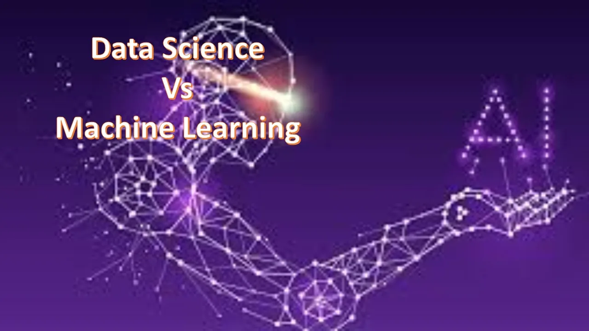

Today, when computers and automation have become an indispensable part of our society, we frequently hear the terms Data Science and Machine Learning. No doubt they have played a crucial role in the rapid growth and advancement of technology, but it would be incorrect to say both of them are exactly the same. They might be closely related but have distinct purposes and functionality.

Thanks to rapid digitization, today massive chunks of data are generated from all sectors including Healthcare, IT, E-commerce, business, etc. This data can be priceless for an organization if it can perform robust analysis on it and derive valuable insights that can help in their business decisions. This is exactly what Data Science is i.e, analyzing data and extract critical information from it and draw inferences. The critical tasks of a Data Scientist include Statistical Analysis, Data Exploration, Data Cleaning, Hypothesis Testing, Data Visualization and handling large databases.

On the other hand, Machine Learning can be thought of as a subset of Data Science helping Data Scientists in their decision-making process. It is nothing but designing sophisticated algorithms such that they can automatically learn the patterns and variations in given data and forecast future trends(supervised learning) or group similar data(unsupervised learning) without explicit programming. The potential skills of Machine Learning Engineer include a good understanding of computer algorithms, Mathematics(Algebra, Calculus, Statistics) and hardware knowledge.

So Data Science is more industry-oriented or practical whereas Machine Learning is more research-oriented with the focus to improve the model’s prediction power. Data Scientists need not have too depth understanding of computer science concepts but ML Engineers should have in-depth knowledge of them to optimize their algorithm. Data scientists must be more creative in finding out ways better ways to visualize their data and solve business problems. They must possess excellent communication and presentation skills to present their data in an interpretable form to non-technical stakeholders.

The success of Machine Learning Engineers is dependent on how well Data Scientists clean the data and make it suitable for the ML algorithm to perform. Good knowledge of database architecture and Querying Database is essential for Data Scientists as they are responsible for managing the data, whereas sound knowledge of hardware and processors help Machine Learning Engineers to optimize the time and space complexity of their algorithms.

That being said, there are many Machine Learning Engineers in the industry who possess good Data Science skills and vice-versa. It depends on the skill-sets of the employee and the industry-needs.
