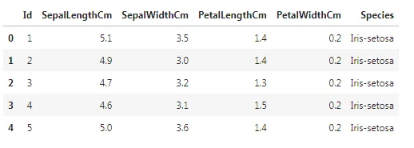
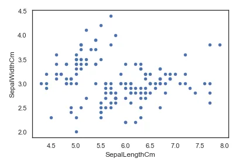
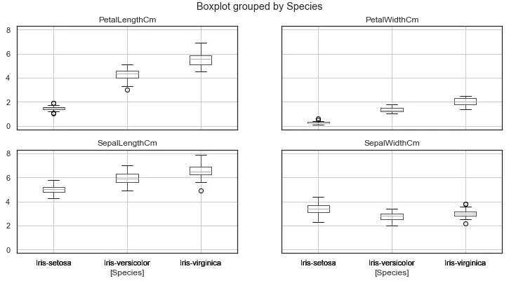
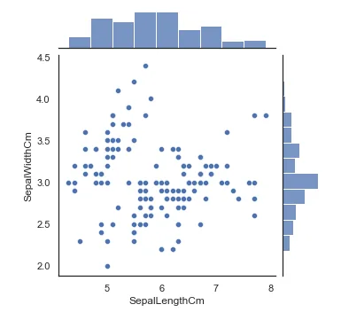
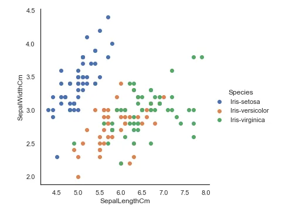
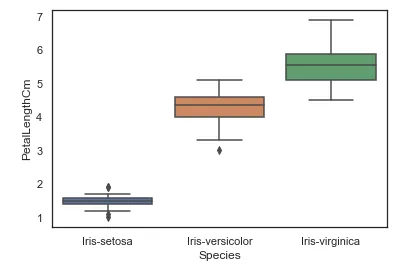
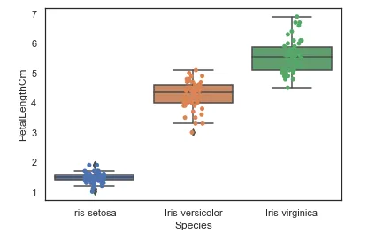

For this blog post, data from Iris Dataset is used.

First we have to import the python libraries that will be used for the data visualisation of the Iris dataset.

We import pandas, seaborn and matplotlib libraries for this Data Visualisation as follows

```python
import pandas as pd
import seaborn as sns
import matplotlib.pyplot as plt
```

Now we have to load the Iris Flower Datasets, by using pd**.**read_csv method and give the file path along with the file name as shown below. After loading the file, to view the first five rows of our Data we use the head() method.

```python
iris = pd.read_csv("Iris.csv")
iris.head()
```

- 

In order to find out the number of each species we will use value_counts() method and it will display the value of each flower species.

```python
iris["Species"].value_counts()

Output
Iris-virginica     50
Iris-versicolor    50
Iris-setosa        50
Name: Species, dtype: int64
```

## Scatter Plot
For the Data Visualisation, first we will create a scatter plot of our data. Where we declare the kind as scatter, give what column data to be used for the x and y axis of our plot.

```python
iris.plot(kind="scatter", x="SepalLengthCm", y="SepalWidthCm")
```

- 

We can also make a boxplot with Pandas on each feature split out by species

```python
iris.drop("Id", axis=1).boxplot(by="Species", figsize=(12, 6))

Output
array([[<AxesSubplot:title={'center':'PetalLengthCm'}, xlabel='[Species]'>,
        <AxesSubplot:title={'center':'PetalWidthCm'}, xlabel='[Species]'>],
       [<AxesSubplot:title={'center':'SepalLengthCm'}, xlabel='[Species]'>,
        <AxesSubplot:title={'center':'SepalWidthCm'}, xlabel='[Species]'>]],
      dtype=object
```

- 

**Scatter plot using Seaborn**

We can also create a scatter plot using seaborn library. By using seaborn jointplot it shows both scatterplot and univariate histograms in the same figure as shown below.

```python
sns.jointplot(x="SepalLengthCm", y="SepalWidthCm", data=iris, size=5)
```

- 

Here we cannot identify which one belongs to which species so, We will use seaborn's FacetGrid to color the scatter plot by species and also add the legend.

```python
sns.FacetGrid(iris, hue="Species", size=5) \
   .map(plt.scatter, "SepalLengthCm", "SepalWidthCm") \
   .add_legend()
```

- 

## Boxplot using seaborn
We can also look at an individual feature in Seaborn through a boxplot as follows.

```python
sns.boxplot(x="Species", y="PetalLengthCm", data=iris)

Output
<AxesSubplot:xlabel='Species', ylabel='PetalLengthCm'>
```

- 

One way we can extend this plot is by adding a layer of individual points on top of it through Seaborn's striplot. We will use jitter=True so that all the points don't fall in single vertical lines above the species. Saving the resulting axes as ax each time causes the resulting plot to be shown on top of the previous axes

```python
ax = sns.boxplot(x="Species", y="PetalLengthCm", data=iris)
ax = sns.stripplot(x="Species", y="PetalLengthCm", data=iris, jitter=True, edgecolor="gray")
```

- 
