Because it is the final outcome of the process, the exact visualization is just as crucial as the data that is being visualized. As a result, it's important to pay a lot of attention to developing the greatest possible visualization for the data at hand.

### Choosing a Visualization
The first step in producing a visualization is choosing the graphs or plots that will represent your data after it has been cleaned and prepped and the elements that you want to visualize have been chosen.

**Relationship**: Are used when showing a link between two or more variables. ex. scatter plots, bubble charts.

**Comparison**: is used when you want to show the differences or similarities between two or more variables. ex. simple, paired bar, paired column, stacked bar, and stacked column, box plots, and violin plots.

### Plotting with pandas and seaborn

**Histograms**

Histograms are important for figuring out how a numerical feature in a dataset is distributed statistically. They can be made with the hist() and distplot() functions in pandas and seaborn, respectively.

```python
#Import the necessary libraries
import seaborn as sns
import pandas as pd
#Import diamonds dataset from seaborn
diamonds_df = pd.read_csv('diamonds.csv')
#Plot a histogram using the diamonds dataset
diamonds_df.hist(column='carat')
```

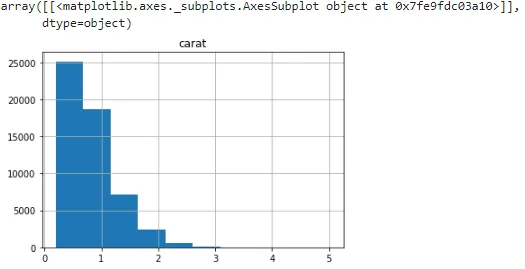

Let's figure out what we get when use the same function in seaborn :

```python
sns.distplot(diamonds_df.carat)
```

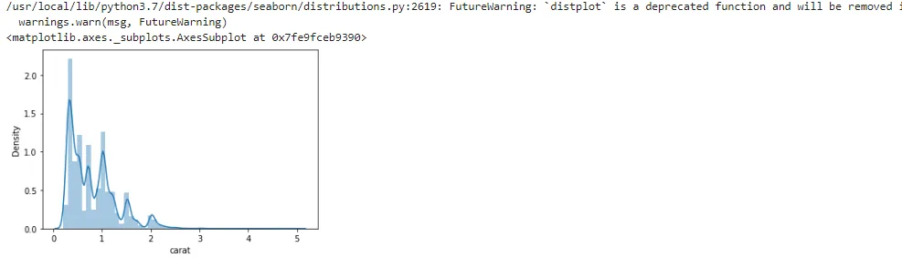

The pandas' hist function and the seaborn distplot have two important differences:

1. The bins parameter in pandas is set to 10 by usual, however seaborn supposes a different value. optimal bin size based on the dataset's statistical distribution
2. The distplot function also includes kernel density estimation (KDE) curve, And to remove it set KDE to False (kde=False).

**Bar Plots**

Bar plots are helpful in understanding the values that a categorical feature in a dataset has. They may be made with pandas' plot(kind='bar') and the catplot(kind='count') in pandas, and barplot() functions in seaborn.

Let's see an example of bar plots in the diamonds dataset, Get the counts of diamonds of each cut quality, we first need to create a table using the pandas crosstab() function.

```python
cut_count_table = pd.crosstab(index=diamonds_df['cut'],columns='count')
cut_count_table
```

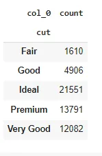

```python
cut_count_table.plot(kind='bar')
```

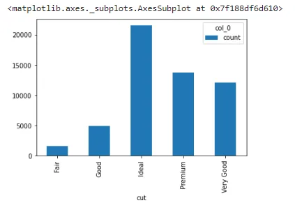

Generate the same bar plot using seaborn:

```python
sns.catplot("cut", data=diamonds_df, aspect=1.5, kind="count", color="b")
```

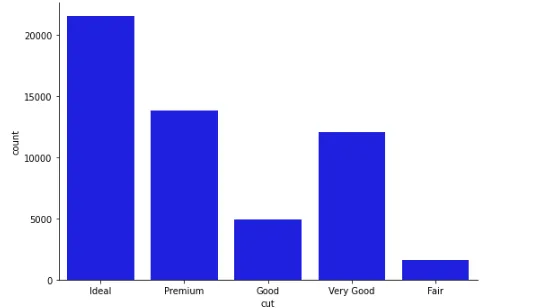

Here's how we use seaborn to get the mean price distribution of various cut qualities:

```python
from numpy import median, mean
sns.set(style="whitegrid")
ax = sns.barplot(x="cut", y="price", data=diamonds_df,estimator=mean)
```

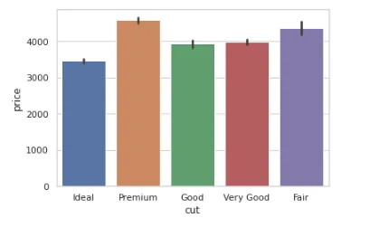

**Scatter Plots**

Scatter plots is a type of plot that displays values for typically two variables for a set of data. If the points are coded (color/shape/size), one additional variable can be displayed.

The data are displayed as a collection of points, each having the value of one variable determining the position on the horizontal axis and the value of the other variable determining the position on the vertical axis.

```python
ax = sns.scatterplot(x="carat", y="price", data=diamonds_df)
```

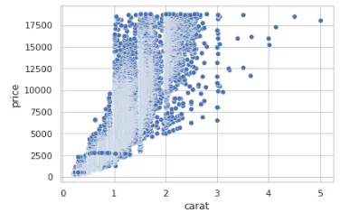

Notice that the scatter plot shows an increase in price with an increase in carat. That's a useful insight into the relationships between different features in the dataset.

**Line Plots**

Information is represented as a series of data points connected by straight-line segments in a line plot. They can be used to show the link between a discrete numerical feature (on the x-axis) and a continuous numerical characteristic (on the y axis).

We are going to visualize another dataset auto-mpg, We can draw a simple line plot showing the relationship between model_year and mileage with the following code:

```python
#read dataset
mpg_df = pd.read_csv('auto-mpg.csv')
# contour plot
sns.set_style("white")
# seaborn 2-D scatter plot
ax = sns.lineplot(x="model year", y="mpg", data=mpg_df)
```

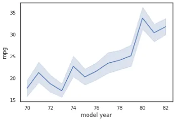

To switch to a different confidence interval, utilize the ci parameter. A range of feature values where x percent of the data points are present is referred to as an x percent confidence interval. The code that follows is an example of converting to a 68 percent confidence interval:

```python
sns.lineplot(x="model year", y="mpg", data=mpg_df, ci=68)
```

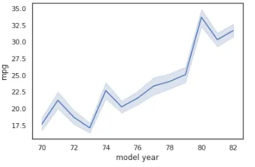

**Box Plots**

Box plots are a great approach to look at the link between a numerical feature's summary statistics and other categorical data.

We will create a box plot to analyze the relationship between model_ year and mileage using the mpg dataset:

```python
# box plot: mpg(mileage) vs model_year
sns.boxplot(x='model year', y='mpg', data=mpg_df)
```

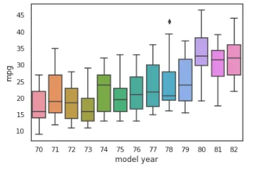

The box boundaries represent the interquartile range, with the upper boundary representing the 25% quartile and the lower boundary representing the 75% quartile. The horizontal line within the box represents the median. Any single points beyond the whiskers (the T-shaped bars above and below the box) indicate outliers, whereas the whiskers themselves show the minimum and maximum values that are not outliers.

Use the hue parameter to group by origin:

```python
sns.boxplot(x='model year', y='mpg', data=mpg_df, hue='origin')
```

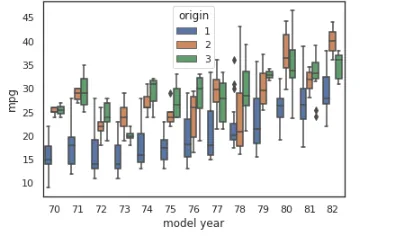

As we can see from the mpg dataset, Europe and Japan produced cars with better mileage than the United States in the 1970s and early 1980s. Exciting!

**Violin Plots**

A violin plot is similar to a box plot, but it includes more information about data differences. The structure of a violin plot indicates the shape of the data distribution: where data points cluster around a common value, the plot is thicker; where data points are limited, the plot is thinner.

```python
# code for violinplots
sns.violinplot(x='model year', y='mpg', data=mpg_df, hue='origin')
```

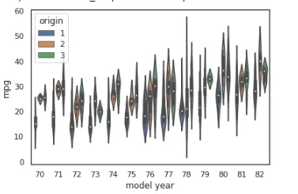

We can see here that, during the 70s, while most vehicles in the US had a median mileage of 19 mpg, vehicles in Japan and Europe had median mileages of around 27 and 25 mpg.

**Thanks for reading!**

Link for GitHub repo [GitHub](https://github.com/EslamElkot/EslamEklot.github.io/blob/main/Data_Visualisation_in_Python_An_Overview.ipynb)

**Sources**

[**Kaggle1**](https://www.kaggle.com/shivam2503/diamonds?select=diamonds.csv)

[**Kaggle2**](https://www.kaggle.com/uciml/autompg-dataset)

[**Wiki**](https://en.wikipedia.org/wiki/Scatter_plot)

**Interactive DataVisualization with python: second Edition**

**Acknowledgment**

That was part of Data insight's Data Scientist program.
