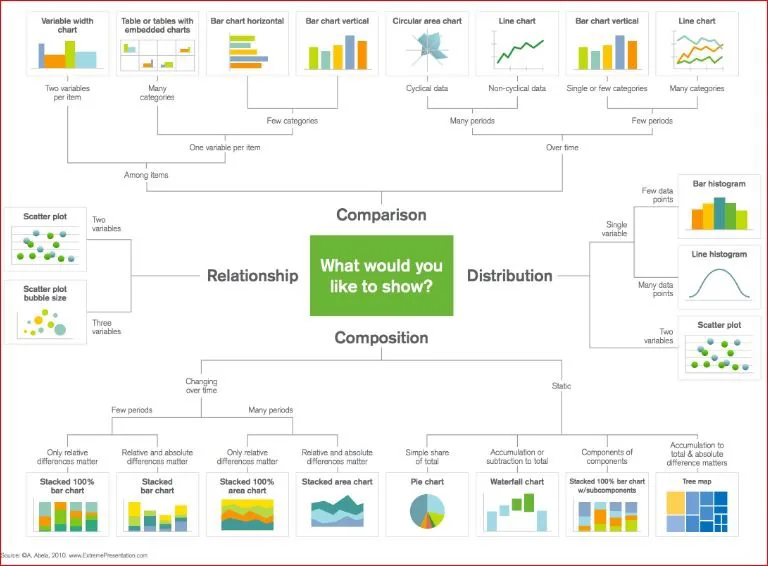
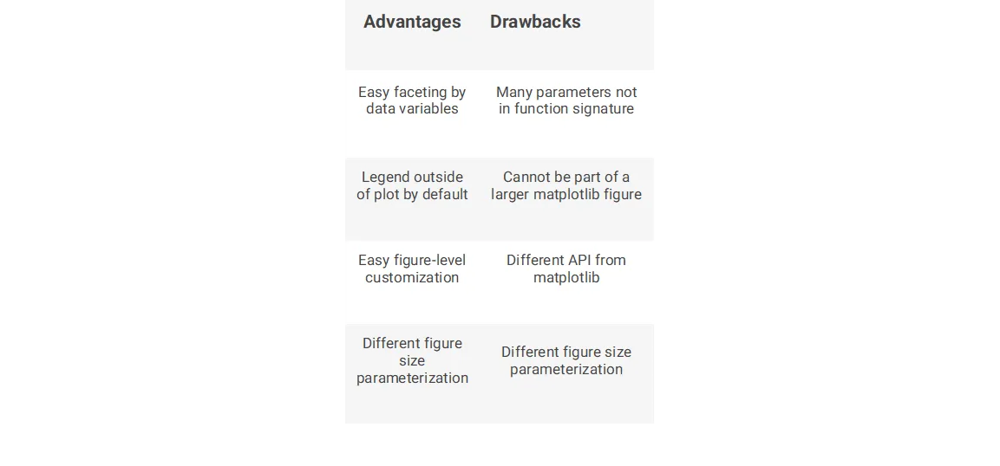
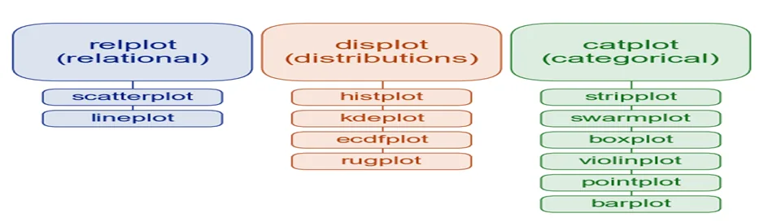
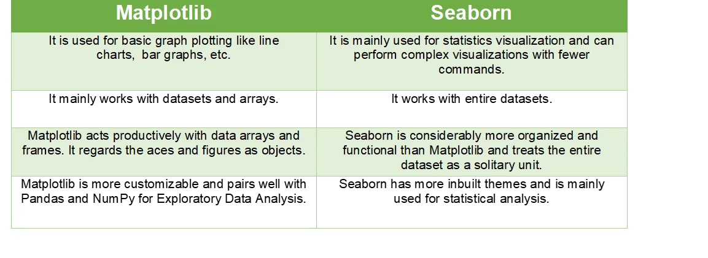

**Content:**

- What is Data Visualization?
- Useful packages for visualizations in python.
- How to use the right visualization?

Line Charts

Bar Graphs

Histograms

Scatter Plots

**What is data visualization?**

**“ A picture is worth a thousand of words”**

That old quote is what **Data Visualization** is all about. Data visualization is an integral part of data science/ analysis as it is useful for

1. **E**xploratory **D**ata **A**nalysis **EDA** **:** understanding the data.

2. **E**xplanatory **D**ata **A**nalysis : communicate the insights of the data in graphical form to other stakeholders.

**Useful packages for visualizations in python**

Python offers several plotting libraries, namely Matplotlib, Seaborn, Bokeh, and many other such data visualization packages with different features for creating informative, customized, and appealing plots to present data in the most simple and effective way.

v Matplotlib

Matplotlib is a visualization library in Python for 2D plots of arrays. Matplotlib is written in Python and makes use of the NumPy library. It can be used in Python and IPython shells, Jupyter notebook, and web application servers. Matplotlib comes with a wide variety of plots like line, bar, scatter, histogram, etc. which can help us, deep-dive, into understanding trends, patterns, correlations. It was introduced by John Hunter in 2002.

v Seaborn

Seaborn is a dataset-oriented library for making statistical representations in Python. It is developed atop matplotlib to create different visualizations. It is integrated with pandas' data structures. The library internally performs the required mapping and aggregation to create informative visuals It is recommended to use a Jupiter/IPython interface in matplotlib mode.

Seaborn functions are classified into:

o Figure-level functions ( relplot / displot/ catplot )



o Axes-level functions (scatterplot / histplot / boxplot …….)



v Bokeh

Bokeh is an interactive visualization library for modern web browsers. It is suitable for large or streaming data assets and can be used to develop interactive plots and dashboards. There is a wide array of intuitive graphs in the library which can be leveraged to develop solutions. It works closely with PyData tools. The library is well-suited for creating customized visuals according to required use-cases. The visuals can also be made interactive to serve a what-if scenario model. All the codes are open source and available on GitHub.

**How to use the right visualization?**

Matplotlib and Seaborn are python libraries that are used for data visualization. They have inbuilt modules for plotting different graphs. While Matplotlib is used to embed graphs into applications, Seaborn is primarily used for statistical graphs.



·

**1- Line plot**

A line chart is a graph that represents information as a series of data points connected by a straight line. In the line charts, each data point or marker is plotted and connected with a line or curve.

**Using Matplotlib**

```python
# make data
x = [2011, 2012, 2013, 2014, 2015, 2016, 2017, 2018, 2019, 2020] y = np.linspace(0, 10, 10)
# plot
fig, ax = plt.subplots()
ax.plot(x, y, marker='o', linewidth=2.0)
 plt.xlabel('Years')
 plt.ylabel('Production (ton)')
 plt.title('Production')
```

**Using Seaborn**

```python
# make data
x = [2011, 2012, 2013, 2014, 2015, 2016, 2017, 2018, 2019, 2020] y = np.linspace(0, 10, 10)
sns.set_style('darkgrid')
sns.lineplot(x, y,  marker='o')
plt.xlabel('Years')
plt.ylabel('Production (ton)')
plt.title('Production')
```

**2- Bar Graphs**

When you have categorical data, you can represent it with a bar graph. A bar graph plots data with the help of bars, which represent value on the y-axis and category on the x-axis. Bar graphs use bars with varying heights to show the data which belongs to a specific category.

**Using Matplotlib**

```python
plt.bar(top_10_Population['Country'], top_10_Population['Population'])
plt.xlabel('Top_10_Countries');
plt.ylabel('Population');
plt.xticks(rotation=90);
```

**Using Seaborn**

```python
sns.barplot(data=top_10_Population, \
            x = 'Country',
            y = 'Population')
plt.xlabel('Top_10_Countries')
plt.ylabel('Population')
plt.xticks(rotation=90)
```

**3- Histograms**

A Histogram is a bar representation of data that varies over a range. It plots the height of the data belonging to a range along the y-axis and the range along the x-axis. Histograms are used to plot data over a range of values. They use a bar representation to show the data belonging to each range. Let's again use the ‘Iris’ data which contains information about flowers to plot histograms

**Using Matplotlib**

```python
plt.hist(countries_info['GDP ($ per capita)'], bins=20)
plt.xlabel('GDP ($ per capita)')
plt.title('GDP distribution acros the world')
```

**Using Seaborn**

```python
sns.histplot(data = countries_info, x= countries_info['GDP ($ per capita)'], hue = df['Region'], bins=20 )
plt.xlabel('GDP ($ per capita)')
plt.title('GDP distribution acros the world')
```

**4 -Scatter Plots**

Scatter plots are used when we have to plot two or more variables present at different coordinates. The data is scattered all over the graph and is not confined to a range. Two or more variables are plotted in a Scatter Plot, with each variable being represented by a different color.

**Using Matplotlib**

```python
plt.scatter(x=countries_info['GDP ($ per capita)'], y=countries_info['deathrate'])
plt.xlabel('GDP ($ per capita)')
plt.ylabel('Death Rate')
plt.title('Death Rate vs GDP')
```

**Using Seaborn**

```python
sns.scatterplot(data=countries_info,\
                x= 'GDP ($ per capita)',
                y= 'deathrate',
                hue = 'Region')
plt.xlabel('GDP ($ per capita)')
plt.ylabel('Death Rate')
plt.title('Death Rate vs GDP')
plt.legend(loc=(1.04,0))
```
