US election for the year 2020 has been the hot topic of this year. Many polls have tried to understand the sentiment of the people towards the candidates. This blog consist of a simple analysis of the comments on recent tweet of both the candidates Donald Trump and Joe Biden.

## 1) Understanding the data
The dataset is provided [(https://www.kaggle.com/techykajal/us-election-using-twitter-sentiment-analysis),](https://www.kaggle.com/techykajal/us-election-using-twitter-sentiment-analysis) the data is scraped from the tweeter and it consist of the comments on the tweet of Donald Trump and Joe Biden. The data consist of of the user name of the people who have commented on the the respective candidate post and the respective tweet as text. The data is in csv format for both candidates.

```python
import numpy as np
import seaborn as sns
import matplotlib.pyplot as plt
%matplotlib inline
from textblob import TextBlob
from wordcloud import WordCloud
from plotly import graph_objs as go
import pandas as pd
Trump_reviews=pd.read_csv('Trumpall2.csv')
print(Trump_reviews.head())
```

- 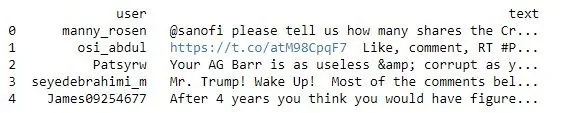

## 2)Feature creation
### 2.1) Adding the Sentiment Polarity feature
In this step a new feature Sentiment Polarity was generated using the the comment text of various user. Sentiment Polarity was generated using the textblob library. The text were the input to the textblob and the out was number from -1 to 1 where any negative number mean the degree of negativity of the comment , positive number meant the positivity of the comment and 0 meant the comment was neutral.

```python
def find_pol(review):
     return TextBlob(review).sentiment.polarity
Trump_reviews['Sentiment_Polarity'] =   Trump_reviews['text'].apply(find_pol)
Trump_reviews.tail()
```

- 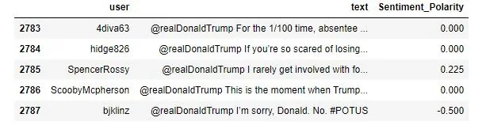

### 2.2) Adding the Expression Label feature:
Now using the Sentiment Polarity feature a new feature expression label was created. Simple grouping of positive polarity comment to positive expression label, negative polarity to negative label and 0 value to neutral was done.

```python
Trump_reviews['Expression Label'] = np.where(Trump_reviews['Sentiment_Polarity']>0,'positive', 'negative')
Trump_reviews['Expression Label'][Trump_reviews.Sentiment_Polarity ==0] = "Neutral"
Trump_reviews.tail()
```

- 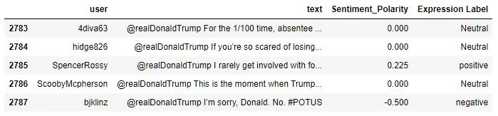

### 2.3)Adding the Review Length feature:
The length of each comment i.e. number of characters used in the comment was noted by the review length feature.

```python
def find_len(review):
    return len(review)
Trump_reviews['Review_Length'] = Trump_reviews['text'].apply(find_len)
Trump_reviews.tail()
```

- 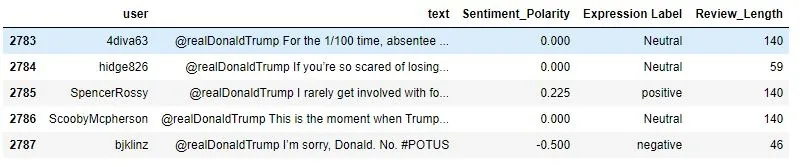

## 3) Data visualization:
Initially the data visualization of trump tweet where performed. A bar graph displaying the count of negative positive and neutral review was generated. Also the same data was interpreted using a pie chart as displayed below.

```python
y_value_counts = Trump_reviews['Expression Label'].value_counts()
print(y_value_counts)
plt.title("Review counts for Trump")
plt.bar(['Neutral','Positive','negative'],y_value_counts)
fig, ax = plt.subplots(figsize=(6, 6), subplot_kw=dict(aspect="equal"))
recipe = ["Neutral", "positive","negative"]
data = [y_value_counts[2],y_value_counts[1], y_value_counts[0]]
wedges, texts = ax.pie(data, wedgeprops=dict(width=0.5), startangle=-40)
bbox_props = dict(boxstyle="square,pad=0.3", fc="w", ec="k", lw=0.72)
kw = dict(xycoords='data', textcoords='data',
arrowprops=dict(arrowstyle="-"),bbox=bbox_props, zorder=0, va="center")
for i, p in enumerate(wedges):
    ang = (p.theta2 - p.theta1)/2. + p.theta1
     y = np.sin(np.deg2rad(ang))
     x = np.cos(np.deg2rad(ang))
     horizontalalignment = {-1: "right", 1: "left"}
     [int(np.sign(x))]
     connectionstyle = "angle,angleA=0,angleB=
     {}".format(ang)
     kw["arrowprops"].update({"connectionstyle":
     connectionstyle})
     ax.annotate(recipe[i], xy=(x, y), xytext=
     (1.35*np.sign(x), 1.4*y),
     horizontalalignment=horizontalalignment, **kw)
     ax.set_title("Expression Label of people for Trump")
     plt.show()
```

- 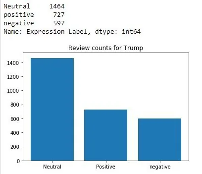

- 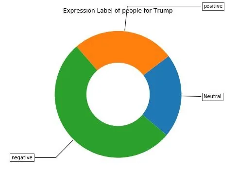

Now generating the histogram of the Sentiment Polarity for Trump tweets comments. Also, box plots of Negative and Positive review for Donald Trump tweets were generated by counting the value of each label of positive and negative review. It is clear that the majority value of sentiment polarity for trump lies between the 0 to 0.25 meaning most comments are mainly neutral or positive. Also by examining the box plot we can notice that seem to have higher average value while the quartile range seem to similar for both.

```python
plt.hist(Trump_reviews['Sentiment_Polarity'])
plt.title("Histrogram of Sentiment_Polarity for Trump")
plt.show()
negative_review =Trump_reviews[Trump_reviews['Expression Label']=='negative']['Sentiment_Polarity'].values
positive_review =Trump_reviews[Trump_reviews['Expression Label']=='positive']['Sentiment_Polarity'].values
plt.boxplot([negative_review,positive_review])
plt.title('Box Plots of Negative and Positive review for Donald Trump')
plt.xticks([1,2],('Negative reviews','Positive review'))
plt.grid()
plt.figure(figsize=(10,3))
plt.show()
```

- 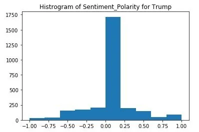

- 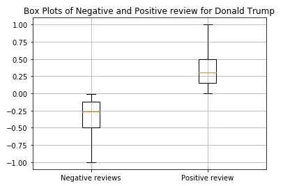

Furthermore, we can note from the histograms of character counts according to expression label that both positive and negative comment tend to have follow the same pattern where both label have majority of comments of character count higher than 100 characters. While the neutral review tend to follow different pattern where the majority of the comment have less than 100.

```python
plt.hist(Trump_reviews[Trump_reviews['Expression Label']=='negative']['Review_Length'])
plt.title("Histrogram of Negative reviews comment character count for Trump")
plt.show()
plt.hist(Trump_reviews[Trump_reviews['Expression Label']=='positive']['Review_Length'])
plt.title("Histrogram of Positive reviews comment character count for Trump")
plt.show()
plt.hist(Trump_reviews[Trump_reviews['Expression Label']=='Neutral']['Review_Length'])
plt.title("Histrogram of Neutral reviews comment character count for Trump")
plt.show()
```

- 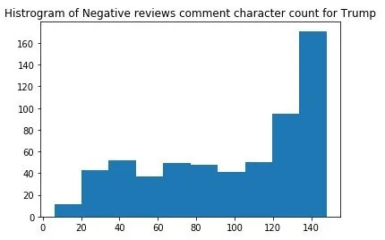

- 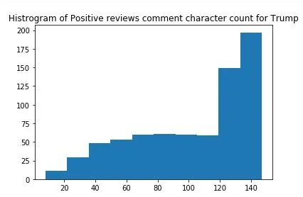

- 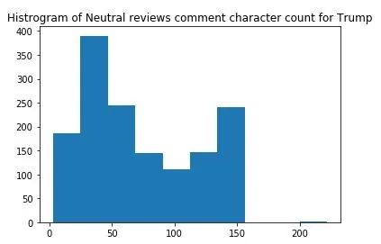

Finally, word cloud of the comments on the tweet of trump was generated using the WordCloud library. Word cloud displays the word the words present in the dataset with variability in size by the repetition of the word. Stop words where not considered while creating the world count and the twitter handle of Donald Trump and the word https for website links were added to stop words. We can witness that election, fox news , vote and mail were the top words used.

```python
from wordcloud import WordCloud, STOPWORDS
stopwords = set(STOPWORDS)
stopwords.add('https')
stopwords.add('realdonaldtrump')
comment_words = ' '
for val in Trump_reviews.text:
   val = str(val)
   tokens = val.split()
   for i in range(len(tokens)):
       tokens[i] = tokens[i].lower()
    comment_words += " ".join(tokens)+" "
    wordcloud = WordCloud(width = 800, height = 800,
    background_color ='white',stopwords = stopwords,
    min_font_size = 10).generate(comment_words)
    plt.figure(figsize = (8, 8), facecolor = None)
    plt.imshow(wordcloud)
    plt.axis("off")
    plt.tight_layout(pad = 0)
    plt.title("Word could of tweets for Trump tweets")
    plt.show()
```

- 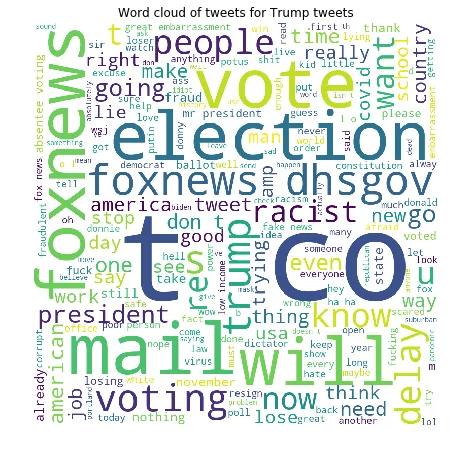

Similarly, the above steps were repeated for the other candidate Joe Biden. The following figures were generated as follow. It is clear that the both the candidate have almost similar number of expression label with trump having slightly higher comment on the post. Also it can be noted from the box plot that positive review seem to have larger value as compared to negative ones and the whisker of the positive box plot is longer as compared to negative ones. By examining the histograms we can observe for both positive and negative reviews the majority of the character count was above 120 characters. But for neutral comments most comment lie between the range 30 to 50 characters and second peak above 130 characters. Furthermore, in is clear from he world cloud generated for Biden comments that the most repeated words are Obama , trump , president , election and mail.

```python
Biden_reviews=pd.read_csv('Bidenall2.csv')
Biden_reviews['Sentiment_Polarity'] = Biden_reviews['text'].apply(find_pol)
Biden_reviews['Expression Label'] = np.where(Biden_reviews['Sentiment_Polarity']>0,'positive', 'negative')
Biden_reviews['Expression Label'][Biden_reviews.Sentiment_Polarity ==0] = "Neutral"
Biden_reviews['Review_Length'] = Biden_reviews['text'].apply(find_len)
Biden_reviews.tail()
```

- 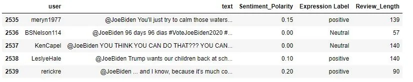

```python
y_value_counts = Biden_reviews['Expression Label'].value_counts()
print(y_value_counts)
plt.bar(['Neutral','Positive','negative'],y_value_counts)
plt.title("Barchart of Reviews for Biden")
fig, ax = plt.subplots(figsize=(6, 6), subplot_kw=dict(aspect="equal"))
recipe = ["Neutral", "positive","negative"]
data = [y_value_counts[2],y_value_counts[1], y_value_counts[0]]
wedges, texts = ax.pie(data, wedgeprops=dict(width=0.5), startangle=-40)
bbox_props = dict(boxstyle="square,pad=0.3", fc="w", ec="k", lw=0.72)
kw = dict(xycoords='data', textcoords='data',
arrowprops=dict(arrowstyle="-"),bbox=bbox_props, zorder=0, va="center")
for i, p in enumerate(wedges):
    ang = (p.theta2 - p.theta1)/2. + p.theta1
     y = np.sin(np.deg2rad(ang))
     x = np.cos(np.deg2rad(ang))
     horizontalalignment = {-1: "right", 1: "left"}
     [int(np.sign(x))]
     connectionstyle = "angle,angleA=0,angleB=
     {}".format(ang)
     kw["arrowprops"].update({"connectionstyle":
     connectionstyle})
     ax.annotate(recipe[i], xy=(x, y), xytext=
     (1.35*np.sign(x), 1.4*y),
     horizontalalignment=horizontalalignment, **kw)
     ax.set_title("Expression Label of people for Biden")
     plt.show()
```

- 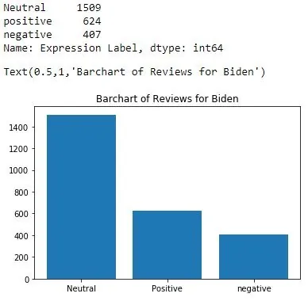

- 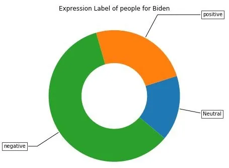

```python
plt.hist(Biden_reviews['Sentiment_Polarity'])
plt.title("Histrogram of Sentiment_Polarity for Biden")
plt.show()
negative_review =Biden_reviews[Biden_reviews['Expression Label']=='negative']['Sentiment_Polarity'].values
positive_review =Biden_reviews[Biden_reviews['Expression Label']=='positive']['Sentiment_Polarity'].values
plt.boxplot([negative_review,positive_review])
plt.title('Box Plots of Negative and Positive review for Joe Biden')
plt.xticks([1,2],('Negative reviews','Positive review'))
plt.grid()
plt.show()
plt.figure(figsize=(10,3))
```

- 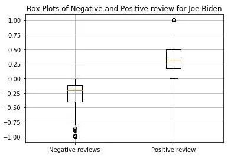

```python
plt.hist(Biden_reviews[Biden_reviews['Expression Label']=='negative']['Review_Length'])
plt.title("Histrogram of Negative reviews for Biden")
plt.show()
plt.hist(Biden_reviews[Biden_reviews['Expression Label']=='positive']['Review_Length'])
plt.title("Histrogram of Positive reviews for Biden")
plt.show()
plt.hist(Biden_reviews[Biden_reviews['Expression Label']=='Neutral']['Review_Length'])
plt.title("Histrogram of Neutral reviews for Biden")
plt.show()
```

- 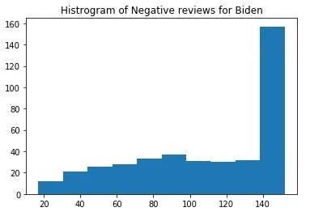

- 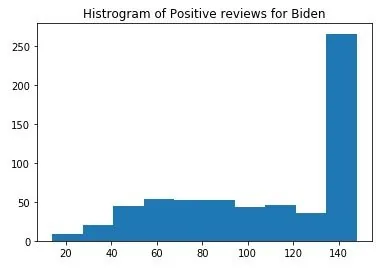

- 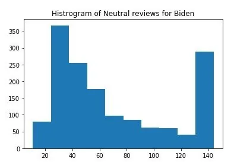

```python
from wordcloud import WordCloud, STOPWORDS
stopwords = set(STOPWORDS)
stopwords.add('https')
stopwords.add('joebiden')
comment_words = ' '
for val in Biden_reviews.text:
   val = str(val)
   tokens = val.split()
   for i in range(len(tokens)):
       tokens[i] = tokens[i].lower()
    comment_words += " ".join(tokens)+" "
    wordcloud = WordCloud(width = 800, height = 800,
    background_color ='white',stopwords = stopwords,
    min_font_size = 10).generate(comment_words)
    plt.figure(figsize = (8, 8), facecolor = None)
    plt.imshow(wordcloud)
    plt.axis("off")
    plt.tight_layout(pad = 0)
    plt.title("Word could of tweets for Biden tweets")
    plt.show()
```

- 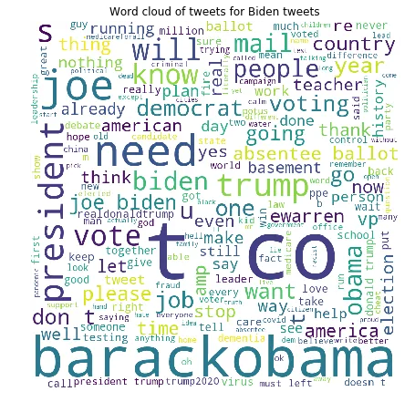

## 4) Conclusion
It can seen that even though Joe Biden has comparatively less followers as Donald Trump, the ratio of positive to negative comments is higher than that of trump with the number of labels being very similar in term of number. For both the candidates the number of characters of positive and negative review seem to follow the same pattern but the neutral label followed different trend. Also for both the candidate the words mostly used in the comment were related to elections like mail, vote, election , president etc...
