## Table of Contents

1. Introduction

2. Data Visualization and Key principles

2.1. Importance of Data Visualization

2.2. Common Useful types of Data Visualizations

2.3. Key Principles for Data Visualization

3. Import Relevant Libraries

4. Get the Data

5. Creating Plots with Matplotlib's Pyplot

5.1. Plotting Line Plots

5.2. Plotting Bar Charts

5.3. Plotting Histogram Plots

5.4. Plotting Scatterplots

6. Conclusion

## 1. Introduction

Data Visualization is a key tool for data analysis which is employed in the process of Exploratory Data Analysis (EDA) and in the communication of the results from an analysis. In EDA, data visualization allows us to quickly pick up any underlying patterns in the data that we can then explore and analyze further. Once we have done our analysis, the results are easier to understand by stakeholders when visualizations are employed for communication.

Matplotlib is a handy python library that is used for developing various types of visualizations. In this post, we will look at how to create various types of visualizations using the matplotlib library.

## 2. Data Visualization and Key principles

### 2.1. Importance of Data Visualization

Data Visualization is key in exploring data as well as communicating information. The following are some of the key important reasons why one might want to consider visualization of data:

- Communicates complex information in a more informative manner
- Provides summary outlook of the data at a glance
- Used in EDA to get insights about the data to understand what sort of analysis would be required
- Used to present outcomes of an analysis

### 2.2. Common Useful types of Data Visualizations

The type of visualization to use will depend on the type of data one has and the kind of information that one intends to communicate with a visualization. The following are the most common useful type of visualizations:

- Line Plots. Used for presenting time series data to observe trends over time.
- Bar charts and Column Charts. Used to compare data points over different categories.
- Histogram plots. Used to explore the distribution of continuous data.
- scatterplots. Used to explore the relationship between two variables.

This is not an exhaustive list of the type of visualizations that one might consider in their data exploration and analysis. We will however consider the above as they are quite useful in providing insights in the data.

### 2.3. Key Principles for Data Visualization

For visualizations to be useful and deliver their intended purpose, the following are some of the key principles that needs to be observed in developing visualizations:

- Clearly labeled titles and axis.
- Provide legends when displaying charts with different data categories.
- Use appropriate visuals for a particular type of data.

## 3. Import Relevant Libraries

- matplotlib.pyplot. We will use the matplotlib sub-module of pyplot for plotting and visualization.
- seaborn. Seaborn is another library that is used for visualizations. However, we will use seaborn to get access to the built-in datasets that we can use for visualizations.
- pandas. We will import pandas for any data manipulation that we may require.

## 4. Get the Data

We will make use of two datasets for our demonstration from the seaborn in-bult datasets:

- dowjones. This is a timeseries data of the dow jones industries index over time.
- tips. This dataset the amount of tips given by customers which includes other variables like the total bill, the sex of a customer etc.

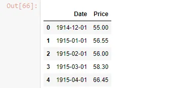

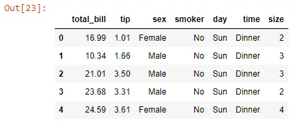

## 5. Creating Plots with Pyplot

Creating plots with pyplot is easy, we call pyplot. the type of plot we want to create and pass the variables we are plotting with any additional arguments. For example, plotting a scatter plot of x against y we will call plt.scatter(x, y). This will plot a scatterplot of y against x.

### 5.1. Plotting Line Plots

We will use the dowjones data to plot the line plot of the index value over time. We will follow the stated principles by adding a title and labeling the axis. The date column will be our x-axis and the Price column will be out y-axis.

```python
#convert the 'Date' column to Datetime

dow['Date'] = pd.to_datetime(dow['Date']).dt.date
```

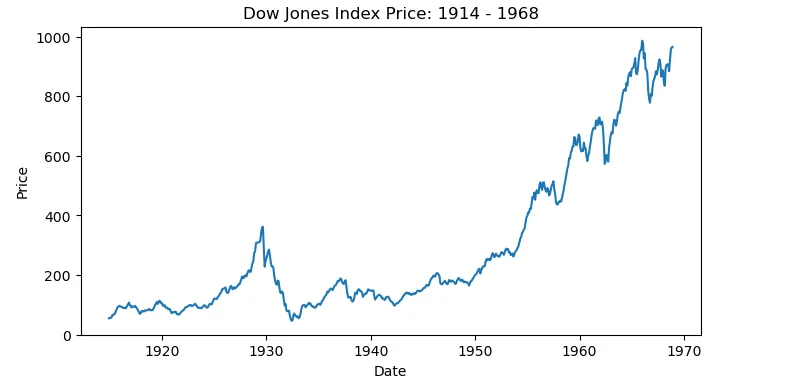

The line graph above can be customized by specifying the color of the plot, the linestyle, linewidth etc by passing these arguments in the plot() function.

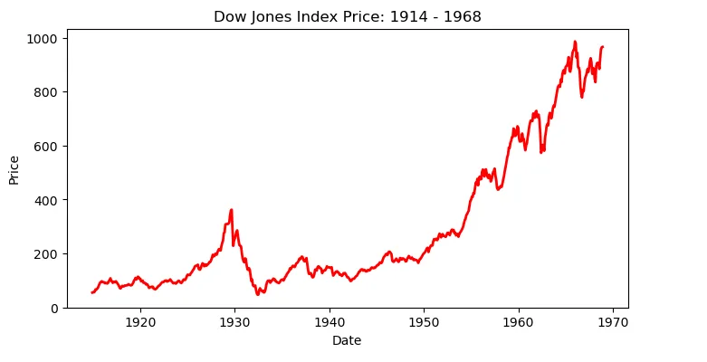

### 5.2. Plotting Bar Charts

We will create a bar chart by looking at the mean tip given based on the day of the week. to do this, we first group the data by day using the mean as aggregation.

```python
#group the dataframe by day column

tips_by_day = tips.groupby('day').mean()
tips_by_day
```

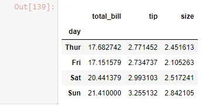

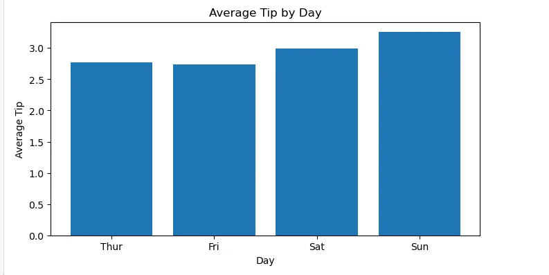

From the above we can see that on average higher tips are given on a Sunday. we can further specify additional arguments in the plt.bar() function to customize the plots such as specifying the labels for for each of the bars.

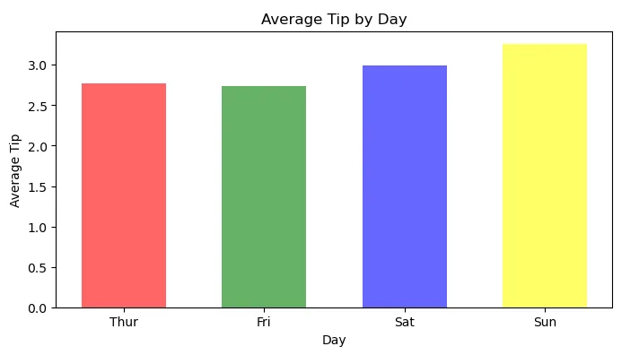

### 5.3. Plotting Histogram Plots

We can use histogram plots to look at the distribution of variables. We will look at the distribution plots of total bills and then get a sense of how these differ for males and females by plotting the histograms for the respective sex.

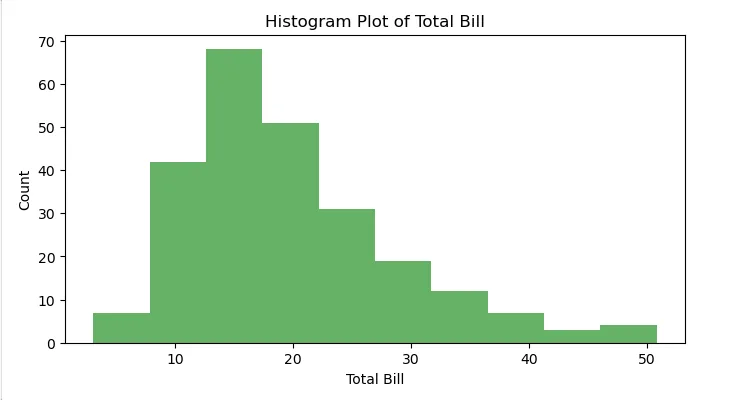

Next we filter the data by sex and draw the two histogram lots for males and females. We specify label in the plt.hist() function call so that these can be used for setting the legend labels. ensure to specify an alpha level so that we can see both the plots as they are overlayed each others.

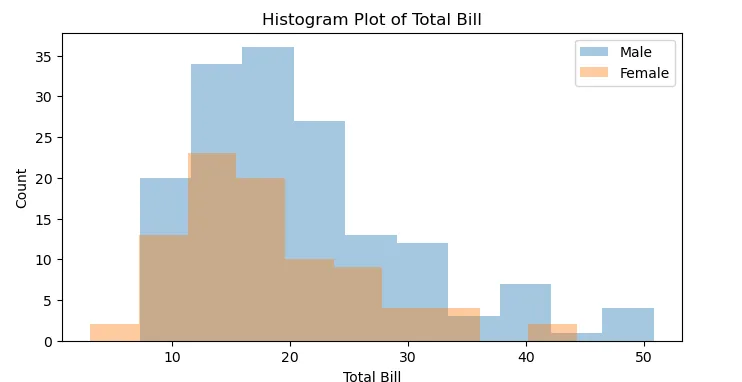

### 5.4. Plotting Scatterplots

Scatterplots are used to get an understand how to variables relate. In this case we would want to explore the relationship between Total Bill and the amount of Tip given. We specify Total Bill on the x-axis as it will be our independent variable and the tip on the y-axis as it will be our dependent variable.

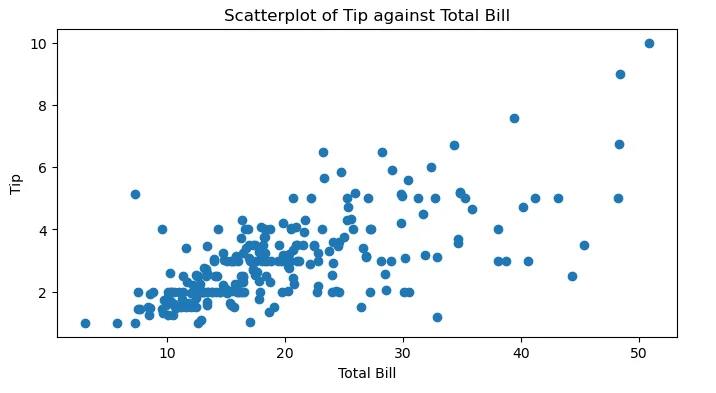

We can also plot the scatterplot by sex and see how the relationship between total bill and tip differ between the females and males.

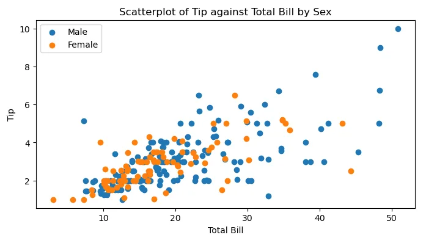

## 6. Conclusion

This tutorial has presented the plotting of some of the most useful visualizations for data exploration and analysis. There is further customization that can be employed to enhance the presentation of visualizations in matplotlib. What has been presented however, forms a bases upon which one can build on in presenting data in visuals.

The notebook for the code used in this post can be found from this [GitHub link](https://github.com/Musonda2day/Data-Visualization-using-Matplotlib-in-Python).
