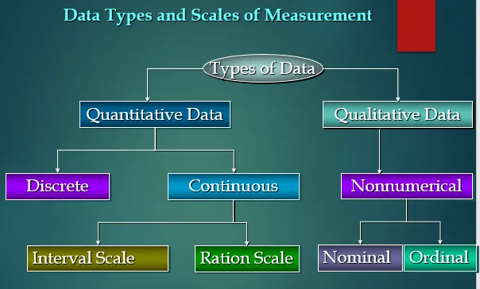
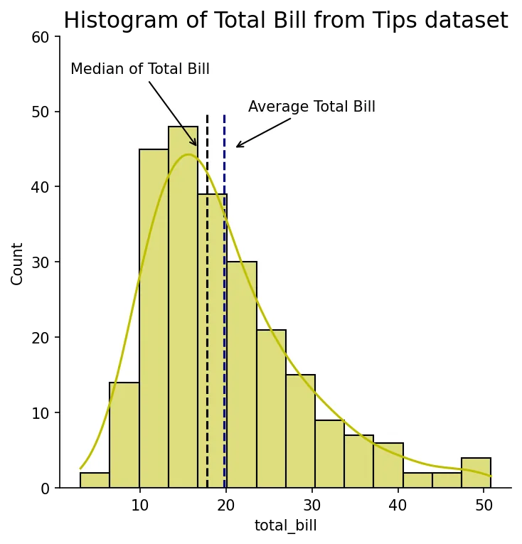
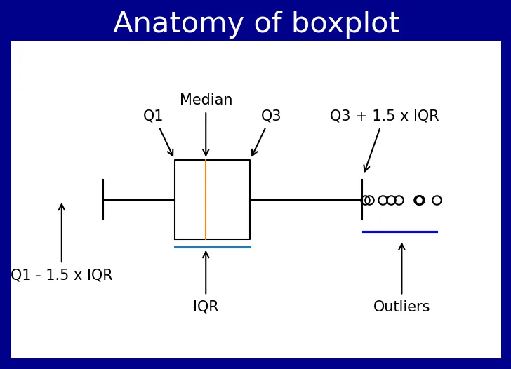
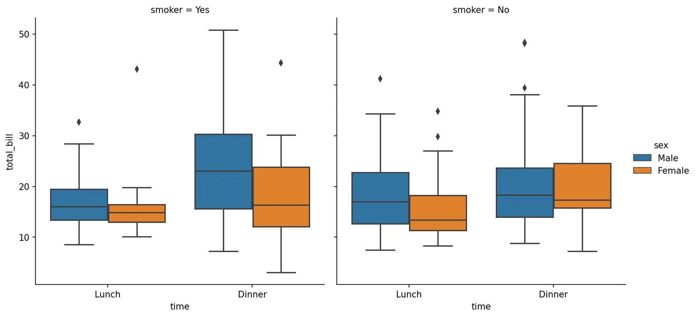
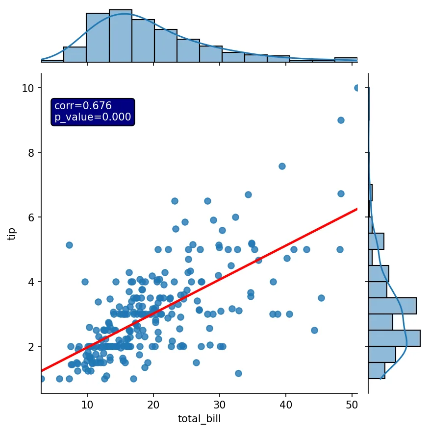
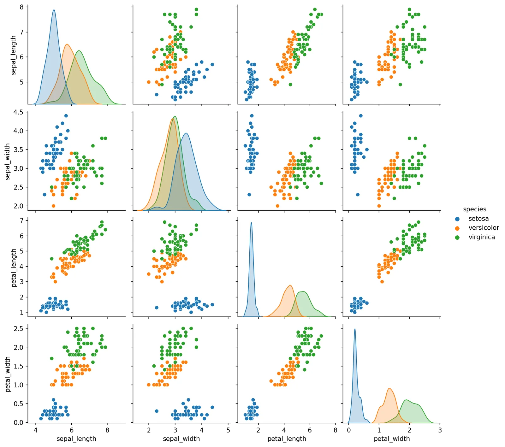
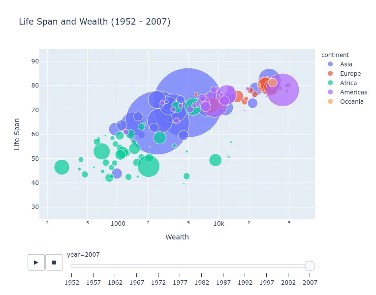
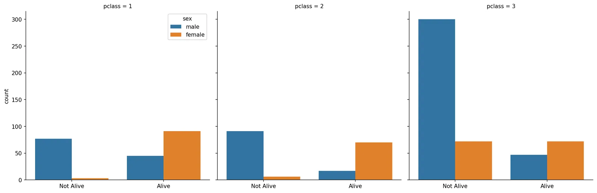
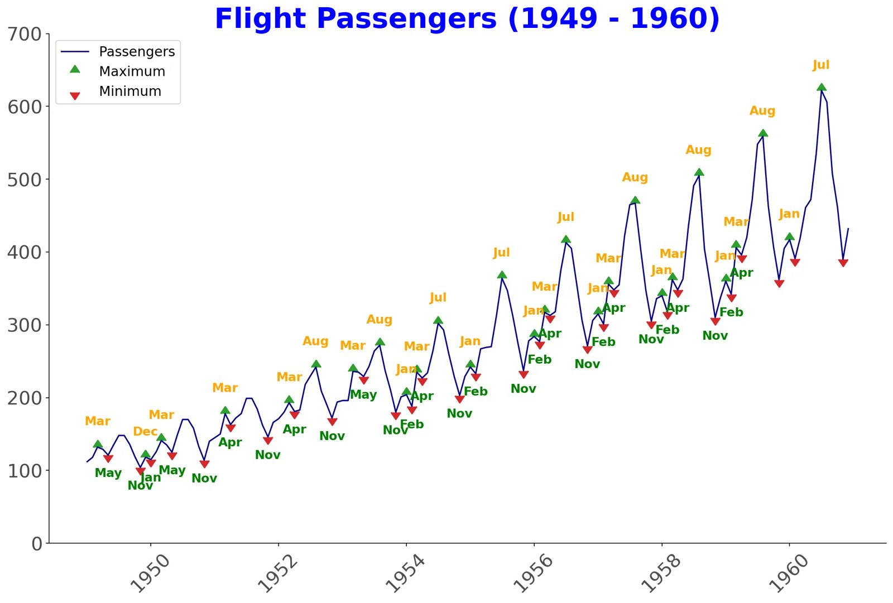

Data visualization is the practice of translating information into a visual context, such as a map or graph, to make data easier for the human brain to understand and pull insights from. The main goal of data visualization is to make it easier to identify patterns, trends, and outliers in large data sets. We cannot see the data from the spreadsheets or text files. So, we use visualization tools to configure that data. It is important which types of graphs or charts should be used for certain types of data.

Visualizations are different according to data type. First, let's talk about the types of data.

### Types of data

Generally, for structured data, there are two types of data; quantitative and qualitative data.

### Quantitative Data

The data that can be answered the question such as how many, how much, how often and that can be counted are called quantitative data. It can be divided into discrete and continuous data. With programming language, integer values are discrete data and float values are continuous data. For example, the number of children is discrete data as it has no decimal points and the weight of the child is continuous data as it contains decimal points as much as you want to be precise.

### Qualitative Data

The data that cannot be measured or expressed as a number is qualitative data. It can be divided into nominal and ordinal types. Nominal data are just labels. It just names a thing without applying for any particular order. For example, gender, hair color, marital status. Ordinal data are also 'labels' but it has a particular order. For example, satisfaction score, education status, ranking in a competition.

### Data Visualization

Data can be visualized by many kinds of pictures such as bar charts, box plots, violin plots, strip plots, scatter plots, histograms, polar plots, heatmap, combined graphs, and many more. For Python language, Matplotlib is the grandfather of the data visualization library. It allows you to draw from scratch like an artist. It is a little handy to draw at the beginning and other visualization libraries are easy to plot. But they are built upon Matplotlib and if you want to customize your pictures, you need to be familiar with the Matplotlib library. Moreover, images can be manipulated by Matplotlib. Moreover, it has a great documentation book of pages over 3000. Here are [tutorials for matplotlib](https://matplotlib.org/stable/tutorials/index.html) and here is [Matplotlib gallery.](https://matplotlib.org/stable/gallery/index.html) It is a great way to start.

I want to give examples of the most frequently used pictures ( the most basic types of graphs ) in data science and explain briefly the types of data that are used.

### 1. Histogram

Histograms are the most frequently used graphs and they let us know how the data is distributed; normally distributed, right skew or left skew. We can know the distribution of the data by glimpsing the histogram. Continuous data types are plotted. For example,

The dataset came from a restaurant and contains data about the total bills, tips, the characteristics of customers such as sex, smoker or not, when did they come, and the size of the party. I drew a histogram of the total bill column and you can see the data is a little right skew as the median of the data is less than the mean but it is nearly normal.

### 2. Box Plot

Boxplots are like histograms but I think they are more useful when comparing more than one data set.

This boxplot was drawn from the same dataset as above. The orange line inside the box is the median number of that dataset. The range of the box in the boxplot is the interquartile range (IQR) that can be calculated by subtracting the first quartile from the third quartile.

Suppose we have 10 numbers and sorted smallest to largest; 1,1,2,3,4,5,6,6,7,100. The median, the middle (average of 5th and 6th) number, is 4.5. The first quartile, Q1, is the median of the left half of the median and in this example, it is 2. The third quartile, Q3, is the median of the right half of the median and it is 6. Outliers are generally called data points higher than Q3 plus 1.5 times IQR and lower than Q1 minus 1.5 times IQR and from the above example, 100 is the outlier.

Let's talk about the above boxplot. There are outliers with high numbers as we saw in the above histogram, the data is right skew and so, the boxplot here has outliers.

Continuous data are plotted and categorical data separate the groups. It is from the same dataset and data are divided into 8 groups. We can see that generally, men cost more total bills than women.

### 3. Scatterplot

Scatterplots are also the most frequently used graphs. Two continuous numerical data are usually plotted and let us know the relationship between the two variables.

Dataset used is also from the tips dataset. Here tip is plotted versus total_bill and we can see the positive relationship between these two variables. From the calculation, the correlation coefficient is 0.68 with a p-value of nearly zero.

We can easily draw multiple plots with just a few lines. But beware of the running time is long for large data set if you are using the Seaborn pairplot method. The data set is the famous **iris** dataset. The Iris Dataset contains four features (length and width of sepals and petals) of 50 samples of three species of Iris (Iris setosa, Iris virginica, and Iris versicolor). We can see a positive relationship between sepal length, sepal width, petal length, and petal width. Continuous variables are plotted and colors are separated by categorical variables.

Here is the next example of a scatter plot for the gapminder dataset.

The picture in this article is not an animated graph.

It is plotted against life span vs GDP, the size of points by population and colored by continent, and animated by year. It is using the Plotly library and you should try this, as a beautifully animated bubble plot can be drawn just a single line of code.

### 4. Bar Chart

Bar charts are useful for plotting counts or comparing the statistical computations between categorical variables. For example, here I used the titanic dataset.

You can see that women have more chances to be alive than men.

### 5. Line Chart

Line charts are widely used in time series analysis and it gives us the visualization of trends, increasing or decreasing of the outcomes.

The dataset is the flight dataset with two variables; international air passengers in thousands and dates of the flights. Here line chart generally shows the rising trend of the number of air passengers but not a straight rising. There are fluctuations. In general, February and November have minimum numbers of passengers for each year, and July and August have maximum numbers of passengers.

*If you are an R user, you can choose the Plotnine library. It has the same syntax as ggplot2.*

So, in conclusion, we cannot see the data just by seeing the data. We have to change the data into meaningful graphs. Data visualization is an art. To change into pictures, we need to know about the types of the data, and considering the types of the graph is depends upon you. Thanks a lot for your time.

Here is my [Github](https://github.com/thihanaung-thnn/data_insight/blob/main/notebooks/data_visualization.ipynb) repo.
