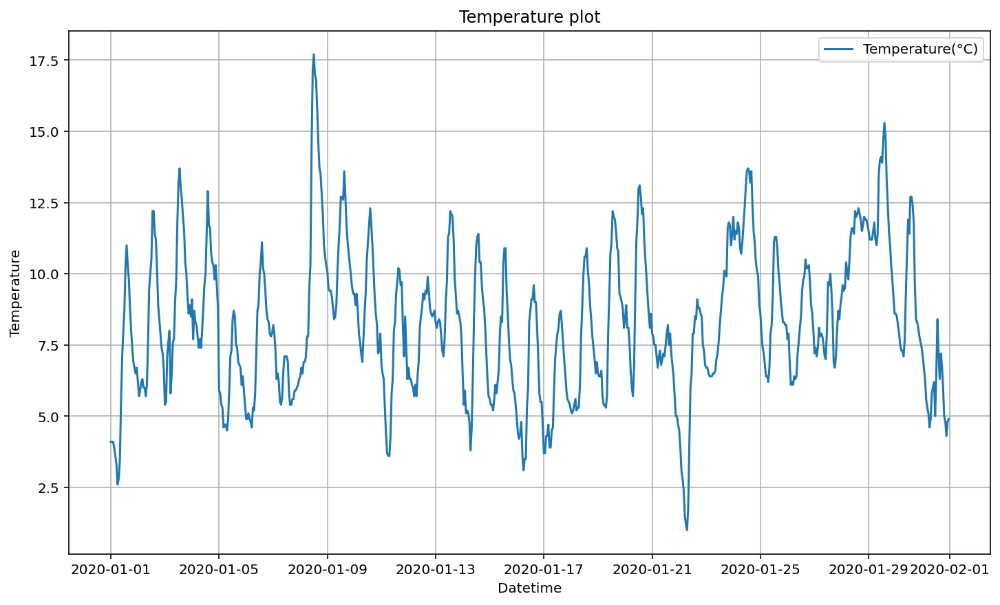
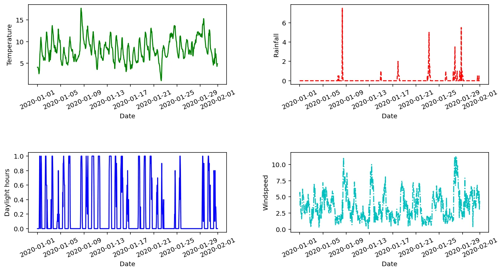

Data visualization is the representation of data or information in a graph, chart, or other visual formats. It communicates the relationships of the data with images. We need data visualization because a visual summary of information makes it easier to identify patterns and trends than looking through thousands of rows on a spreadsheet. Since the purpose of data analysis is to gain insights, data is much more valuable when it is visualized. Even if a data analyst can pull insights from data without visualization, it will be more difficult to communicate the meaning without visualization.

There are different kinds of libraries to visualize data in python like matplotlib, seaborn, Bokeh etc.

Today we are learning about the Matplotlib library. First, we need to import the necessary library as below code.

```python
import pandas as pd
from matplotlib import pyplot as plt
```

Now we are reading the project2.xlsx excel file which contains data about temperature, rainfall, daylight hours, and wind speed data. The excel data is read using read_excel and assigned to a data frame new.

```python
new = pd.read_excel("project2.xlsx")
print(new.head())
```

We can read few lines of data using .head() function of the pandas library.

Then we get the following lines of project2.xlsx.

```python
    Date  Temp(C)  Rainfall(mm)  Daylight hours(hr)  windspeed(m/s)
0 2020-01-01 00:00:00      4.1           0.0                 0.0    5.4
1 2020-01-01 01:00:00      4.1           0.0                 0.0    5.7
2 2020-01-01 02:00:00      4.1           0.0                 0.0    3.7
3 2020-01-01 03:00:00      3.9           0.0                 0.0    4.7
4 2020-01-01 04:00:00      3.6           0.0                 0.0    4.1
```

### Plot data of single column(Temp) versus Date

```python
# this statement plot line plot of temperature value.
plt.plot(new['Date'],new['Temp(C)'])

# Add label to the x-axis and y-axis and title to the plot.
plt.xlabel("Datetime")
plt.ylabel('Temperature')
plt.title("Temperature plot")

# Add grid lines to the plot.
plt.grid()
plt.legend(['Temperature(°C)'])

# Display plot
plt.show()
```

The above code plot a line graph of the Temperature column of the new data frame. The output plot is shown below.



### Use subplot to plot multiple graphs

The following code plots multiple graphs in a single plot using a subplot.

The snippet of the code is added below.

```python
# Temperature plot
plt.subplot(2,2,1)
plt.plot(new['Date'],new['Temp(C)'],'g-')
plt.xlabel('Date')
plt.ylabel('Temperature')
plt.xticks(rotation=25)

# Rainfall plot
plt.subplot(2,2,2)
plt.plot(new['Date'],new['Rainfall(mm)'],'r--')
plt.xlabel('Date')
plt.ylabel('Rainfall')
plt.xticks(rotation=25)

# Daylight hours plot
plt.subplot(2,2,3)
plt.plot(new['Date'],new['Daylight hours(hr)'],'b')
plt.xlabel('Date')
plt.ylabel('Daylight hours')
plt.xticks(rotation=25)

# Windspeed plot
plt.subplot(2,2,4)
plt.plot(new['Date'],new['windspeed(m/s)'],'c-.')
plt.xlabel('Date')
plt.ylabel('Windspeed')
plt.xticks(rotation=25)

plt.tight_layout(pad=5)
plt.figure(figsize=(10,15))
plt.show()
```

The above code displayed 4 graphs in a 2 by 2 matrix form as below.



You can get full code and data from the GitHub [link](https://github.com/awalGaurab/Graph_plot).
