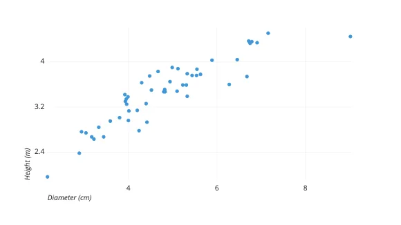
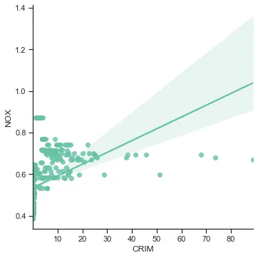
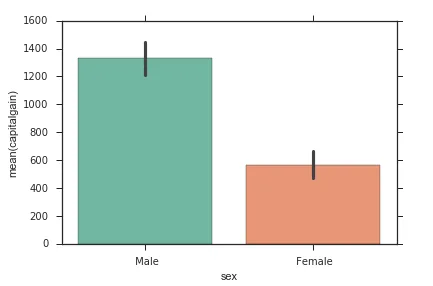
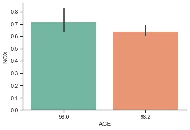
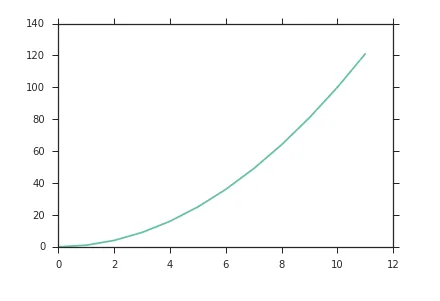
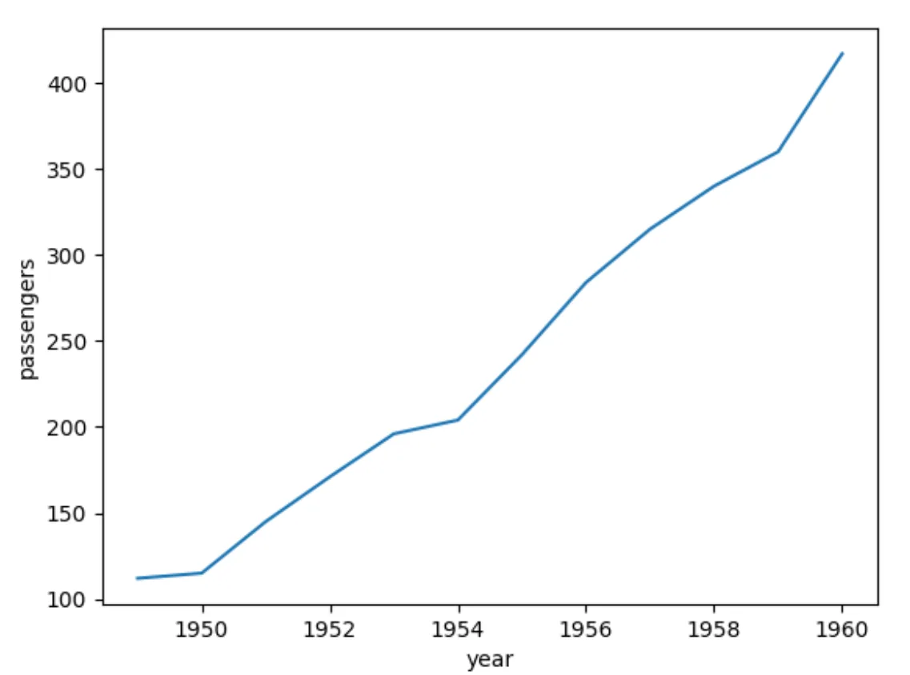

## The importance of data visualization
Data visualization can provide the following benefits:

- Enhancing data understanding
- A more compelling story when explaining the data
- that is easier to understand

The ability to visualize data is a core skill for any analyst or data scientist. Using great visualizations to help tell a data story can improve others' understanding. A better understanding can contribute to the success of a project.

## Data visualization tools in Python

Matplotlib and Seaborn are two of the most popular Python tools for visualizing data. These will be our focus in this blog, but there are many other tools, such as Bokeh, ggpy, and D3.

**Matplotlib:** is sort of the base plotting library in Python. Consider it a low-level library that gives you a wide variety of options, but sometimes this flexibility makes it difficult to work with. It can sometimes appear a bit dated in the style of Matplotlib, given that it has been around for so long

**Seaborn :** In order to address some of these issues, Seaborn was created. Seaborn is built on top of Matplotlib and provides high-level access to statistical graphics. In most cases, when possible. Due to the fact that Seaborn is built on top of Matplotlib, it is pretty easy to mix the two.

## Visualization with Scatter Plots
Scatter plots are great for plotting two variables to visualize any correlation and relationship that might exist between them.

Take a look at the scatter plot below. As can be seen from this plot, Height and Diameter are positively correlated. In a scatter plot, that relationship is easily seen by looking for points that are close to the 45-degree line pointing up and to the right.



### Scatter plots in Python:

The lmplot() function in Seaborn lets you create scatter plots easily. The key inputs are:

- x which is the column name for your x-axis variable
- y which is the column name for your y-axis variable
- data which is your Pandas dataframe

Here's an example:

```python
from sklearn.datasets import load_boston
import pandas as pd
import seaborn as sns
import matplotlib.pyplot as plt
# Set the palette and style to be more minimal
sns.set(style='ticks', palette='Set2')

# Load data
boston_data = load_boston()
boston_df = pd.DataFrame(boston_data.data, columns=boston_data.feature_names)

# Create the scatter plot
sns.lmplot(x="CRIM", y="NOX", data=boston_df)
# Remove excess chart lines and ticks for a nicer looking plot
sns.despine()
```



As you can see from the code above, the x and y variables come from our data, which is in the form of a Pandas dataframe that contains the x and y values we wish to plot. A regression line is plotted by default so that you can more easily see possible linear relationships. The variables appear to be positively correlated. Using bootstraps of our data, the lighter shade around the line represents the 95% confidence interval of our regression line.

## Visualization with Bar Plots
When comparing categories, bar plots can be useful. The bar graph below, for example, compares capital gain values by gender. For this dataset, the bar plot shows the difference in mean capital gain tax across genders.



In Seaborn, we can create bar plot using the barplot() command. In this command, the first argument specifies the column for the grouping. In the plot above, it is the gender. As for the second argument, it specifies the column to use for comparison. In the plot above, that column is capital gain. For instance, here's an example with Boston data:

```python
from sklearn.datasets import load_boston
import pandas as pd
import seaborn as sns
import matplotlib.pyplot as plt
# Set the palette and style to be more minimal
sns.set(style='ticks', palette='Set2')

# Load data
boston_data = load_boston()
boston_df = pd.DataFrame(boston_data.data, columns=boston_data.feature_names)

# Only keep for ages 96 and 98.2
boston_df = boston_df[boston_df["AGE"].isin([96, 98.2])]

# Create the bar plot
sns.barplot(boston_df['AGE'], boston_df['NOX'])
# Remove excess chart lines and ticks for a nicer looking plot
sns.despine()
```



In the barplot() command, the AGE column and the NOX column are the first and second arguments, respectively. Thus, the plot illustrates the average NOX value by AGE.

## Visualization with Line Graphs
A line graph is a useful tool for displaying values over time, such as the price of a stock. When there is a connecting component between the values, such as time, a line graph is preferable to a scatter plot. Consider the following example of a value growing exponentially over time:



### Line graphs in Python

Seaborn plots line graphs with its lineplot() function. The first parameter is the array of x-values, and the second parameter is the array of y-values. It's that simple! Line graphs are fairly simple to create and can be very effective. As an example, let's look at the flight dataset from Seaborn. There are three columns in this dataset. Year, Month, and Passengers. The passengers column represents the number of passengers on a flight for the given year and month.

```python
import seaborn as sns            # importing seaborn functionality
import pandas as pd
import matplotlib.pyplot as plt

flights_long=sns.load_dataset("flights")   # importing dataset

# filtering the dataset to obtain the January records for all years
flights_long=flights_long[flights_long.month == 'January']

#plotting a line graph
plot=sns.lineplot(flights_long.year, flights_long.passengers)
```



In the above code, the dataset is loaded, filtered to only include data for January, and then the number of passengers is plotted for every year as a line plot. That’s how the variations in data along time can be mapped with a line graph.

You can find the source code on [GitHub](https://github.com/safia-bashir/Data-Visualization)
