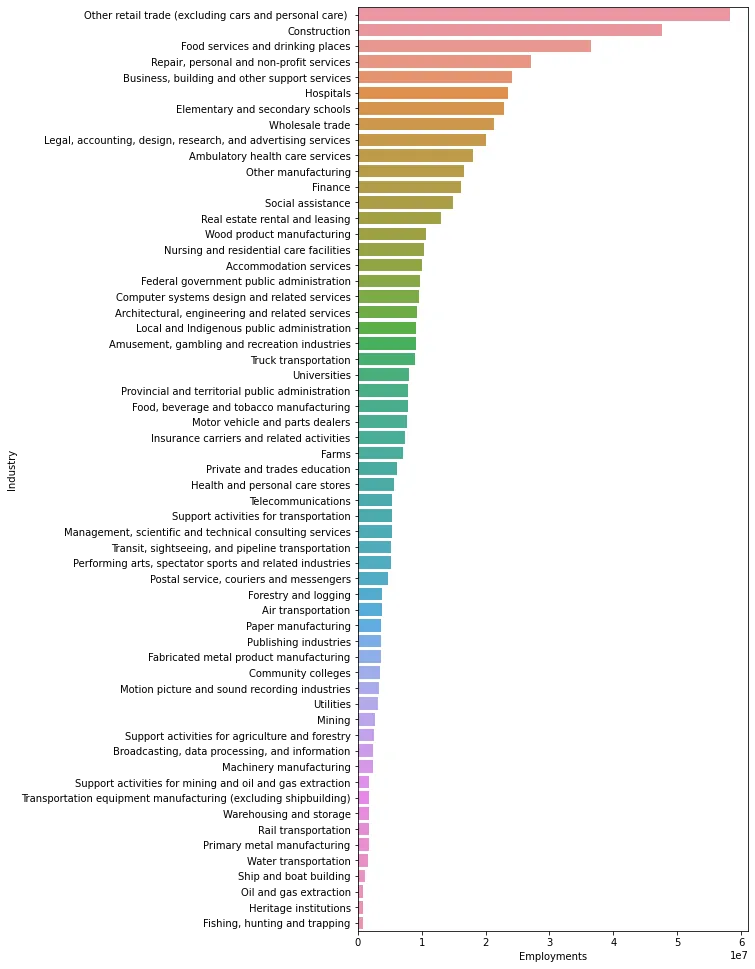

Every new learner in the data analysis field wonder what would the first job will look like. Specially after spending quiet some time in learning.

Today, we will imagine together that this project is my first job and will walk together the journey.& Happy Day 1.

The task is to work with data from The North American Industry Classification System (NAICS).

NAICS is an industry classification system developed by the statistical agencies of Canada, Mexico, and the United States. NAICS is designed to provide common definitions of the industrial structure of the three countries and a common statistical framework to facilitate the

analysis of the three economies.

The data consists of 15 CSV files beginning with RTRA. These files contain employment data by industry at different levels of aggregation; 2-digit NAICS, 3-digit NAICS, and 4-digit NAICS.

Columns mean as follows:

(i) SYEAR: Survey Year

(ii) SMTH: Survey Month

(iii) NAICS: Industry name and associated NAICS code in the bracket

(iv) _EMPLOYMENT_: Employment

There is also an excel file that is considered a dictionary of NAICS, upon which we will approve the numbers of employment.

Requirements of the job:

1- Fill the Data Output Template: An excel file with an empty column for employment. You should fill the empty column with the data you prepared from your analysis.

2- Highlight at least 5 important questions that you would like to answer in order to provide valuable information to your company so that they can make good business decisions. Your questions should include how employment in Construction evolved over time and how this

compares to the total employment across all industries? and at least 4 more questions.

Specifications:

1- Try to create each series from the highest possible level of aggregation in the raw data files. For example, if an LMO Detailed Industry is defined with a 2-digit NAICS only, do not use a lower level of aggregation (i.e., 3-digit or 4-digit level NAICS files in the RTRA). Similarly, if an LMO Detailed Industry is defined with a 3-digit NAICS only, do not use the 4-digit NAICS files for that industry.

2- All steps, including merging or appending the data, that would generate the requested data should be done using python codes.

The full work is found here.

I started by importing data and having a look.

```python
import pandas as pd
file1 = pd.read_csv('A_NEWLY_HIRED_DATA_ANALYST\RTRA_Employ_2NAICS_00_05.csv', parse_dates=([['SYEAR', 'SMTH']]))
file2 = pd.read_csv('A_NEWLY_HIRED_DATA_ANALYST\RTRA_Employ_2NAICS_06_10.csv', parse_dates=([['SYEAR', 'SMTH']]))
```

The same for the rest of the files. Then combine similar type of files together.

```python
two_digit = pd.concat([file1, file2, file3, file4, file5])
```

## Data Cleaning

Have a look at the data for any missing values:

```python
three_digit.info()
```

Extract the NAICS from the industry name:(keep only the number

```python
three_digit['NAICS'] = three_digit.NAICS.str.extract('(\d+)')
```

When we look again at the data we will notice now missing NAICS that we have to drop them.

Extract the data from lmo file which is the dictionary of NAICS:

```python
lmo = pd.read_excel('A_NEWLY_HIRED_DATA_ANALYST\LMO_Detailed_Industries_by_NAICS.xlsx')
lmo['NAICS'] = lmo['NAICS'].replace(regex='&', value=',').astype('str')

lmo.head()
```

```python
#create a separate dictionary for each NAICS level
#unify all separators to comma and then extract it
#extract the NAICS each to its dictionary
two_digit_dict = {}
three_digit_dict = {}
four_digit_dict = {}

for name, numbers in zip(lmo['LMO_Detailed_Industry'], lmo['NAICS']):
    num_list = numbers.split(',')
    num_list = [x.strip() for x in num_list]
    for i in range(len(num_list)):
        if len(num_list[i]) == 2:
            two_digit_dict[num_list[i]] = name
        elif len(num_list[i]) == 3:
            three_digit_dict[num_list[i]] = name
        elif len(num_list[i]) == 4:
            four_digit_dict[num_list[i]] = name
```

Now we have a dictionary that will convert the NAICS to name as in the output file.

After merging each dictionary with its type of file we check again for NaN values.

Notice that we need to handle each level of digits separately. For example the missing data from 2digit will be dropped immediately, since this is the highest level. But the 3d data, convert the NAICS of the missing names to 2d first and then drop the rest.

Converting 3digit to 2digit :

```python
full_three_digit.loc[full_three_digit['Name'].isna(), 'NAICS'] = full_three_digit['NAICS'].apply(lambda x: str(x)[:-1])
```

The final step is to find the sum of Employment :

```python
full_three_digit_updated.groupby(['SYEAR_SMTH', 'Name'])['_EMPLOYMENT_'].sum()
```

Now we can visualize the sums per industry.



The rest of analysis and work is [here](https://github.com/NeferTerry/Analysing-NAICS-Data) .

.
