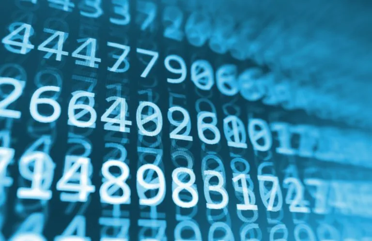

In this post, you will learn how to convert a decimal into an equivalent binary number using Python. Here, I have mentioned two ways to do that:

1.Using loops

Step 1. Divide the integer by 2, while noting the remainder.

```python
    while(decimal > 0):
        rem = decimal % 2
```

Step 2. Then, append this remainder to a list. then, divide the quotient again by 2.

```python
        binary_num_list.append(rem)
        decimal = decimal // 2
```

Step 3. Like this, keep dividing each successive quotient by 2 until you get a quotient of zero.

Step 4. After this, we reverse the order of the list to get the binary representation of

```python
binary_num_list.reverse()
print("Binary Equivalent is: ")
for i in binary_num_list:
    print(i, end=" ")
```

Here's the full code:

```python
User_input=int(input("Enter a number: "))

binary_num_list=[]

def decimal_to_binary(decimal):

    while(decimal > 0):

        rem = decimal % 2

        binary_num_list.append(rem)

        decimal = decimal // 2

    binary_num_list.reverse()

    print("Binary Equivalent is: ")

    for i in binary_num_list:

        print(i, end=" ")
```

2.Using recursive function

A recursive function is a function that calls itself during its execution something. For this, we have defined a function and taken a decimal number as an input and converted it to an equivalent binary number.

```python
User_input = int(input("Enter a number: "))

print("Binary Equivalent is: ")

def decimal_to_binary(decimal):

    if decimal > 1:

        decimal_to_binary(decimal // 2)

    print(decimal % 2, end = " ")
```

Personally I think this conversion is better and much more efficient than the first one.
