## Decision Tree multi-way

Decision trees are supervised learning models used to solve problems for classification and regression. Decision Tree breaks down a datasets into smaller and smaller subsets while at the same time an associated decision tree is incrementally developed. In Decision Trees, for predicting a labeled record we start from the **root** of the tree. And the final result is a tree with **decision nodes** and **leaf nodes**.

Tree models present a high flexibility that comes at a price: on one hand, trees are able to capture complex non-linear relationships; and, they are prone to memorizing the noise present in a datasets. By aggregating the predictions of trees that are trained differently, ensemble methods take advantage of the flexibility of trees while reducing their tendency to memorize noise.

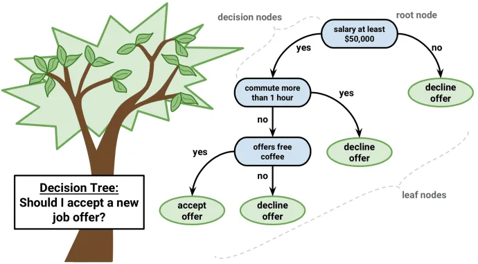

## Important Terminology related to Decision Trees
**Root Node:** It represents the entire population which is top most of the tree. Root node divides two or more homogeneous sets or sub-branch or child nodes

**Decision Node:** When a sub-node splits into further sub-nodes, it is called the decision node. It has one parent node and two or more child nodes

**Leaf / Terminal Node:**  When a node cannot be separated any other nodes, it is called Leaf node.

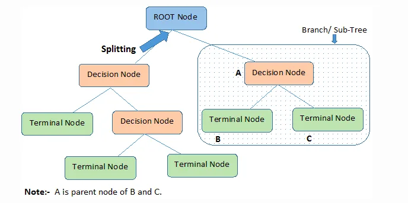

## How do Decision Trees work?
The decision of making strategic splits heavily affects a tree’s accuracy. The decision criteria are different for classification and regression trees.

Decision trees use multiple algorithms to decide to split a node into two or more sub-nodes. The creation of sub-nodes increases the homogeneity of resultant sub-nodes. In other words, the purity of the node increases with respect to the target variable. The decision tree splits the nodes on all available variables and then selects the split which results in most homogeneous sub-nodes.

The algorithm selection is also based on the type of target variables. Some of the algorithms used in Decision Tree are -

1. ID3 (Extension of D3)

2. C4.5 (successor of ID3)

3. CART (Classification and Regression Tree)

4. CHAID (Chi-square automatic interaction detection)

5. MARS (multivariate adaptive regression splines)

**ID3 (Iterative Dichotomiser 3)** was developed in 1986 by Ross Quinlan. The algorithm creates a multiway tree, finding for each node (i.e. in a greedy manner) the categorical feature that will yield the largest information gain for categorical targets. Trees are grown to their maximum size and then a pruning step is usually applied to improve the ability of the tree to generalize to unseen data.

**C4.5** is the successor to ID3 and removed the restriction that features must be categorical by dynamically defining a discrete attribute (based on numerical variables) that partitions the continuous attribute value into a discrete set of intervals. C4.5 converts the trained trees (i.e. the output of the ID3 algorithm) into sets of if-then rules. These accuracy of each rule is then evaluated to determine the order in which they should be applied. Pruning is done by removing a rule’s precondition if the accuracy of the rule improves without it.

**CART (Classification and Regression Trees)** is very similar to C4.5, but it differs in that it supports numerical target variables (regression) and does not compute rule sets. CART constructs binary trees using the feature and threshold that yield the largest information gain at each node.

scikit-learn uses an optimized version of the CART algorithm; however, scikit-learn implementation does not support categorical variables for now.

## Attribute selection for Classification
The process decision which attributes to place at the root node or at different decision nodes for a datasets S is a complicated step. By just randomly selecting any node to be the root can’t solve the issue. To solve this attribute selection problem, scikit-learn uses **Entropy & Information gain Algorithm** and **Gini Index Algorithm** in criterion.

##### Gini Index

Gini index is used to measure of the degree of variation or inequality represented in a set of values. It is calculated by subtracting the sum of the squared probabilities of each class from one. It favors larger partitions and easy to implement whereas entropy favors smaller partitions with distinct values. Higher value of Gini index implies higher inequality, higher heterogeneity.

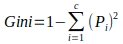

##### Entropy

Entropy is a measure of the randomness in the information being processed. If the sample is completely homogeneous the entropy is zero and if the sample is an equally divided it has entropy of one. A branch with an entropy of zero is a leaf node and A branch with entropy more than zero needs further splitting.

To build a decision tree, we need to calculate two types of entropy – one for root node and two for decision node

- Entropy for 1 attribute is represented as:

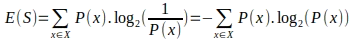

Here, S → Current state, and P(x) → Probability of an event x of state S

- Entropy for 2 attributes:

Here, S – current state, T – selected attribute

##### Information Gain

Information gain or **IG** is a statistical property that measures how well a given attribute separates the training examples according to their target classification. Constructing a decision tree is all about finding an attribute that returns the highest information gain and the smallest entropy.

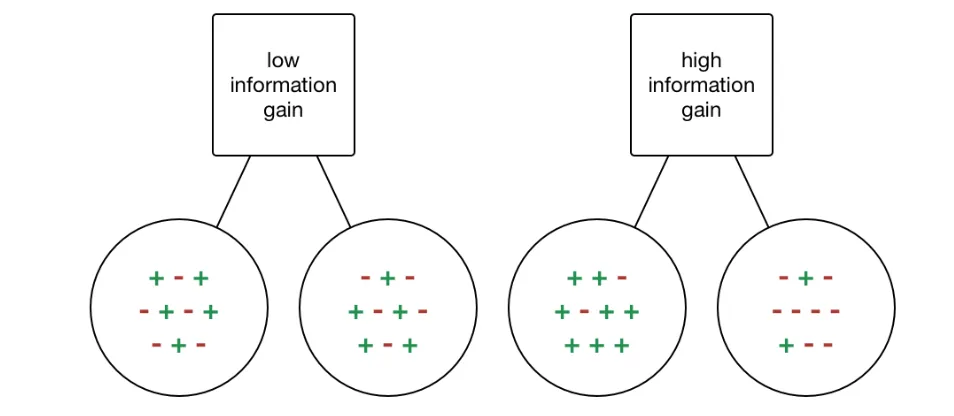

Information gain is a decrease in entropy. It computes the difference between entropy before split and average entropy after split of the datasets based on given attribute values.

Mathematically, IG is represented as:

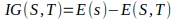

In simple way,

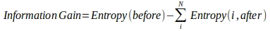

###### Let’s implement in Python

We use scikit-learn’s tree library for Decision Tree classification which use CART algorithm for tree.

Here is the Golf-play data for Decision Tree model which contains four features

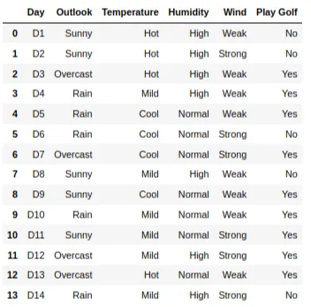

When we train the Decision Tree model with ‘gini’ impurity and maximum depth 2, we get the training accuracy of 0.857

Then, we visualize the model

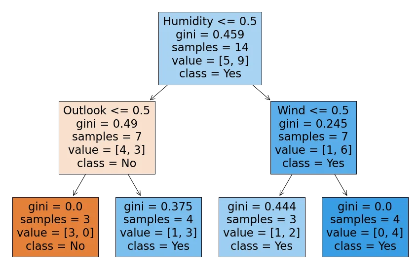

Decision Tree Classifier with ‘entropy’ impurity with max-depth of 2. The accuracy score is 0.857

The visualization model is

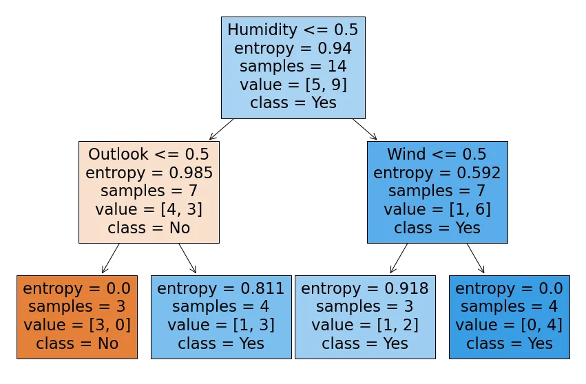

As the model hyper-parameter of max-depth is limited at 2, there is some impurity in leaf of the model. The Model choose greater target variable at these node. The detail is [here](https://github.com/DoublePK/DataScientistProgramAssignments/blob/master/Decision%20Tree%20Classification.ipynb).

## Attribute selection for Classification
The core algorithm for building decision trees in scikit-learn is CART which employs a top-down, **using the feature and threshold that yield the largest information gain at each node.**  The CART algorithm can be used to construct a decision tree for regression by replacing Information Gain with Reduction for Impurity which uses *Mean Squared Error, Absolute Square Error Reduction, etc*.

**Mean Squared Error Impurity**

MSE, also called Variance, calculates the homogeneity of a numerical sample. If the numerical sample is completely homogeneous its variance is zero.

- Mean Squared Error for one attribute:

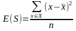

Where, E(S) is variance or MSE of entire set in Current State S , x_bar is mean of the target

- Mean Squared Error for two attribute:

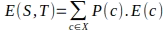

Where, P(c) - Probability of an event c of state S , S – current state, T – selected attribute

##### Impurity Reduction

The reduction is based on the decrease in impurity after a datasets is split on an attribute. Constructing a decision tree is all about finding attribute that returns the highest reduction (i.e., the most homogeneous branches).

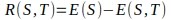

##### Absolute Mean Error Impurity

Absolute Mean Error is also used in CART decision Tree algorithm for homogeneity of data.

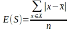

Where, x_bar is median of data. AME impurity in CART training is slower than the MSE criterion. CART algorithm also use ‘**Friedman MAE’** and **‘Poisson’** for impurity check for data.

#### Let’s some implement decision tree regression in Python
We use data how many hours play the game base on weather condition for Decision Tree. Decision Tree Regression object from scikit-learn library for building model.

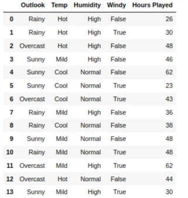

When we build the tree with ‘Variance’ for homogeneity sample data, the training error is 32.55

The model with MAE impurity is illustrated as -

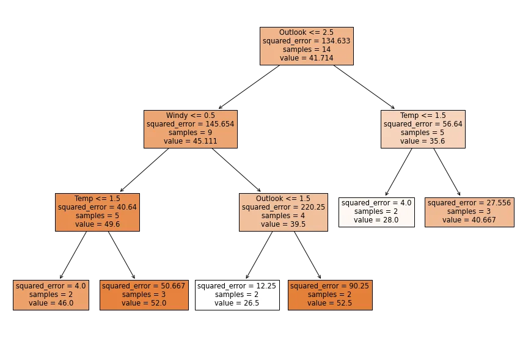

When model is trained with ‘Absolute Mean Error’ impurity, the error of training-set is increase to 37.93

The visualization of the model with MAE impurity -

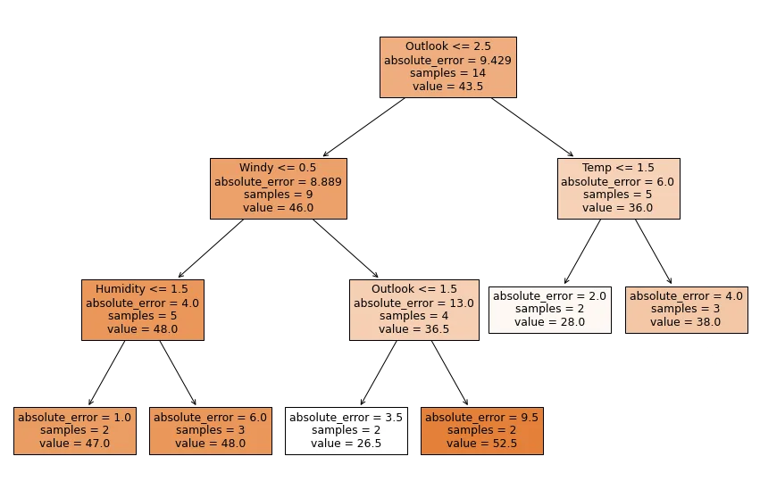

Detail of the code for regression Models can be seen [here.](https://github.com/DoublePK/DataScientistProgramAssignments/blob/master/Decision%20Tree%20Regressor.ipynb)

## How to avoid/counter Over-fitting in Decision Trees?
The common problem with Decision trees, especially having a lot of features, they fit a lot. Sometimes it looks like the tree memorized the training data set. If there is no limit set on a decision tree, it will give you 100% accuracy on the training data set because in the worse case it will end up making 1 leaf for each observation. Thus this affects the accuracy when predicting samples that are new datasets.

Here are two ways to remove over-fitting:

1. Pruning Decision Trees.
2. Random Forest

**Pruning Decision Trees**

In pruning, branches of the tree are trim off, or remove the decision nodes starting from the leaf node such that the overall accuracy is not disturbed. This is done by segregating the actual training set into two sets: training data set, D and validation data set, V. Prepare the decision tree using the segregated training data set, D. Then continue trimming the tree accordingly to optimize the accuracy of the validation data set, V.

**Random Forest**

Random Forest is an example of ensemble learning, in which we combine multiple machine learning algorithms to obtain better predictive performance.

## Advantages of CART

- Simple to understand, interpret, visualize.
- Decision trees *implicitly perform variable screening or feature selection.*
- C**an** ***handle both numerical and categorical data*****.** Can also *handle multi-output problems.*
- Decision trees require relatively *little effort from users for data preparation.*
- *Nonlinear relationships between parameters do not affect tree performance.*

## Disadvantages of CART
- Decision-tree learners *can create over-complex trees* that do not generalize the data well. This is called *overfitting*.
- Decision trees can be unstable because *small variations in the data might result in a completely different tree being generated.* This is called ***variance***, which needs to be *lowered by methods likebagging and boosting*.
- Greedy algorithms cannot guarantee to return the globally optimal decision tree. This can be mitigated by training multiple trees, where the features and samples are randomly sampled with replacement.
- **Decision tree learners create** *biased trees if some classes dominate***. It is therefore recommended to balance the data set prior to fitting with the decision tree.**

## Conclusion
In this article, we have described details about Decision Tree; Structure of the decision Tree and the algorithm to build a Decision, attribute selection in CART algorithm use in scikit-learn library such as Gini impurity, Entropy impurity and information gain for classification, Mean Squared Error impurity, Mean Absolute Error impurity and other for Regression, and advantage and disadvantage for CART. We also some implementation of Classification and Regression tree in Python with visualization.

We would describe the detail about bias and variance for over-fitting problem in later.

References

[1] Decision Trees for Classification: A Machine Learning Algorithm ( [link](https://towardsdatascience.com/decision-trees-in-machine-learning-641b9c4e8052) )

[2] Decision Tree - Classification ( [link](http://www.saedsayad.com/decision_tree.htm) )

[3] Decision Tree - Regression ( [link](http://www.saedsayad.com/decision_tree_reg.htm) )

[4] Decision Tree Algorithm, Explained ( [link](https://www.kdnuggets.com/2020/01/decision-tree-algorithm-explained.html) )

[5] Scikit-learn's Document article 1.10. Decision Trees ( [link](https://scikit-learn.org/stable/modules/tree.html#tips-on-practical-use) )
