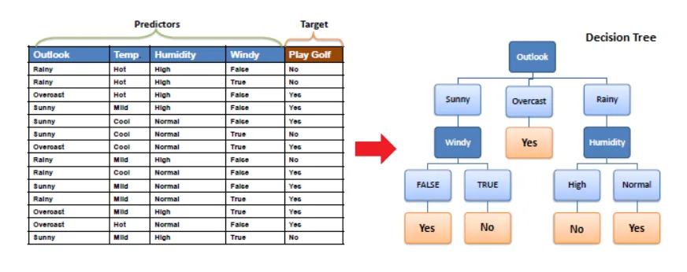
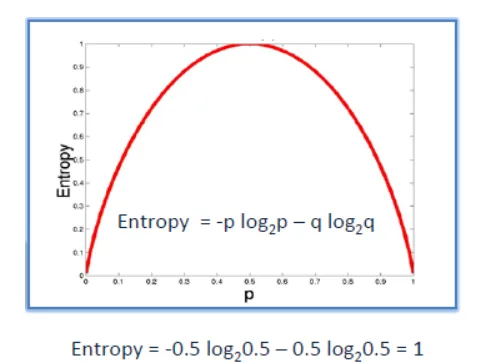

Decision tree is a supervised learning technique that can be used for both classification and regression problems, but it is mostly preferred for solving classification problems. It is a tree classifier, where internal nodes represent features of a dataset, branches represent decision rules, and each leaf node represents the result.

## Why use Decision Trees?
- Decision trees generally mimic human thinking ability when making decisions, so it is easy to understand.
- The logic behind the decision tree can be easily understood as it shows a tree structure.

**How does the Decision Tree algorithm Work?**

**Step 1:** Start the tree with the root node, called S, which contains the complete dataset.

**Step 2:** Find the best attribute in the dataset using the attribute selection metric (ASM).

**Step 3:** Divide the S into subsets that contain possible values for the best attributes.

**Step 4:** Generate the decision tree node, which contains the best attribute.

**Step 5:** Create new decision trees recursively using the dataset subsets created in step -3. Continue this process until a stage is reached where you can no longer order the nodes and call the final node as a leaf node.

**How are Decision Trees used in Classification?**

The basic algorithm (called ID3) for building decision trees uses a top-down and greedy search in the space of possible branches without backtracking.

it uses entropy and information gain to build a decision tree.

**Entropy**

The ID3 algorithm uses entropy to calculate the homogeneity of a sample. If the sample is completely homogeneous, the entropy is zero and if the sample is equally divided, it has an entropy of one.

**Information Gain**

Information gain is based on the decrease in entropy after a dataset is split on an attribute. The construction of a decision tree consists in finding the attribute which returns the highest gain of information (that is to say the most homogeneous branches).

**Conclusion**

In general, decision tree classifiers have good efficiency. However, successful use can be based on available data. Decision tree induction algorithms have been used for classification in several application areas, including medicine, manufacturing and production, monetary analysis, astronomy, and molecular biology. Decision trees are based on several business rule induction systems.
