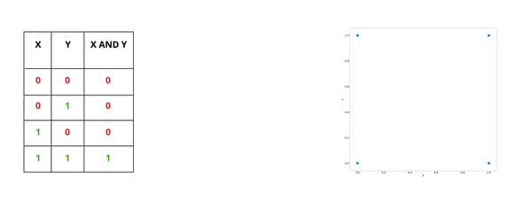
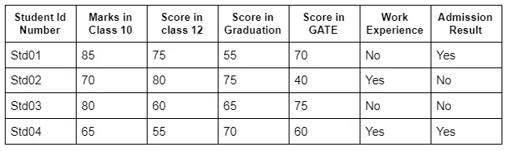
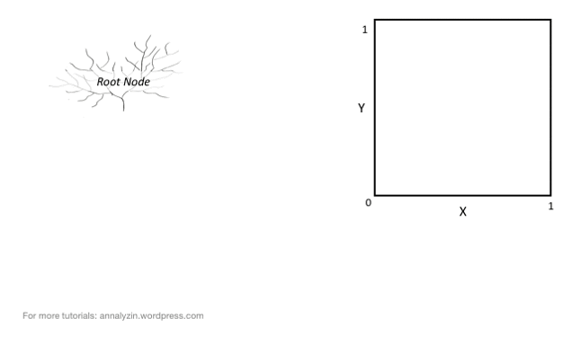
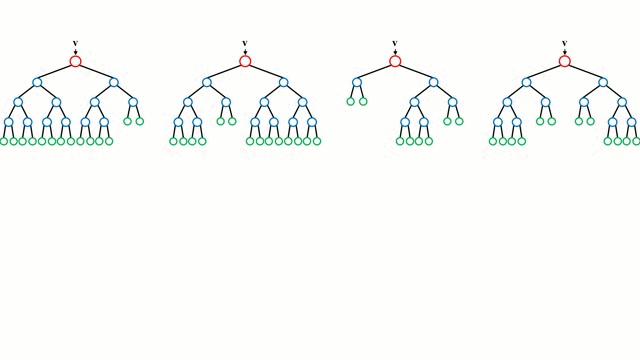
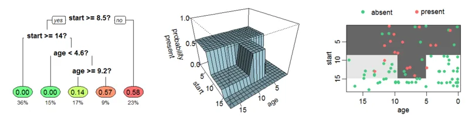
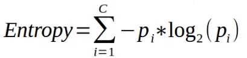
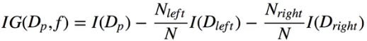
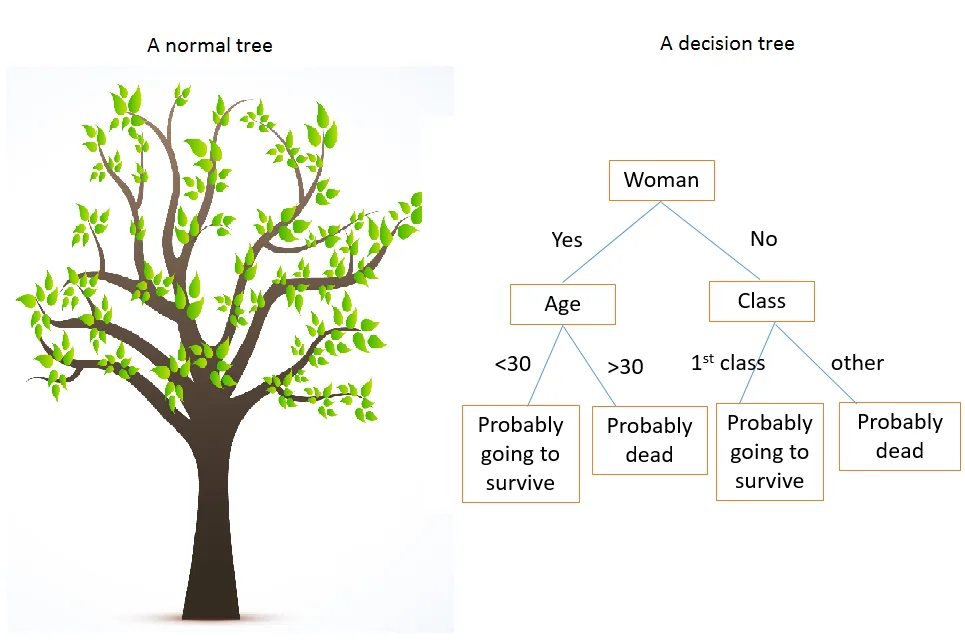

There are various machine learning algorithms that can be put into use for dealing with classification problems. One such algorithm is the Decision Tree algorithm, which apart from classification can also be used for solving regression problems. Though one of the simplest classification algorithms, if its parameters are tuned properly can yield incredibly accurate results.

**How are Decisions Made in a Decision Tree?**

The Decision tree algorithm is a simple yet efficient supervised learning algorithm wherein the data points are continuously split according to certain parameters and/or the problem that the algorithm is trying to solve. Decision trees are also popularly referred to as CART (which stands for Classification and Regression Trees).

Every decision tree includes a **root node**, some **branches**, and **leaf** nodes. The internal nodes present within the tree describe the various test cases. Decision Trees can be used to solve both classification and regression problems. The algorithm can be thought of as a graphical tree-like structure that uses various tuned parameters to predict the results. The decision trees apply a **top-down approach** to the dataset that is fed during training.

To understand how the algorithm actually works, Assume that a predictive model needs to be developed that can predict if a student’s application for securing admission into a particular course gets accepted or not. Consider the following set of data that is provided to any Decision Tree model.

An application from a particular student will be accepted for the course at the university only if it satisfies the conditions that are described below:

Score in the GATE examination shall be equal to or more than 60.

Marks in Graduation, Class 10, and Class 12 shall be more than 60.

In this case, though there may be certain exceptions to the aforementioned conditions. In such conditions, the application will be put on a waiting list.

If the applicant has less than the threshold score in GATE/Graduation but has work experience then the application shall be put on the list.

If the applicant has a score of more than 75 in Class 12 but less than the min required score in class 10 then their application shall be on the list.

The problem considered in the above example can be considered in the graphical form of a decision tree or a flow chart. A tree would satisfy all the possible situations that are provided in the problem. The decision tree algorithm works like a bunch of nested if-else statements wherein successive conditions are checked unless the model reaches a conclusion.

The decision nodes or simply nodes of the tree are the questions that are presented by the tree after passing each node(starting from the root node). A branch or sub-tree is a subsection of the entire tree. Each edge of the tree corresponds to the outcome of the question and the outcome is represented by a leaf node or a terminal node which represents the class distribution.

**How are Decision Trees used in Classification?**

The Decision Tree algorithm uses a data structure called a tree to predict the outcome of a particular problem. Since the decision tree follows a supervised approach, the algorithm is fed with a collection of pre-processed data. This data is used to train the algorithm.

Decision trees follow a top-down approach meaning that the root node of the tree is always at the top of the structure while the outcomes are represented by the tree leaves. Decision trees are built using a heuristic called recursive partitioning (commonly referred to as Divide and Conquer). Each node following the root node is split into several nodes.

The key idea is to use a decision tree to partition the data space into dense regions and sparse regions. The splitting of a binary tree can either be binary or multiway. The algorithm keeps on splitting the tree until the data is sufficiently homogeneous. At the end of the training, a decision tree is returned that can be used to make optimal categorized predictions.

An important term in the development of this algorithm is Entropy. It can be considered as the measure of uncertainty of a given dataset and its value describes the degree of randomness of a particular node. Such a situation occurs when the margin of difference for a result is very low and the model thereby doesn’t have confidence in the accuracy of the prediction.

The higher the entropy, the higher will be the randomness in the dataset. While building a decision tree, a lower entropy shall be preferred The expression for calculating the entropy of a decision tree is as described:

Another metric used for a similar purpose is the Gini Index. It uses the Gini method to create split points. Information Gain is the metric that is generally used for measuring the reduction of uncertainty in the dataset. The information gained in decision trees is generally described by the formulae:

This metric can further be used to determine the root node of the decision tree and the number of splits that are to be made. The root node of a decision tree is often referred to as the decision node or the master node.

