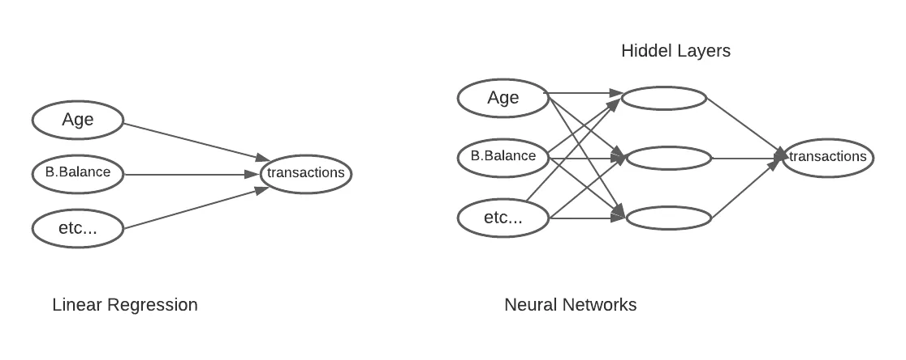
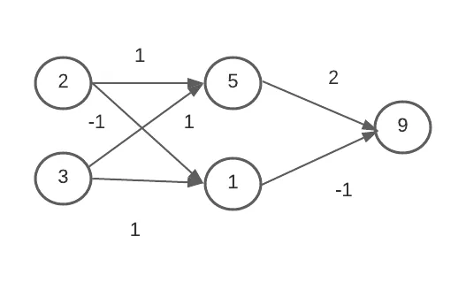
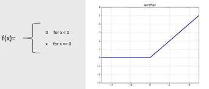

**What is deep learning?**
Deep learning is a type of machine learning and artificial intelligence (AI) that imitates the way humans gain certain types of knowledge. Deep learning is an important element of data science, which includes statistics and predictive modeling.

**Deep Learning v Machine Learning**
Machine learning means computers learn from data using algorithms to perform a task without being explicitly programmed. Deep learning uses a complex structure of algorithms modeled on the human brain. This enables the processing of unstructured data such as documents, images, and text.

**What is Neural Network**
A neural network is a method in artificial intelligence that teaches computers to process data in a way that is inspired by the human brain. It is a type of machine learning process, called deep learning, that uses interconnected nodes or neurons in a layered structure that resembles the human brain.

**Explained Clearly**
Imagine we work for a bank and want to predict how many transactions each customer will make next year. We'll get into deep learning but for the comparison of how Linear Regression works in this problem. Features are Age, bank balance, etc. Then it adds the effect of age, bank balance, etc. Here Linear Regression can't identify the interaction effect between these parts, and how they affect banking activity. But Neural network can identify the interaction effect, and it is more powerful to predict the banking system.



## Forward propagation in Neural Network
Forward propagation means we are moving in only one direction, from input to output, in a neural network. Think of it as moving across time, where we have no option but to forge ahead, and just hope our mistakes don't come back to haunt us.



Here 2 & 3 are input. 5 & 1 are hidden layers and 9 is output. Each Line has a weight(like 1, -1, 2) that indicates how strongly the input affects the hidden node that the lines end at. The weights are the parameters we train or change when we fit a neural network. From input, one time two and one times three makes 5(hidden layer). Also minus one time, two, and 1 time three makes 1(hidden layer). Lastly two times five and minus one time one makes 9(output). This is the procedure of forward propagation.

## Forward propagation code in Python
```python
import numpy as np
input_data = np.array([2, 3])
weights = {'node_0': np.array([1, 1]),'node_1': np.array([-1,
      1]),'output': np.array([2, -1])}
node_0_value = (input_data * weights['node_0']).sum()
node_1_value = (input_data * weights['node_1']).sum()
```

```python
hidden_layer_values = np.array([node_0_value, node_1_value])
print(hidden_layer_values)
```

```python
[5 1]
```

```python
output = (hidden_layer_values * weights['output']).sum()
print(output)
```

```python
9
```

## Activation Function
#### The Rectified Linear Activation Function

As Dan explained to you in the video, an "activation function" is a function applied at each node. It converts the node's input into some output.

The rectified linear activation function (called ReLU) has been shown to lead to very high-performance networks. This function takes a single number as an input, returning 0 if the input is negative, and the input if the input is positive.

Here are some examples:

- relu(3) = 3
- relu(-3) = 0



```python
# Relu activation fuction
def relu(input):
    '''Define your relu activation function here'''
    # Calculate the value for the output of the relu function: output
    output = max(0, input)
    # Return the value just calculated
    return(output)
```

```python
output = relu(-3)
output
```

```python
0
```

```python
output = relu(3)
output
```

```python
3
```

[GitHub Link](https://github.com/abubinfahd/Data-Insight/blob/main/Assignments/Deep_Learning_Introduction_with_Python.ipynb)
