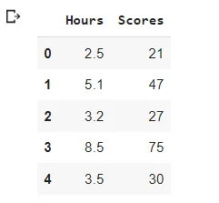
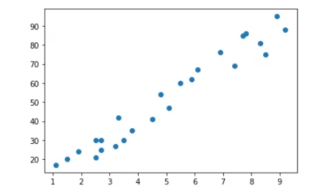

***"A little learning is a dangerous thing: Drink deep, or taste not the Pierian spring"***

***- Alexander Pop***

Deep Learning does a wonderful job in pattern recognition, especially in the context of images, speech, language…etc, it help us do some predictions, classification and clustering. But, before diving in into it, I find it crucial to understand what’s behind it: ***The Tensorflow Framework.***

In November 15, Google released Tensorflow, which has been used in most of its products: Google Search, spam detection, speech recognition, Google Now…etc. Explaining the basics of Tensorflow is the aim of this blog.

**- First, some definitions are a MUST!**

**Tensorflow:** Is an open source library for graph based numerical computations, developed by Google’s brain team. Tensorflow allows model parallelism and data parallelism, it provides multiple APIs. The lowest level API—TensorFlow Core—provides you with complete programming control.

**Tensors :** The basic unit of data in TensorFlow. A tensor is a mathematical object and a generalization of scalars, vectors, and matrices. A tensor can be represented as a multidimensional arrays. Here are some examples of tensors:

• 5: This is a rank 0 tensor; this is a scalar with shape [ ].

• [2.,5., 3.]: This is a rank 1 tensor; this is a vector with shape [3].

• [[1., 2., 7.], [3., 5., 4.]]: This is a rank 2 tensor; it is a matrix with shape [2, 3].

• [[[1., 2., 3.]], [[7., 8., 9.]]]: This is a rank 3 tensor with shape [2, 1, 3].

**- How Tensorflow works?**

Its programs are usually structured into a construction phase where the nodes(operations) and edges(tensors) of the graph are assembled, and an execution phase where a session is used to execute operations in the graph. Here a question pops up: ***What kind of operations are we talking about here?*** A simple one is a constant that takes no input but passes outputs to other operations that do computation, while a complex one is multiplication (or addition or subtraction that takes two matrices as input and passes a matrix as output). The TensorFlow library has a default graph to which operation constructors add nodes.

A computational graph is a series of TensorFlow operations arranged into a graph of nodes. To actually evaluate the nodes, you must run the computational graph within a session. A session encapsulates the control and state of the TensorFlow runtime. But, TF 2.0 supports eager execution which means you don't have to explicitly create a session and run the code in it.

**-Constants and Variables :** TensorFlow programs use a tensor data structure to represent all data— only tensors are passed between operations in the computation graph. You can think of a TensorFlow tensor as an n-dimensional array or list. A tensor has a static type, a rank, and a shape. Here the graph produces a constant result. Variables maintain state across executions of the graph.

A constant is the simplest category of tensors, it’s not trainable and can have any dimension:

```python
#2*3 constant
x = tf.constant(3 , shape=[2,3])
print(x)
```

```python
tf.Tensor( [[3 3 3]
            [3 3 3]], shape=(2, 3), dtype=int32)
```

The variable values can change over computations. The value of a variable is shared, persistent and modifiable.

```python
y = tf.Variable ([1,2,3,4,5,6], dtype=tf.float32)
y
```

```python
<tf.Variable 'Variable:0' shape=(6,) dtype=float32, numpy=array([1., 2., 3., 4., 5., 6.], dtype=float32)>
```

**-Basic Operations:**

***add()****:* performs element-wise addition with 2 tensors, it requires that both tensors have the same shape. It is overloaded, which mean you can use (+) instead.

```python
#define a 0dimension tesnsor
a0 = tf.constant([1])
b0 = tf.constant([2])

#define a 1 dimension tensor
a1 = tf.constant([1,2])
b1 = tf.constant([3,4])

#define a 2 dimension tensor
a2 = tf.constant([[1,2],[3,4]])
b2 = tf.constant([[5,6],[7,8]])
```

Remember when you first learned math? You learned that 1 + 1 = 2 and 2 + 3 = 5 and so on. Well, this straight addition of your numbers is referred to as **scalar addition**. A scalar value is simply a value that only has one component to it, the magnitude.

```python
#scalar addition
c0 = tf.add(a0,b0)
c0
```

```python
<tf.Tensor: shape=(1,), dtype=int32, numpy=array([3], dtype=int32)>
```

the result of the addition is in the numpy array = 3.

A variety of mathematical operations can be performed with and upon vectors. One such operation is the addition of vectors. Two vectors can be added together to determine the result (or resultant).

```python
#vector addition
c1 = tf.add(a1,b1)
c1
```

```python
<tf.Tensor: shape=(2,), dtype=int32, numpy=array([4, 6], dtype=int32)>
```

the result is a tensor vector [4,6].

In [mathematics](https://en.wikipedia.org/wiki/Mathematics), **matrix addition** is the operation of adding two [matrices](https://en.wikipedia.org/wiki/Matrix_(mathematics)) by adding the corresponding entries together.

```python
#matrix addition
c2 = tf.add(a2,b2)
c2
```

```python
<tf.Tensor: shape=(2, 2), dtype=int32, numpy= array([[ 6,  8],        [10, 12]], dtype=int32)>
```

***multiply()***: element wise multiplication, requires same shaped tensors.

Suppose we have multiple fixed Tensors (a tensor of only values 0 or 1) with different shapes :

```python
#matrix multiplicatio
a0 = tf.ones(1)
a31 = tf.ones([4,5])
a34 = tf.ones([2,4])
a43 = tf.ones([4,2])
```

we can multiply every tensor with itself:

```python
m1 = tf.multiply(a0,a0)
m1
```

```python
<tf.Tensor: shape=(1,), dtype=float32, numpy=array([1.], dtype=float32)>
```

***matmul():*** matrix multiplication: matmul(a,b) = a\*b where numbers of columns in a requires the same number of rows in b.

we can do a matrix multiplication for a43 and and a34

```python
m2 = tf.matmul(a43,a34)
m2
```

```python
<tf.Tensor: shape=(4, 4), dtype=float32, numpy= array
([[2., 2., 2., 2.],
 [2., 2., 2., 2.],
 [2., 2., 2., 2.],
 [2., 2., 2., 2.]], dtype=float32)>
```

the result is a tensor matrix of values of 2 as the tensors that were multiplied were fixed tensors with only values of 1.

**-Advanced Operations:**

***random():*** populates tensors with entries drown from a probability distribution.

***gradient():*** compute the slope of a function at a point. In many machine learning problems you are going to need to find an optimum of a function(min or max), we can do this using this function.

Let’s say that you are given a loss function, y=x\*2, which you want to minimize. You can do this by computing the slope using the GradientTape() operation at different values of x. If the slope is positive, you can decrease the loss by lowering x. If it is negative, you can decrease it by increasing x. This is how gradient descent works.

```python
#gradient
def compute_gradient(x0):
    # Define x as a variable with an initial value of x0
  x = tf.Variable(x0)
  with tf.GradientTape() as tape:
    tape.watch(x)
    # Define y using the multiply operation
    y = x*x
    # Return the gradient of y with respect to x
  return tape.gradient(y, x).numpy()

# Compute and print gradients at x = -1, 1, and 0
print(compute_gradient(-1.0))
print(compute_gradient(1.0))
print(compute_gradient(0.0))
```

```python
-2.0
 2.0
 0.0
```

***reshape():***  reshapes a tensor. Let’s considerate an operation that is particularly useful for image classification: reshaping. Images have a natural representation of a matrix with values between 0 – 255, while some algorithms exploit this shape, others requires you to reshape matrices into vectors before using them as inputs.

Create a random gray scale image by drawing numbers from the set of integers between 0 and 255:

```python
gray = tf.random.uniform([2,2], maxval=255, dtype='int32')
gray
```

```python
<tf.Tensor: shape=(2, 2), dtype=int32,
 numpy= array([[ 51,  55],
               [ 50, 120]], dtype=int32)>
```

```python
gray = tf.reshape(gray,[2*2,1])
gray
```

```python
<tf.Tensor: shape=(4, 1), dtype=int32,
numpy= array([[ 51],
              [ 55],
              [ 50],
              [120]], dtype=int32)>
```

the difference of shapes is the result of the reshape ().

For color images, we will generate 3 such matrices to form a 2 by 2 by 3 tensors using random():

```python
color = tf.random.uniform([2,2,3], maxval=255, dtype='int32')
color
```

```python
<tf.Tensor: shape=(2, 2, 3), dtype=int32,
numpy= array([[
               [122, 131, 175],
               [194, 160, 130]],

               [[166,  35, 103],
               [ 69,  68, 204]
               ]], dtype=int32)>
```

```python
color = tf.reshape(color, [2*2,3])
color
```

```python
<tf.Tensor: shape=(4, 3), dtype=int32, numpy=
array([[122, 131, 175],
       [194, 160, 130],
       [166,  35, 103],
       [ 69,  68, 204]], dtype=int32)>
```

**-Loss Function:** The loss function (cost function) is to be minimized so as to get the best values for each parameter of the model. For example, you need to get the best value of the weight (slope) and bias (y-intercept) so as to explain the target (y) in terms of the predictor (X). The method is to achieve the best value of the slope, and y-intercept is to minimize the cost function.

Common loss functions in Tensorflow are:

MSE: strongly penalized outliers with a high (gradient) sensitivity near minimum.

MAE: scales linearly with size of errors with low (gradient) sensitivity near minimum.

Huber Error: similar to MSE near minimum, Similar to MAE away from minimum.

Those are accessible via: tf.keras.losses.

Lets train a linear regression model by selecting parameters values that minimize the loss function:

There's this dataset that contains the scores students have based on their hours of studies:

```python
df=pd.read_csv('https://bit.ly/w-data')
df.head()
```



If we explore the relationship between these 2 features with a scatterplot we can see clearly that it's linear: Higher scores ares made with higher hours of study.

```python
plt.scatter(x='Hours',y='Scores', data=df)
plt.show()
```



Using a loss function, Let's find the perfect slope and intercept for our regression line that will help us achieve good prediction of the score based on the hours of study:

first we split our df into 2 dfs: one for our features(hours) and one for our targets(scores):

```python
hours = tf.cast(df['Hours'], tf.float32)
scores = tf.cast(df['Scores'], tf.float32)
hours
```

```python
<tf.Tensor: shape=(25,), dtype=float32, numpy= array([2.5, 5.1, 3.2, 8.5, 3.5, 1.5, 9.2, 5.5, 8.3, 2.7, 7.7, 5.9, 4.5,        3.3, 1.1, 8.9, 2.5, 1.9, 6.1, 7.4, 2.7, 4.8, 3.8, 6.9, 7.8],       dtype=float32)>
```

The idea i that we create 2 functions: one for creating our linear regression model given an intercept and slope provided by us and the other is the loss function that will make the predictions and caluclates the mean squared error:

```python
# Define a linear regression model
def linear_regression(intercept, slope, features = hours):
  return intercept+features*slope

# Set loss_function() to take the variables as arguments
def loss_function(intercept, slope, features = hours, targets = scores):
  # Set the predicted values
  predictions = linear_regression(intercept, slope, features)

    # Return the mean squared error loss
  return tf.keras.losses.mse(scores, predictions)/100

# Compute the loss for different slope and intercept values
print(loss_function(0.5,8).numpy())
print(loss_function(1.2,10.06).numpy())
```

```python
1.6664679
 0.29396924
```

We can see that the error is better for the second values of intercept and slope.

Now, let's minimize our intercept and slope so we find the best values that gives better predictions with less error:

**- Optimizers:** TensorFlow, and every other deep learning framework, provides optimizers that slowly change each parameter in order to minimize the loss function.

We start by creating 2 variables tensors with values close to the second values we tried above for the loss function, then passed them to our funtions we created above:

```python
intercept =tf.Variable([1.], np.float32)
slope = tf.Variable([10.], np.float32)
```

the, we initialize an optimizer with a learning rate of 0.5:

```python
opt = tf.keras.optimizers.Adam(0.5)
```

finally we pass the loss function and our intercept and slope to the minimize method of the optimizer and we print the values of the loss function for each 10th iteration:

```python
for i in range(100):
  opt.minimize(lambda: loss_function(intercept,slope), var_list=[intercept,slope])
  if i % 10 == 0:
    print(loss_function(intercept,slope))
```

```python
tf.Tensor(39.09423, shape=(), dtype=float32) tf.Tensor(30.12893, shape=(), dtype=float32) tf.Tensor(29.732178, shape=(), dtype=float32) tf.Tensor(29.052313, shape=(), dtype=float32) tf.Tensor(28.905817, shape=(), dtype=float32) tf.Tensor(28.888535, shape=(), dtype=float32) tf.Tensor(28.886223, shape=(), dtype=float32) tf.Tensor(28.886658, shape=(), dtype=float32) tf.Tensor(28.884825, shape=(), dtype=float32) tf.Tensor(28.882883, shape=(), dtype=float32)
```

We can see clearly that the error is minimized throughout each iteration. To find the linear model which enable us to predict the score given hours of study:

```python
print(intercept.numpy(), slope.numpy())
```

```python
[2.4898534] [9.774894]
```

**- End Notes:** from creating the model to mimizing the loss function using optimizers, that's what's deep learning is about. Using neural networks, and throughout additional hidden layers, each algorithm in the hierarchy applies a nonlinear transformation to its input using activation functions and uses what it learns to create a statistical model as output. [Iterations](https://www.techtarget.com/searchsoftwarequality/definition/iterative) continue until the output has reached an acceptable level of accuracy using optimizers.The number of [processing](https://www.techtarget.com/whatis/definition/process) layers through which data must pass is what inspired the label *deep*. We'll have a whole article about deep learning next time but for now: Have Fun Learning.

For Further Knowledge:

Book: Deep Learning With Applications using Python: Navin Kumar Manaswi

You can find the code [Here](https://github.com/asmakrl/datacampstd/blob/main/Deep%20Learning/TensorFlow.ipynb).
