According to Mayo Clinic, Parkinson's disease is a progressive nervous system disorder that affects movement. Symptoms start gradually, sometimes with a barely noticeable tremor in just one hand. Tremors are typical, but the disorder also causes stiffness or slowing of movement. In the early stages of Parkinson's disease, your face may show little or no expression. Your arms may not swing when you walk. Your speech may become soft or slurred. Parkinson's disease symptoms worsen as your condition progresses over time.

The symptoms of Parkinson's disease may include slowed movements, tremors, rigid muscles, impaired posture, and speech changes. This article will focus on how speech changes can be early detection of Parkinson's disease.

This dataset is composed of a range of biomedical voice measurements from 31 people, 23 with Parkinson's disease (PD). Each column in the table is a particular voice measure, and each row corresponds to one of 195 voice recordings from these individuals ("name" column).

The main aim of the data is to classify patients according to the "**status**" column which is set to 0 for healthy and 1 for PD.

The data is in ASCII CSV format. The rows of the CSV file contain an

instance corresponding to one voice recording. There are around six

recordings per patient,

- The measure of the fundamental frequency.
- The measure of variation in fundamental frequency
- The measure of noise to tonal components in the voice,
- The nonlinear dynamic complexity measure.
- The measure of the signal fractal scaling exponent
- The nonlinear measures of fundamental frequency variation.

From the Parkinsons information [data source](https://archive.ics.uci.edu/ml/machine-learning-databases/parkinsons/), we know the columns of the dataset correspond to the following voice measure recordings

Matrix column entries (attributes):

name - ASCII subject name and recording number

**1. MDVP:Fo(Hz)** - Average vocal fundamental frequency

**MDVP:Fhi(Hz)** - Maximum vocal fundamental frequency

**MDVP:Flo(Hz)** - Minimum vocal fundamental frequency

**2. MDVP:Jitter(%),MDVP:Jitter(Abs), MDVP:RAP, MDVP:PPQ, Jitter:DDP** - Several measures of variation in fundamental frequency

**3.MDVP:Shimmer,MDVP:Shimmer(dB),Shimmer:APQ3,Shimmer:APQ5,MDVP:APQ,Shimmer:DDA** - Several measures of variation in amplitude

**4. NHR, HNR** - Two measures of the ratio of noise to tonal components in the voice

**5. Status** - Health status of the subject (one) - Parkinson's, (zero) - healthy

**4. RPDE,D2** - Two nonlinear dynamical complexity measures

**5. DFA** - Signal fractal scaling exponent

**6. spread1,spread2,PPE** - Three nonlinear measures of fundamental frequency variation

Importing the necessary libraries

```python
# import the necessary libraries
import pandas as pd
import matplotlib.pyplot as plt
import seaborn as sns
import numpy as np
from sklearn.preprocessing import StandardScaler
from sklearn.model_selection import train_test_split
from xgboost import XGBClassifier
from sklearn.metrics import accuracy_score
```

**Read the data as a CSV file**

Accessing the five rows of the data, the data has a name column that shows the name codes of patients, a status column, and 22 other columns that represents the various voice measurements. The data has 195 rows and 24 columns.

```python
data= pd.read_csv('parkinsons.data')
print('The data has {} rows and {} columns'.format(str(data.shape[0]),str(data.shape[1])))
data.head()
```

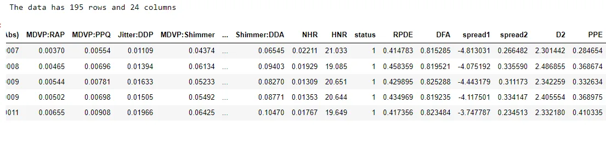

**Exploratory Data Analysis**

The information from the data shows the voice recording measurement columns data types are float, the status column is an integer and the name column is an object. The data has no missing values.

```python
data.info()
```

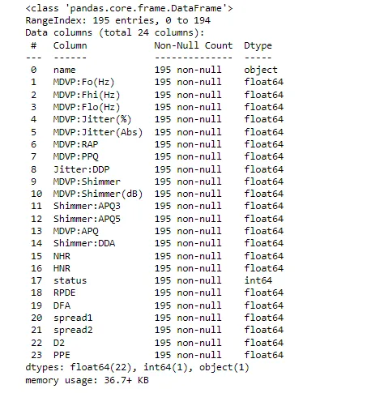

The statistical summary of the dataset shows for example, **MDVP:Fo(Hz)** has a mean of 154.2, the standard deviation is 41.3 and the maximum value is 260.1

```python
data.describe()
```

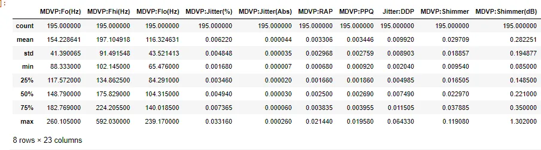

**Univariate Analysis**

The status column shows there are 48 healthy patients and 147 PD patients.

```python
# status column value counts
print(data.status.value_counts())
sns.countplot(x='status',data=data)
plt.title('The Count of values of the Status Column')
plt.show()
```

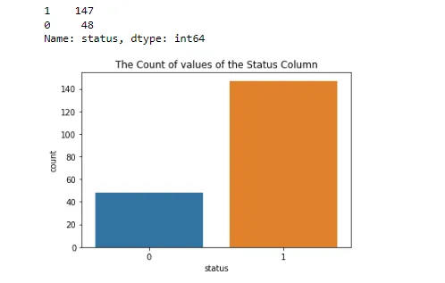

**Distribution of numeric columns**

Displaying the distribution of all the various measurements of voice columns. From the visualization, we can deduce that most of the columns are right-skewed. We can measure the skewness of the distribution precisely. The HNR column is the highest among the left-skewed of -0.5 and NHR is highly skewed to the right by 4.2.

```python
# distribution of feature variables
for n, col in enumerate(data.columns):
    if (data[col].dtype.name == 'float64'):
        sns.displot(data[col],kde=True)
        plt.title("This is the Distribution of {}.
        \n".format(col))
        plt.show()
```

The rest of the output can be found in my github repository.

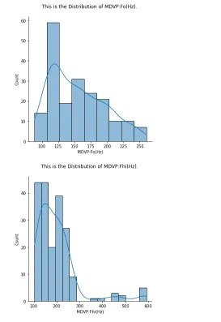

```python
data.skew()
```

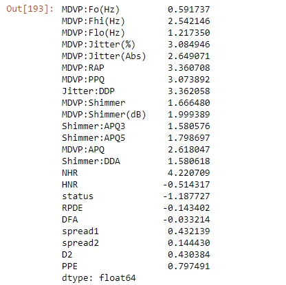

**Correlation Between the numeric columns**

The higher the correlation between two columns shows how closely related they are. The heatmap() function of the Seaborn library visualizes the correlation matrix of data for feature selection. Each data value represents a color. The color of the matrix is dependent on the value. The lighter color indicates that the correlation is low and the darker color is for high correlation.

```python
fig,ax=plt.subplots(figsize=(25,11))
sns.heatmap(data.corr(),annot=True)
plt.title("The Heatmap of correlation of the columns of the dataset")
plt.show()
```

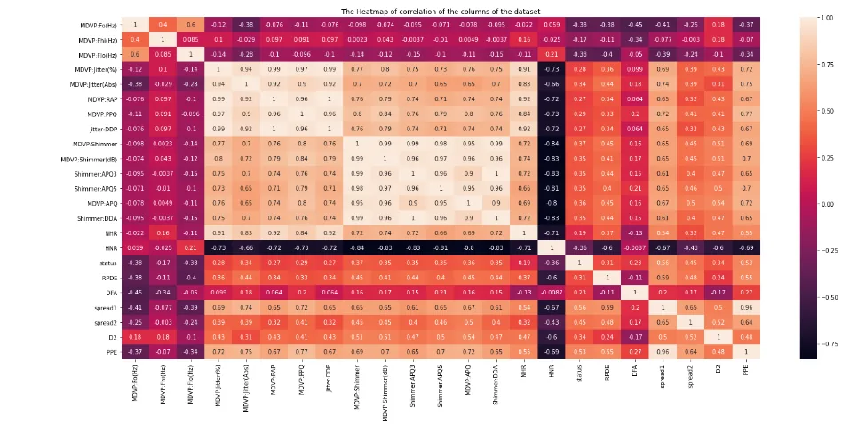

**Removing Highly Correlated Features Before training Our model**

Highly correlated features bring the same information to the model. Since two highly correlated features mean one is closely associated with the other, having all two features will cause a significant problem when fitting your model. Data having non-correlated features have many benefits. Such as:

1. Learning of Algorithm will be faster

2. Interpretability will be high

3. Bias will be less

Therefore we need to remove features that have a high correlation with one another. We set a threshold for high correlation at 0.95. Then filter out the columns with correlations above the threshold. I picked up the code for filtering out highly correlated features on [Stack Overflow](https://stackoverflow.com/questions/29294983/how-to-calculate-correlation-between-all-columns-and-remove-highly-correlated-on?noredirect=1&lq=1).

Before that, we split our dataset into labels and features. The labels are the status column and the features are the various voice recording measurement.

```python
labels= data["status"]
features= data.drop(["name", "status"], axis=1)
```

```python
# Get correlation matrix
corr_matrix = features.corr().abs()

# select upper traingle of correlation matrix
upper = corr_matrix.where(np.triu(np.ones(corr_matrix.shape), k=1).astype(bool))
# Find features with correlation greater than 0.95
to_drop = [column for column in upper.columns if any(upper[column] > 0.95)]

# Drop features
features.drop(to_drop, axis=1, inplace=True)
features
```

This results in a dataframe with 13 features instead of the original 22

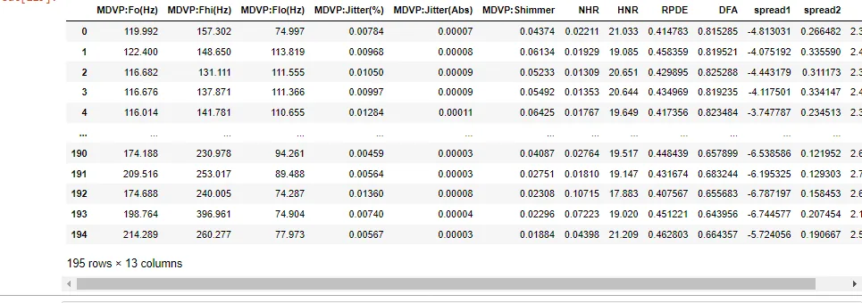

Using this information about this data, we can highlight some questions such as:

1. The maximum vocal fundamental frequency of healthy patients and PD patients.
2. The ratio of noise to tonal components in the voice of healthy patients and PD patients.
3. The measure of variation in amplitude in healthy patients and PD patients

1. **The maximum vocal fundamental frequency of healthy patients and PD patients.**

Plotting the values of maximum vocal fundamental frequency against the individual patients which is the index. This shows most of the data points lying within 100 to 300 for both healthy and PD patients.

```python
sns.relplot(x= data.index, y='MDVP:Fhi(Hz)', hue='status', col='status',data=data)
plt.title('Maximum vocal fundamental frequency of healthy patients and PD patients')
plt.show()
```

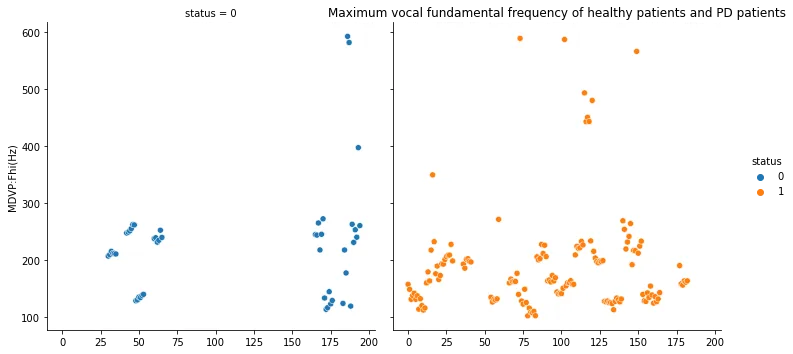

2. **The ratio of noise to tonal components in the voice of healthy patients and PD patients.**

Using the NHR ratio to tonal components measure, we notice that most of the data points for both healthy and PD patients range from 0 to 0.05

```python
sns.relplot(x= data.index, y='NHR', hue='status', col='status',data=data)
plt.title('The ratio of noise to tonal components in the voice of healthy patients and PD patients.')
plt.show()
```

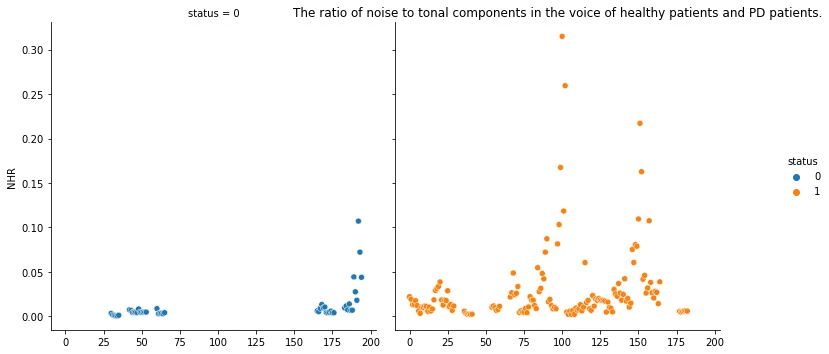

3. **Measure of variation in amplitude in healthy patients and PD patients**

The diagram shows the variation in amplitude of healthy patients ranges from 0.01 to 0.03 and the PD patients range from 0.01 to 0.06.

```python
sns.relplot(x= data.index, y='MDVP:Shimmer', hue='status', col='status',data=data)
plt.title(' The measure of variation in amplitude in healthy patients and PD patients')
plt.show()
```

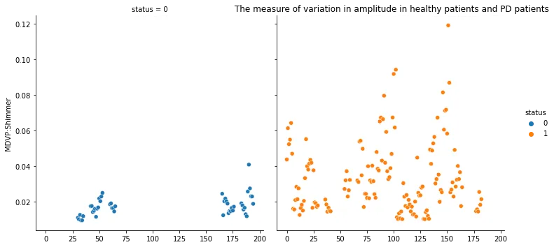

**Splitting and Preparing data for modeling**

Since we have categorized our data into labels and features above, we instantiate the Standard Scaler and fit and transform our features dataset.

```python
scaler=  StandardScaler()
X= scaler.fit_transform(features)
```

Split the scaled features and labels into 80% training and 20% testing dataset.

```python
X_train,X_test,y_train,y_test= train_test_split(X,labels,test_size=0.2,random_state=111)
```

Using the XGBoost Classifier from the xgboost model, we fit our training data.

```python
model = XGBClassifier()
model.fit(X_train,y_train)
```

**Model Prediction and Evaluation**

Perform prediction using the model by testing it on new data (X_test data).

```python
y_pred = model.predict(X_test)
```

Using accuracy score metrics from Sklearn to test the accuracy of our model. The accuracy of our model is 97%

```python
accuracy = accuracy_score(y_test, y_pred)
accuracy
```

```python
0.9743589743589743
```

References

'Exploiting Nonlinear Recurrence and Fractal Scaling Properties for Voice Disorder Detection',

Little MA, McSharry PE, Roberts SJ, Costello DAE, Moroz IM.

BioMedical Engineering OnLine 2007, 6:23 (26 June 2007)

[python - How to calculate correlation between all columns and remove highly correlated ones using pandas? - Stack Overflow](https://stackoverflow.com/questions/29294983/how-to-calculate-correlation-between-all-columns-and-remove-highly-correlated-on?noredirect=1&lq=1)

[Parkinson's disease - Symptoms and causes - Mayo Clinic](https://www.mayoclinic.org/diseases-conditions/parkinsons-disease/symptoms-causes/syc-20376055)

This is a DATA INSIGHT Assignment.

The code in this article can be found on [my Github Repository](https://github.com/Storerun/parkinsons_voice_detection/blob/main/parkinsons_voice_detection.ipynb)

Follow me on [LinkedIn](https://www.linkedin.com/in/benjamin-owusu-a8a676218/)

Photo by [Milad Fakurian](https://unsplash.com/@fakurian?utm_source=unsplash&utm_medium=referral&utm_content=creditCopyText) on [Unsplash](https://unsplash.com/s/photos/neurons?utm_source=unsplash&utm_medium=referral&utm_content=creditCopyText)
