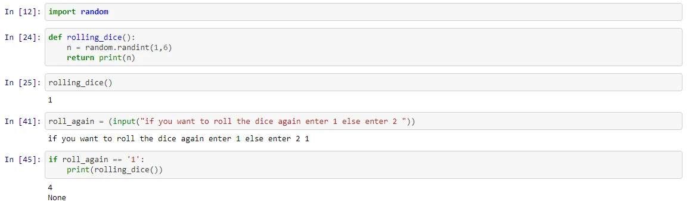

As the name of the program suggests, we will be imitating a rolling dice, will generate a random number each dice the program runs, and the users can use the dice repeatedly for as long as he wants. When the user rolls the dice, the program will generate a random number between 1 and 6 (as on a standard dice).The number will then be displayed to the user. It will also ask users if they would like to roll the dice again.

import random '''importing random module to generate random numbers''

def rolling_dice(): '''defining rolling_dice function to generate random number between and 6 and return the generated number'''

n = random.randint(1,6)

return print(n)

roll_again = (input("if you want to roll the dice again enter 1 else enter 2 "))

''' ask the user if he wants to roll the dice again '''

if roll_again == '1':

print(rolling_dice())

''' if the user answear yes so the dice is rolled again "'

