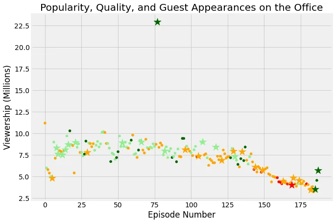

The Office is an American Mockumentary sitcom television series that depicts the everyday lives of office employees in the Scranton, Pennsylvania, branch of the fictional Dunder Mifflin Paper Company.

This article focuses on investigating whether or not the introduction of guest stars into the episodes affect the viewership of each episode.

The dataset used in this analysis can be found from [Kaggle](https://www.kaggle.com/nehaprabhavalkar/the-office-dataset). The approach taken to do the analysis is by trying to understand the relationship between episodes with guest stars and the viewership number as compared to the otherwise episodes.

Although the dataset has more columns, lets describe only those we will use in this project.

```python
episode_number  : Episode number
viewership_mil  : Viewership in millions
guest_stars     : A column containing the list of guest stars
has_guests      : A True/False value indicating whether the episode has guest stars.
scaled_ratings  : Ratings scaled to 0-1 range
```

We will use a visual analysis for this purpose and the Python library used here is [matplotlib](https://matplotlib.org/), which is a plotting library for the Python programming language.

The other library used in here is Pandas, a software library written for the Python programming language for data manipulation and analysis.

Both libraries can be imported with aliases as follow and Pandas read_csv() method is called to bring the dataset into the project.

```python
import pandas as pd
import matplotlib.pyplot as plt

office_df = pd.read_csv('datasets/office_episodes.csv')
```

In the project analysis, we will plot viewership_mil versus the episode number and then add some sprinkles on top of the graph that would help us gain more insight into the dataset. To do so, we will add a **color scheme** reflecting the **scaled ratings** (not the regular ratings) of each episode, such that:

- Ratings < 0.25 are colored "red"
- Ratings >= 0.25 and < 0.50 are colored "orange"
- Ratings >= 0.50 and < 0.75 are colored "lightgreen"
- Ratings >= 0.75 are colored "darkgreen"

Here is how it is implemented with code.

```python
cols =[]

for ind, row in office_df.iterrows():
    if row['scaled_ratings'] < 0.25:
        cols.append('red')
    elif row['scaled_ratings'] < 0.50:
        cols.append('orange')
    elif row['scaled_ratings'] < 0.75:
        cols.append('lightgreen')
    else:
        cols.append('darkgreen')
```

Similarly, sizing is the other feature we will bake into the plot, such that episodes with guest appearances have a marker size of 250 and episodes without are sized 25.

```python
sizes = []

for ind, row in office_df.iterrows():
    if row['has_guests'] == False:
        sizes.append(25)
    else:
        sizes.append(250)
```

The type of plot we used for the visual analysis is called scatter plot. A *scatter plot* (aka *scatter chart*, *scatter graph*) uses dots to represent values for two different numeric variables. That would aid us easily differentiate episodes with guest start from the crowd as they would will have bigger sizes, about 10 times.

We would split up our dataset into two, one for episodes with guest stars and one for the otherwise.

```python
non_guest_df = office_df[office_df['has_guests'] == False]
guest_df = office_df[office_df['has_guests'] == True]
```

Scatter plots can be done with the help of matplotlib.pylot library, calling it in with the following parameters described.

x and y represent the data fields for the x and y axes respectively. c and s are used to pass in the fields used for coloring sizing purposes.

```python
plt.scatter(x= non_guest_df['episode_number'],
            y= non_guest_df['viewership_mil'],
            c=non_guest_df['colors'],
            s=non_guest_df['sizes']
           )
```

Finally, the pyplot graph could further be customized with as follow.

```python
plt.title("Popularity, Quality, and Guest Appearances on the Office")
plt.xlabel("Episode Number")
plt.ylabel("Viewership (Millions)")
```



The graph clearly proves that episodes that has guest stars within each season have got more viewership generally.

The list of guest starts for the most viewed episode can be listed with the following snippet.

```python
office_df[office_df['viewership_mil'] == office_df['viewership_mil'].max()]['guest_stars']
```
