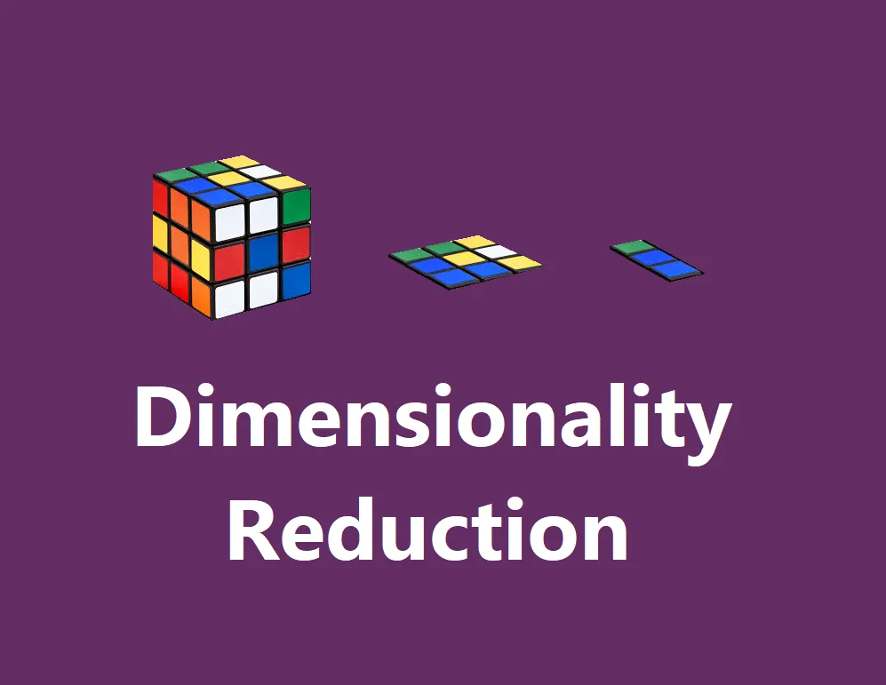
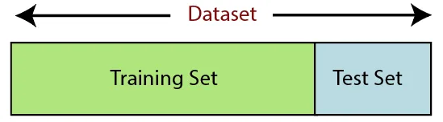

## Dimensionality Reduction in Python



Dimensionality reduction is a method of unsupervised learning. It refers to techniques for reducing the number of input variables in training data.
However, on classification and regression predictive modeling datasets with supervised learning methods, it can be employed as a data transform pre-processing step for machine learning techniques.
There are numerous dimensionality reduction techniques to choose from, and there is no one-size-fits-all solution. Instead, it's a good idea to experiment with a variety of dimensionality reduction techniques and their various setups.
This article will show you how to use Python to fit and evaluate top dimensionality reduction techniques.

Dimensionality reduction aims to reduce the number of dimensions in numerical input data while preserving the data's key relationships.
There are numerous dimensionality reduction algorithms available, and there is no single ideal solution for all datasets.
Here we get familiar to use the scikit-learn machine learning library to implement, fit, and assess top dimensionality reduction in Python.

Hundreds, thousands, or even millions of input variables could be considered high-dimensionality.
Fewer input dimensions usually imply fewer parameters or a simpler machine learning model structure, referred to as degrees of freedom. A model with too many degrees of freedom may overfit the training dataset and perform poorly on new data.
Simple models that generalize effectively, as well as input data with few input variables, are preferred. This is especially true for linear models, where the number of inputs and the model's degrees of freedom are frequently linked.
Prior to modeling, dimensionality reduction is a data preparation technique used on data. It could be done after cleaning and scaling the data and before training a prediction model.

As a result, any dimensionality reduction applied to training data must also be applied to new data, such as a test dataset, validation dataset, or data used to make a prediction with the final model.

**Dimensionality Reduction Algorithms**

Dimensionality reduction can be accomplished using a variety of algorithms.
There are two types of methods: those based on linear algebra and those based on manifold learning.

Linear Algebra Methods
- Dimensionality can be calculated using matrix factorization methods from the subject of linear algebra.
- Some of the more popular methods include:
​
 - Principal Components Analysis
 - Singular Value Decomposition
 - Non-Negative Matrix Factorization
​

Manifold Learning Methods

- Manifold learning approaches aim to find a lower-dimensional projection of a high-dimensional input that captures the input data's most important qualities.
- Some of the more popular methods include:

  - Isomap Embedding
  - Locally Linear Embedding
  - Multidimensional Scaling
  - Spectral Embedding
  - t-distributed Stochastic Neighbor Embedding

Each method takes a different approach to the problem of detecting natural links in low-dimensional data.
There is no single optimum dimensionality reduction algorithm, and there is no simple way to determine which algorithm is appropriate for your data without doing controlled tests.

**Examples of Dimensionality Reduction**

Classification Dataset

To construct a test binary classification dataset, we'll utilize the make_classification() function.
There will be 1,000 samples in the dataset, with 20 input attributes (10 relevant and 10 redundant). This gives each technique the chance to detect and eliminate unnecessary input features.
The pseudorandom number generator's fixed random seed ensures that the same synthetic dataset is generated each time the code is run.
The following is an example of how to create and summarize a synthetic classification dataset.

```python
# synthetic classification dataset
from sklearn.datasets import make_classification
# define dataset
X, y = make_classification(n_samples=1000, n_features=20, n_informative=10, n_redundant=10, random_state=7)
# summarize the dataset
print(X.shape, y.shape)
```

It's a binary classification problem, and after each dimensionality reduction operation, we'll test a LogisticRegression model.

The gold standard of repeated stratified 10-fold cross-validation will be used to assess the model. The mean and standard deviation classification accuracy will be presented for all folds and repeats.

As a point of contrast, the sample below assesses the model on the raw dataset.

```python
# evaluate logistic regression model on raw data
from numpy import mean
from numpy import std
from sklearn.datasets import make_classification
from sklearn.model_selection import cross_val_score
from sklearn.model_selection import RepeatedStratifiedKFold
from sklearn.linear_model import LogisticRegression

# define dataset
X, y = make_classification(n_samples=1000, n_features=20, n_informative=10, n_redundant=10, random_state=7)
# define the model
model = LogisticRegression()
# evaluate model
cv = RepeatedStratifiedKFold(n_splits=10, n_repeats=3, random_state=1)
n_scores = cross_val_score(model, X, y, scoring='accuracy', cv=cv, n_jobs=-1)
# report performance
print('Accuracy: %.3f (%.3f)' % (mean(n_scores), std(n_scores)))
```

When the example is run on the raw dataset with all 20 columns, it achieves a classification accuracy of roughly 82.4 percent.
Although this may not be attainable with all techniques, a successful dimensionality reduction transform on this data should result in a model that is more accurate than the baseline.

After that, we may look at some instances of dimensionality reduction algorithms that have been used on this dataset.
I've tried to tailor each approach to the dataset as much as possible. Wherever possible, each dimensionality reduction method will be adjusted to decrease the 20 input columns to ten.
To integrate the data transform and model into an atomic unit that can be assessed using the cross-validation technique, we will use a Pipeline; for example:

```python
from sklearn.decomposition import PCA
from sklearn.pipeline import Pipeline

# define the pipeline
steps = [('pca', PCA(n_components=10)), ('m', LogisticRegression())]
model = Pipeline(steps=steps)
```

Principal Component Analysis

The most prevalent technique for dimensionality reduction with dense data is Principal Component Analysis, or PCA (few zero values).

The following is a complete example of evaluating a model using PCA dimensionality reduction.

```python
# evaluate pca with logistic regression algorithm for classification

from numpy import mean
from numpy import std
from sklearn.datasets import make_classification
from sklearn.model_selection import cross_val_score
from sklearn.model_selection import RepeatedStratifiedKFold
from sklearn.pipeline import Pipeline
from sklearn.decomposition import PCA
from sklearn.linear_model import LogisticRegression

# define dataset
X, y = make_classification(n_samples=1000, n_features=20, n_informative=10, n_redundant=10, random_state=7)

# define the pipeline
steps = [('pca', PCA(n_components=10)), ('m', LogisticRegression())]
model = Pipeline(steps=steps)

# evaluate model
cv = RepeatedStratifiedKFold(n_splits=10, n_repeats=3, random_state=1)
n_scores = cross_val_score(model, X, y, scoring='accuracy', cv=cv, n_jobs=-1)

# report performance
print('Accuracy: %.3f (%.3f)' % (mean(n_scores), std(n_scores)))
```

The example uses dimensionality reduction and a logistic regression prediction model to evaluate the modeling pipeline.

Preprocessing for Machine Learning in Python


In Machine Learning, data preparation is a critical step that improves data quality and facilitates the extraction of relevant insights from the data. In Machine Learning, data preprocessing refers to the process of cleaning and organizing raw data in order to make it appropriate for creating and training Machine Learning models. In simple terms, data preprocessing is a data mining approach used in Machine Learning that turns raw data into a legible and intelligible format.

Data preparation is the first stage in developing a Machine Learning model, and it marks the start of the process. Real-world data is frequently partial, inconsistent, erroneous (due to errors or outliers), and lacking in exact attribute values and trends. This is where data preparation comes into play: it cleans, formats, and organizes raw data, making it ready for Machine Learning models to use. Let's have a look at the different stages of data preprocessing in machine learning.

Steps in Data Preprocessing in Machine Learning

1. Acquire the dataset
2. Import all the crucial libraries
3. Import the dataset
4. Identifying and handling the missing values
5. Encoding the categorical data
6. Splitting the dataset
7. Feature scaling

1. Acquire the dataset

The initial stage in machine learning data preparation is to acquire the dataset. You must first obtain the required dataset before you can create and develop Machine Learning models. This dataset will be made up of data acquired from a variety of sources, which will be merged in a logical manner to make a dataset. The formats of datasets vary depending on the use case. A corporate dataset, for example, will be very different from a medical dataset. A medical dataset will include healthcare-related data, whereas a business dataset will comprise important industrial and business data.

Datasets can be downloaded from numerous online sites, including <https://www.kaggle.com/uciml/datasets> You may also generate a dataset by using several Python APIs to collect data. Once you've completed the dataset, save it as a CSV, HTML, or XLSX file.

2. Import all the crucial libraries

We'll show you how to import Python libraries for data preprocessing in Machine Learning because Python is the most widely used and recommended library by Data Scientists all over the world. More information about Python libraries for Data Science may be found here. Specific data pretreatment activities can be performed using the specified Python libraries. The second stage in machine learning data preprocessing is to import all of the necessary libraries. The following are the three main Python libraries used for data preprocessing in Machine Learning:

- NumPy - NumPy is a Python library that allows you to perform scientific calculations. As a result, it's used to add any form of mathematical operation to the code. Large multidimensional arrays and matrices can also be used in NumPy programs.
- Pandas — Pandas is a fantastic open-source Python data manipulation and analysis package. It's a popular tool for importing and maintaining datasets. It includes Python data structures and data analysis tools that are fast and simple to use.
- Matplotlib - Matplotlib is a 2D charting toolkit for Python that may be used to create any style of chart. It can produce publication-quality numbers in a variety of hard copy and interactive formats across several platforms (IPython shells, Jupyter notebook, web application servers, etc.).

3. Import the dataset

In this stage, you'll import the datasets you've obtained for your machine learning project. One of the most critical processes in data preprocessing in machine learning is importing the dataset. You must, however, establish the current directory as the working directory before you can import the dataset/s. In Spyder IDE, you can set the working directory in three easy steps:

1. Save your Python script in the same directory as the dataset.
2. In Spyder IDE, go to File Explorer and choose the needed directory.
3. To run the file, press F5 or select Run from the File menu.

4. Identifying and handling the missing values

It's important to identify and manage missing values effectively during data preparation; if you don't, you risk drawing incorrect and erroneous conclusions and inferences from the data. Needless to say, this will sabotage your machine learning effort.
In general, there are two approaches to dealing with missing data:

- Deleting a particular row – This method is used to delete a specific row that has a null value for a feature or a specific column with more than 75% of the data missing. However, because this strategy isn't 100 percent effective, it's best to utilize it only when the dataset includes enough samples. You must guarantee that no bias remains after the data has been deleted.
- Calculating the mean – This method is useful for features having numeric data like age, salary, year, etc. Here, you can calculate the mean, median, or mode of a particular feature or column or row that contains a missing value and replace the result for the missing value. This method can add variance to the dataset, and any loss of data can be efficiently negated. Hence, it yields better results compared to the first method (omission of rows/columns). Another way of approximation is through the deviation of neighbouring values. However, this works best for linear data.

5. Encoding the categorical data

Categorical data is information that is divided into distinct categories within a dataset. There are two categorical variables in the dataset described above: nation and purchased.
The majority of Machine Learning models are built on mathematical formulae. As a result, it's easy to see how keeping category data in the equation can cause problems, as you'll only need numbers in the calculations.

6. Splitting the dataset



The next stage in machine learning data preprocessing is to split the dataset. Every dataset for a Machine Learning model should be divided into two sets: training and test. The training set refers to the portion of a dataset that is utilized to train a machine learning model. You are already aware of the result in this case. On the other hand, a test set is a subset of the dataset that is used to test the machine learning model. The test set is used by the ML model to predict outcomes.
The dataset is usually divided into 70:30 or 80:20 ratios. This means that you either use 70% or 80% of the data to train the model, while leaving out the remaining 30% or 20%. The method for separating the dataset differs depending on its shape and size.

To split the dataset, you have to write the following line of code –

```python
from sklearn.model_selection import train_test_split
x_train, x_test, y_train, y_test= train_test_split(x, y, test_size= 0.2, random_state=0)
```

Here, the first line splits the arrays of the dataset into random train and test subsets. The second line of code includes four variables:
x_train – features for the training data
x_test – features for the test data
y_train – dependent variables for training data
y_test – independent variable for testing data

As a result, the train test split() function has four parameters, two of which are for data arrays. The size of the test set is specified by the test size function. This indicates the dividing ratio between the training and test sets and could be.5,.3, or.2. The final parameter, "random state," specifies the seed for a random generator, ensuring that the result is consistent.

7. Feature scaling

In Machine Learning, feature scaling signifies the end of data preprocessing. It's a technique for keeping a dataset's independent variables inside a certain range. To put it another way, feature scaling narrows the range of variables so that you can compare them on a level playing field.

Most ML models are based on Euclidean Distance

You can perform feature scaling in Machine Learning in two ways:

- Standardization
- Normalization

The standardization approach will be used for our dataset. To accomplish so, we'll use the following piece of code to import the sci-kit-learn library's StandardScaler class:

```python
from sklearn.preprocessing import StandardScaler
```

The next step will be to create the object of StandardScaler class for independent variables. After this, you can fit and transform the training dataset using the following code:

```python
st_x= StandardScaler()x_train= st_x.fit_transform(x_train)
```

You can use the transform() function directly on the test dataset (you don't need to use the fit transform() function because it's been done in the training set). The code will look like this:

```python
x_test= st_x.transform(x_test)
```
