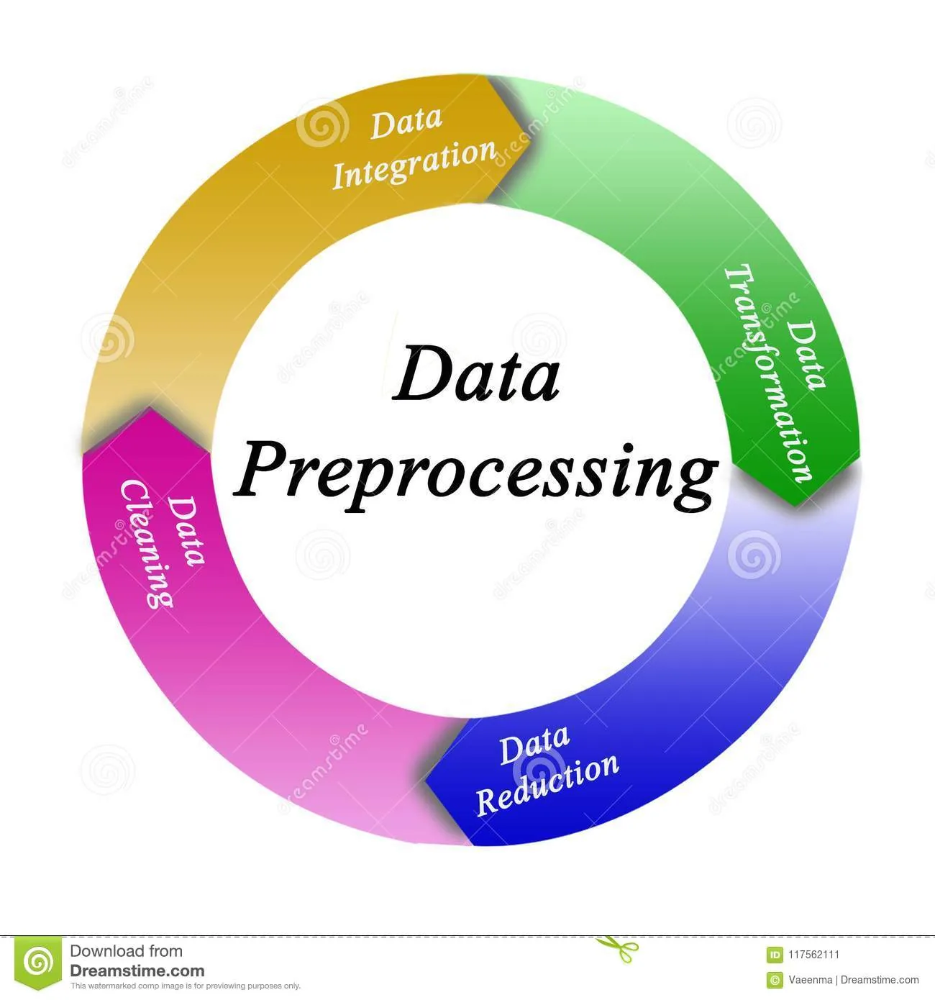

### *Dimensionality Reduction:*
High-dimensional datasets can be overwhelming and leave you not knowing where to start. Typically, you’d visually explore a new dataset first, but when you have too many dimensions the classical approaches will seem insufficient. Working in high-dimensional spaces can be undesirable for many reasons; raw data are often sparse as a consequence of the curse of dimensionality, and analyzing the data is usually computationally intractable (hard to control or deal with). Dimensionality reduction is common in fields that deal with large numbers of observations and/or large numbers of variables, such as signal processing, speech recognition, neuroinformatics, and bioinformatics.

Methods are commonly divided into linear and nonlinear approaches. Approaches can also be divided into feature selection and feature extraction. Dimensionality reduction can be used for noise reduction, data visualization, cluster analysis, or as an intermediate step to facilitate other analyses. It is considered a technique of Data Preprocessing.

### *Data pre-processing for Machine Learning:*

This essential step in any machine learning project is when you get your data ready for modeling. Between importing and cleaning your data and fitting your machine learning model is when preprocessing comes into play. You have to learn how to standardize your data so that it's in the right form for your model, create new features to best leverage the information in your dataset and select the best features to improve your model fit.

### 1-Identify and sort out missing data:

There are a variety of reasons a data set might be missing individual fields of data. Data scientists need to decide whether it is better to discard records with missing fields, ignore them or fill them in with a probable value.

### 2-Standardizing Data:

Often a model will make some assumptions about the distribution or scale of your features. Standardization is a way to make your data fit these assumptions and improve the algorithm's performance.

### 3-Feature Engineering:

It is all about exploring different ways to create new, more useful, features from the ones already in your dataset. It enables you to encode, aggregate, and extract information from both numerical and textual features.

These are the main concepts of Data Pre-processing.
